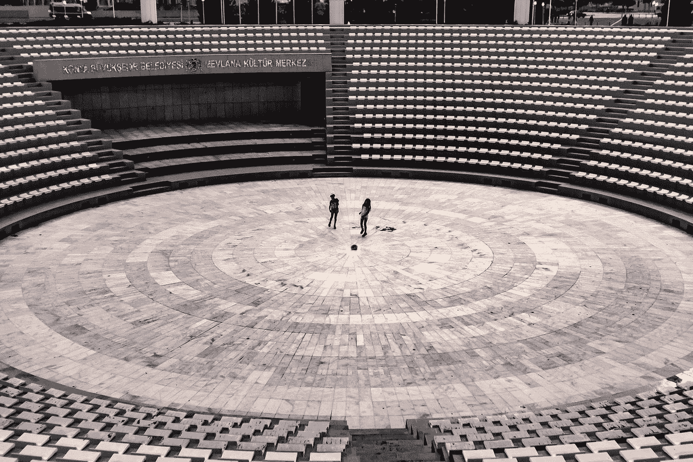
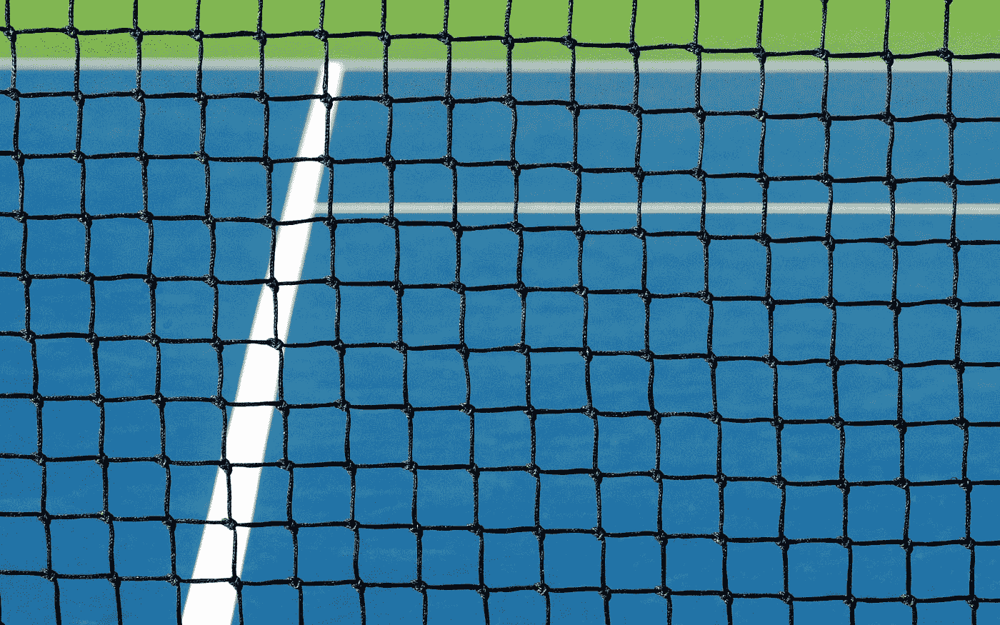

# CSS 中的中心元素

> 原文：<https://blog.devgenius.io/center-element-in-css-4c28cd603fb3?source=collection_archive---------16----------------------->

在 CSS 中垂直和水平居中元素的 3 种方法

胡尔基·奥莰·塔巴克在 [Unsplash](https://unsplash.com?utm_source=medium&utm_medium=referral) 上拍摄的照片

在我们的 web 开发旅程中，总会遇到这样的情况，比如将元素放置在页面的特定部分，最常见的是将它们居中。

仅在一个方向上居中并不需要太多的努力，并且可以用`text-align:center`或`margin:0 auto`技术来完成，但是在水平和垂直方向上居中会很困难。或者是？让我们在本文中找到一些方法来实现这一点。

# 使用简单的旧 CSS 技术居中

我们可以在这里利用定位。在元素上使用`absolute`位置属性会将元素从页面流中移除。现在必须将`relative`定位到一个父节点，这样它就可以相对于父节点居中。此外，我们将添加 50%的顶部和左侧属性，以将子元素移动到父元素内部。

让我们来看一个例子:

在上面的例子中，子元素看起来并不居中。这是因为它已经从顶部和左侧移动到 50%，包括其自身的宽度和高度。为了准确地使它居中，我们需要通过翻译把它带回来。

我们给出变换属性 **transform: translate(-50%，-50%)** 瞧！

# 使用 flex 居中

[韦斯利·廷吉](https://unsplash.com/@wesleyphotography?utm_source=medium&utm_medium=referral)在 [Unsplash](https://unsplash.com?utm_source=medium&utm_medium=referral) 上拍摄的照片

这种技术非常简单，只需在父节点上声明`flex`，并为其分配`justify-content:center`和`align-items:center`。

> justify-content:center = >如果 flex-direction:row，则将 flex 子项水平居中
> 
> align-items:center = >如果 flex-direction:row，则垂直居中 flex 子级

> justify-content:center = >如果 flex-direction:column，则将 flex 子级垂直居中
> 
> align-items:center = >如果 flex-direction:column，则将 flex 子项水平居中

上述规则组合可能会令人困惑，所以只需尝试不同的选项，直到一个合适。至少对我来说有点难记。

# 网格居中

本·赫尔希在 [Unsplash](https://unsplash.com?utm_source=medium&utm_medium=referral) 上的照片

这是目前为止我最喜欢的将元素放在页面中央的方法。只需将父元素声明为`display: grid`，并将`justify-items:center`和`align-items:center`赋予它。

> justify-items:center = >水平居中网格子级
> 
> align-items:center = >垂直居中网格子级

上述属性还有一个简写属性，即`place-items:center`

# 资源

 [## flexbox 的基本概念

### 柔性盒模块，通常被称为 flexbox，被设计为一维布局模型，并作为一个…

developer.mozilla.org](https://developer.mozilla.org/en-US/docs/Web/CSS/CSS_Flexible_Box_Layout/Basic_Concepts_of_Flexbox)  [## CSS 网格布局

### CSS 网格布局擅长于将页面划分成主要区域，或者根据大小、位置来定义关系

developer.mozilla.org](https://developer.mozilla.org/en-US/docs/Web/CSS/CSS_Grid_Layout)