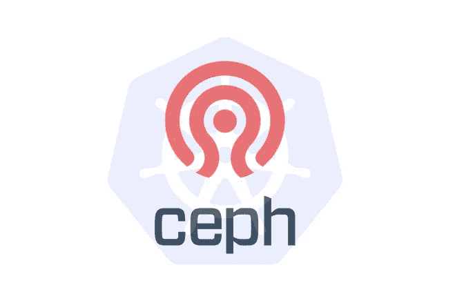
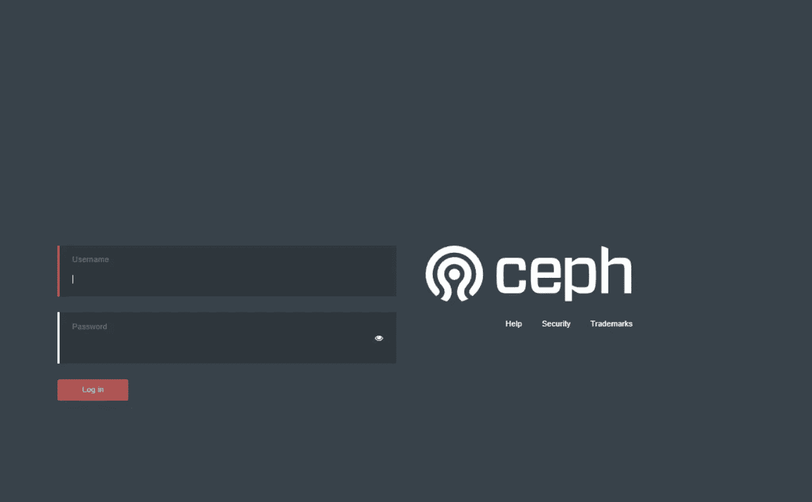
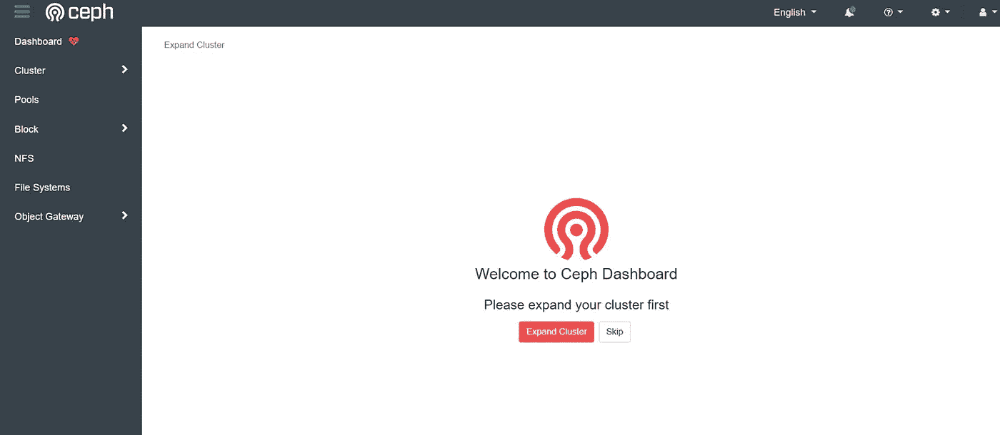
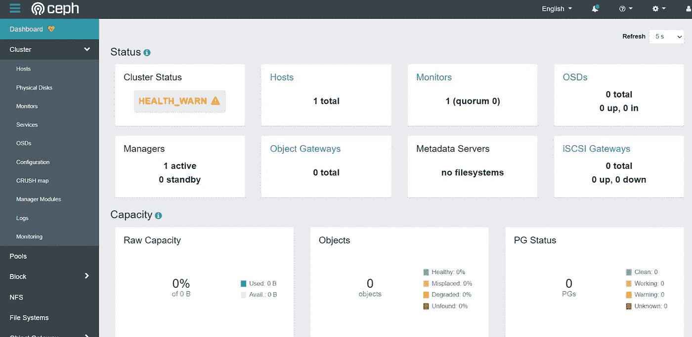
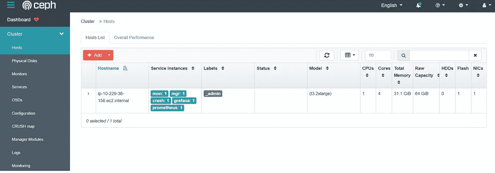
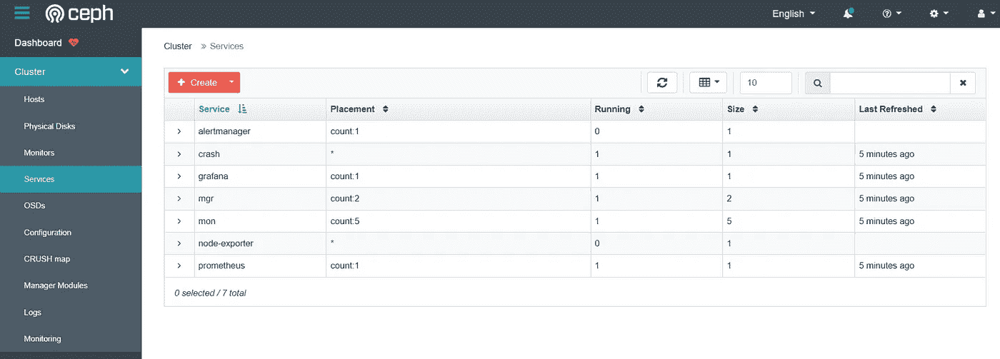
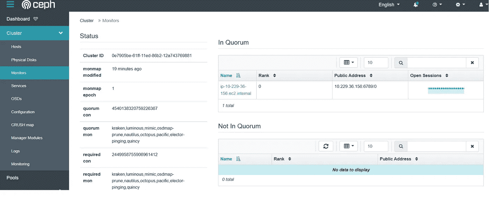

# Ceph —安装单节点集群

> 原文：<https://blog.devgenius.io/ceph-install-single-node-cluster-55b21e6fdaa2?source=collection_archive---------3----------------------->

## 在 AWS EC2 上安装 Ceph 集群



在我上一篇 ceph 文章 [Ceph 简介](https://medium.com/dev-genius/ceph-next-gen-cloud-storage-system-1ee91fbbeca4)中，我谈到了什么是 Ceph，它的历史，核心组件和核心服务。让我们做一个实验，在 AWS EC2 Linux 服务器上安装一个单节点 Ceph 集群。

安装 Ceph 有几种不同的方法，例如:

*   Cephadm :使用容器和 systemd 安装和管理 Ceph 集群，与 CLI 和仪表板 GUI 紧密集成。
*   **Rook** :部署和管理在 K8s 中运行的 Ceph 集群，同时还支持通过 K8s APIs 管理存储资源和供应。
*   **ceph-ansible** :使用 ansible 部署和管理 ceph 集群。
*   **ceph-salt** :使用 salt 和 cephadm 安装 ceph。
*   **jaas.ai/ceph-mon**:使用 Juju 安装 Ceph。
*   **github.com/openstack/puppet-ceph**:通过傀儡安装 Ceph。
*   **手动** : Ceph 也可以手动安装。

如果想单机安装 Ceph 集群，推荐的方式是 **Cephadm** ，如果想在 K8s 中安装 Ceph 集群，那么 **Rook** 是推荐的方式。

为了演示和简单起见，我将使用 **Cephadm** 作为我的演示 Ceph 集群。有关其他方法的详细信息，请访问[https://docs.ceph.com/en/quincy/install/](https://docs.ceph.com/en/quincy/install/)

# Cephadm

`Cephadm`是一个用于管理 Ceph 集群的实用程序。它不依赖于外部配置工具，如`Ansible`、`Rook`或`Salt`。但是，这些外部配置工具可以用来自动执行不是由 cephadm 本身执行的操作。

`Cephadm`管理 Ceph 集群的整个生命周期。这包括通过在单个节点上创建一个小型 Ceph 集群，然后扩展集群，添加主机并提供 Ceph 守护程序和服务的引导过程。这个生命周期的管理可以通过 Ceph 命令行界面(CLI)或仪表板(GUI)来执行。

# Ceph 集群安装

## 要求:

*   Python 3
*   系统 d
*   搬运集装箱的搬运工或码头工人
*   时间同步(如 chrony 或 NTP)
*   LVM2 用于配置存储设备

## 下载 cephadm

安装`cephadm`有两种方式:

*   基于 curl 的安装
*   特定于发行版的安装
    我们将在这里使用基于 curl 的安装:
    下载 cephadm

```
$ curl --silent --remote-name --location https://github.com/ceph/ceph/raw/quincy/src/cephadm/cephadm
```

将其移动到`/usr/local/bin`，确保该路径在您的环境＄PATH 中

```
$ mv cephadm /usr/local/bin/
$ which cephadm
/usr/local/bin/cephadm
```

## 引导新的 ceph 集群

创建新的 Ceph 集群的第一步是在 Ceph 集群的第一台主机上运行 cephadm bootstrap 命令。`--mon-ip`是主机 IP:

```
$ cephadm bootstrap --mon-ip 10.221.36.156 --allow-fqdn-hostname
```

我们必须在这里允许`feqn-hostname`，因为默认情况下 AWS EC2 的主机名是`ip-10-221-36-156.ec2.internal`。否则，您将遇到以下错误:

```
ERROR: hostname is a fully qualified domain name (ip-10-221-36-156.ec2.internal); either fix (e.g., "sudo hostname ip-10-229-36-156" or similar) or pass --allow-fqdn-hostname
```

命令运行输出:

```
$ cephadm bootstrap --mon-ip 10.221.36.156 --allow-fqdn-hostname
Verifying podman|docker is present...
Verifying lvm2 is present...
Verifying time synchronization is in place...
...
Pulling container image quay.io/ceph/ceph:v17...
Ceph version: ceph version 17.2.5 (98318ae89f1a893a6ded3a640405cdbb33e08757) quincy (stable)
Extracting ceph user uid/gid from container image...
...
Ceph Dashboard is now available at:
             URL: https://ip-10-221-36-156.ec2.internal:8443/
            User: admin
        Password: ehpzvrbf9z
Enabling client.admin keyring and conf on hosts with "admin" label
Saving cluster configuration to /var/lib/ceph/0e7905be-61ff-11ed-86b2-12a743769881/config directory
Enabling autotune for osd_memory_target
You can access the Ceph CLI as following in case of multi-cluster or non-default config:
        sudo /usr/local/bin/cephadm shell --fsid 0e7905be-61ff-11ed-86b2-12a743769881 -c /etc/ceph/ceph.conf -k /etc/ceph/ceph.client.admin.keyring
Or, if you are only running a single cluster on this host:
        sudo /usr/local/bin/cephadm shell
Please consider enabling telemetry to help improve Ceph:
        ceph telemetry on
For more information see:
        https://docs.ceph.com/docs/master/mgr/telemetry/
```

现在你应该可以从上面的网址访问 Ceph UI:`https://ip-10-221-36-156.ec2.internal:8443/`



它会要求您在首次登录时更新默认密码，一旦您更新密码并重新登录，您应该会看到以下界面:



着陆仪表板应该看起来像这样:



由于我们只有一个节点，运行状况实际上显示为黄色。

您可以检查集群中的主机数量:



检查服务:



检查监视器



恭喜你！至此，您已经成功安装了一个单节点 Ceph 集群！下一篇文章我们将学习如何通过添加更多节点来扩展集群。