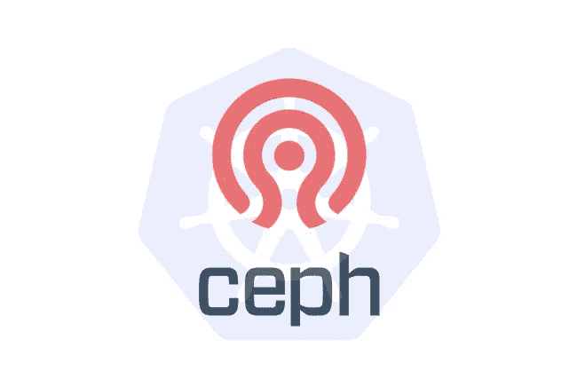
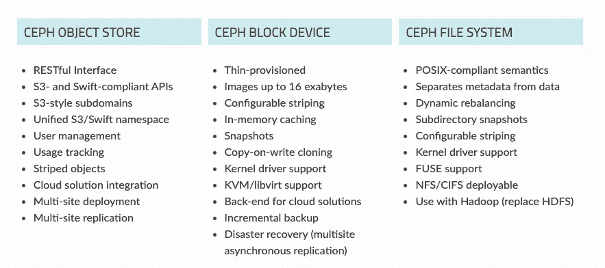
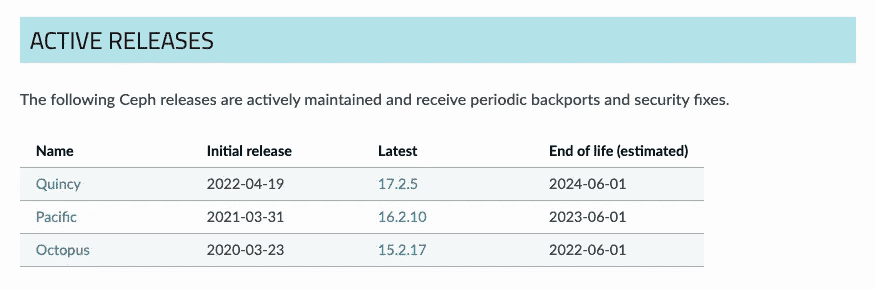
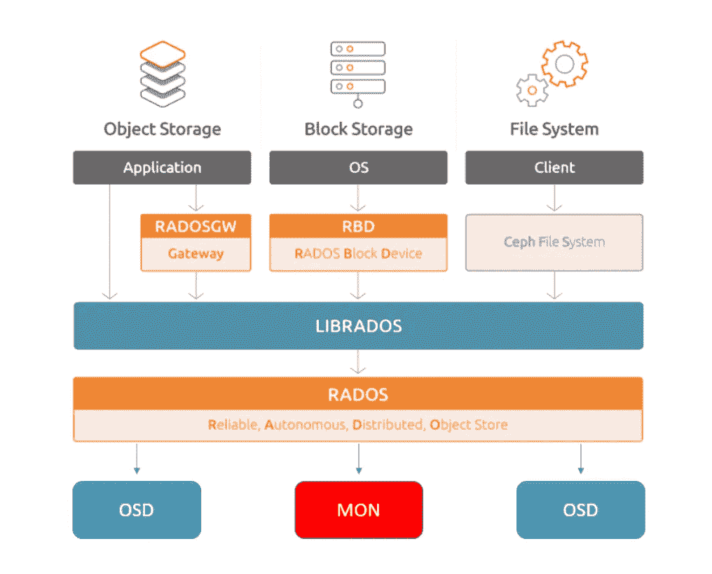
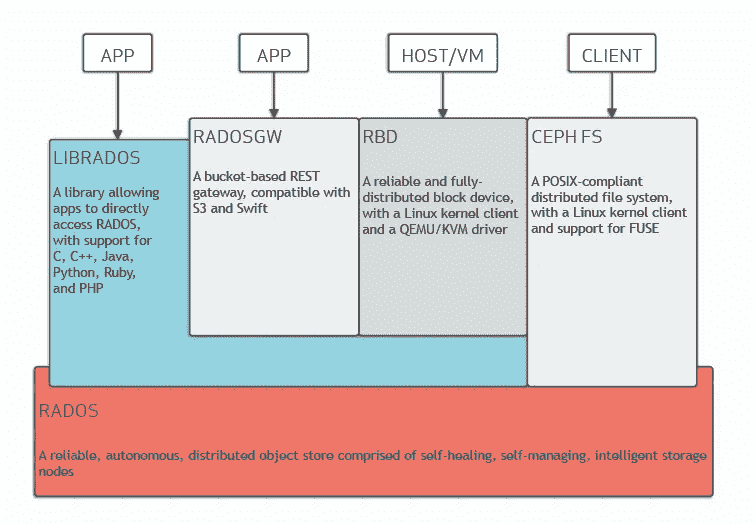
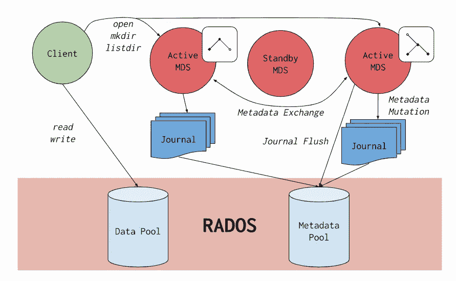

# Ceph —下一代云存储系统

> 原文：<https://blog.devgenius.io/ceph-next-gen-cloud-storage-system-1ee91fbbeca4?source=collection_archive---------3----------------------->

## Ceph 简介

# 什么是 Ceph

Ceph 是什么？Ceph 是一个开源、分布式、横向扩展、软件定义的存储系统，可以提供块、对象和文件存储。Ceph 的集群被设计为在一种叫做 **CRUSH** (可伸缩散列下的受控复制)的算法的帮助下运行在任何硬件上。

**CRUSH** 算法使客户端能够独立计算数据应该写入或读取的位置。通过动态派生这些元数据，就不需要管理一个集中的表。

服务器可以非常快速地执行 CRUSH 查找；此外，更小的计算负载可以跨集群节点分布，从而利用分布式存储的能力。这使得 Ceph 可以快速扩展到数百 Pb，而没有瓶颈和相关单点故障的风险。

Ceph 是一个真正的统一存储解决方案，它从一个统一的软件定义的后端提供数据块、文件和对象服务。Ceph 提供了三种主要的存储类型:

*   通过 RADOS 块设备进行块存储(RBD)
*   通过 CephFS 进行文件存储
*   通过 RADOS Gateway 进行对象存储，提供 S3 和 Swift 兼容的存储。

如下图所示:

图片来自 [Ceph](https://docs.ceph.com/en/quincy/)

您可以在任何符合 Ceph 要求的硬件上自由运行 Ceph。这是存储行业的一项重大发展，该行业通常会受到严格的供应商限制。此外，根据 CAP 定理，Ceph 更倾向于**一致性**,并会不惜一切代价使保护您的数据在发生分区时比可用性更优先。

# Ceph 的历史

*   2003–2007:Ceph 是由 Sage Weil 于 2003 年在加州大学开发的，作为他博士项目的一部分。然后在 2006 年，它在一个 LGPL 下被开源，作为一个参考实现和研究平台。劳伦斯利弗莫尔国家实验室从 2003 年到 2007 年支持 Sage 的早期跟踪工作。
*   **2007–2011**:DreamHost 从 2007 年到 2011 年支持 Ceph 开发。在此期间，Ceph 的核心组件获得了稳定性和可靠性，实现了新功能，并绘制了未来的路线图。
*   **2012 年—当前**:2012 年，Sage Weil 创立了 Inktank，以推动 Ceph 的广泛应用。2014 年，红帽同意收购 Inktank。

Ceph 的活动版本如下所示:

来自 [Ceph](https://docs.ceph.com/en/quincy/releases/index.html) 的图片

# Ceph 的好处

Ceph 具有以下优势:

*   **可扩展性**:支持使用 CRUSH 算法快速缩放。Ceph 克服了所有可扩展性挑战，并提供真正灵活、弹性的大规模存储。
*   **可靠性** : Ceph 具有自我管理和自我修复功能，它可以监控和管理守护进程，从而提高整个系统的可靠性和数据可用性。
*   **性能**:作为纯 SDS(软件定义的存储系统)，它旨在最大限度地提高效率和性能，而不考虑底层基础架构。

# Ceph 核心组件

## RADOS 和 OSD

在 Ceph 中，核心存储层被称为 RADOS(可靠的自治分布式对象存储)，它提供了一个对象存储，在此基础上构建更高级别的存储协议。拉多斯是:

*   无单点故障的高可用性(SPoF)
*   可靠且有弹性
*   自我修复和自我管理
*   适应的
*   可攀登的

RADOS 层由许多对象存储守护进程(OSD)组成，每个 OSD 都是完全独立的，并在整个集群中形成对等关系。然后，每个 OSD 通常被映射到单个磁盘，这与通过 RAID 控制器将多个磁盘组合成单个设备呈现给操作系统的传统方法形成对比。

## 隆起

另一个关键组件是 MONs(监视器)。这里的名称很容易让人误解，因为 MONs 不仅进行集群监控，还充当整个集群的仲裁者、交通警察和医生。

监视器负责通过使用 Paxos 形成集群仲裁。监视器使用集群映射来提供集群状态，Ceph 集群组件和客户端都使用这些集群映射来描述集群拓扑，并使数据能够安全地存储在正确的位置。

## 经理

管理器负责 Ceph 集群配置和统计。为了跟踪集群中每个对象的状态，Ceph 对底层对象名进行哈希运算，将对象放入多个放置组中。

然后使用 CRUSH 算法将放置组放置到 OSD 上。这大大降低了跟踪数百万个对象所需的计算能力，只需跟踪更易于管理的放置组数量，通常以千计。It 职责包括:

*   驱动器和机箱状态/定位器指示灯的管理
*   创建和管理客户端映射，如 rbd-mirror 和 RADOS Gateway，
*   Ceph 手术服的整体管理
*   更丰富的重新加权和重新平衡操作管理。
*   与 RackTables、NetBox、HP SIM 和 Cisco UCS Manager 等外部库存系统集成
*   Nagios、Icinga、Graphite 和 Prometheus 等监控/度量系统的接口

图片来自[规范](https://canonical.com/blog/ceph-storage-on-ubuntu-an-overview)

# Ceph 核心服务

Ceph 核心服务架构图如下:

来自 [Ceph](https://docs.ceph.com/en/quincy/architecture/) 的图片

## RADOS 闭塞设备(RBD)

RBD 服务以一种方式呈现块(也称为卷)存储，传统的 HDD/SDD 应用程序只需很少或不需要调整即可使用。它将基于块的应用程序数据分解成小块，这些小块作为对象存储在 RADOS 中。RBD 协调虚拟块设备中对象的存储

## 雷达网关(RGW)

Ceph 对象网关是一个构建在 librados 之上的对象存储接口，为应用程序提供了一个通向 Ceph 存储集群的 RESTful 网关。Ceph 对象存储支持两种接口:

*   S3 兼容:提供对象存储功能，其接口与 Amazon S3 RESTful API 的大部分子集兼容。
*   Swift 兼容:通过与 OpenStack Swift API 的大部分子集兼容的接口提供对象存储功能。

在幕后，Ceph 对象网关使用 RGW(一个 HTTP 服务器)与下划线存储交互。

## CephFS

Ceph 文件系统是构建在 RADOS 之上的 POSIX 兼容文件系统。CephFS 致力于为各种应用程序提供一流的、多用途、高可用性和高性能的文件存储，包括共享主目录、HPC 暂存空间和分布式工作流共享存储等传统用例。

在 CephFS 中，文件元数据存储在与文件数据分开的 RADOS 池中，并通过 MDS(元数据服务器)提供服务。对数据的访问通过 MDS 集群来协调，该集群充当由客户端和 MDS 合作维护的分布式元数据缓存的状态的权威。

图片来自 [Ceph](https://docs.ceph.com/en/quincy/cephfs/)

## 利布拉多斯

基于 RADOS，librados API 允许您创建自己的 Ceph 存储集群接口。使用 librados，您可以与两种类型的 Ceph 守护进程进行交互:

*   Ceph Monitor，它维护集群映射的主副本。
*   Ceph OSD 守护进程(OSD ),它将数据作为对象存储在存储节点上。

# Ceph 用例

*   OpenStack/KVM: Ceph 是向 OpenStack 环境或 KVM 虚拟化提供存储的完美匹配。
*   K8s
*   大型块存储
*   对象存储:Ceph 目前拥有匹配 S3 API 的最佳兼容性记录之一
*   Web 场服务器
*   美国国家科学院（National Academy of Sciences）
*   大数据

# Ceph 实施建议

以下是部署成功的 Ceph 集群的一些通用规则:

*   最低 10G 网络
*   不要对 filestore 使用无障碍装载选项
*   不要配置大小为 2 或最小大小为 1 的池
*   不要使用消费级固态硬盘
*   在没有电池保护的情况下，不要在回写模式下使用 raid 控制器
*   一定要有一个商定的备份和恢复计划