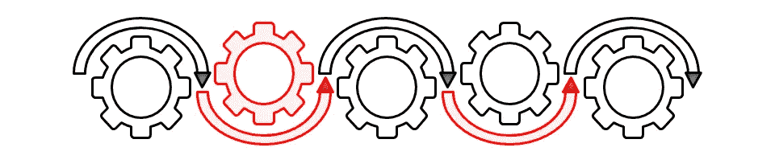

# 现代 C++中的责任链设计模式

> 原文：<https://blog.devgenius.io/chain-of-responsibility-design-pattern-in-modern-c-f318f48a4f45?source=collection_archive---------4----------------------->



责任链是一种行为设计模式， ***提供了向松散耦合对象链*** 传播事件/请求/命令/查询的工具。现代 C++中的责任链设计模式允许您沿着处理程序链传递请求&在接收到请求时，每个处理程序决定是处理请求还是将其转发给链中的下一个处理程序。

> */！\:本文已原创发表于我的* [*博客*](http://www.vishalchovatiya.com/chain-of-responsibility-design-pattern-in-modern-cpp/) *。如果你有兴趣接收我的最新文章，* [*请报名参加我的简讯*](http://eepurl.com/gDNybv) *。*

顺便说一句，如果你还没有看过我的其他关于行为设计模式的文章，下面是列表:

1.  [**责任链**](http://www.vishalchovatiya.com/chain-of-responsibility-design-pattern-in-modern-cpp/)
2.  [命令**命令**命令](http://www.vishalchovatiya.com/command-design-pattern-in-modern-cpp/)
3.  [**解释器**](http://www.vishalchovatiya.com/interpreter-design-pattern-in-modern-cpp/)
4.  [**迭代器**](http://www.vishalchovatiya.com/iterator-design-pattern-in-modern-cpp/)
5.  [**调解员**](http://www.vishalchovatiya.com/mediator-design-pattern-in-modern-cpp/)
6.  [**纪念物**](http://www.vishalchovatiya.com/memento-design-pattern-in-modern-cpp/)
7.  [**观察者**](http://www.vishalchovatiya.com/observer-design-pattern-in-modern-cpp/)
8.  [状态**状态**状态](http://www.vishalchovatiya.com/state-design-pattern-in-modern-cpp/)
9.  [**策略**](http://www.vishalchovatiya.com/strategy-design-pattern-in-modern-cpp/)
10.  [**模板方法**](http://www.vishalchovatiya.com/template-method-design-pattern-in-modern-cpp/)
11.  [**来访者**](http://www.vishalchovatiya.com/double-dispatch-visitor-design-pattern-in-modern-cpp/)

您在这一系列文章中看到的代码片段是简化的，而不是复杂的。所以你经常看到我不使用像`override`、`final`、`public`(同时继承)这样的关键字，只是为了让代码紧凑&可消耗(大多数时候)在单一标准屏幕尺寸。我也更喜欢`struct`而不是`class`，只是为了节省代码行，有时不写`public:`，也故意忽略[虚析构函数](http://www.vishalchovatiya.com/part-3-all-about-virtual-keyword-in-c-how-virtual-destructor-works/)，构造函数[，复制构造函数](http://www.vishalchovatiya.com/all-about-copy-constructor-in-cpp-with-example/)，前缀`std::`，删除动态内存。我也认为自己是一个务实的人，希望用尽可能简单的方式，而不是标准的方式或使用术语来传达一个想法。

***注:***

*   如果你是在这里被直接绊倒的，那么我建议你浏览一下[什么是设计模式？](http://www.vishalchovatiya.com/what-is-design-pattern/)一、哪怕是鸡毛蒜皮的小事。相信会鼓励你对这个话题进行更多的探索。
*   您在本系列文章中遇到的所有这些代码都是使用 C++20 编译的(尽管我在大多数情况下使用了 C++17 的[现代 C++](http://www.vishalchovatiya.com/21-new-features-of-modern-cpp-to-use-in-your-project/) 特性)。因此，如果你无法获得最新的编译器，你可以使用[https://wandbox.org/](https://wandbox.org/)，它也预装了 boost 库。

# 目的

> **提供由多个对象/组件处理请求的机会。**

*   责任链设计模式是一个松散耦合的对象链，所有对象都有机会处理命令/查询。并且它们可以具有某种默认处理实现和/或它们还可以终止处理链，从而防止事件传播到其余对象。
*   换句话说，它的 ***处理流水线就在你刚刚启动并离开*** 的地方。

# C++中责任链设计模式的经典例子

*   责任链的一个典型用例是登录过程。这需要一定数量的步骤才能成功完成，如用户名、密码、验证码等。搭配得当。考虑以下相同的传统示例:

```
struct Authentication {
    Authentication*     m_next{nullptr}; virtual bool authenticate() = 0;
    void next_authentication(Authentication *nextAuth) { m_next = nextAuth; }
};struct UserName : Authentication {
    string      m_name; UserName(string name) : m_name(name){}
    bool is_valid_user_name() { return true; }
    bool authenticate() {
        if(!is_valid_user_name()) {
            cout << "Invalid user name" << endl;
            return false;
        }
        else if(m_next) return m_next->authenticate();
        return true;
    }
};struct Password : Authentication {
    string      m_password; Password(string password) : m_password(password){}
    bool is_valid_password() { return true; }
    bool authenticate() {
        if(!is_valid_password()) {
            cout << "Invalid password" << endl;
            return false;
        }
        else if(m_next) return m_next->authenticate();
        return true;
    }
};int main() {
    Authentication *login{new UserName("John")};
    login->next_authentication(new Password("password"));
    login->authenticate();
    return EXIT_SUCCESS;
}
```

*   我知道这不是一个很好的例子，但足以传达一个责任链的想法。正如您在上面看到的，登录是一个单一的过程，需要执行多个子过程，如用户名和密码验证。
*   所以在我们的例子中,`login->authenticate();`触发了责任链来逐一验证登录所需的每个步骤。
*   您还可以在登录过程中添加更多步骤，例如，添加验证码，创建继承了`Authentication` &的验证码类，在登录的下一个认证链中添加该类对象指针，就像我们对`UserName` & `Password`所做的那样。
*   现在，在我们继续讨论更复杂的实现之前，我只想提一下这样一个事实，即责任链的这种特定实现看起来很不自然。因为本质上这里发生的是你在构建一个单链表，所以问题是为什么不直接使用`std::list`或者`std::vector`。这当然是一个非常合理的担忧。但是正如我前面提到的，这就是人们过去如何建立不负责任的链条。

# 责任链设计模式的 Boost 示例

*   现在您将看到的是一种实现责任链设计模式的现代方法，称为[事件代理](https://en.wikipedia.org/wiki/Broker_pattern)。这实际上是几个设计模式的组合，如[命令](http://www.vishalchovatiya.com/command-design-pattern-in-modern-cpp/)、[中介](http://www.vishalchovatiya.com/mediator-design-pattern-in-modern-cpp/)、&、[观察者](http://www.vishalchovatiya.com/observer-design-pattern-in-modern-cpp/)。

```
#include <iostream>
#include <string>
using namespace std;
#include <boost/signals2.hpp>
//using namespace boost::signals2;struct Query {                          // Command
    int32_t     m_cnt{0};
};struct EventObserver {                  // Observer
    boost::signals2::signal<void(Query &)>       m_handlers;
};struct ExampleClass : EventObserver {   // Mediator
    void generate_event() { 
        cout << "Event generated" << endl;
        Query   q;
        m_handlers(q); 
        cout << endl;
    }
};struct BaseHandler {
    ExampleClass&       m_example;
};struct Handler_1 : BaseHandler {
    boost::signals2::connection      m_conn; Handler_1(ExampleClass &example) : BaseHandler{example}
    {
        m_conn = m_example.m_handlers.connect([&](Query &q) {
            cout << "Serving by Handler_1 : count = " << ++q.m_cnt << endl;
        });
    }
    ~Handler_1() { m_conn.disconnect(); }
};struct Handler_2 : BaseHandler {
    boost::signals2::connection      m_conn; Handler_2(ExampleClass &example) : BaseHandler{example}
    {
        m_conn = m_example.m_handlers.connect([&](Query &q) {
            cout << "Serving by Handler_2 : count = " << ++q.m_cnt << endl;
        });
    }
    ~Handler_2() { m_conn.disconnect(); }
};int main() {
    ExampleClass example;
    Handler_1 applyThisHandlerOn{example}; example.generate_event();       // Will be served by Handler_1 { 
        Handler_2 TemporaryHandler{example};
        example.generate_event();   // Will be served by Handler_1 & Handler_2
    } example.generate_event();       // Will be served by Handler_1
    return EXIT_SUCCESS;
}
/*
Event generated
Serving by Handler_1 : count = 1Event generated
Serving by Handler_1 : count = 1
Serving by Handler_2 : count = 2Event generated
Serving by Handler_1 : count = 1
*/
```

*   如你所见，我们有`ExampleClass`生成一个事件&，事件`boost::signal2`作为观察者。我们有`Query`(即[命令设计模式](http://www.vishalchovatiya.com/command-design-pattern-in-modern-cpp/))在所有寄存器处理器之间传递。
*   然后我们有一个处理程序安排，它注册了 [lambda 函数](http://www.vishalchovatiya.com/learn-lambda-function-in-cpp-with-example/)来处理构造函数&中的事件，同样会在析构函数中取消注册。
*   总的来说，我们只是通过声明处理在`ExampleClass::generate_event()`中传递的`Query`的对象来简化处理程序的特别注册。由于 [RAII](https://en.cppreference.com/w/cpp/language/raii) ，处理程序在超出范围时会自动注销。

# 责任链设计模式的好处

1.  解耦发送者和接收者，正如我们看到的使用[中介](http://www.vishalchovatiya.com/mediator-design-pattern-in-modern-cpp/) & [命令设计模式](http://www.vishalchovatiya.com/command-design-pattern-in-modern-cpp/)的更复杂的方法。
2.  简化代码，因为生成事件的对象不需要知道链结构&命令/查询。
3.  增强分配任务对象的灵活性。通过更改链中的成员或更改其顺序，允许动态添加或删除责任。
4.  增加可扩展性，因为添加新的处理程序非常方便。

# 常见问题汇总

**我可以对装饰者使用(或区别)责任链设计模式吗？**

—当你需要多个装饰者时。
—当您想要动态添加新功能时。
—当您想要更改可配置功能的顺序时。
—例如，您创建了`WalkingAnimal`&`BarkingAnimal``Animal`的装饰器，现在您想在运行时将两者结合起来。在这种情况下，责任链将是正确的选择。

什么时候我应该使用责任链设计模式？

—当有多个对象服务于一个请求时。
—这些对象&其顺序根据请求类型在运行时确定。
—当你不想紧密绑定请求&处理程序时。