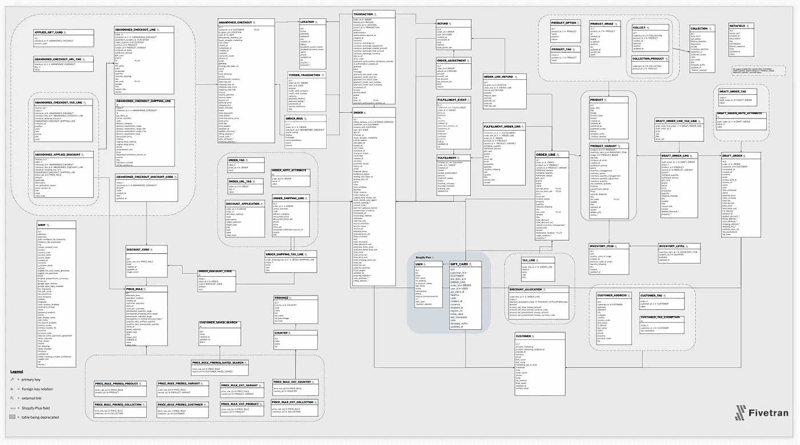
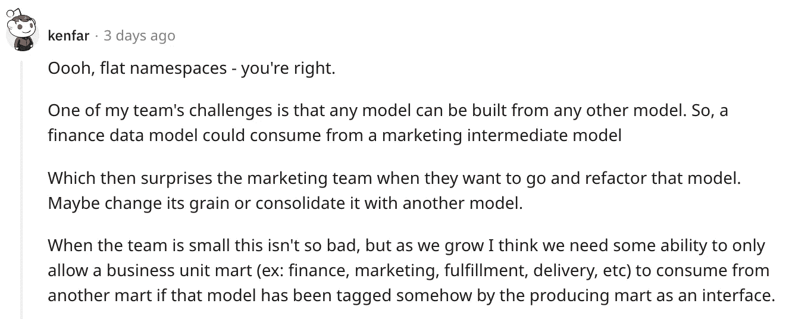
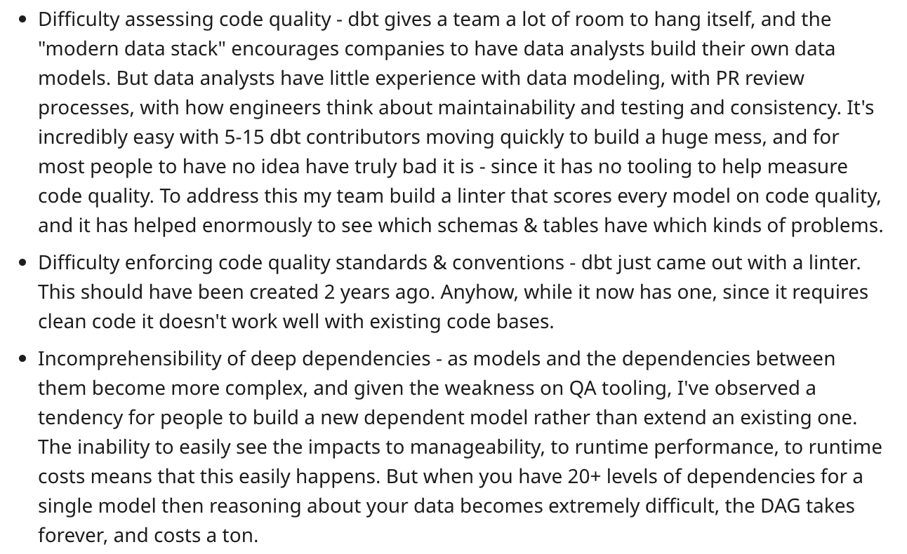

# 使用 dbt 时的挑战

> 原文：<https://blog.devgenius.io/challenges-when-using-dbt-90b573afaad?source=collection_archive---------0----------------------->

注意:这是从更广泛的 dbt 社区收集的关于使用 dbt 时的挑战的评论。本文并不试图成为一个详尽的列表，而是一个关于自以为是的 dbt 集成的 R&D(参见本文底部)。

> dbt 的粗糙点在哪里？现有 dbt 用户怎么说？使用 dbt 时有哪些问题？最重要的是——任何 dbt 集成如何从中吸取教训并改善现状？

使用 dbt，您可以做很多事情…


资料来源:DS 设计公司。注:引自[斯坦·李](https://en.wikipedia.org/wiki/Stan_Lee)

使用 dbt 云有很多好处，尽管[Linkedin](https://www.linkedin.com/posts/timo-dechau_dbt-core-was-a-product-coming-at-the-right-activity-6992721502194262016-ltDn?utm_source=share&utm_medium=member_desktop)上的一些民意调查显示，大多数 dbt 社区使用 dbt Core 和他们自己开发的设置。这些是要点:

— #1 设置环境复杂性

— #2 成本和成本控制

— #3(的需要)建模实践

— #4 个宏

—# 5 dbt 核心的集成

— #6 企业就绪性和可扩展性

— #7 协调层(的需求)

让我们开始吧！

# #1 环境设置的复杂性

尽管 dbt 实验室和社区发布了一流的最佳实践，但设置指南大多是狂野的西部——充满了固执己见的设置。对于新手来说似乎很容易的开始，很快就变成了最理想设置的分析瘫痪，充满了定制包和第三方工具，填补了一些不足。

从开发者的角度来看，最具挑战性的任务是如何建立本地开发，如何管理环境、CI/CD 管道和围绕它的基础设施。例如，我们应该维持单一回购吗？我们应该从每个领域/领域/团队的存储库开始吗？

有一个特定的部分似乎最具挑战性——如何促进生产数据的开发和测试？我们应该使用复制品吗？数据子集？如何最好地利用雪花克隆(如果我们可以的话)？

还有很多手动的 YAML 配置处理，至少在用户决定什么应该放在哪里，开始尝试一些让他们的生活更轻松的包之前。

> 包，包-包和自定义宏无处不在。

所有这些问题都有答案，有时社区决定了一些趋势，通常是在伟大而强大的联合会议上创造的。然而，所有这些都带来了采用挑战，看似简单的开始很快变成了寻找最佳设置的真正过程。

# #2 成本和成本控制

cte 可能不是编写 SQL 脚本的最具成本效益的方式——最有可能的是，我们将在易用性/框架指导与其成本影响之间寻求平衡。

这里有一些关于这个主题的文章:

## 当心雪花外部表的 DBT 增量更新

[](https://dm03514.medium.com/beware-of-dbt-incremental-updates-against-snowflake-external-tables-beeda513e748) [## 当心雪花外部表的 DBT 增量更新

### 雪花目前不支持子查询修剪，这可能会严重影响 DBT 增量…

dm03514.medium.com](https://dm03514.medium.com/beware-of-dbt-incremental-updates-against-snowflake-external-tables-beeda513e748) 

> 雪花目前不支持[子查询修剪](https://docs.snowflake.com/en/user-guide/tables-clustering-micropartitions.html#query-pruning)，这会对 DBT [**产生**严重的成本影响****](https://docs.getdbt.com/docs/building-a-dbt-project/building-models/configuring-incremental-models) **针对** [**外部表**](https://docs.snowflake.com/en/user-guide/tables-external-intro.html) **进行增量更新。**

## 使用 cte 的潜在风险

[](https://techwithadrian.medium.com/the-hidden-risk-of-using-ctes-53b241e256b2) [## 使用 cte 的潜在风险

### 更可读的代码，没有附加条件？

techwithadrian.medium.com](https://techwithadrian.medium.com/the-hidden-risk-of-using-ctes-53b241e256b2) 

> cte 的主要好处是使 SQL 代码更具可读性。在 DBT 是核心技术的世界里，cte 比以往任何时候都更加明显。**随便看看 DBT 的文件，看看 cte 的使用频率**。他们确实很适合 DBT 模式。

但是:

> 现在，让我们尝试内联导入！惊喜惊喜！这段代码将在 6 秒内执行。**一个 CTE 和 2x 性能下降**。

# #3(建模实践的需要)

许多团队已经将 dbt 作为数据建模的解决方案。他们对 it 的简单性刮目相看——让数据分析师(ehm。[分析工程师](https://www.getdbt.com/what-is-analytics-engineering/) — btw。dbt 实验室通过在头衔中引入“工程师”来创建一个新的类别和 enpower 分析师，这是一个多么聪明的举动。)，他们能够用 SQL 定义表，让 dbt 处理执行逻辑，这是一个自由的概念。

然而，这至少提出了三个严峻的挑战:

—成本影响(见上文)

—嵌入式技术债务—新产品的开发比现有产品的优化工作更快。

—有成百上千个模型的夸大的 dbt 设置。许多人在网上抱怨设置的复杂性，不同的团队在后续表格的基础上工作，这是一件很难维护的事情。Lauren Balik 使用术语“人类中间件”来表达一种过度的设置，需要越来越多的人来维护整个马戏团。

**由于 dbt 简单到“只是创造新东西”，建模实践经常被忽视。**尽管跟上来自报告层的永无止境的请求流变得更加容易，但技术债务却越积越多。

今年[至少有 3 场关于 Coalesce](https://www.youtube.com/playlist?list=PL0QYlrC86xQlj9UDGiEwhXQuSjuSyPJHl) 的会议，涵盖了数据建模作为 dbt 使用环境中的必备概念。我会称之为 dbt 社区为回归根本所做的努力。我推荐托尼的(分析 8)讲座:**回到未来:维度建模进入现代数据堆栈** ( [幻灯片](https://files.slack.com/files-pri/T0VLPD22H-F046ZUWC030/download/analytics8_2022_dbt_coalesce_conference_workshop.pdf?origin_team=T0VLPD22H))。

ELT 方法还有一个继承的问题——当用例只需要来自源的少数几个表时，只按原样获取源数据，然后对它们建模可能不是最好的成本效益方式。一个被广泛引用的例子是 [Fivetran 的 Shopify 连接器](https://docs.google.com/presentation/d/1wSWI7SbY4NMtyRLWdg2Z4LW3-SRCF8K7McN0VzLjh3w/edit#slide=id.g18cb6e0dd55_5_0)的过度规范化数据结构。



资料来源:Fivetran

让我们再来看看技术债务，一篇中型文章指出了几个挑战和经验教训:

## 使用 dbt 一年后的经验教训

[](https://medium.com/@imweijian/lessons-learned-after-1-year-with-dbt-a7f0ccf85b12) [## 使用 dbt 一年后的经验教训。

### 我和我的一些数据朋友谈到了 dbt，以及它如何使我们的 ELT 管道更易于管理。不是所有人…

medium.com](https://medium.com/@imweijian/lessons-learned-after-1-year-with-dbt-a7f0ccf85b12) 

> 有两种方法来处理需求:在满足所有最佳实践的同时小心地构建 dbt 模型(更合适)，或者快速而混乱地构建它们，然后**稍后再担心技术债务**(只要数据是正确的)。

….

> 在 2022 年的短短 7 个月内，**分析团队人数增加了两倍，从 6 名分析师增加到 18 名，以满足公司不断增长的数据需求**。我们有更多的业务部门、更多的利益相关者和更多的使用案例，需要干净的数据集用于仪表板和性能分析。这意味着要构建更多的 dbt 模型。多得多。

…

> 对于我们的团队来说，我们已经在 6 个月内生产了几乎 **700 个 dbt 模型**，并且经常`ref()`我们的同事 dbt 模型来处理我们自己的东西，所以**最终我们得到了一些意大利面条管道**。

dbt slack 和 reddit 上有许多类似的帖子——提到成百上千个模型的设置，以及团队在技术债务上的追赶。


来源:[https://www . Reddit . com/r/data engineering/comments/zame wl/comment/iyn2b 87/](https://www.reddit.com/r/dataengineering/comments/zamewl/comment/iyn2b87/?utm_source=share&utm_medium=web2x&context=3)

一些人提到了大型部署中团队协作的挑战。模型共享、重用和引用只反映在谱系中，没有安全措施和警告来使协作更容易。



来源:[https://www . Reddit . com/r/data engineering/comments/zame wl/comment/iymw 3 u 0/](https://www.reddit.com/r/dataengineering/comments/zamewl/comment/iymw3u0/?utm_source=share&utm_medium=web2x&context=3)

此外，Reddit 上有一条很棒的评论:



来源:[https://www . Reddit . com/r/data engineering/comments/zame wl/comment/iymhctp/](https://www.reddit.com/r/dataengineering/comments/zamewl/comment/iymhctp/?utm_source=share&utm_medium=web2x&context=3)

Datafold 和 BigEye 等工具的存在证明，在这样一个复杂的环境中，越来越需要捕捉突破性的变化，增加团队工作的可见性。

我相信这些挑战中的一部分可以通过采用数据网格的概念来解决。

# #4 —宏

虽然宏是 dbt 的魔力、交付灵活性和 SQL 代码编程语言的力量，但它的过度依赖和一些设计选择确实给团队带来了挑战:

1.  难以阅读
2.  其他工具很难解析含义
3.  难以测试

[https://pedram.substack.com/p/we-need-to-talk-about-dbt](https://pedram.substack.com/p/we-need-to-talk-about-dbt#%C2%A7the-core-problem)

> 宏是 dbt 和 Python 的私生子，是 jinja 驱动的不可测试代码的混乱，然而它们仍然是在 dbt 中完成 SQL 之外的任何逻辑的主要方式。这是数据分析的未来，还是我们可以期待更好的东西？如果雪花能运行 Python，为什么 dbt 不能？

> **宏开发烂。Jinja 不是，也永远不会是一种可行的编程语言。**

我见过许多使用宏的实践，我会毫不犹豫地称之为反模式。例如:

—基于宏定义雪花仓库大小

—使用宏管理用户及其权限

—使用运行操作根据一天中的时间和仓库负载来更改项目参数。

**我认为所有这些都应该由一个编排引擎来处理**，管理计算资源并理解大计划中运行的上下文。

# #5 —集成 dbt 内核

实际上很难将 dbt 核心集成到能够利用 dbt 所有功能的产品中。这很大程度上是因为运行后需要工件存储和解析，这以一种简单的方式防止了 dbt 项目黑盒内部的智能峰值。换句话说，一个项目解析而不运行它。

第二，控制 dbt 项目的最简单的方法(通过 Python API)由于某种原因丢失了——不知道这是设计/业务选择还是由于开发资源分配的遗漏。 **Python API 将为良好的集成**开启许多新的机会和用例，这将使 dbt 从当前的操作方式中解放出来——运行 dbt，计算如何存储工件，解析工件。或者直接使用 dbt 云并付费。这就是一些现代堆栈公司选定的目标——只支持 dbt 云，而不支持开源的 dbt 核心。集成已定义的服务比 dbt 生态系统中的“丛林”更容易。

[我们需要谈谈 dbt——作者佩德拉姆·纳维德(substack.com)](https://pedram.substack.com/p/we-need-to-talk-about-dbt#%C2%A7the-core-problem)

> 喝几杯酒，问问任何数据供应商他们是如何与 dbt 集成的，你会听到一些故事。对于一个开源 CLI 来说，**很难与它很好地集成**。**一些看似简单的事情，如“获得所有模型的名称，而不针对仓库运行整个项目”，实际上是不可能的**。**没有人愿意解析这个未记录在案的地狱，那就是 manifest.json** ，但这是我们唯一的选择。

重要的是，dbt 包含许多有用的命令，尽管只能从基于命令行的界面访问:

```
dbt compile
dbt debug
dbt list
dbt parse
```

有一些使用定制包和`run operation`命令的巧妙集成，例如 [Re:Data](https://www.getre.io) 、 [Elementary](http://elementary-data.com) 和其他数据观察工具。

还有一个很大的潜在风险是**暴露**，尽管还不清楚为什么没有源的替代物——比如数据加载器工具可以访问的**源**定义。我们已经从逆向 ETL 和 BI 工具中看到了创建暴露来定义 RETL 用法和报告的聪明方法，使用特定的表和类似 Origin 的定义也是集成其他工具的好方法。

我还有一个愿望就是提供一个更加健壮的日志记录功能**。**

# #6 企业就绪性和可扩展性

许多问题的解决方案都是在另一个自定义内容的基础上添加宏，形成自定义内容层。只需跟随 dbt slack 一周，检查问题和答案。虽然这是一个由优秀人员组成的令人敬畏的充满活力的社区(slack bot 会在这里纠正我使用人员)，但很明显，这对于企业环境来说可能不是最好的事情，除了为谨慎的团队提供工具之外，可能只是企业内的影子 it 团队(市场营销、财务部门等)。)

## dbt、雪花和时间旅行——白蜡树

[](/dbt-snowflake-and-time-traveling-4253fb703f44) [## dbt，雪花和时间旅行

### 由于一位前同事对我关于可审计性和 dbt 的文章的反应，我决定尝试一下…

blog.devgenius.io](/dbt-snowflake-and-time-traveling-4253fb703f44) 

> 虽然 dbt 有许多特性，并且很容易设置，**我认为它是一个专用于数据集市(在集成层之后)的工具，而不是用于高度兼容和集成的数据仓库。**也许大量数据实现的时代已经过去，我们现在只能追加和重新创建数据，但是**我认为 dbt 有一些限制，从长远来看可能会有伤害。**我在 Postgres 上的观察也适用于雪花:
> 
> —同时打开太多连接
> 
> —在增量加载中，会在插入数据之前创建一个临时表
> 
> —每次运行都会改变表中列的注释
> 
> —基于目标生成文档(击败元数据驱动的文档生成)

**在 dbt 云之外为 dbt 部署自己的配置项**


来源:[https://get dbt . slack . com/archives/cmz 2 q 9ma 9/p 1648075362996279](https://getdbt.slack.com/archives/CMZ2Q9MA9/p1648075362996279)

> **在 dbt 云跟不上的情况下，让一大批新的 dbt 开发人员加入进来** …
> 
> … fwiw，我们现在大约有 10 dbt 开发。我们仓库的一次完整的`dbt run`大约需要 20 分钟，我们中午会有 4-5 次 CI 运行**堆积在一起等待**

看起来企业要么必须有 dbt 实验室的白手套处理和设置，要么必须开发他们的实践和工具来促进企业采用。

似乎很难想象许多企业会心甘情愿地使用这些工具，因为他们知道必须围绕这些工具来构建工艺，以使其可伸缩并为企业做好准备。

# #7 协调层

这实际上并不是 dbt 的错，而是将 dbt 用作完整数据基础架构设置的一部分的一个挑战。从另一个角度来看——有太多的机会来做好这一点，并在需要时为运行 dbt 提供编排工具。

公司要么选择简单的路线——依赖 dbt 云调度系统，并在数据加载器完成加载过程的预期窗口中安排执行时间，希望时机正确，执行按时结束，以便后续过程(如 RETL)可以使用正确的数据开始。

或者他们跳到更复杂的编排工具上——要么是“老掉牙的但却是金玉其外”的气流，要么是像 Prefect 或 Dagster 这样的最新工具。然而，建立这一系统的技术复杂度极高。不再可能让分析师设置编排，这些工具确实需要数据工程技能集和编程语言。

然而，最重要的部分是 dbt 应在整个数据管道的更大范围内进行协调。最理想的是，使用每一步产生的元数据(来自数据加载器、不同的转换层、dbt、RETL 和其他数据消费工具),从期望值、SLA 和成本的角度优化运行。

**这个空间好像有几个机会:**

—带来强健的业务流程层，但简化了 UX，从根本上降低了技术复杂性，但提供了丰富的现成功能集和集成。

—丰富的 dbt 集成，理解上下文和内部逻辑(以某种方式克服#5 中提到的问题)。理解模型、测试、沿袭，并引入外部信息，如 SLA 和元数据。

—了解每次 dbt 运行的成本影响，并提出优化建议。

# 特别提示:将 dbt 与 MS SQL 一起使用

Jacob Matson 制作了一个完整的列表:

好吧，老实说这不是 dbt 的错，但如果你是一家 MSFT 商店，它仍然算数。不管怎样，这都是你的错(开个玩笑——嗯，部分原因！).

# 结论

值得一提的是，dbt 仍然是过去几年数据世界中最大的突破之一，它彻底改变了数据转换的前景并提高了数据转换的民主化程度，尤其是对中小型企业而言。

然而，由于缺少导轨，它缺少核心功能并被误用。这也为 dbt 实验室和其他 SaaS 公司带来解决这些挑战的机会。

**作为对整合 dbt** 的 SaaS 公司的建议，以下几点应该是主要关注点:

*   简化整个设置环境
*   在整个管道的背景下，流程编排是一个强有力的价值支柱。
*   分离转换和执行逻辑，提供系统范围的变量处理
*   独立运行和测试，支持数据网格
*   可观察性特性——模型计时的元存储、工件存储(+API)、文档托管
*   成本控制和可见性

**更新:**如果你刚好读到这里才看完文章，恭喜你！请注意写完了[固执己见的将 dbt 集成到 Keboola 平台](https://www.keboola.com/product/dbt)的文章，敬请关注！

# 进一步阅读和资源

[https://round up . get dbt . com/p/complexity-the-new-analytics-frontier](https://roundup.getdbt.com/p/complexity-the-new-analytics-frontier)

[充分利用数据构建工具(DBT)的实用技巧—第 1-3 部分](https://medium.com/photobox-technology-product-and-design/practical-tips-to-get-the-best-out-of-data-building-tool-dbt-part-1-8cfa21ef97c5)

[https://pedram.substack.com/p/we-need-to-talk-about-dbt](https://pedram.substack.com/p/we-need-to-talk-about-dbt)

[https://roundup.getdbt.com/p/the-response-you-deserve](https://roundup.getdbt.com/p/the-response-you-deserve)

[dbt-core/2022–05-dbt-a-core-story . MD dbt-labs/dbt-core GitHub](https://github.com/dbt-labs/dbt-core/blob/main/docs/roadmap/2022-05-dbt-a-core-story.md)

[dbt 有什么“毛病”？:数据工程(reddit.com)](https://www.reddit.com/r/dataengineering/comments/zamewl/whats_wrong_with_dbt/)

[https://hiflylabs . com/2022/12/01/using-dbt-with-snow flake-optimization-tips-tricks-part-2/](https://hiflylabs.com/2022/12/01/using-dbt-with-snowflake-optimization-tips-tricks-part-2/)

[https://medium . com/hiflylabs/we-need-to-talk-about-window-functions-in-dbt-a 7675412545d](https://medium.com/hiflylabs/we-need-to-talk-about-window-functions-in-dbt-a7675412545d)

[合并 2022 播放列表](https://www.youtube.com/playlist?list=PL0QYlrC86xQlj9UDGiEwhXQuSjuSyPJHl)