# 使用 Kafka connect 和 Debezium 将数据捕获从 MySQL 更改为 PostgreSQL。

> 原文：<https://blog.devgenius.io/change-data-capture-from-mysql-to-postgresql-using-kafka-connect-and-debezium-ae8740ef3a1d?source=collection_archive---------1----------------------->

对于从 MySQL 到 PostgreSQL 的实时数据流

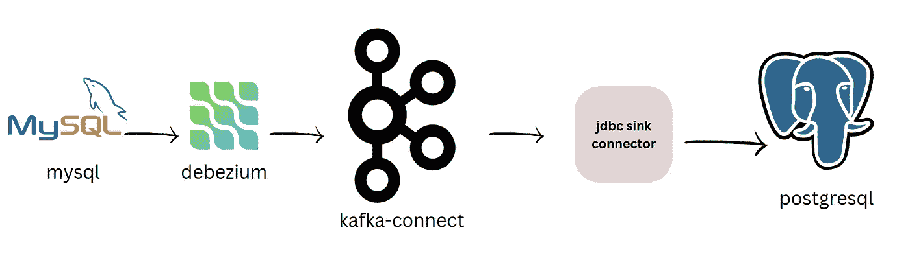

[**卡夫卡**](https://kafka.apache.org/) 由[**LinkedIn**](https://in.linkedin.com/) 开发，于 2011 年开源。Kafka 用于构建 [**实时流管道**](https://www.precisely.com/blog/big-data/streaming-data-pipelines-how-to-build-one) 和应用程序。Kafka 是一个开源软件，它提供了一个用于存储、读取和分析流数据的框架。

**Kafka Connect** 可以接收整个数据库或从所有应用服务器收集指标到 **Kafka topics** 中，使数据可用于具有**低延迟**的流处理。

## 什么是变更数据捕获？

变更数据捕获用于捕获源数据库中的数据增量变更和模式变更。Its 还用于将实时数据从源数据库复制到生产数据库。

## **连接器类型**

这里 Kafka connect 需要两种类型的连接器:

**源连接器**:源连接器用于将数据库或应用程序中的数据接收到 Kafka 主题中。

**Sink connectors:**Sink connector 用于从 Kafka 主题中获取数据，并将其传送到另一个数据库或对象存储等..

## 步骤:

1.  创建 docker 合成文件
2.  添加所需的连接器
3.  创建 json 属性文件
4.  部署连接器
5.  演示

你可以在 https://github.com/pranav1699/debezium-kafka-cdc 中找到源文件

## 创建 docker 合成文件

我们需要 Zookeeper，Kafka，Kafka-connect，MySQL 在我们的 [**docker 组合文件**中。](https://github.com/pranav1699/debezium-kafka-cdc/blob/main/docker-compose-test.yaml)

```
version: '2'
services:
  zookeeper:
    image: quay.io/debezium/zookeeper
    ports:
     - 2181:2181
     - 2888:2888
     - 3888:3888
  kafka:
    image: quay.io/debezium/kafka
    ports:
     - 9092:9092
    links:
     - zookeeper
    environment:
     - ZOOKEEPER_CONNECT=zookeeper:2181
  mysql:
    image: quay.io/debezium/example-mysql
    ports:
     - 3307:3307
    environment:
     - MYSQL_ROOT_PASSWORD=debezium
     - MYSQL_USER=mysqluser 
     - MYSQL_PASSWORD=mysqlpw 
  connect:
    image: debezium/connect:1.8
    ports:
     - 8083:8083
    links:
     - kafka
     - mysql
     - postgres
    environment:
     - BOOTSTRAP_SERVERS=kafka:9092
     - GROUP_ID=1
     - CONFIG_STORAGE_TOPIC=my_connect_configs
     - OFFSET_STORAGE_TOPIC=my_connect_offsets
     - STATUS_STORAGE_TOPIC=my_source_connect_statuses
```

使用 docker compose 命令部署它

```
docker-compose up -d
```

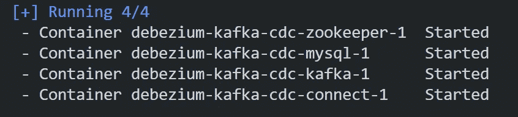

## 添加所需的连接器

转到[http://localhost:8083/connector-plugins](http://localhost:8083/connector-plugins)查看可用连接器的列表

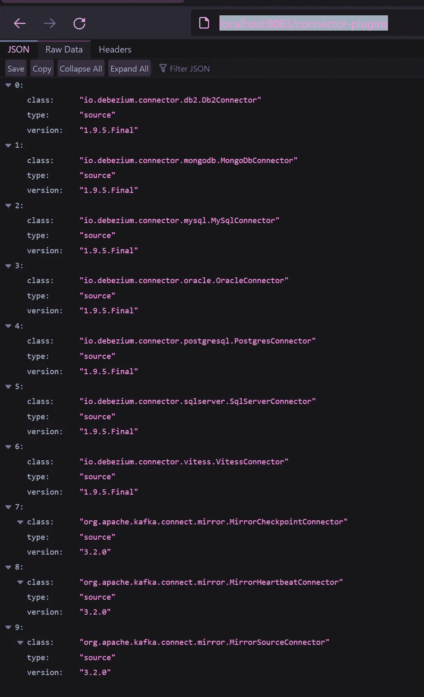

在这里我们可以看到 Debezium 连接器 MySQL，Postgres，db2 和 mango dB 等。

我们将使用 Debezium connector for MySQL**io . Debezium . connector . MySQL . MySQL connector**来捕获 MySQL 中数据的变化

对于接收器连接器，我们将使用 jdbc 接收器连接器，但是我们没有列出任何 jdbc 接收器连接器，因此我们将 jdbc 接收器连接器下载到 kafka connect 中

我们可以从[https://www . confluent . io/hub/confluent Inc/Kafka-connect-jdbc](https://www.confluent.io/hub/confluentinc/kafka-connect-jdbc)下载 JDBC 接收器连接器

我们将选择手动下载，并将其下载为 zip 文件

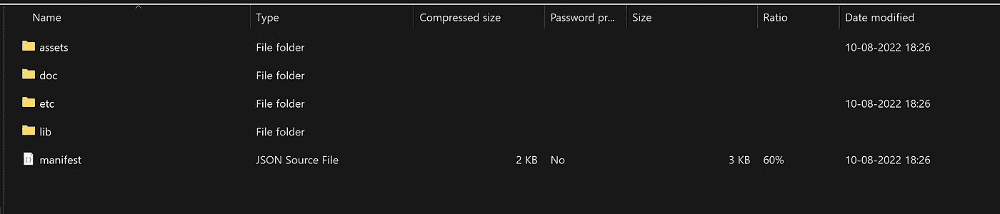

转到 lib 目录，在那里我们可以看到 jdbc 连接器的大量 jar 文件。

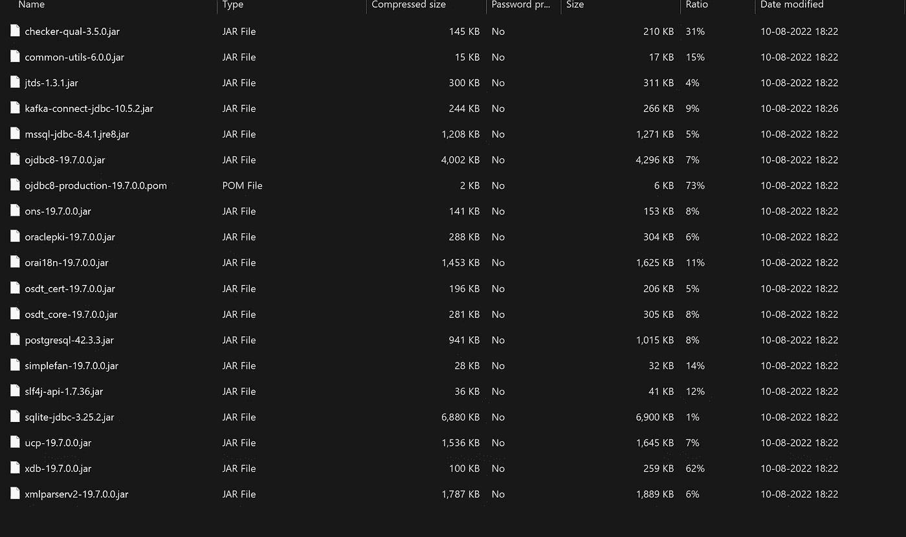

使用 docker cp 命令将这些 jar 文件复制到容器内的 kafka/libs 目录中

```
docker cp ./ debezium-kafka-cdc-connect-1:/kafka/libs
```

现在重新启动 debezium-kafka-cdc-connect-1 容器，重新启动容器后，您可以看到新添加的 jdbc 连接器。

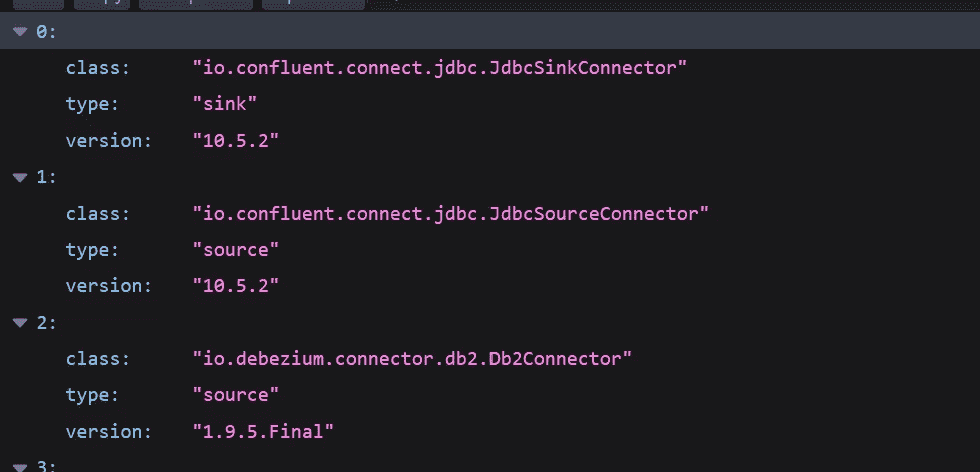

## 创建 json 属性文件

首先为源连接器创建 json 文件，命名为 [**source.json**](https://github.com/pranav1699/debezium-kafka-cdc/blob/main/source.json)

```
{
    "name": "inventory-connector",
    "config": {
        "connector.class": "io.debezium.connector.mysql.MySqlConnector",
        "tasks.max": "1",
        "database.hostname": "mysql",
        "database.port": "3306",
        "database.user": "debezium",
        "database.password": "dbz",
        "database.server.id": "184054",
        "database.server.name": "dbserver1",
        "database.include.list": "inventory",
        "database.history.kafka.bootstrap.servers": "kafka:9092",
        "database.history.kafka.topic": "schema-changes.inventory",
        "transforms": "route",
        "transforms.route.type": "org.apache.kafka.connect.transforms.RegexRouter",
        "transforms.route.regex": "([^.]+)\\.([^.]+)\\.([^.]+)",
        "transforms.route.replacement": "$3"
    }
}
```

命名连接器，每个连接器应该有一个唯一的名称。

这里我们使用 regex 转换来获取表名作为 kafka 主题的名称。你可以在这里找到更多相关信息[https://docs . confluent . io/platform/current/connect/transforms/regex router . html # description](https://docs.confluent.io/platform/current/connect/transforms/regexrouter.html#description)

使用这个 curl 命令将这个连接器部署到 kafka connect

```
curl -i -X POST -H "Accept:application/json" -H  "Content-Type:application/json" http://localhost:8083/connectors/ -d @source.json
```

现在让我们为 sink 连接器创建 json 属性文件，将文件命名为 [**sink.json**](https://github.com/pranav1699/debezium-kafka-cdc/blob/main/jdbc-sink.json)

```
{
    "name": "jdbc-sink",
    "config": {
        "connector.class": "io.confluent.connect.jdbc.JdbcSinkConnector",
        "tasks.max": "1",
        "topics": "customers",
        "connection.url": "jdbc:postgresql://postgres:5432/inventory?user=postgresuser&password=postgrespw",
        "transforms": "unwrap",
        "transforms.unwrap.type": "io.debezium.transforms.ExtractNewRecordState",
        "transforms.unwrap.drop.tombstones": "false",
        "auto.create": "true",
        "insert.mode": "upsert",
        "delete.enabled": "true",
        "pk.fields": "id",
        "pk.mode": "record_key"
    }
}
```

使用 curl 命令将这个连接器部署到 kafka connect

```
curl -i -X POST -H "Accept:application/json" -H  "Content-Type:application/json" http://localhost:8083/connectors/ -d @sink.json
```

现在转到[http://localhost:8083/connectors/](http://localhost:8083/connectors/)查看活动和运行的连接器列表。

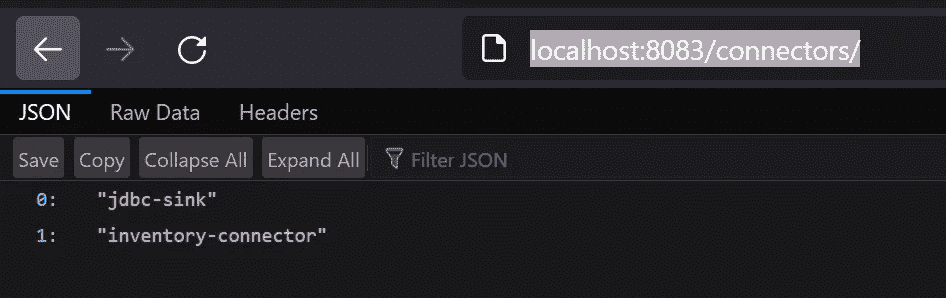

让我们转到 mysql 来查看可用的表

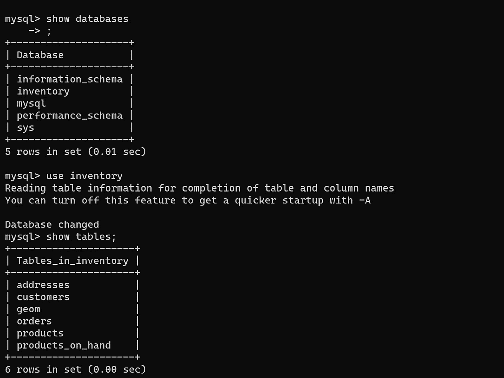

现在让我们看看卡夫卡创造的主题

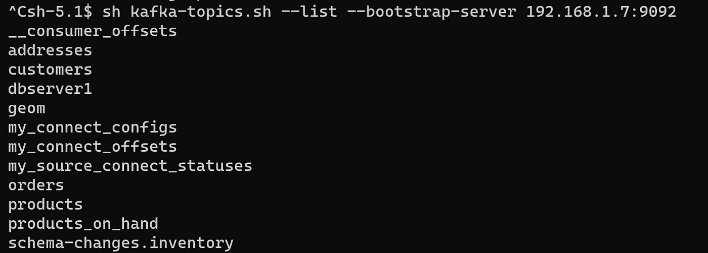

你可以看到主题表的名称已经被创建。

在这个例子中，我们只关注 customers 表，所以我们在 sink 连接器中提到了 customer 主题。

现在让我们看看 PostgreSQL 中的数据

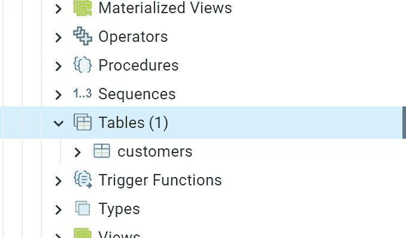

我们可以看到 Customers 表是由 kafka connect 自己创建的。

## 变更数据捕获演示

现在让我们从 MySQL 中选择所有数据。

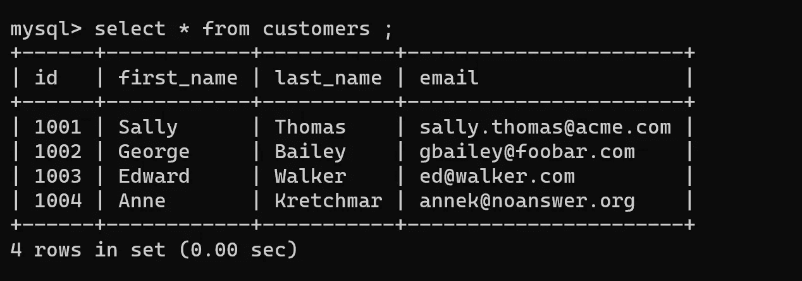

现在让我们检查 PostgreSQL 中的数据。

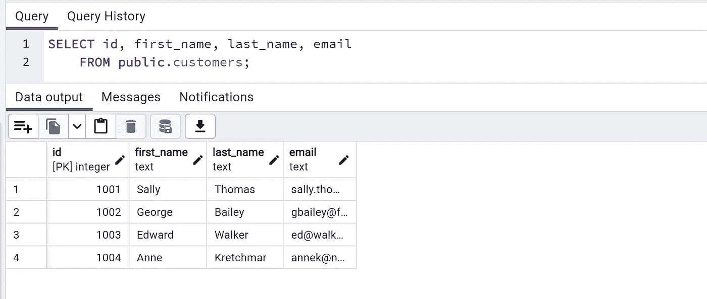

太好了，它有相同的数据。现在，让我们尝试更新一条记录，看看源连接器是否捕捉到了更改并在 PostgreSQL 中进行了更改。

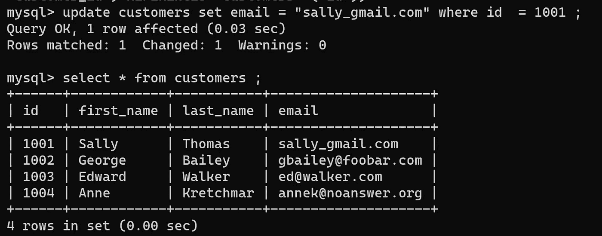

我们已经更新了 id 1001 的电子邮件。

现在让我们在 PostgreSQL 上看看

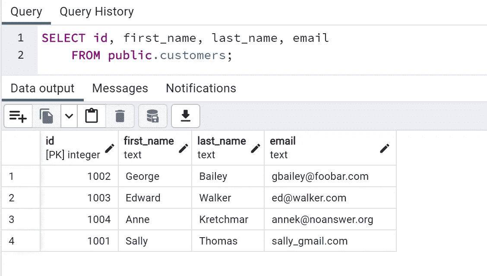

很好，它捕捉到了变化并更新了 PostgreSQL 中的表

现在让我们尝试在 MySQL 中添加新记录

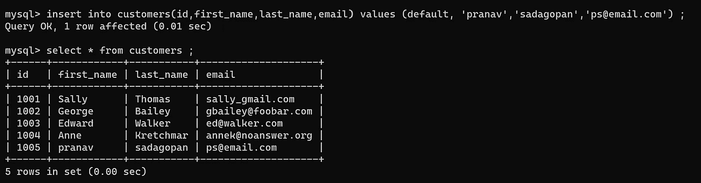

现在让我们看看 PostgreSQL 中的这条记录

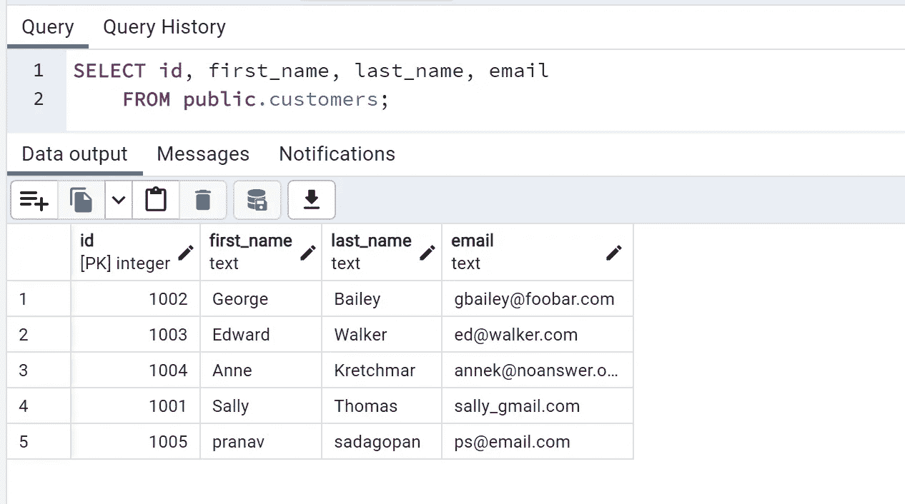

太好了，更新了..👍

## 摘要

在这篇博客中，我们看到了如何使用 debezium 和 Kafka-connect 实现从 MySQL 到 PostgreSQL 的变更数据捕获，从而使我们的复制过程变得简单且可伸缩。

与我联系:

推特—[https://twitter.com/pranavsadagopan](https://twitter.com/pranavsadagopan)

领英—【https://www.linkedin.com/in/pranav-sadagopan/ 