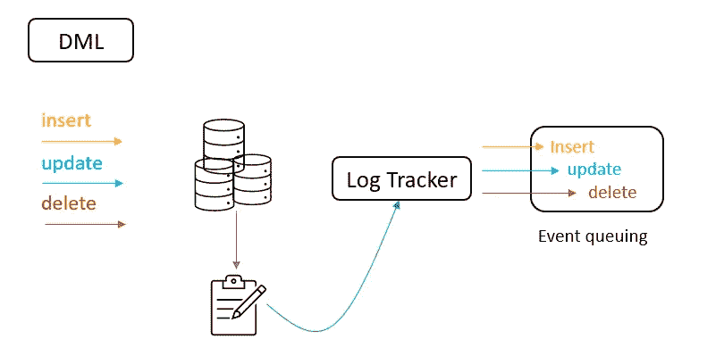
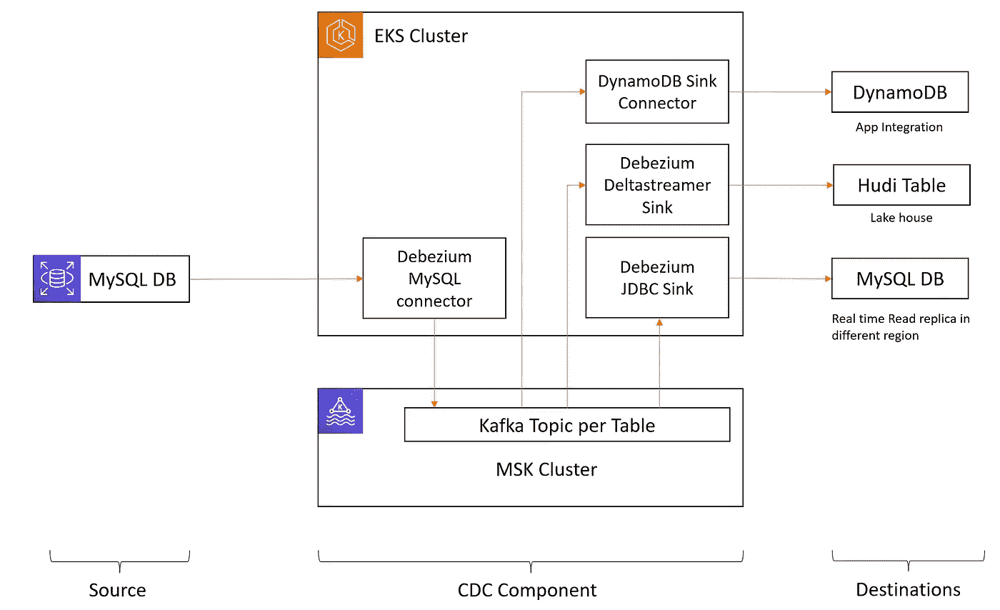
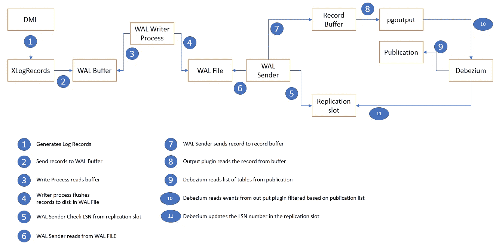

# 变更数据捕获—简介！

> 原文：<https://blog.devgenius.io/change-data-capture-intro-7307d3768056?source=collection_archive---------7----------------------->

斯蒂芬·道森在 [Unsplash](https://unsplash.com?utm_source=medium&utm_medium=referral) 上拍摄的照片

疾病控制中心的基本介绍

# 美国疾病控制与预防中心

变更数据捕获 *(CDC)* 是一种数据集成设计模式，它允许我们跟踪数据库表中的行级变更，以响应创建、更新和删除操作。CDC 允许我们将 DB 中的变化视为事件并对其做出响应。使用这种技术，我们可以执行增量数据加载，并同步异构数据。CDC 可以使用不同的策略来实现，如轮询、双重写入和日志跟踪。大多数 CDC 管道实现了日志跟踪方法，这种方法从数据库的引擎特定日志中跟踪事件。例如，在 MySQL 中，这些变更数据事件通过 [MySQL 二进制日志(binlog)](https://dev.mysql.com/doc/internals/en/binary-log-overview.html) 公开。在 Postgres 中，WAL 是使用发布和复制槽公开的。类似地，MongoDB 的变化可以用 OpLog 来跟踪。

**疾控中心核心理念:**

*   将数据更改作为事件公开
*   将事件存储在缓冲区中
*   实时使用缓冲区中的事件。

# 疾控中心平台

有多个 CDC 平台，如 Debezium、DBLog、Maxwell、MySQL Streamer 和 SpinalTap。其中 Debezium 是最受欢迎的。Debezium 用于 Zomato、Oyo、Delhivery 和 Zalando 等公司。它在事务日志中捕获提交给数据库表的所有行级更改，并将它们转换为事件。它利用 Kafka 来处理变更的排队。它也可以连接到 Pulsar 和 kinesis。Debezium 提供了几种单一的消息转换，允许我们进行基于主题/内容的路由和基于内容的过滤。

在生产环境中，Debezium 平台在 K8s 集群上以分布式模式运行。Kafka-connect image 被用作基础，debezium 和 source/sink specific 的插件被添加到它的上面。JMX 插件/jar 被添加到映像中进行监控。

或者，我们也可以使用 MSK 连接来运行 Kafka-connect 连接器。MSK 连接允许我们在 AWS 上运行完全托管的 Apache Kafka Connect 工作负载。

在上图中，我们将 MySQL DB 作为源。我们使用 EKS 集群来托管 Debezium 源和接收器连接器。这些以分布式模式运行。后端 Kafka 集群托管在 AWS MSK。

正如所看到的，源数据库中的单个更改几乎实时地传播到三个不同的用例。首先，它丰富了胡迪表(湖房子)。同时，它还将数据复制到不同地区的 MySQL 中。最后，我们还使用相同的事件来更新应用程序使用的 DynamoDb 表。

# 疾控中心的优势

1.  仓库和功能商店的实时更新
2.  与其他不兼容的数据库集成
3.  减轻运营数据库的压力
4.  扇出数据库事件
5.  支持灾难恢复使用案例

# CDC 使用案例

1.  无效缓存
2.  实体化视图的更新
3.  审计日志
4.  微服务的发件箱设计模式

## 要记住的几点:

*   插件中数据库运行时的不兼容性
*   事务提交大小
*   复制插槽中的错误
*   在繁重的交换表中缺乏并行性

## 附录

postgres 上的 CDC 流

*   LSN 代表日志序列号(WAL 文件中的字节偏移量)

数据工程快乐！！！