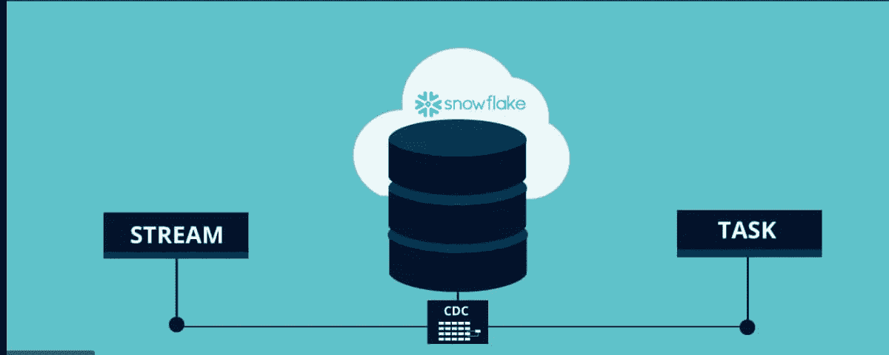

# 使用雪花流更改数据捕获

> 原文：<https://blog.devgenius.io/change-data-capture-using-snowflake-streams-54a58e1839d3?source=collection_archive---------2----------------------->

感谢您阅读我之前的博客，我们将了解更多关于使用雪花流在雪花中实现渐变维度或更改数据捕获的内容。如果你想了解更多关于变更数据捕获(CDC)的信息，你可以在这里阅读更多信息—[https://blog . dev genius . io/Change-Data-Capture-in-dwbi-ETL-ELT-implementations-af 08 b 54d 8 FB 5](/change-data-capture-in-dwbi-etl-elt-implementations-af08b54d8fb5)



让我们在一些常见问题的帮助下，开始了解更多关于雪花流的知识

**什么是溪流？**

流是雪花对象，我们可以在另一个雪花对象——表上创建、修改或删除它。我们可以在任何表上创建流，比如标准表、目录表、外部表以及视图中的底层表。我们可以在想要跟踪缓慢变化的维度或 CDC 的表的顶部创建流。

**Stream 是如何工作的？**

一旦我们在任何表上创建了流，它就会跟踪该表上的任何 DML 更改。这个对象跟踪源表中发生的任何插入、更新或删除，并在流中列出操作。

**Stream 如何捕捉变化？**

一旦在任何表的顶部定义了流，它就创建一个表的时间点快照作为表的当前事务版本。流将更改与快照版本进行比较，识别对源表所做的更改，并记录到流中。

**流中捕获的是什么？**

正如我们现在所知道的，stream 跟踪、比较和记录对源对象的任何事务或 DML 更改。这些更改被记录到在该表之上创建的流中。Stream 以列、修改的行及其动作状态(在其中一个元数据列中插入/更新或删除)的前后阶段的形式存储信息。流不保存任何表数据，但是它只保存更改的日志数据。

**流的格式是什么？它是否有任何用于记录或跟踪更改的列？**

Stream 不存储任何表数据，但是它的结构类似于一个表，其中包含来自源表的所有列，并添加了以下元数据相关列

METADATA$ACTION —指示记录的 DML 操作(插入、删除)。

METADATA $ ISUPDATE 指示操作是否是 UPDATE 语句的一部分。对源对象中行的更新表示为流中的一对删除和插入记录，元数据列 METADATA $ ISUPDATE 值设置为 TRUE。

METADATA$ROW_ID —为行指定唯一且不可变的 ID，可用于跟踪特定行随时间的变化。

**流的类型有哪些？**

流也可以以不同的类型完成，如下所示

1.**仅插入:**这仅支持外部表格。该流跟踪插入操作的行。这不会捕获任何删除操作。

2.**仅追加:**标准表、目录表或视图支持。这将跟踪插入的行。这些类型的流不会跟踪更新、删除或任何截断操作

3.**标准**:支持—标准表、目录表或视图。因为这是标准流，所以它跟踪源对象上所有类型的 DML，如插入、更新或删除。

**我们可以使用 Streams 跟踪地理空间数据的 CDC 吗？**

是的，我们可以使用流来跟踪 CDC，但是我们不能为地理空间数据创建标准流，尽管地理空间数据的 CDC 可以使用仅附加流来完成。

**流可以跟踪多长时间的数据？维护的变更日志是否有效？**

流数据可能是陈旧的，这取决于源表的数据保持期。这不适用于外部表或目录表，因为这些表没有数据保留策略。如果源表有 14 天的数据保留期，那么流也可以保存长达 14 天的更改日志。如果更改日志数据在 14 天内未被使用，则数据会延长至最多 14 天，以确保更改日志的使用，并避免从流中遗漏或删除更改日志。

**如何才能创建流？**

可以使用 DDL 语句创建流。我们可以使用下面一组 DDL 创建或改变流。让我们创建一个示例表作为源表来创建流–

```
*-- Create a table to store the names and fees paid by members of a gym*
create or replace table members (
  id number(8) not null,
  name varchar(255) default null,
  fee number(3) null
);

*-- Create a stream to track changes to date in the MEMBERS table*
create or replace stream member_check on table members;
```

这里，member_check 是在源表成员上创建的流。每当在源表上运行任何 DML 更改时，stream-member _ check 都会捕获它们。

**我们如何使用流来使用修订？**

现在，我们有了一个源表—成员和一个定义的流— members_check。让我们创建另一个表，并对源表 members 和 signup 运行几个 insert 语句。

```
create or replace table signup (
  id number(8),
  dt date
  );

insert into members (id,name,fee)
values
(1,'Joe',0),
(2,'Jane',0),
(3,'George',0),
(4,'Betty',0),
(5,'Sally',0);

insert into signup
values
(1,'2018-01-01'),
(2,'2018-02-15'),
(3,'2018-05-01'),
(4,'2018-07-16'),
(5,'2018-08-21');
```

现在，让我们看看流是如何记录对 members-source 表所做的更改的。

```
select * from member_check;

+----+--------+-----+-----------------+-------------------+------------------------------------------+
| ID | NAME   | FEE | METADATA$ACTION | METADATA$ISUPDATE | METADATA$ROW_ID                          |
|----+--------+-----+-----------------+-------------------+------------------------------------------|
|  1 | Joe    |   0 | INSERT          | False             | d200504bf3049a7d515214408d9a804fd03b46cd |
|  2 | Jane   |   0 | INSERT          | False             | d0a551cecbee0f9ad2b8a9e81bcc33b15a525a1e |
|  3 | George |   0 | INSERT          | False             | b98ad609fffdd6f00369485a896c52ca93b92b1f |
|  4 | Betty  |   0 | INSERT          | False             | e554e6e68293a51d8e69d68e9b6be991453cc901 |
|  5 | Sally  |   0 | INSERT          | False             | c94366cf8a4270cf299b049af68a04401c13976d |
+----+--------+-----+-----------------+-------------------+------------------------------------------+
```

**我们如何使用来自流的更改日志数据并将其应用到目标表？**

正如我们所见，members_check 是一个流，它具有与源表相同的列/DDL 以及 4 个元数据列。我们可以基于元数据操作列应用更改。让我们看一个使用 members、signup 和 members_check 的示例。让我们考虑我们有 30 天的免费试用，然后提供每月 90 美元的费用。我们需要考虑的成员和注册细节以及最新的数据插入从成员 _ 检查和计算费用在目标表列日志。我们可以如下使用 sql

```
merge into members musing (select id, dtfrom signup swhere datediff(day, '2018-08-15'::date, s.dt::date) < -30) son m.id = s.idwhen matched then update set m.fee = 90;
```

一旦我们运行这个 SQL，目标表就会得到更新。让我们看看成员表中的记录–

```
select * from members;+----+--------+-----+| ID | NAME   | FEE ||----+--------+-----||  1 | Joe    |  90 ||  2 | Jane   |  90 ||  3 | George |  90 ||  4 | Betty  |   0 ||  5 | Sally  |   0 |+----+--------+-----+
```

使用 MERGE 语句，我们可以很容易地从流中捕获变化并应用到目标表。我们也可以使用相同的流逻辑和 MERGE 语句实现 SCD 类型 II。

我希望这篇博客将有助于理解流和流的实现，以从源表捕获变化，并将它们应用到目标表。我们还可以自动化该过程，并近乎实时地将更改捕获到目标表中。自动化可以使用雪花任务来完成。

> 关于我:
> 
> 我是 DWBI 和云建筑师！我目前在雪花公司的 GCP 担任高级数据架构师。我一直在处理各种遗留数据仓库、大数据实施、云平台/迁移。我是 SnowPro 核心认证数据架构师，也是 Google 认证的 Google 专业云架构师。您可以联系我 [LinkedIn](https://www.linkedin.com/in/poojakelgaonkar/) 如果您在认证、数据解决方案和实施方面需要任何进一步的帮助！