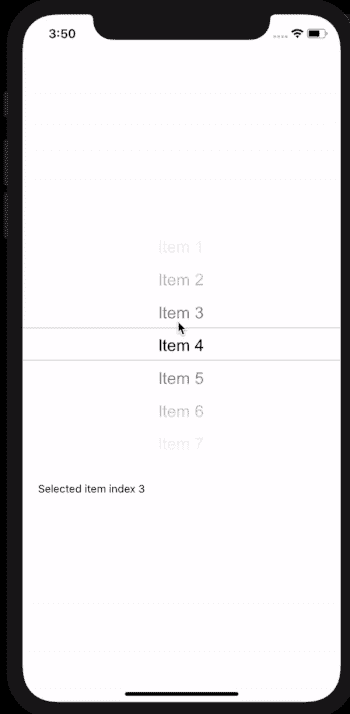
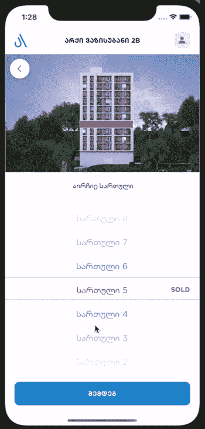

# 更改滚动上的选取器值—反应本机和 Expo。

> 原文：<https://blog.devgenius.io/change-picker-value-onscroll-react-native-and-expo-df81b17e9a8d?source=collection_archive---------5----------------------->



默认 NPM 包示例

这是我为一家房地产开发公司做的第一个 React native 项目，任务是在滚轮选择器卷轴上突出显示选定的建筑楼层。(*顺便可以查一下这个 APP 的工作示例(* [*IOS*](https://apps.apple.com/ge/app/archi-ge/id1506595848) *，*[*Android*](https://play.google.com/store/apps/details?id=com.archi)*)，目前来看语言只有格鲁吉亚语。你也可以从 NPM 下载这个包。*



工作项目示例

但是没有希望找到任何反应原生包或 StackOverflow 帮助。所有的自定义拾取器和 IOS 本地拾取器也只在滚动结束时进行回调。我总是试着写自己的代码而不使用包，但是这次我认为这是一个困难的任务，需要很多时间。花在寻找上的时间和精力告诉我，我必须自己做所有的事情。幸运的是，许多 React 原生开发者正在寻找类似的功能，在他们的谷歌足迹中，我发现了[React-Native-swipe-picker](https://github.com/ninio/react-native-swipe-picker)包，其中 FlatList 或 ScrollView 被用作 picker，所以这是一个修复我的问题的机会。

我增加了滚动回调，修复了一些 bug，改进了功能，让开发者更加方便。

如何使用 DynamicallySelectedPicker 组件的简单示例

```
import React, {*useState*} from 'react';
import {StyleSheet, View, Text} from 'react-native';
import {Colors} from 'react-native/Libraries/NewAppScreen';
import DynamicallySelectedPicker from './src/components/DynamicallySelectedPicker';const *App* = () => {
  const [selectedValue, setSelectedValue] = *useState*(0); return (
    <View style={styles.body}>
      <View style={{margin: 30}}>
        <Text>Item index {selectedValue}</Text>
      </View>
      <DynamicallySelectedPicker
        items={[
          {
            value: 1,
            label: 'Item 1',
          },
          {
            value: 2,
            label: 'Item 2',
          },
          {
            value: 3,
            label: 'Item 3',
          },
          {
            value: 4,
            label: 'Item 4',
          },
          {
            value: 5,
            label: 'Item 5',
          },
        ]}
        width={300}
        height={300}
        onScroll={(*selected*) => setSelectedValue(*selected*.index)}
      />
    </View>
  );
};const styles = StyleSheet.create({
  body: {
    backgroundColor: Colors.white,
    flex: 1,
    alignItems: 'center',
    justifyContent: 'center',
  },
});export default *App*;
```

这是一个带有一个大组件的 React 本地示例(它可以被分成几个小的功能组件)。要经营世博会，你必须改变

***反应-原生-线性-渐变*** 包到 [***世博-线性-渐变***](https://docs.expo.io/versions/latest/sdk/linear-gradient/)

```
import React from 'react';
import PropTypes from 'prop-types';
import {StyleSheet, View, ScrollView, Platform, Text} from 'react-native';
import LinearGradient from 'react-native-linear-gradient';
import *PickerListItem* from './PickerListItem';export default class DynamicallySelectedPicker extends React.Component {
  constructor(*props*) {
    *super*(*props*); *// set picker item height for android and ios* const {height, transparentItemRows, initialSelectedIndex} = *props*;
    let itemHeight = height / (transparentItemRows * 2 + 1);
    *// In ios we have to manually ceil items height to eliminate distortion in the visualization, when we have big data.* if (Platform.OS === 'ios') {
      itemHeight = Math.ceil(itemHeight);
    } *this*.state = {
      itemHeight: itemHeight,
      itemIndex: initialSelectedIndex,
    };
  } */**
   * Generate fake items for picker top and bottom.
   ** ***@param*** *n
   ** ***@returns*** *{[]}
   */* fakeItems(*n* = 3) {
    const itemsArr = [];
    for (let i = 0; i < *n*; i++) {
      itemsArr[i] = {
        value: -1,
        label: '',
      };
    }
    return itemsArr;
  } */**
   * Get extended picker items length.
   ** ***@returns*** *{number}
   */* allItemsLength() {
    return *this*.extendedItems().length - *this*.props.transparentItemRows * 2;
  } */**
   *
   ** ***@param*** *event
   */* onScroll(*event*) {
    const {items, onScroll} = *this*.props;
    const tempIndex = *this*.getItemTemporaryIndex(*event*);
    if (
      *this*.state.itemIndex !== tempIndex &&
      tempIndex >= 0 &&
      tempIndex < *this*.allItemsLength()
    ) {
      *this*.setItemIndex(tempIndex);
      onScroll({index: tempIndex, item: items[tempIndex]});
    }
  } */**
   *
   ** ***@param*** *event
   ** ***@returns*** *{number}
   */* getItemTemporaryIndex(*event*) {
    return Math.round(
      *event*.nativeEvent.contentOffset.y / *this*.state.itemHeight,
    );
  } */**
   *
   ** ***@param*** *index
   */* setItemIndex(*index*) {
    *this*.setState({
      itemIndex: *index*,
    });
  } */**
   * Add fake items to make picker almost like IOS native wheel picker.
   ** ***@returns*** *{*[]}
   */* extendedItems() {
    const {transparentItemRows} = *this*.props;
    return [
      ...*this*.fakeItems(transparentItemRows),
      ...*this*.props.items,
      ...*this*.fakeItems(transparentItemRows),
    ];
  } */**
   *
   ** ***@param*** *item
   ** ***@param*** *index
   ** ***@returns*** *{*}
   */* renderPickerListItem(*item*, *index*) {
    const {itemHeight} = *this*.state;
    const {allItemsColor, itemColor} = *this*.props; return (
      <View
        key={*index*}
        style={[
          styles.listItem,
          {
            height: itemHeight,
          },
        ]}>
        <Text
          style={{
            color: itemColor ? itemColor : allItemsColor,
          }}>
          {*item*.label}
        </Text>
      </View>
    );
  } render() {
    const {itemIndex, itemHeight} = *this*.state;
    const {
      width,
      height,
      topGradientColors,
      bottomGradientColors,
      selectedItemBorderColor,
      transparentItemRows,
    } = *this*.props;
    return (
      <View style={{height: height, width: width}}>
        <ScrollView
          showsVerticalScrollIndicator={false}
          showsHorizontalScrollIndicator={false}
          onScroll={(*event*) => {
            *this*.onScroll(*event*);
          }}
          scrollEventThrottle
          initialScrollIndex={itemIndex}
          snapToInterval={itemHeight}>
          {*this*.extendedItems().map((*item*, *index*) => {
            return *this*.renderPickerListItem(*item*, *index*);
          })}
        </ScrollView>
        <View
          style={[
            styles.gradientWrapper,
            {
              top: 0,
              borderBottomWidth: 1,
              borderBottomColor: selectedItemBorderColor,
            },
          ]}
          pointerEvents="none">
          <LinearGradient
            colors={topGradientColors}
            style={[
              styles.pickerGradient,
              {
                height: transparentItemRows * itemHeight,
              },
            ]}
          />
        </View>
        <View
          style={[
            styles.gradientWrapper,
            {
              bottom: 0,
              borderTopWidth: 1,
              borderTopColor: selectedItemBorderColor,
            },
          ]}
          pointerEvents="none">
          <LinearGradient
            colors={bottomGradientColors}
            style={[
              styles.pickerGradient,
              {height: transparentItemRows * itemHeight},
            ]}
          />
        </View>
      </View>
    );
  }
}DynamicallySelectedPicker.defaultProps = {
  items: [{value: 0, label: 'No items', itemColor: 'red'}],
  onScroll: () => {},
  width: 300,
  height: 300,
  initialSelectedIndex: 0,
  transparentItemRows: 3,
  allItemsColor: '#000',
  selectedItemBorderColor: '#cecece',
  topGradientColors: [
    'rgba( 255, 255, 255, 1 )',
    'rgba( 255, 255, 255, 0.9 )',
    'rgba( 255, 255, 255, 0.7 )',
    'rgba( 255, 255, 255, 0.5 )',
  ],
  bottomGradientColors: [
    'rgba( 255, 255, 255, 0.5 )',
    'rgba( 255, 255, 255, 0.7 )',
    'rgba( 255, 255, 255, 0.9 )',
    'rgba( 255, 255, 255, 1 )',
  ],
};DynamicallySelectedPicker.propTypes = {
  items: PropTypes.arrayOf(
    PropTypes.shape({
      value: PropTypes.oneOfType([PropTypes.string, PropTypes.number]),
      label: PropTypes.string,
      itemColor: PropTypes.string,
    }),
  ),
  onScroll: PropTypes.func,
  initialSelectedIndex: PropTypes.number,
  height: PropTypes.number,
  width: PropTypes.number,
  allItemsColor: PropTypes.string,
  selectedItemBorderColor: PropTypes.string,
  topGradientColors: PropTypes.array,
  bottomGradientColors: PropTypes.array,
};const styles = StyleSheet.create({
  listItem: {
    alignItems: 'center',
    justifyContent: 'center',
  },
  gradientWrapper: {
    position: 'absolute',
    width: '100%',
  },
  pickerGradient: {
    width: '100%',
  },
});
```

希望有人会用，不会像我一样浪费时间。此外，如果您有任何问题或意见，请随时交流。

[GitHub 库](https://github.com/sosog/react-native-dynamically-selected-picker)中的投稿或问题报告(有一点点不同，有更多的道具和回调。)就太好了。

再次为我糟糕的英语道歉，谢谢你。