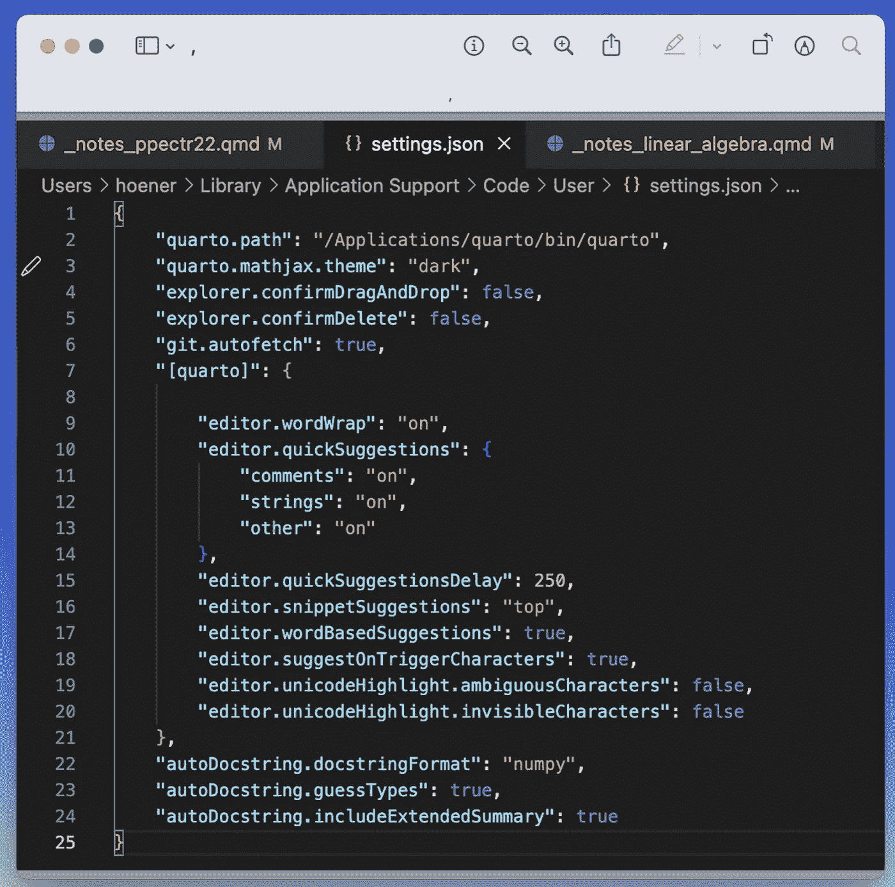
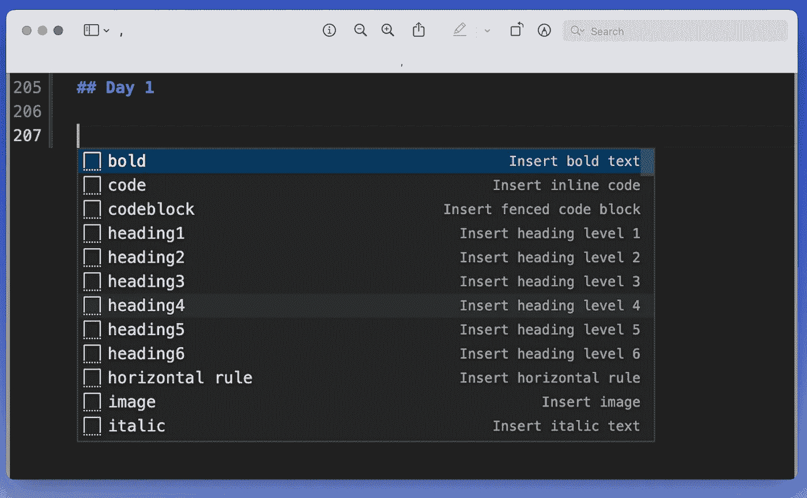
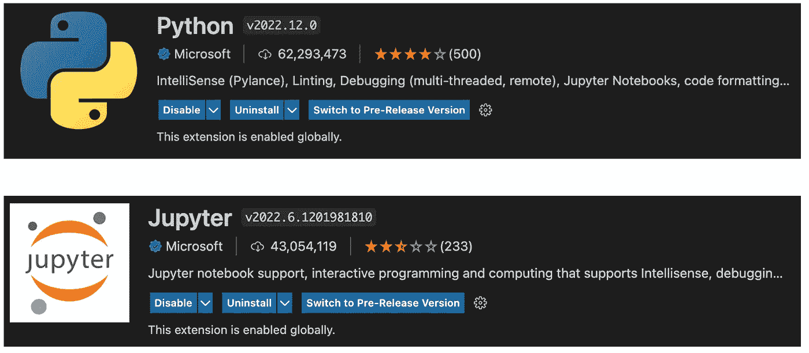
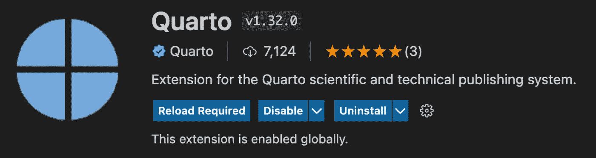

# 改成 VS 代码！数据科学的简单概述。

> 原文：<https://blog.devgenius.io/change-to-vs-code-an-overview-with-a-minimal-setup-for-data-science-a67ba2e42571?source=collection_archive---------13----------------------->

[**VS 代码**](https://code.visualstudio.com/) **用于编程**为我的 R、Python 和未来可能出现的任何其他语言代码使用同一个编辑器。由于一开始我在寻找 VS 代码方面遇到了一些问题，所以我在这里总结了我的一些经验。

如果你和我一样，手头一直在使用一个特定于你的编码语言的**IDE(R 的 RStudio，Python 的 PyCharm / Jupyter)，那么 VS 代码一开始会感觉有点不一样。**

我更愿意把它描述为一个开源开发平台，因为它可以根据你的需求高度定制。定制你的编码体验的三个途径是添加扩展、定制片段和调整非常详细的设置。

# 设置

令人惊讶的是，你可以在 VS 代码中更改设置。在 Mac 上，可以通过常用的`cmd + ,`快捷键打开设置。

不太标准的是，您也可以直接在*中更改设置。json* 文件。如果您使用`cmd+shift+p`打开命令搜索，并输入“设置”，点*首选项:打开设置(JSON)* 将显示:

在这里你可以**直接调整 VS 代码的设置**以及你已经安装的任何扩展，甚至**将它们分配给特定的编程语言**。例如，您可以激活 raw *的代码推荐。py* 文件，但为*禁用它们。ipynb* 以防你在笔记本环境中被它们困扰。

请注意，当在线搜索解决方案时，调整文件中的设置非常有用，因为您可以简单地将配置复制并粘贴到您自己的 *settings.json* 文件中。

# 代码片段和键盘快捷键

我使用片段，特别是当我和`[quarto](https://quarto.org/)`一起工作时，因为它允许我快速插入特定的写作环境。

我为这种语言创建的特定代码片段会在我键入时自动提示。例如，键入单词*粗体*并敲击`tab`会自动插入`** cursor_here **`，并将我的光标放在中间，这加快了我的键入速度。

> *如果你想自己导入我的* quarto snippets.json *，* ***请通过下面的表格给我写一封迷你邮件****——一如既往，我希望收到你的来信！*

为了快速体验，您可以将这些片段与特定语言的键盘快捷键相结合。因此，您可以在 VS 代码中重新创建常用的 RStudio 快捷方式，如管道运算符(`%>%`)的`cmd+shift+m`，或赋值运算符(`<-`)的`cmd+-`。

# 基本扩展

有很多人在为编辑器编写**小扩展，它们通常工作得很好。你可以简单地通过 [*扩展*标签](https://code.visualstudio.com/docs/editor/extension-marketplace)安装它们。**

由于我对扩展的数量感到有些困惑，所以我给你一个小堆栈，让你可以做你的数据科学工作。

*只需点击相应的图片，即可查看市场中的扩展。*

# 编码语言

## 计算机编程语言

## 稀有

## 朱莉娅

## 朱莉娅

## 四开

## 四开

# 便利的工具

# 便利的工具

## Git 镜头

## autoDocstring

## autoDocstring

当你使用 Python 时，这个扩展将为你节省大量的时间，因为它可以帮助你用很棒的文档字符串来记录你的函数。是的，改进你的文档，或者使用帮助你更一致地记录代码的工具，节省了大量的时间。[见 ds-econ 上的这篇帖子](https://www.ds-econ.com/5-years-of-data-science/)。

AutoDocstring 还可以**猜测函数参数的数据类型**，并将其作为文档的一部分。

虽然有不同的、流行的风格可用(例如，*谷歌*，或 *pep257* )，如果你对格式有任何特殊需求，你甚至可以建立自己的 **docstring 模板**。

## 一次降价

名称说明了一切:对 Markdown 的一体化支持，包括片段、目录和预览。不多说，很有用。