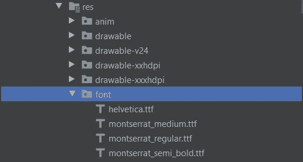

# 改变 Android 中的工具栏字体系列。

> 原文：<https://blog.devgenius.io/change-toolbar-font-family-in-android-2c2662e10b85?source=collection_archive---------4----------------------->

## 轻松定制工具栏字体


亚历山大·安德鲁斯在 [Unsplash](https://unsplash.com/s/photos/font?utm_source=unsplash&utm_medium=referral&utm_content=creditCopyText) 上拍摄的照片

如今在 Android 应用程序中，我们经常会在整个应用程序中看到自定义字体，如细节中的自定义字体，工具栏中的自定义字体，应用程序中的自定义字体无处不在。这使得 UI 更加合适和吸引人。

在这篇文章中，我们将学习如何自定义工具栏字体，如何在主题的帮助下改变工具栏字体系列。

> *原载于 2020 年 6 月 2 日 https://danishamjad.com**。*

# 更改文本视图的字体

在直接跳到自定义工具栏字体之前，首先，看看我们如何在 Android 中轻松地为`TextView`更改字体家族。

我们只需要在我们的`TextView`中添加`font-family`属性，如下面的代码片段所示。

```
<androidx.appcompat.widget.AppCompatTextView
    android:id="@+id/heading"
    android:layout_width="match_parent"
    android:layout_height="wrap_content"
    **android:fontFamily="@font/montserrat_semi_bold"**
    android:textSize="16sp"
    android:ellipsize="end"
    android:gravity="center"/>
```

只需添加一个`**android:fontFamily**` 属性，它就会变得神奇。为`Textview`改变字体系列是如此简单

# 更改工具栏的字体

现在，在 Android 中，我们经常需要改变工具栏的字体系列，以便为我们的最终用户提供更具吸引力的用户界面。

为此，我们需要在工具栏中用`app:theme`属性定义主题，如下面的代码片段所示。

```
<androidx.appcompat.widget.Toolbar
    android:id="@+id/toolbar"
    android:layout_width="match_parent"
    android:layout_height="wrap_content"
    **app:theme="@style/AppTheme.ToolbarFont"** />
```

在此之前，我们必须在我们的`styles.xml`文件中添加主题，并且我们必须像下面的代码片段那样定义字体系列。

```
<style name="AppTheme.ToolbarFont" parent="AppTheme">
    <!--This line changes the color of text in Toolbar-->
    <item name="android:textColorPrimary">@color/black</item>
    <!--This line changes the color of icons in toolbar (back, overflow menu icons)-->
    <item name="android:textColorSecondary">@color/azul</item>
    <item name="textAllCaps">false</item>
    <item name="android:textSize">16sp</item>
    **<item name="android:fontFamily">@font/montserrat_semi_bold</item>**
</style>
```

# 将自定义字体添加到资源文件夹

要添加自定义字体，我们需要在 **res** 目录下创建一个名为**“font”**的文件夹，如下图所示。



Android Studio 字体文件夹截图

# 结果

瞧啊。！！我们在工具栏中实现了自定义字体。


自定义工具栏字体的屏幕截图

如果你想成为一名专业摄影师，那么看看下面的链接。

[](https://bit.ly/30MWM9M) [## Adobe Photoshop CC 高级摄影版-约翰学院

### 了解 Adobe Photoshop CC 的高级功能，以创建和增强您的图像、照片、插图和其他…

bit.ly](https://bit.ly/30MWM9M) 

# 结论

这篇文章告诉你如何在主题的帮助下简单地改变你的工具栏字体，也描述了如何用一行代码设置`Textview`的字体。

希望这篇文章有帮助。如果你认为缺少了什么，有问题，或者想提供任何想法或建议，请在下面留下评论。我会感谢你的反馈。

我写了一些其他与 Android 相关的内容，如果你喜欢这里的内容，你可能也会喜欢:

[](https://android.jlelse.eu/implement-in-app-update-in-android-68892bd11e35) [## 在 Android 中实现应用内更新

### 确保你的应用程序的每个用户都是新版本。

android.jlelse.eu](https://android.jlelse.eu/implement-in-app-update-in-android-68892bd11e35) [](https://heartbeat.fritz.ai/implementing-adaptive-icons-in-android-using-android-studio-301cd61c5d45) [## 使用 Android Studio 在 Android 中实现自适应图标

### 不同 Android 设备上的应用程序启动器图标

heartbeat.fritz.ai](https://heartbeat.fritz.ai/implementing-adaptive-icons-in-android-using-android-studio-301cd61c5d45) [](https://android.jlelse.eu/define-resource-layout-id-in-the-constructor-activity-fragment-with-androidx-a9f80674f185) [## 用 AndroidX 在构造函数活动/片段中定义资源布局 Id

### 减少活动/片段中的方法数量

android.jlelse.eu](https://android.jlelse.eu/define-resource-layout-id-in-the-constructor-activity-fragment-with-androidx-a9f80674f185) 

分享(知识)是关怀😊感谢阅读这篇文章。如果你觉得这篇文章有帮助，一定要鼓掌或推荐。这对我意义重大。

如果你需要任何帮助，请加入我的 [**Twitter**](https://twitter.com/DanishAmjad10) ， [**LinkedIn**](https://www.linkedin.com/in/danish-amjad-06a43090/) ， [**GitHub**](https://github.com/DanishAmjad12) **，**并订阅我的 [**Youtube 频道**](https://www.youtube.com/channel/UC06GphxCS1gzZhdT9dn6kQA?view_as=subscriber) 。