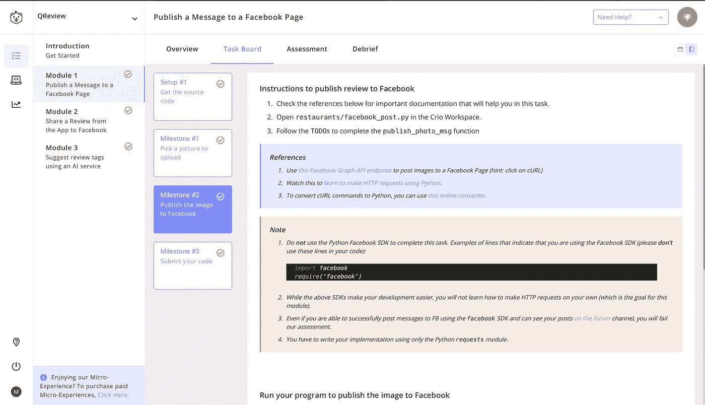
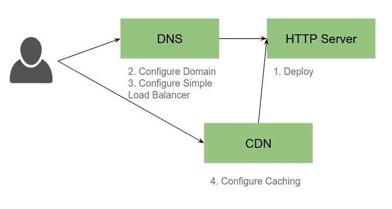
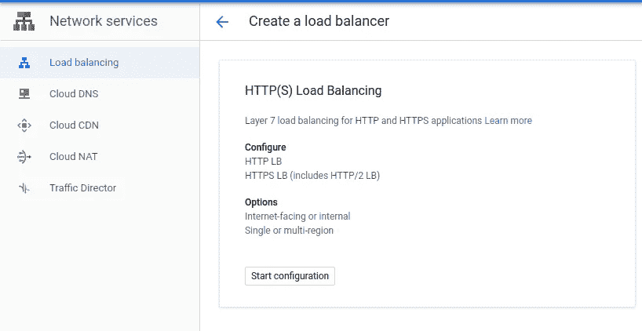
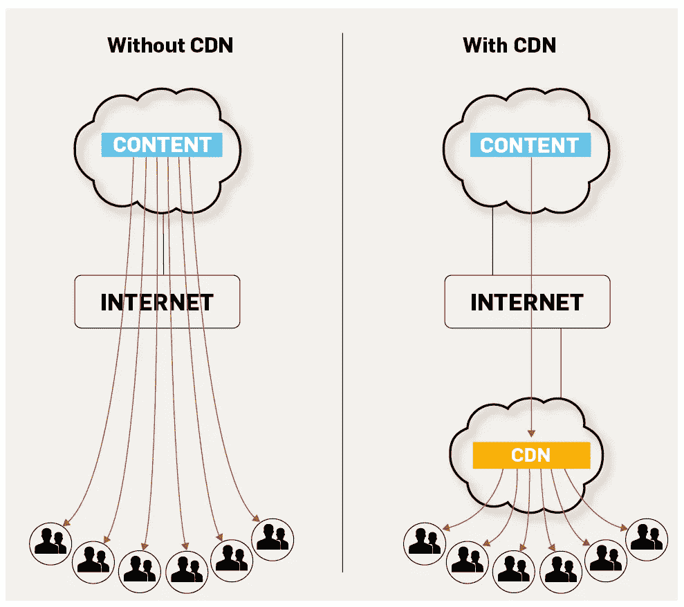

# 改变在线学习游戏

> 原文：<https://blog.devgenius.io/changing-the-online-learning-game-693644708507?source=collection_archive---------17----------------------->

## 看看 Crio.do，他们的“微观经验”提供了一种边做边学的方法。

照片由[克莱门特·H](https://unsplash.com/@clemhlrdt?utm_source=medium&utm_medium=referral)在 [Unsplash](https://unsplash.com?utm_source=medium&utm_medium=referral) 上拍摄

我最近发现了 [Crio.do](https://crio.do) ，惊讶于他们(我)的微体验设计得如此之好。他们能够模拟“真实”的工作，如软件产品开发程序，并通过做来帮助**学习，这是该公司的主要理念。**

这篇文章主要总结了我在完成 [QReview](https://crio.do/detail/api-implementation.html) 和[qp-系统设计](https://crio.do/detail/system-design.html)微观体验中的想法和收获。

# Crio 微体验

在我们进入细节之前，先来了解一下微观体验本身。两个 me 都非常巧妙，设计得很好。整个体验分为多个模块，每个模块都有一堆设置和里程碑任务。每项任务都提供了动手体验，最后，通过提问，总结部分让你真正思考所有获得的技能，并让所有知识真正成为你的，这在[体验式学习范式](https://en.wikipedia.org/wiki/Experiential_learning)中是基本的，也是非常重要的。此外，由于提供了在线 VS 基于代码的工作区，您真的不需要在安装和设置上花费太多时间。

# 回顾

这种微观体验允许你在他们的订餐应用 QEats 中实现社会评论功能，并让你从只知道基本的 Python 语法到获得足够的技能，在任何项目中应用 REST APIs、cURL、使用 Python 请求模块的 HTTP 请求和响应、脸书共享 API、JSON 解析和 Clarifai Predict APIs。

## 模块 1

第一个模块包括使用 python 函数向脸书页面发布一条消息和一张照片。为此，我们需要了解 [**HTTP 请求方法**](https://developer.mozilla.org/en-US/docs/Web/HTTP/Methods) ，这些方法用于指示针对给定资源要执行的一些期望的操作。这里使用了 POST 方法，用于将实体提交给指定的资源，这可能会导致服务器上的状态变化或副作用。

我使用了 [Python 请求库](https://requests.readthedocs.io/en/master/)来创建对[脸书图形 API](https://developers.facebook.com/docs/graph-api/) 的 post 请求。这个函数是在 [cURL 到 Python](https://curl.trillworks.com) 转换器的帮助下创建的。

使用这个函数，可以使用页面 id 将一张照片和一些标题发布到所需的页面上。

## 模块 2

在第二个模块中，我了解了 Django 服务器，这是一个基于 Python 的免费开源 web 框架，遵循模型-模板-视图架构模式。我还安装了一个，并在上面运行了一个 android 应用程序(QEats)。之前创建的评论服务随后在应用程序中实现。

## 模块 3

第三个模块的目标是使用 Clarifai Predict API 对评论图片进行分类，并向用户发送#hashtag 建议。Clarifai 是一个计算机视觉人工智能平台，它有一堆预先训练好的网络，并允许你使用 API 访问它们。我们不得不在不使用 Clarifai 的 SDK 的情况下，仅通过 HTTP 请求来完成这项工作。同样，在仔细阅读了 Clarifai 的文档(主要是关于使用他们的 SDK)之后，您会明白如何将学到的关于 HTTP 请求的知识应用到应用程序中。

# qp-系统设计

“系统设计我”就是要理解典型的 web 架构的复杂性，并获得一些实践经验。它让您预览如何以“Crio”方式设计可伸缩、分布式和容错系统，即通过自己创建一个。完成这个 ME 也让你能够回答常见的面试问题— *当你在浏览器中输入*[*www.google.com*](http://www.google.com)*会发生什么？*

资料来源:Crio.do

上图显示了我们在 4 个模块中努力实现的整体架构。

## 模块 1

这个模块是关于在云中(Google 云平台)创建一个**虚拟机** (VM)，部署一个 **HTTP 服务器** (Nginx)，并将其配置为向外部世界提供流量。

虚拟机是计算机的模拟，提供与物理机相同的功能。Nginx 是一个 web 服务器，也可以用作负载平衡器、HTTP 缓存、反向代理和邮件代理。

(PS。如果你是一名学生，不想向 GCP 提供信用卡信息，你可以通过在 google.dev 上获取学生福利来获得 50 美元的信用

## 模块 2

第二个模块通过检查浏览器开发工具中的网络选项卡，让您了解当您点击一个 URL 时所发生的一系列事件。您还将了解到 [**DNS 记录**](https://blog.dnsimple.com/2015/04/common-dns-records/) 以及如何配置记录，方法是将您自己的域定向到模块 1 中创建的 web 服务器。

## 模块 3

目标是配置一个简单的负载均衡器并理解**负载均衡**的概念。负载平衡可以在几个层次上完成，如 DNS 层、网络层和 HTTP 层。在本模块中，我们必须在 DNS 和 HTTP 级别设置负载平衡器。

为了理解[负载平衡器](https://www.nginx.com/resources/glossary/load-balancing/)，我们可以把它想象成一个“交通警察”,它位于我们的服务器前面并路由客户端请求。这样做是为了最大限度地提高速度和容量利用率，并且没有一台服务器超负荷工作，从而实现最佳性能。因为有了负载平衡器，即使我们的一个虚拟机宕机，网站也会继续运行，比如在 [DNS 故障转移](https://ns1.com/resources/dns-failover-basic-concepts-and-limitations)的情况下。

## 模块 4

资料来源:globaldots.com

本模块的目标是找到解决网站流量过载的方法。有必要了解站点的传入流量的性质。例如，脸书主页的流量可能是读密集型的，而支付网关站点的流量可能是写密集型的。

为此，我们使用 CDN 来快速传输加载互联网内容所需的资产，包括 HTML 页面、javascript 文件、样式表、图像和视频，从而提高服务器性能。我用[cdn77.com](https://www.cdn77.com/)来设置我的 CDN。此外，我通过对提供的内容进行实验，理解了[最终一致性](https://hackernoon.com/eventual-vs-strong-consistency-in-distributed-databases-282fdad37cf7)的概念。

> Crio 提供了一个平台，通过探索不同的文档，在论坛上交流，甚至帮助他人完成任务，你可以找到如何自己完成所有这些工作的方法，这在现实生活中也是如此。亲身经历所获得的技能是不能和仅仅阅读相关资料相比的。
> 此外，所提供的在线工作空间非常重要，因为并非每个人都能获得跟进所需的资源。
> 
> 我真的认为，看看当前世界的整个 covid 情况，以及我们对在线学习的依赖增加，越来越多的学习平台和课程将开始采用这种方法。