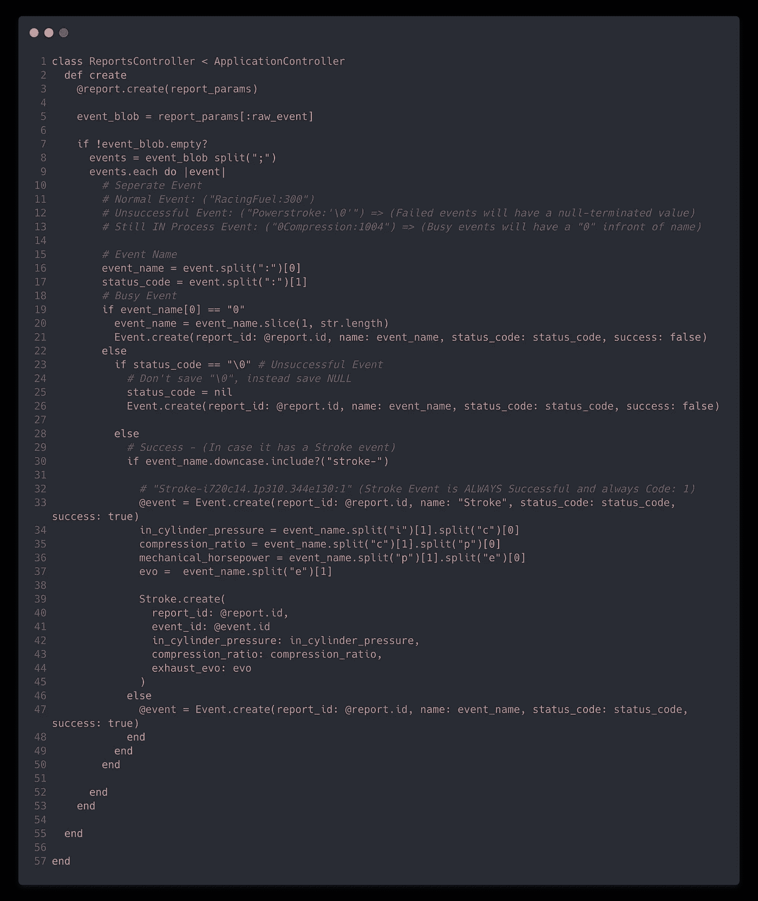
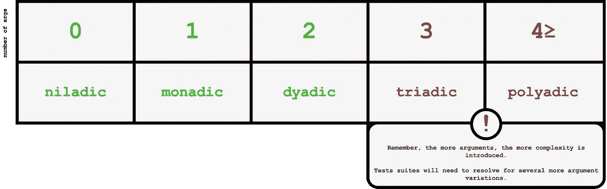
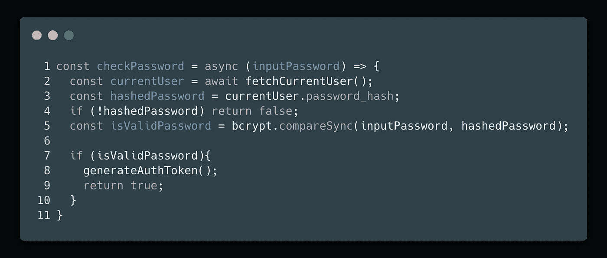

# 第 3 章—功能

> 原文：<https://blog.devgenius.io/chapter-4-functions-d5395fd83786?source=collection_archive---------0----------------------->


切斯文斯— **迪斯尼乐园**

在你可能出生之前，[福坦在流行音乐排行榜上称霸了近 30 年。](https://www.youtube.com/watch?v=Og847HVwRSI)你可以想象从那以后软件的动态发生了多大的变化，但是**功能** **依然盛行。**

今天，我们将深入烹饪漂亮，干净的功能！

## 小——第一条规则

你可能被建议保持你的功能不要大于一个屏幕滚动。

## 更小——第二条规则

虽然我不能给你一个准确的数字，但 20 行已经足够了。足够了——不应该是 20 行。

## 块和缩进

缩进中的块通常应该是一行。如果你曾经发现自己在`if`语句或`for`循环之间编写了大量的指令，那么你很有可能将它们放入自己的函数中。

举例来说，看看我们违反了多少原则。有太多的重复，有太多不必要的评论，因为它读起来很混乱(*提示，提示…下一章)*)，并且有太多的缩进块发生。



**不好。**

## 应该做一件事。应该做好。应该只做这件事。

听起来很简单，但是*是什么一回事？*

假设您想通过向 API 提交表单来提交一个更新的用户名。大致说来，你必须:

1.  验证输入是字符串
2.  获取经过身份验证的用户令牌
3.  用输入字符串数据触发 XHR 请求

这是在做一件*事…* 还是三件事？这将需要一些时间和经验来破译，但一般的经验法则是这样的；我们创建函数来分解更大的代码指令。**，**，*然而，如果你能从函数中提取出另一个函数，那么你很有可能应该再写一个函数。*

例如，如果你验证的输入是一个字符串**并且**有 *x* 个字符**和**验证特殊字符，你应该创建`validateUsernameInput(username)`函数并调用它。

## Switch 语句

当涉及到处理函数时，它们是有风险的。如果你和我一样，你应该知道 switch 语句有多棒。


抽象工厂——漫画由 [refactoring.guru](https://refactoring.guru/design-patterns/abstract-factory) 提供

问题来了(据鲍勃大叔说)…他们违反了单一责任原则(SRP)。一个有无限理由改变的 ***功能，到底有什么责任感？***在 OOP 中，你可以在抽象工厂中使用开关来返回多态对象，但这听起来确实很可怕——不是吗？

当我找到在 switch 语句中调用函数的安全而适当的方法时，我会回来的。

## 使用描述性名称

这很重要，所以我就开门见山了:

*   使它们成为描述性的
*   **不要撒谎**
*   **从容做**

**这些要点可以外推到一本自助书籍中，但它们也适用于函数名。寻找一个好名字需要重命名和重构，但这是值得的，因为它巩固了软件的方向和设计。**

**说起来容易做起来难。说真的。**

## **一致性**

**`getStage()`、`fetchStage()`、`currentStage()`！嗯…哪个是最好的名字？！`getStage`是类方法…还是会执行 HTTP Get 请求…还是会开始计算整数？从长远来看，尽早拥有这些模式是非常有益的，因为你不必每次都进行第二次猜测。**

# **争论**

**函数可以带参数，而且非常强大！**

****

**功能签名+形容词！**

## **二元函数**

**它总是更容易阅读:**

```
// monadic
def add_hours(num_hours)
```

**然后:**

```
// dyadic
def add_hours(unix_time, num_hours)
```

**二元函数仍然非常易读和易懂。当然，第一个是好的，黄油；二元函数只需要多花一秒钟。问题是，**其中一个论点**往往会被*忽略。*最终，开发者将学会有意跳过这一争论，只看`num_hours`。**

> **"我们忽略的部分是虫子的藏身之处."—马丁(4.42 分)**

**当你遇到需要使用二元函数的场景时，你的参数应该显得自然；*自然衔接*和*自然排序*。比如`makeCircle(coordinate, radius)`有一个*自然度*到`coordinate`和`radius`，相比之下像`buyGasoline(octane, carTankSize)`这样的函数。**

## **三元和多元函数**

**此时，将它包装成一个单独的类可能是有意义的。在 MVC 中，你可能想创建一个新的模型来缓解广泛的争论。**

**如果可能，在参数中使用对象也可以减少参数数量:**

**假设我们解析出一些重要的信息，现在有了这些重要的信息，我们想把它放到某个地方！**

**我们正在做的事情相对简单，但争论使它变得相当模糊。**

**编辑:不需要返回` this '**

## **你不需要标志参数**

**函数签名中的布尔参数是函数正在做多件事情的标志。**

**真的，你应该把它分成两个独立的功能。**

## **没有副作用！没有谎言！**

****

**你能发现副作用吗？**

**这个函数 ***应该*** 只是验证密码是否正确。但是由于副作用(第 8 行),每当有人想要验证他们的输入密码时，他们就不必要地创建了一个授权令牌。**

**它不止做一件事。它在撒谎。因此，有副作用的函数是不干净的。**

**显然，你可以在《干净代码》的第 4 章中读到更详细的内容，但是这里有一些重要的概念开发者应该记住:**

****每个功能一个抽象层次**:基本上，不要混合复杂和低级的抽象。类似于在复杂的计算后加上一个`.toString(2)`的东西。**

****逐步下降规则**:你的代码应该像叙述一样从上到下阅读，或者像你在一层一层的抽象中“走过”代码一样。**

****偏好异常或返回错误码**:返回自定义错误码时，可能会以`if else hell`结束。马丁认为最好直接尝试，抓住`(err)`号，然后返回。**

**既然我们在讨论错误处理，我也认为(几乎)所有的响应都应该在一个单独的函数中处理。你的职能是一回事**，处理成功的回应和错误是另一回事**。******

******上一章的提示:也许你已经看过了《T3》，但它很可能是《T4》。一般来说，像`data`或`info`这样的词是虚假信息，它们不会引起任何混乱，但**也不会增加任何价值。********