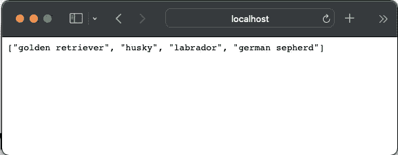
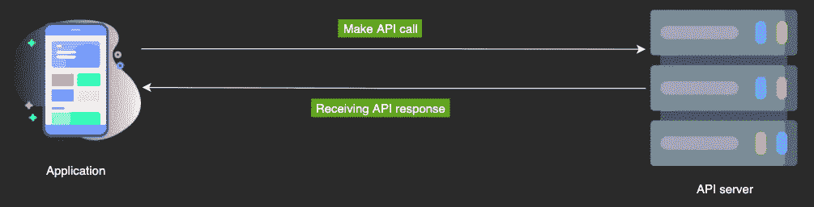
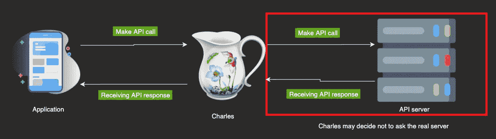
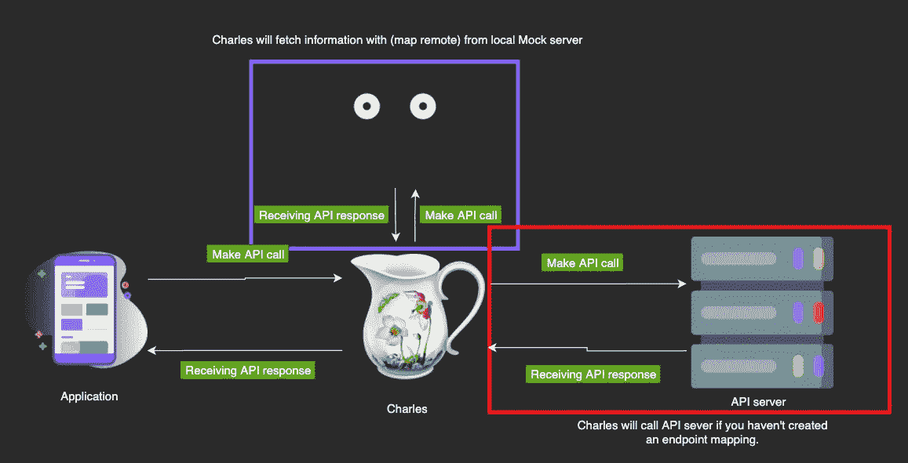
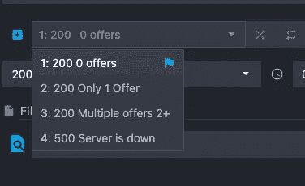

# iOS 版 Charles+mocoon

> 原文：<https://blog.devgenius.io/charles-mockoon-for-ios-80cab9eabca6?source=collection_archive---------1----------------------->


作为一名 iOS 开发人员，准备好大幅提高您的工作效率了吗？我一直在利用这些工具的力量，今天我想和你们分享一下。这篇文章是特别为那些希望在更短的时间内完成更多的开发人员而写的。

# 介绍

## 什么是 Mockoon？

开源项目中的 Mockoon 允许您运行本地主机模拟 API。它有一个 UI 友好的 GUI，可以在其中定义不同的端点和 JSON 响应。



本地主机:3001/狗

从[这里](https://mockoon.com)下载并试用。

## 查尔斯是什么？

> Charles 是一个 HTTP 代理/ HTTP 监控/反向代理，使开发人员能够查看他们的机器和互联网之间的所有 HTTP 和 SSL / HTTPS 流量。

简而言之，charles 能够从你的模拟器中发现所有的网络呼叫。但是并不是唯一的刺探。

Charles 让您能够干预 API 调用并返回您的 JSON 响应，而不是真正的 API 服务器响应。Simulator 认为它正在从真实的 API 获得响应，即使您使用 charles 更改了它。



**不用**使用查尔斯①



和查尔斯一起🎉 (2)

灵感来源于他在图中的位置，也叫作中间人。

有趣的是，用于 API 调用的应用程序代码库并没有改变。应用程序认为它正在与真正的 API 服务器对话，而这并没有发生。

Charle 关于如何处理传入的 API 调用的决定是由开发人员来处理的。它被称为**映射**，您可以使用:

1.  **映射本地文件** (Charles 将提供您设置的本地 json 文件的内容)
2.  **Map Remote** (Charles 不会调用真正的 API 服务器，而是调用另一个服务器，当它得到响应时，它会将响应返回给它)
3.  **无**(你不用为此做什么。就像图 *(1)* )

从[这里](https://www.charlesproxy.com/download/)了解更多关于查尔斯的信息。

介绍完了，让我们看看真正的力量🚀

# 结合查尔斯+莫克 oon

## **好处:**

1.  测试依赖于 API 响应的应用程序的不同状态**快得惊人**。
2.  即使 API 还没有准备好或不稳定，也能从事项目工作。
3.  间谍网络调用和增强您的调试技能。
4.  在 Mockoon 文件夹中组织和保存所有不同的 API 调用。
5.  节流或延迟 API 调用🧪的能力



查尔斯+莫克顿

让我们看一个例子。

```
protocol OfferServiceProtocol {
    func fetchAllOffers() -> [Offer]
    func renewOffer(id: String) -> Bool
}class OfferService: OfferServiceProtocol {
// Let's assume here Alamofire or URLSession used to make the calls
// ...
}
```

假设您正在开发一个复杂的 ViewController，它根据 API 调用响应在 UI 上有所不同。你已经实现了其中的大部分，你想把它们展示给你的队友，你会怎么做？

*   有人可能只是进入代码，做一点小小的改变来强制实现想要的 UI(厌倦了等待构建完成)。

但是完全不接触 XCode，只需点击一个按钮就能改变 API 调用响应，这不是很完美吗？



fetchAllOffers()的不同响应

这样你就能看到 UI 之间惊人的差异。

> **提示:**看到有一个*服务器宕机了。*我用它来看看 API 返回 500 内部服务器错误时 app 的反应。

就这样了，伙计们！Charles 和 Mockoon 在我的 iOS 职业生涯中节省了我大量的开发时间，它们已经成为我工作工具中不可替代的一部分。我希望他们也能为你节省一些时间。时间=💰

*更多内容尽在*[*blog . devgenius . io*](http://blog.devgenius.io)*。*