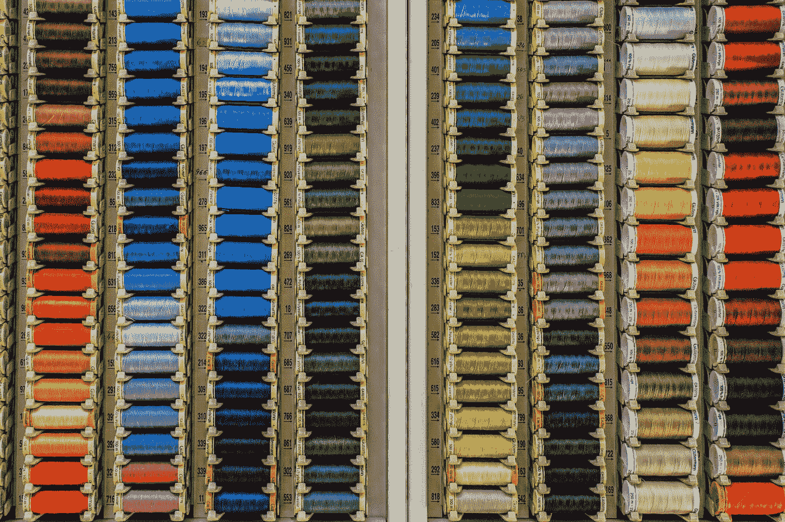

# Chart.js 堆积条形图和辐射图

> 原文：<https://blog.devgenius.io/chart-js-stacked-bar-chart-and-radial-chart-363b34915c12?source=collection_archive---------1----------------------->



照片由[埃克托尔·j·里瓦斯](https://unsplash.com/@hjrc33?utm_source=medium&utm_medium=referral)在 [Unsplash](https://unsplash.com?utm_source=medium&utm_medium=referral) 上拍摄

我们可以使用 Chart.js 使在网页上创建图表变得容易。

在本文中，我们将了解如何使用 Chart.js 创建图表。

# 堆积条形图

我们可以用 Chart.js 创建一个堆积条形图。

例如，我们可以写:

```
var ctx = document.getElementById('myChart').getContext('2d');
var stackedBar = new Chart(ctx, {
  type: 'bar',
  data: {
    labels: ['Red', 'Blue', 'Yellow'],
    datasets: [{
        label: '# of Votes',
        data: [12, 19, 3],
        backgroundColor: [
          'rgba(255, 99, 132, 0.2)',
          'rgba(54, 162, 235, 0.2)',
          'rgba(255, 206, 86, 0.2)',
        ],
        borderColor: [
          'rgba(255, 99, 132, 1)',
          'rgba(54, 162, 235, 1)',
          'rgba(255, 206, 86, 1)',
        ],
        borderWidth: 1
      },
      {
        label: '# of Votes',
        data: [10, 28, 23],
        borderWidth: 1
      }
    ]
  },
  options: {
    scales: {
      xAxes: [{
        stacked: true
      }],
      yAxes: [{
        stacked: true
      }]
    }
  }
});
```

创建包含 2 个数据集的堆积条形图。

我们在`options`属性中包含了`stacked`属性，使它们堆叠在一起。

# 水平条形图

我们可以通过将类型更改为`'horizontalBar'`来创建水平条形图。

例如，我们可以写:

```
var ctx = document.getElementById('myChart').getContext('2d');
var stackedBar = new Chart(ctx, {
  type: 'horizontalBar',
  data: {
    labels: ['Red', 'Blue', 'Yellow'],
    datasets: [{
      label: '# of Votes',
      data: [12, 19, 3],
      backgroundColor: [
        'rgba(255, 99, 132, 0.2)',
        'rgba(54, 162, 235, 0.2)',
        'rgba(255, 206, 86, 0.2)',
      ],
      borderColor: [
        'rgba(255, 99, 132, 1)',
        'rgba(54, 162, 235, 1)',
        'rgba(255, 206, 86, 1)',
      ],
      borderWidth: 1
    }]
  },
  options: {
    scales: {
      xAxes: [{
        stacked: true
      }],
      yAxes: [{
        stacked: true
      }]
    }
  }
});
```

我们只是更改了`type`属性，并将条形改为水平显示。

# 雷达

雷达图是显示多个数据点以及它们之间变化的一种方式。

要创建一个，我们可以写:

```
var ctx = document.getElementById('myChart').getContext('2d');
new Chart(ctx, {
  type: 'radar',
  data: {
    labels: ['Red', 'Blue', 'Yellow'],
    datasets: [{
        label: 'red',
        data: [12, 19, 3],
        backgroundColor: 'red'
      },
      {
        label: 'blue',
        data: [12, 13, 13],
        backgroundColor: 'blue'
      },
      {
        label: 'yellow',
        data: [22, 12, 15],
        backgroundColor: 'yellow'
      }
    ]
  },
});
```

我们有 3 个数据集显示在图表中。

每个数据集都有标签。

`backgroundColor`显示每个形状的背景色

我们现在应该可以看到图表数据集的三角形。

此外，我们可以更改许多其他选项，如边界颜色、边界虚线、钻孔宽度、点半径、点边界颜色、点样式等等。

线条样式，如背景色、边框颜色、边框虚线、填充、指针悬停半径等。也可以改。

# 缩放选项

我们可以用`scale`属性改变缩放比例。

例如，我们可以写:

```
var ctx = document.getElementById('myChart').getContext('2d');
new Chart(ctx, {
  type: 'radar',
  data: {
    labels: ['Red', 'Blue', 'Yellow'],
    datasets: [{
        label: 'red',
        data: [12, 19, 3, 22, 12],
        backgroundColor: 'red'
      },
      {
        label: 'blue',
        data: [12, 13, 13],
        backgroundColor: 'blue'
      },
      {
        label: 'yellow',
        data: [22, 12, 15],
        backgroundColor: 'yellow'
      }
    ]
  },
  options: {
    scales: {
      scale: {
        angleLines: {
          display: false
        },
        ticks: {
          suggestedMin: 50,
          suggestedMax: 100
        }
      }
    }
  }
});
```

改变雷达图的比例。`ticks`改变图表中线条的间隔。

`angleLines.display`如果是`true`则显示角度线。

# 结论

我们可以用 Chart.js 创建堆积条形图和放射状图表。