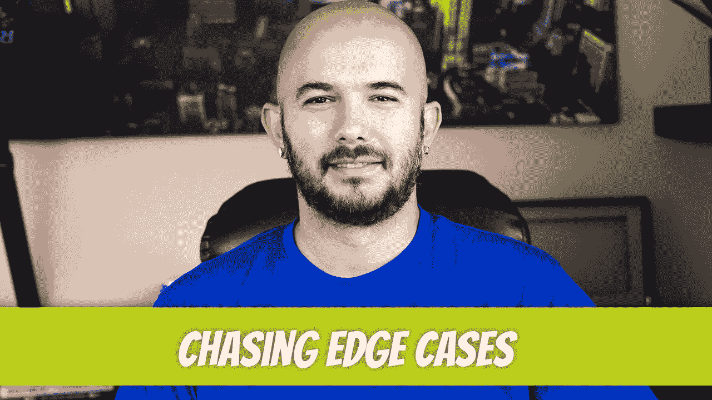

# 追逐边缘案例

> 原文：<https://blog.devgenius.io/chasing-edge-cases-3f03a0197128?source=collection_archive---------9----------------------->

边缘案例。你必须爱他们。这会摧毁你的公司和员工的士气。如果在错误的环境中，追逐边缘案例可能是开发人员最大的陷阱，如果在正确的环境中，这可能是他们最大的优势。你如何平衡，何时平衡？这就是我们将在本文中解决的问题。

如果你没有读过我关于 MVP 软件开发的文章，我鼓励你去读一读。它涵盖了用 MVP 术语进行思考，我们将在整篇文章中涉及这一点。

 [## MVP——开发者的死亡召唤

### MVP。不，不是最有价值球员。在技术术语中，它代表最小可行产品。这是一件如此…

blog.devgenius.io](/mvp-the-developer-death-call-453bba88b351) 

## 什么是边缘案例？

我能描述软件开发中的边缘情况的最好方式是当用户执行某些操作，导致他们正在使用的软件出现不希望的结果。例如，假设我们有一个*添加到购物车*的功能。如果用户按照预期完成这些步骤，他们应该会到达购物车。然而，如果用户点击 Logout 并在点击 Add to Cart 按钮的同时暂时按住 Escape 键，他们可能会出现在 404 页面上。这可能有点夸张，但我认为我已经把这一点讲清楚了。边缘案例只会在最模糊的场景中产生意想不到的后果。

## 是边缘案例还是 Bug？

技术上来说，边缘案例是 bug。然而，什么是风险回报比呢？用户找到它的可能性有多大？即使他们这样做了，这有多大可能会影响业务？这是开发团队在创建软件时应该问自己的问题。如果影响很小，并且重现的步骤远离正常的用户行为，我会把它归类为边缘情况。如果是正常的用户行为导致了中断，我会将其归类为 bug。

## 和你的客户一起设定错误容忍水平。

你的委托人晚上会被他们发现的边缘案件困扰吗？有时这是值得修正的，然而，找出边缘案例可能会对你的底线不利。你越是寻找边缘案例，你就越能找到它们。在某些时候，你必须问自己，客户是希望软件按时完成，软件中潜在的某些边缘情况，还是客户希望代码 100%完美，时间不是问题？

根据我的经验，我会告诉你，客户想要 100%完美的代码，并且要准时。这不是一个现实的期望，尤其是当客户不想为额外的时间和 QA 工作付费的时候。即使是 TDD，如果你能让客户为它付费，也不能保证考虑到所有的边缘情况。

 [## 当单元测试成为错误的选择时

### 如果你认为这篇文章是关于开发人员不知道如何使用单元测试，那不是…

medium.com](https://medium.com/geekculture/when-unit-tests-become-the-wrong-choice-63527812910) 

## 质量保证

如果你的公司足够重视质量保证过程，你会有一些质量保证工程师，他们不仅知道如何在目标用户层次上对核心功能进行冒烟测试，还知道如何找出边缘情况。如果用户访问 web 应用程序并决定禁用 JavaScript，会发生什么？我知道没有人再这样做了(这只是一个例子)，但有时人们会尝试发挥创意，禁用 JavaScript 来禁用某些网站的付费墙。

质量 QA 工程师在那里帮助开发人员，并有可能使他们的生活成为人间地狱。QA 工程师倾向于过分关注边缘案例，以至于会让开发人员失去工作。与 QA 工程师沟通，特定的边缘案例可以记录，但不要求他们立即修复，这是应该定期做的事情。

## 沟通

除了与团队讨论边缘案例，从一开始就与客户交流边缘案例并设定错误容忍预期也很重要。软件开发团队和客户之间必须有某种理解。构建软件是一个混乱的过程。你希望它变得越完美，它就需要越多的资源，也需要越多的钱。

拥有 30 到 90 天的发布后测试期对大多数公司来说也是合理的。在产品发布六个月后发现的边缘案例应要求新的 SOW。客户应该提前了解到还有其他边缘案例潜伏在角落里。公司不能无限期地免费修理那些东西。如果在开发过程中考虑到边缘情况，那么开发时间会增加，客户一开始就会支付更多的钱。就像在商业的任何领域一样，沟通是关键。

## 什么时候可以追边缘案例？

我认为我们现在可以停止谈论边缘案件追逐者的废话，而把注意力放在何时真正适合追逐边缘案件上。如果你在一家已经成功发布产品的公司工作，时间可以分成两部分:bug/edge-case 清理和新特性集成。这甚至不是 50/50 的划分，而是 80/20，80%的时间集中在新功能集成上。

现在不是在产品开发过程中搜寻边缘案例的时候，尤其是当你试图发布它的时候。对大多数人来说，这听起来是违反直觉的，因为他们认为软件必须完美才能发布，但事实是，如果你在测试完美，你永远不会发布一个产品。

因此，如果你在一家以产品完美为目标的大公司工作(比如苹果)，寻找边缘案例可能是你最大的优势。香槟会从天而降，你会被认为是自切片面包以来最好的东西。在大多数其他地方，你会被告知你在浪费时间。

## 最后

我希望你在阅读这篇文章的时候过得愉快。这无疑让我想起了之前经历的创伤后应激障碍。每当客户提到一个晦涩的方法来找到一些意想不到的东西，你只想闭上眼睛，慢慢地筋疲力尽地呼气，小声对他们说:“那是一个边缘情况。”

迪诺·卡伊奇目前是 [LSBio(生命周期生物科学公司)](https://www.lsbio.com/)、[绝对抗体](https://absoluteantibody.com/)、 [Kerafast](https://www.kerafast.com/) 、[珠穆朗玛生物](https://everestbiotech.com/)、[北欧 MUbio](https://www.nordicmubio.com/) 和 [Exalpha](https://www.exalpha.com/) 的 IT 主管。他还担任我的自动系统的首席执行官。他有十多年的软件工程经验。他拥有计算机科学学士学位，辅修生物学。他的背景包括创建企业级电子商务应用程序、执行基于研究的软件开发，以及通过写作促进知识的传播。

你可以在 [LinkedIn](https://www.linkedin.com/in/dinocajic/) 上联系他，在 [Instagram](https://instagram.com/think.dino) 上关注他，或者[订阅他的媒体出版物](https://dinocajic.medium.com/subscribe)。

[*阅读迪诺·卡吉克(以及媒体上成千上万其他作家)的每一个故事。你的会员费直接支持迪诺·卡吉克和你阅读的其他作家。你也可以在媒体上看到所有的故事。*](https://dinocajic.medium.com/membership)