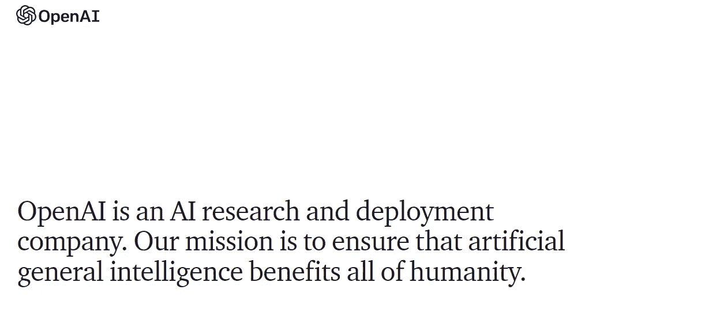
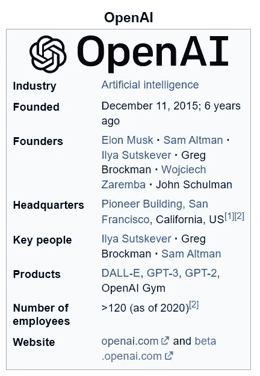
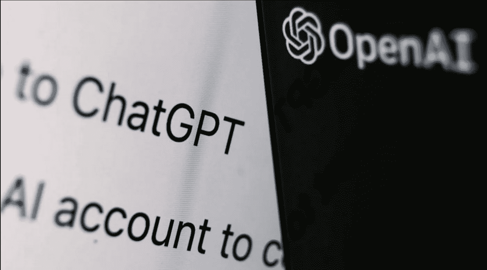
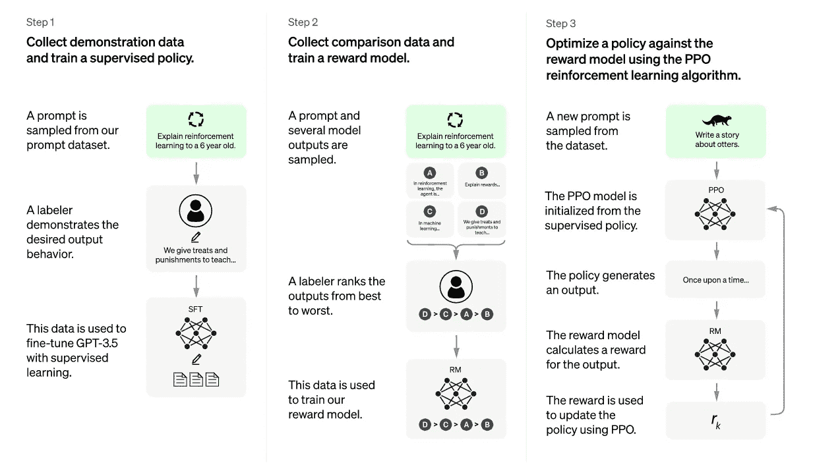
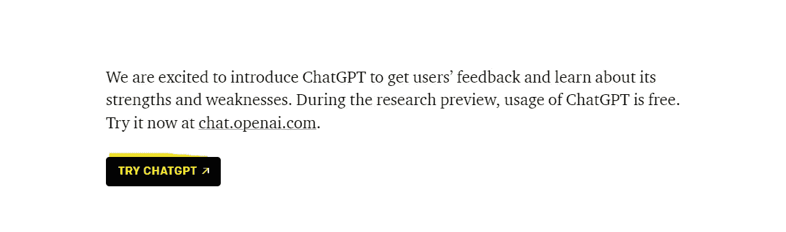
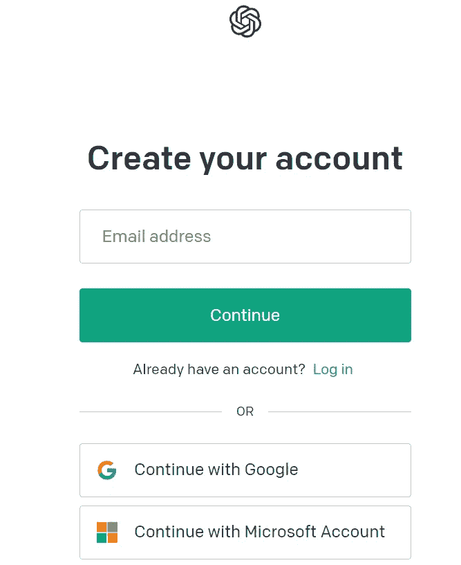
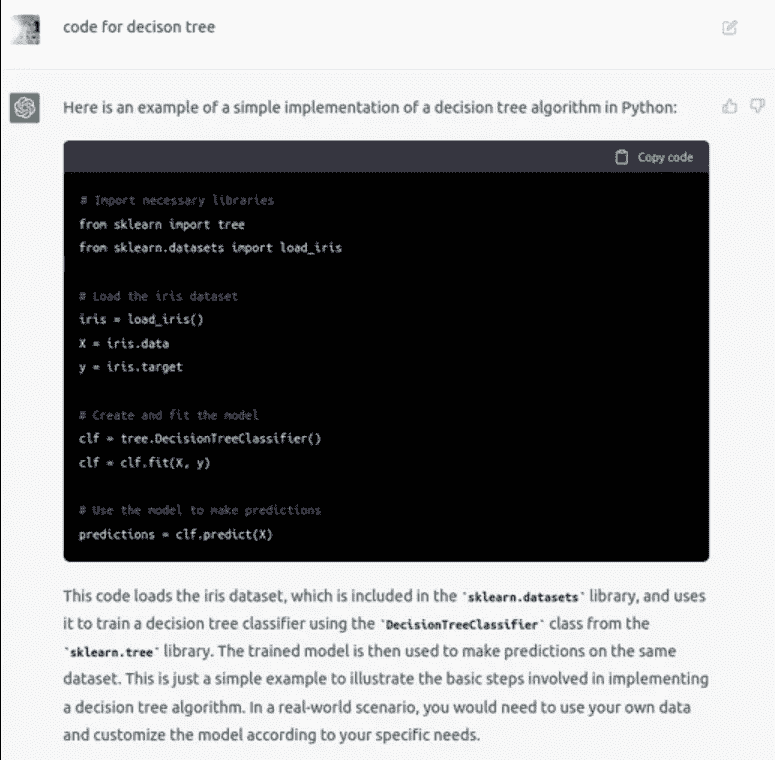

# ChatGPT 聊天机器人🤖:人工智能的新革命🤯

> 原文：<https://blog.devgenius.io/chatgpt-new-revolution-of-ai-c219bd693179?source=collection_archive---------8----------------------->

大家好，在这篇文章中，我们将谈论打破互联网的热门词汇“ **ChatGPT** ”。

目录:

*   *ChatGPT 母公司:OpenAI*
*   *什么是 ChatGPT？*
*   *chat GPT 是如何训练的(后端理解)？*
*   *如何使用 ChatGPT，并用于数据科学实验？*
*   *ChatGPT 的局限性*

## *ChatGPT 母公司:OpenAI*

Open AI 是拥有该应用程序(ChatGPT 和 DALL-E)的母公司

OpenAI*(*[*https://openai.com/*](https://openai.com/)*)*

*   你可以在这里查看 OpenAI 公司([https://openai.com/about/](https://openai.com/about/))

愿景和使命

*   如果你搜索 OpenAI 的创始人，你会得到一个著名的名字“埃隆·马斯克”

([https://en.wikipedia.org/wiki/OpenAI](https://en.wikipedia.org/wiki/OpenAI))

*   他们有一个更受欢迎的应用程序，名为 DALL E，于 2021 年推出
*   这是一种深度学习模型，用于从自然语言描述中创建数字图像。

## 什么是 ChatGPT？

它是由 OpenAI 集团开发的基于 **NLP** (自然语言处理) **AI** (人工智能)的聊天机器人，ChatGPT 中的 **GPT** 代表**生成式预训练变形金刚。用简单的语言向你解释，它是一个聊天机器人，具有学习、理解和用人类可以理解的语言回答问题的额外能力。**

它不仅会回答你的问题，还会记住之前的对话，给你一个更好的答案。

OpenAI- ChatGPT

## *chat GPT 是如何训练的(后端理解)？*

这个聊天机器人是使用从人类反馈中获得的**强化学习** (RLHF)训练的。

如果您查看 ChatGPT 的官方页面，您将会看到下面的图片，它将向您展示数据是如何收集的以及模型是如何训练的。

解决方案框架

**步骤 1** :讲述训练一个监督策略，其中 labeler 基于强化学习(对待和惩罚)标记数据。

**第 2 步**:谈论奖励模型的训练，标签器帮助将输出从最好到最差排序，这些数据用于训练奖励模型。

**第三步**:使用 [PPO](https://openai.com/blog/openai-baselines-ppo/) 强化学习算法([近似策略优化](https://openai.com/blog/openai-baselines-ppo/))优化整个框架。

所有这些都是在 Azure AI 超级计算基础设施上训练的。

## *如何使用 ChatGPT(登录并用于数据科学实验)？*

*   使用该网址访问该网站并点击“**TRY CHATGPT”**([*https://openai.com/blog/chatgpt/*](https://openai.com/blog/chatgpt/))

*   它会将你重定向到登录或注册(如果你是新用户，你有以下所有选项来注册)，我使用我的谷歌帐户继续

*   一旦你完成了深潜登录并开始实验，添加我的一个结果的截图

## ChatGPT 的局限性？

建模强化学习模型是一个迭代过程。您需要重复，以便使用较新的数据获得性能最佳的模型。

*   它使用开源数据进行训练，因此如果某些内容的资源不可用，它会给出不正确或无意义的答案
*   它比前一个版本更好，因为在这个版本中，即使用户提供了模糊的查询，模型也会询问问题以获得更大的清晰度

**注意** : *如果他们开始像 Github Copilot 一样收费，那么这将是一个失败，因为它使用开源数据，并且没有给予作者适当的信任。*

**想看更多【https://medium.com/@ravikumar10593/】:**

***找到我的所有句柄**:[*https://linktr.ee/ravikumar10593*](https://linktr.ee/ravikumar10593)*

> *如果这篇文章对你有所帮助，别忘了关注、喜欢并分享给你的朋友👍快乐学习！！*