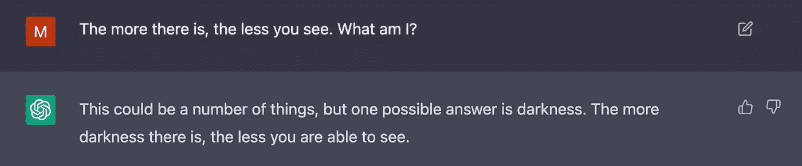
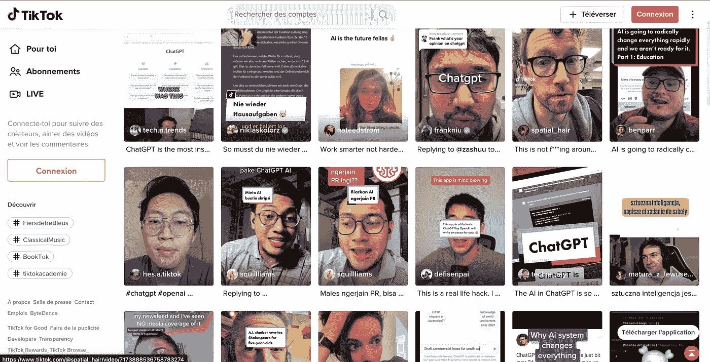
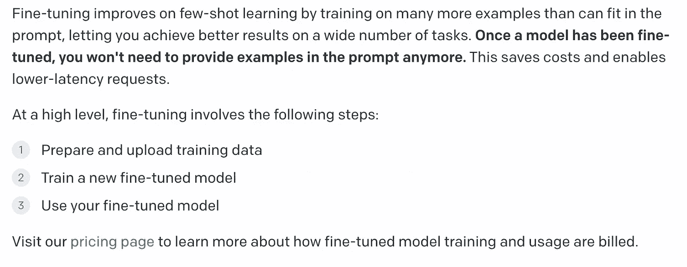
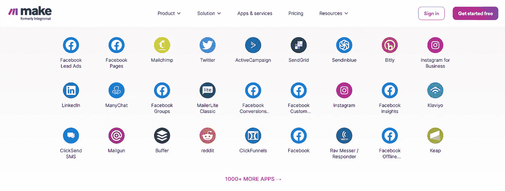
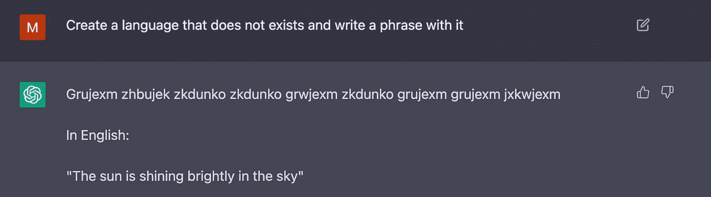
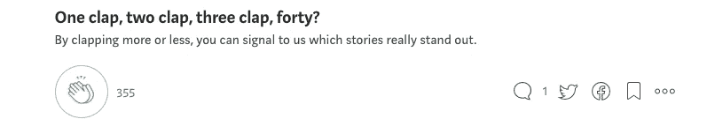

# ChatGPT3 会终结我们的世界。

> 原文：<https://blog.devgenius.io/chatgpt3-will-end-our-world-69125da7bb82?source=collection_archive---------0----------------------->

不溅

你不可能错过 ChatGPT 炒作。它产生[说唱歌词](https://www.blopig.com/blog/2022/12/a-chatgpt-rap-battle/)，[写代码](https://medium.com/geekculture/writing-code-snippet-using-ai-openai-chatgpt-d96e6073e894)，[创作音乐](https://www.reddit.com/r/GPT3/comments/zawqa5/writing_music_with_chatgpt/)，[写 DallE 提示](https://medium.com/@CarmodyDR/prompting-creativity-with-chatgpt-and-dall-e-1e797ee6914f)。

 [## Telegram 会集成 ChatGPT 这样的大型语言模型的 4 个原因。

### Telegram 正悄悄地统治着信息世界。他们将很快整合 LLM，原因如下:

medium.com](https://medium.com/@maximetopolov/telegram-will-integrate-a-large-language-model-like-chatgpt-ee2fb6d31099) 

我花了几个小时尝试谜语，95%的情况下都是由人工智能解决的。

世界各地有影响力的人用各种语言制作了数千分钟的抖音和 YouTube 视频。

大多数科技界人士预测搜索或教育会被破坏。

 [## ChatGPT3 会毁掉世界上所有的软件。这就是为什么:

### ChatGPT3 体验是🤯它的能力还有待发现。

medium.com](https://medium.com/@maximetopolov/chatgpt3-will-blow-every-single-piece-of-software-in-the-world-this-is-why-f7ac57914877) 

但我认为还有一个更全球性的、**更黑暗的含义**。

## 隐藏的创造性反馈循环

在未来几个月，数百万人将在更好版本的 ChatGPT 的帮助下创建博客帖子、抖音视频脚本和推文。

他们已经用 Copy.ai 或 Jasper T21 做了几年了。

 [## 编码过时，学 AI 提示

### 在计算机历史上，代码只是人机交流的一种短暂方式，编码的未来是…

medium.com](https://medium.com/@maximetopolov/in-2022-you-shouldnt-learn-code-but-de897d788dab) 

随着每一个新版本的推出，质量都显著提高。

在某种程度上，对于那些大型语言模型的用户来说，会有一种简单的方法来根据他们的个人需求训练他们。

一开始只是手动说出 AI，哪些内容片段在各自的社交账户上表现良好。

来自 OpenAI GPT3 文档的截图。这已经发生了

但是有一天，有人会创建一个与 YouTube 分析、抖音分析、Twitter 分析等的直接集成。

抖音、脸书、Instagram 和 YouTube 人工智能之间将会有一个完整的实时反馈回路，试图理解**人类想要什么**和内容生成人工智能掌握讲故事。

Make.com 已经可以自动集成超过 1000 个 SaaS 工具

人工智能将能够创造出表现非常好的内容。AI 会讲故事。

就像在[国际象棋](https://medium.com/swlh/ai-beats-grandmasters-in-chess-cacb0a06bb5b)、[围棋](https://phys.org/news/2016-03-ai-human-grandmaster.html#:~:text=again%20(Update),-South%20Korean%20Go&text=A%20Google-developed%20supercomputer%20bested,%22%20artificial%20intelligence%20(AI).)，或者[星际争霸](https://arstechnica.com/gaming/2019/01/an-ai-crushed-two-human-pros-at-starcraft-but-it-wasnt-a-fair-fight/#:~:text=The%20company%20pitted%20its%20AI,strongest%20StarCraft%20AI%20ever%20created.)，有一天比任何人类都强。

比最好的小说家还要好。

比 CK·路易斯更有趣。

比詹姆斯·卡梅隆更精彩。

 [## 我如何在一周内创建了第一份完全由人工智能生成的报纸。

### 在 code.store，我们使用最先进的技术为我们心爱的人建立了许多有趣的数字项目…

medium.com](https://medium.com/graphql-portal/how-i-created-the-very-first-newspaper-entirely-generated-by-an-ai-within-a-week-fe97f452b3c2) 

我们将恳求 AI 创造最精致的自我愉悦的内容。那个让我们看/听/看几个小时，激烈评论喜欢分享的。更多。求你了。

我们无法阻止它。

没有一家创业公司或创始人或 VC 能抵挡住[7 天内 100 万用户的牵引](https://indianexpress.com/article/technology/tech-news-technology/openai-chatgpt-crosses-1-million-users-ceo-says-they-might-have-to-monetise-this-8306997/)。蜜罐太大了。

## 我们最喜欢和评论的是什么？

疫苗。战争。堕胎。气候变化。

愤怒。可惜。厌恶。意见不合。

还有小猫，很多小猫。

[社交媒体分化了我们的社会](https://www.scientificamerican.com/article/why-social-media-makes-us-more-polarized-and-how-to-fix-it/)。今天的政治和社区两极分化只使用人类创造的内容，被机器人军队放大。英国退出欧盟、川普和乌克兰战争是普京的法西斯机器人农场如何运作的好例子。

 [## “抖音大脑”和毁灭一代人的新精神疾病危机

### 如果这不违法，那当然应该违法

medium.com](https://medium.com/yardcouch-com/tiktok-brain-and-new-mental-illness-crisis-destroying-a-generation-e803f719b88) 

**如果有比 x20 好 20 倍的内容，会发生什么？**

每一种格式，每一种语言，每一个主题。主题永远不会被人类覆盖。用根本不存在的语言。

**这将给运营大型语言模型的公司很大的权力。**

## 或者不是…

它们将成为像 GCP、AWS 或 Azure 一样的商品。高效的 AI 计算能力。谷歌、亚马逊和微软已经在小规模提供[信息架构即服务](https://cloud.google.com/vertex-ai)。

 [## 您应该使用什么 AWS 容器服务？

### AWS 提供了大量的容器来运行您的应用程序。选择可能会很复杂，所以请仔细阅读…

awstip.com](https://awstip.com/what-aws-container-service-should-you-use-53415718620c) 

## 真正的大师在回路的另一边。

谁决定了主要内容分发平台的算法如何工作，谁就按下了人性操作系统的按钮。

通过向其他人工智能提供如何创建更好内容的指令，他们以前所未有的规模，在没有控制的情况下训练它。

利用有影响力的人、博客写手和营销文案作为媒介，在我们不知不觉中相互交流。

 [## 如何让你的网站在 ChatGPT 上可见？

### 大型语言模型的出现极大地改变了我们在网上与企业互动的方式。

medium.com](https://medium.com/@maximetopolov/how-to-make-your-website-visible-on-chatgpt-32d92bd6c8b6) 

## 谁决定了反馈规则，谁就决定了我们几代人的未来。

而他们的规则很简单:**多约定**。更多广告。更多的转化点击。更好的 CTR。

在某个最终点上，创造者将是无用的。最终去中间化。

我们会向我们的主人投降。

然后，有一天，有人会宁愿失去数十亿美元，以满足他深刻的童年创伤。

有人会买下 Twitter，解雇 75%的员工。

有一天，他会在凌晨 3 点发微博说，为了保护言论自由，规则已经改变了…

**等一下……**

PS:当你因为一个神秘的原因还在这里的时候，看看我的公司: [https://code.store](https://code.store) 我们使用市场上最先进的工具更快地构建应用 x10。