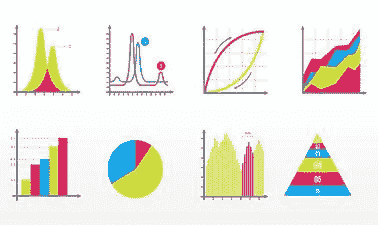

# 切比雪夫:一些最伟大的数学天才背后的人

> 原文：<https://blog.devgenius.io/chebyshev-the-man-behind-some-of-the-greatest-minds-of-mathematics-36179f29ce24?source=collection_archive---------6----------------------->

他的一些贡献并不为人所知。

帕夫纳蒂·切比雪夫是一位著名的数学家，主要在概率、统计和力学方面做出了贡献。在这里，我们将概述切比雪夫对现代生活的贡献。

## 1-微分方程

切比雪夫阐明并证明了他的方程(切比雪夫多项式或切比雪夫方程)可用于三角函数。尽管相关的用例不多，但它们主要用于周期性波形合成、数学、三角学、恒等式、科学和工程。

## 2-概率和统计

这可能是切比雪夫对实际生活的第一个贡献，因为他证明了随机变量的长期概率变得稳定。他在经验法则方面的工作继续进行，并在大数定律中加入了某些比率。不过，他的定理在增长率方面有着广泛的应用，尤其是在商业和金融方面。今天，许多分析师利用大数定律对收入、盈利能力和市场投降做出现实的估计，从而对公司做出现实的管理决策。

## 牛顿法的 3-代数近似

这是艾萨克·牛顿爵士从他的力学著作中衍生出来的作品之一。这个函数没有代数近似值。直到切比雪夫找到了第 n 个函数的根，并通过算法近似得到了这个值。现在，工程师和物理学家可以获得热量和热力学分析的实时结果。

## 4-机器人

切比雪夫利用他在实际力学中的知识在机器人学中的基本现代应用之一。他的成功导致了机械电子学和机器人学的发展，促进了生产，从而改善了人们的生活，并继续这样做。

## 5-培养学生

这是帕夫纳蒂·切比雪夫最大的遗产，他的两个最伟大、最有成就的学生在这里对数学做出了巨大贡献。一个是安德烈·马尔科夫，另一个是亚历山大·李亚普诺夫。尽管在计算机科学成为一门学科之前，马尔科夫的最初贡献并没有被真正使用，但李亚普诺夫的贡献在物理学、统计学和工程学方面更加实用。此外，通过分析各种数学系统中的平衡，李亚普诺夫已经将他的定理直接应用于现实生活中的情况，并在平衡和势理论的领域中加速物理学。

*如何看待帕夫努蒂·切比雪夫？他对数学和近代有什么贡献？在下面的评论区分享你的想法。*