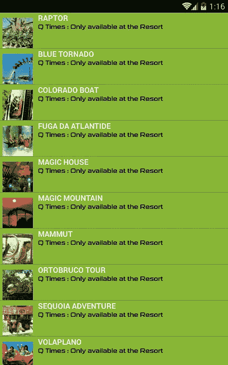

# 检查公园景点等待时间，即使在家

> 原文：<https://blog.devgenius.io/check-gardaland-park-attractions-waiting-time-even-from-home-9141318c1543?source=collection_archive---------1----------------------->

## 如何避开游乐园 app GPS 检查

照片由 [Aaron Burden](https://unsplash.com/@aaronburden?utm_source=medium&utm_medium=referral) 在 [Unsplash](https://unsplash.com?utm_source=medium&utm_medium=referral)

## **来自维基百科的简要信息**

> [**Gardaland**](https://en.wikipedia.org/wiki/Gardaland) 是一座[游乐园](https://en.wikipedia.org/wiki/Amusement_park)位于[意大利](https://en.wikipedia.org/wiki/Italy)东北部。度假村于 1975 年 7 月 19 日开放，包括加达兰公园、加达兰海洋生物和加达兰酒店。它毗邻[加尔达湖](https://en.wikipedia.org/wiki/Lake_Garda)，但实际上并不面对水面。整个建筑群占地 445，000 平方米(4，789，940 平方英尺)，仅主题公园就占地 200，000 平方米(2，152，782 平方英尺)。它既有传统景点又有娱乐节目，每年吸引近 300 万游客。

## **任务**

这个项目的创建是因为如果你不在公园里，就没有办法知道 [Gardaland Park](https://www.gardaland.it/) 景点的等待时间。如果你打开官方的[应用](https://play.google.com/store/apps/details?id=com.merlin.gardaland&hl=it)并且你在公园外面，这是你得到的:

哦..

## 逐步指南

*   下载安装 [**NoxPlayer**](https://www.bignox.com/) 安卓模拟器。
*   运行它。
*   从 GooglePlay 安装 [**Gardaland Resort 官方 App**](https://play.google.com/store/apps/details?id=com.merlin.gardaland&hl=it) 。
*   安装 [**SSL 捕获**](https://play.google.com/store/apps/details?id=com.minhui.networkcapture) 或类似的数据包嗅探器 app。
*   在 NoxPlayer location settings 上设置以下坐标:“ **Lat 45.456863，Long 10.713501** ”或在顶部搜索栏中输入“ **Gardaland Park** ”。
*   启动 SSL 捕获应用程序。
*   启动 **Gardaland Resort 官方 App** ，打开“ **Q-Times** 版块。
*   返回 SSL 捕获应用程序，找到对端点的请求。

嗅嗅..

*   获取用于验证调用的签名参数。
*   下载[**GardalandDashboard**](https://github.com/domeniconicoli/GardalandDashboard)T5 项目。
*   在`appsettings.json`文件上签名。
*   **建立&运行**项目。

## 这是所有的乡亲

如果您正确完成了所有步骤，结果将是:

再见。在家等待时间！

从这里开始，例如我们可以设置一个定时器，使**每 5 分钟**调用一次，**将数据**保存在本地数据库中，并且**制作一个关于在**日**和**周**中等待时间的图形**。

**问题或建议？下面让我知道！**