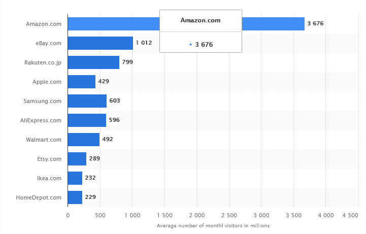
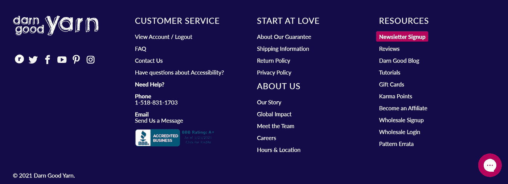
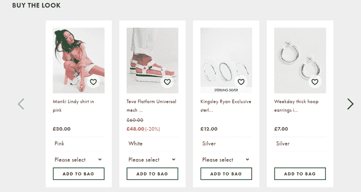
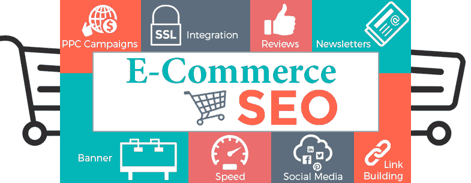
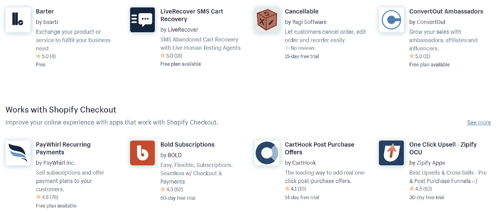
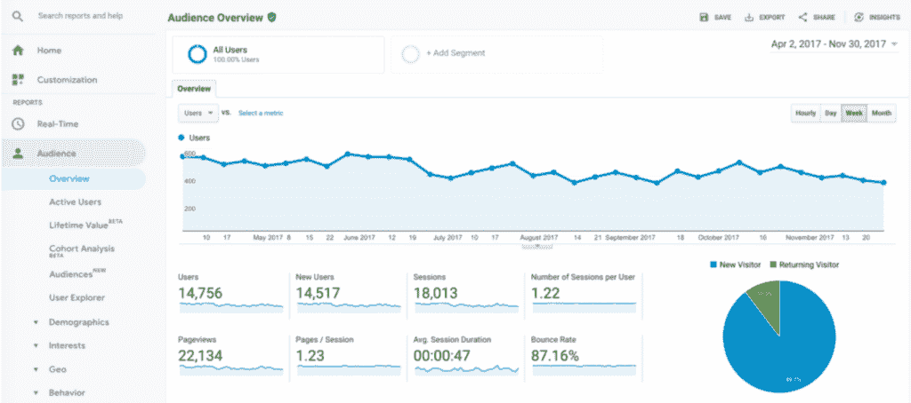

# 启动成功的电子商务网站/移动应用程序的清单

> 原文：<https://blog.devgenius.io/checklist-to-launch-a-successful-ecommerce-website-mobile-app-95db3df2cd1f?source=collection_archive---------6----------------------->

在购物体验中，吸收先进技术的新习惯显而易见。网上购物正日益渗透到数字世界，让人们能够快速做出决定。

众所周知，新冠肺炎，作为一个全球性的疫情，以前所未有的速度和规模使我们的生活方式发生了巨大的变化。它将电子商务业务的各个方面重新定位为数字商务思维模式。

现在，用户通过亚马逊(Amazon)或 Flipkart 等电子商务移动应用来满足所有基本需求。在一些点击中，他们收到了他们想用的任何东西。

电子商务行业正在发生什么？

电子商务行业每年增长 **23%** ，超过**40%**的网上购物通常发生在假期。这就是为什么大企业都在寻找电子商务开发服务。

图片资源: [Statista](https://www.statista.com/statistics/274708/online-retail-and-auction-ranked-by-worldwide-audiences/)

如果我们从月访问量的角度来看在线流量，亚马逊和易贝位于图表的顶端。买家和卖家的数字化互动促进了电子商务平台的使用。

2019 年**网购市值 **3.5 万亿美元**。在 **2015** 年，全球零售总额中的电子商务份额为 **7.4%** ，预计到 2024 年将增长 **21.8%。****

**现在，你可以想象全球零售框架中不可或缺的一部分——电子商务的价值。理解为什么你需要准备一份清单，如果你真的想经历零售业电子商务发展的实质性转变。**

****你启动电子商务网站的清单****

**在进入零售领域和[雇佣电子商务软件开发公司](https://www.valuecoders.com/hire-developers/hire-ecommerce-developers?utm_source=medium-devgenius&utm_medium=ecom-d7)之前，仔细阅读以下清单，并确保启动所需的电子商务网站:**

# **1.找出自定义域**

****

**图片资源: [GoDaddy](https://in.godaddy.com/)**

**当你打算进入电子商务领域时，品牌认知度是最重要的因素。如果你想创建一个独特的品牌标识，我建议你去深入搜索一个域名。**

**检查您的企业名称在不同网站上的可用性，如 Godaddy.com、环球主机等。**

**在这里，我想揭示不同的顶级域名(TLD)。当有许多选择时，为什么还要坚持使用. com 呢？商店和商店。所以，选择最有创意的。**

# **2.准备标准网页**

****

**图片资源:[高尔吉亚](https://www.gorgias.com/blog/ecommerce-launch-checklist)**

**定制电子商务的发展反映了网站最有吸引力和信息的吸引力。用户来到您的电子商务网站，了解更多关于其产品和更好的替代建议。**

**作为一个建议，通过添加足够多的页面来制作一个响应迅速、精心制作的网站。在网上重新创建一个商店，并在每件商品上附上详细的描述。**

**确保您的电子商务网站上有以下页面:**

*   **主页**
*   **联系页面**
*   **关于我们页面**
*   **常见问题(FAQ)页面**
*   **服务条款**
*   **隐私**
*   **运输、退货和退款**

# **3.设计列表和产品页面**

****

**图片资源: [WebsiteBuilderExpert](https://www.websitebuilderexpert.com/designing-websites/ecommerce-product-page-design-part-1/)**

**在电子商务网站上利用不同的产品或商品时，你需要关注每一个细节。因此，设计您的产品页面和列表页面至关重要，以便消费者可以轻松提取他们想要的产品的所有细节。最终，它将增加转化率和整体搜索引擎优化。**

****设计页面时要应用的有效建议:****

****对于列表页面:****

*   **需要对您的类别进行简短介绍**
*   **管理过滤和排序功能**
*   **明确评论、畅销书和库存情况**
*   **类别和子类别的内部链接**

****对于产品页面:****

*   **在你的网站上突出购物车按钮。**
*   **确保使用 360 度视角的高质量图像。**
*   **产品描述是必须的。**
*   **组织与产品相关的元素(款式、颜色、尺寸、跟踪号、产品、税号等)。**
*   **注意与客户建立信任。**

# **4.验证电子邮件通知设置**

**电子邮件是一个强有力的工具，标志着你在数字世界的存在。提供及时、完整的订单相关信息是电子商务应用的突出特点。敏锐地告知你的受众，为主动购物建立信任因素。**

**它将包括某些因素:**

*   **订单确认**
*   **电子收据**
*   **欢迎系列**
*   **航运信息**

# **5.检查电子商务搜索引擎优化**

****

**图片资源:[艾德肯特媒体](https://edkentmedia.com/ecommerce-seo-what-are-the-key-factors-to-implement-seo-for-ecommerce-websites/)**

**依靠付费广告和社交媒体是促进销售和更多用户参与的绝佳方式。但是，我不建议你对搜索引擎优化一无所知。**

**你必须知道，谷歌的算法每天将处理大约 35 亿次搜索。所以，通过踩在 SEO 坚实的基石上，扩大你的业务范围，甚至是你的电子商务网站开发。为此，请遵循一些基本步骤:**

*   **确保进行深入的关键词研究，收集最相关的关键词。**
*   **试着在你的产品描述和类别描述中包含相关的关键词。**
*   **找出重复的内容并删除。**
*   **优化你的元标题，描述，标题和网址。**
*   **提交站点地图并添加模式标记，将点击率提高 30%。**
*   **通过外部和内部链接连接高优先级页面。**

# **6.优化网站内容和页面**

**转化是电子商务发展的重要组成部分。要想获得高转化率，用视频来描述你的产品描述。为了更多的用户参与，即使在不同的渠道处理，也要保持网站的用户友好性和响应性。**

**优化网站内容和页面时，注意以下问题:**

*   **菜单导航**
*   **倒计时器**
*   **订单状态**
*   **Pin 选项**
*   **购买按钮**

# **7.删除不必要的在线应用**

****

**图片资源:[高尔吉亚](https://www.gorgias.com/blog/ecommerce-launch-checklist)**

**如果你检查任何电子商务网站，你会发现一些无缝通信的应用程序。在将任何应用程序集成到您的定制电子商务开发中之前，请检查它是否是必需的，是否满足任何目的。**

**应用程序提供功能并管理主要功能，包括销售、转化、促销、客户服务、SEO 优化和库存。**

# **8.安装分析工具**

****

**图片资源: [crazyegg](https://www.crazyegg.com/blog/google-analytics/)**

**分析工具让你了解访客和客户的活动。它让你在竞争中保持领先，并有助于创建最佳营销计划来组织所有重要活动。**

**洞察和分析的最佳工具之一是谷歌分析。或者，查看 SE Ranking、Adobe Analytics 和 Piwik 以获得有价值的见解。**

# **9.创建营销计划**

**设计、概述、开发，然后启动是电子商务开发中的一些重要步骤，但这些还不够。接触每一个数字平台和每一个移动屏幕是另一项具有挑战性的任务。为此，你需要有一个可行的营销计划。**

**涵盖你营销计划中的一切，从如何推广你的网站或应用到不同的策略。我建议您的项目包含以下几点:**

*   **关于目标受众或客户以及市场趋势的更多信息**
*   **根据 SMART(具体、可衡量、可实现、相关和有时限)确定目标。**
*   **关注点击付费广告、影响者营销、社交媒体营销、内容营销和电子邮件营销等策略。**
*   **为特殊场合提供特别优惠，以促进销售和刺激顾客。**

# **10.整合支付渠道**

**没有支付网关，电子商务什么都不是。每个订单都寻求支付方式，并允许用户支付购买他们的商品。你可以涵盖一些显而易见的支付选项:**

**信用卡、借记卡、预付卡、银行转账、网上银行、数字钱包，如 Google Pay、Paytm、PayPal 等。**

# **11.设置开单详细信息**

**另一个要记住的重要因素是如何执行计费信息。**

**让你的用户了解他们从你的平台上购买的所有东西。因此，请设置适当的账单明细。**

# **12.运行电子商务网站测试**

**这似乎是最后一步，但却是重要的一步。你需要测试你的完整的电子商务网站，然后才在现实世界中推出。适当的测试将有助于开发响应迅速且可行的最终产品，以增强长期印象。**

**仔细检查一份完整的清单，把你的愿景变成最实际的现实。如果你有不同的想法，将它们添加到你的列表中，并应用到网站开发过程中。如果需要，您可以联系[最好的电子商务软件开发公司](https://www.valuecoders.com/ecommerce-development-services-company?utm_source=medium-devgenius&utm_medium=ecom-d7)并寻求帮助。**

## ****优秀设计值得考虑的五大电子商务网站****

**根据我的研究，你需要检查最流行的电子商务网站的外观和设计，以了解它如何在不同的平台上工作。带着想法继续你的项目，并把它作为你成功实施的垫脚石。**

****亚马逊:**它是满足用户每一个基本需求的最常用的电子商务网站。从杂货到电子产品，只要你在这个网站上按一个字，所有的东西都会弹出来。**

**Myntra :通过获得衣服和其他配饰的最佳选择，让你的购物更刺激、更有效。它给你最好的建议、反馈、带有图片和视频的顾客评论，让你的购物体验更加刺激。**

****fabally:**又一个让你的服装购物更刺激的网站。所有类别都被适当地组织起来。你可以选择一系列西方风格和民族风格的服装，让你的形象更有吸引力。**

****易贝:**收集易贝平台上的一切，无论是电子产品还是汽车，还是时尚产品。**

****Flipkart:** 通过另一个著名的电子商务网站 Flipkart，看看它是如何组织不同类别的各种产品的。**

# ****最终想法****

**最后，我觉得你得到了一切来启动你的电子商务网站。如果你有任何疑问，联系一家 [**电子商务网页设计公司**](https://www.valuecoders.com/ecommerce-development-services-company?utm_source=medium-devgenius&utm_medium=ecom-d7) ，聘请电子商务开发人员。**