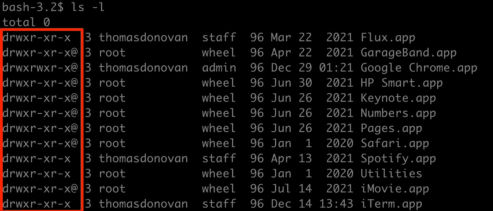
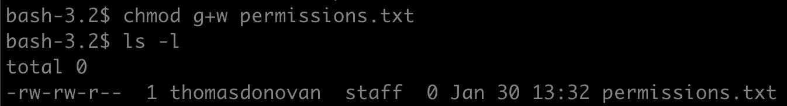
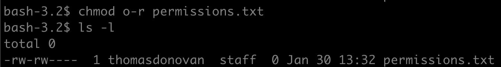
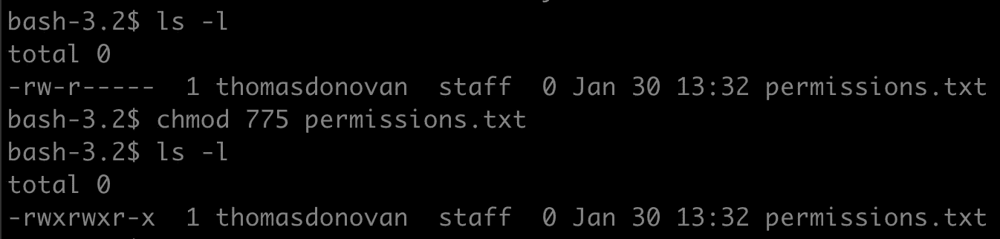

# chmod 和文件权限

> 原文：<https://blog.devgenius.io/chmod-and-file-permissions-6001e2f4738b?source=collection_archive---------13----------------------->

上一次，我们回顾了 Bash 的简史和一些用于导航文件树的基本命令。虽然移动和查看目录树以及它们包含的文件肯定是有用的，但是 Bash(实际上，一般来说是计算机)能力的开始来自于实际操作这些文件并使用它们来做事情。但是，首先，我们需要确保我们有能力对这些文件执行我们想要的操作。

# chmod

我们已经看到了 ls -l 命令的运行。它列出了目录中的文件，以及关于文件的一些附加信息，包括最后的时间戳、所有者名称、大小和权限。

ls -l 输出中的权限列。

这里显示的每个字母代表文件的不同*权限*，这意味着谁可以对它执行不同的操作。我们可以按性格来划分:

## 文件类型

权限的第一个字符是文件的类型，有两种类型:

*   -'意味着这是一个正常的，运行的工厂文件
*   “d”表示这是一个目录文件，一个对其他文件的位置进行分类的文件，并且可以被认为是某种“文件夹”

## 安全性-用户和组

“权限”列接下来的九个字符显示了文件的安全权限。这是事情变得有点复杂的地方，但如果分解成更小的部分，就很容易理解了。
这九个字符可以进一步细分为三个子组:用户、组和其他。

*   用户—用户是您在计算机上登录的帐户。“权限”列的“用户”部分将显示文件所有者的文件权限。
*   组—组是共享某些文件访问权限的用户的集合。“权限”列的“组”部分将显示拥有该文件的组的文件权限。
*   其他-对于不属于拥有该文件的用户或组的任何人-这将显示尚未包括的任何人的权限。

## 安全性-权限

现在，每个子群中的三个字符是什么意思？这些是每个文件的实际权限。每个字符要么有一个字母，要么有一个破折号('-')，表示权限存在(字母)还是不存在(破折号)。

*   r-读取权限，允许查看文件内容。
*   写权限，允许对文件进行编辑。
*   x- Execute 权限，允许文件被执行(仅当文件是可以运行的程序时才重要)。

## 使用 chmod

现在我们知道了不同权限的含义，我们可以开始使用 chmod 了。chmod 将允许你改变文件权限(只有当你有写权限！)这使它成为更强大的基本 Bash 命令之一。chmod 将以几个字符的形式接受参数，字符之间没有空格。它们的顺序是:

*   要更改的子组——u 代表用户，g 代表组，o 代表其他用户，a 代表所有用户
*   是添加权限还是删除权限- +表示添加，-表示删除
*   要编辑哪些权限——r 表示读取，w 表示写入，x 表示执行

在这个权限参数之后，给出的最后一个参数应该是您要编辑权限的文件的路径。

我们来看一个例子，一个名为 permissions.txt-的文件

该文件当前对所有者具有读写权限，仅对组和其他人具有读取权限。让我们授予该组对该文件的写权限。

现在，让我们取消其他人的阅读权限(并避开窥探的目光)。

## 使用 chmod-现在使用数字

您可能会看到对 chmod 或权限的引用有一组三位数。775 是很常见的一种。

这三个数字代表每个类别的权限，因为它们用二进制表示。还记得以前，每个权限可以用一个字母或一个破折号来表示吗？在二进制中，这些可以表示为“1”(字母)或“0”(破折号)，表示该权限是否为真。数字(0–7)是二进制中三个(rwx)权限的十进制表示。每个数字将依次代表用户、组和其他权限集。所以上面的 775 用二进制表示就是 111 111 101，用字母表示就是 rwx rwx r-x(这是一个非常常见的设置)。

这些整数表示也可以作为 chmod 的一种简写形式。您可以只写出文件权限的整数表示，而不是写出您想要启用和禁用的每个类别和权限。

# 本系列中关于 Bash 的其他文章

*   [Bash 基础和导航目录树](https://medium.com/@tdonovan79/bash-basics-and-navigating-directory-trees-b2456c14deea)
*   [Bash 脚本简介](https://medium.com/@tdonovan79/intro-to-bash-scripts-39ce67aba2ee)
*   [Bash 中的特殊参数](https://medium.com/@tdonovan79/special-parameters-in-bash-7cabbb9213ec)