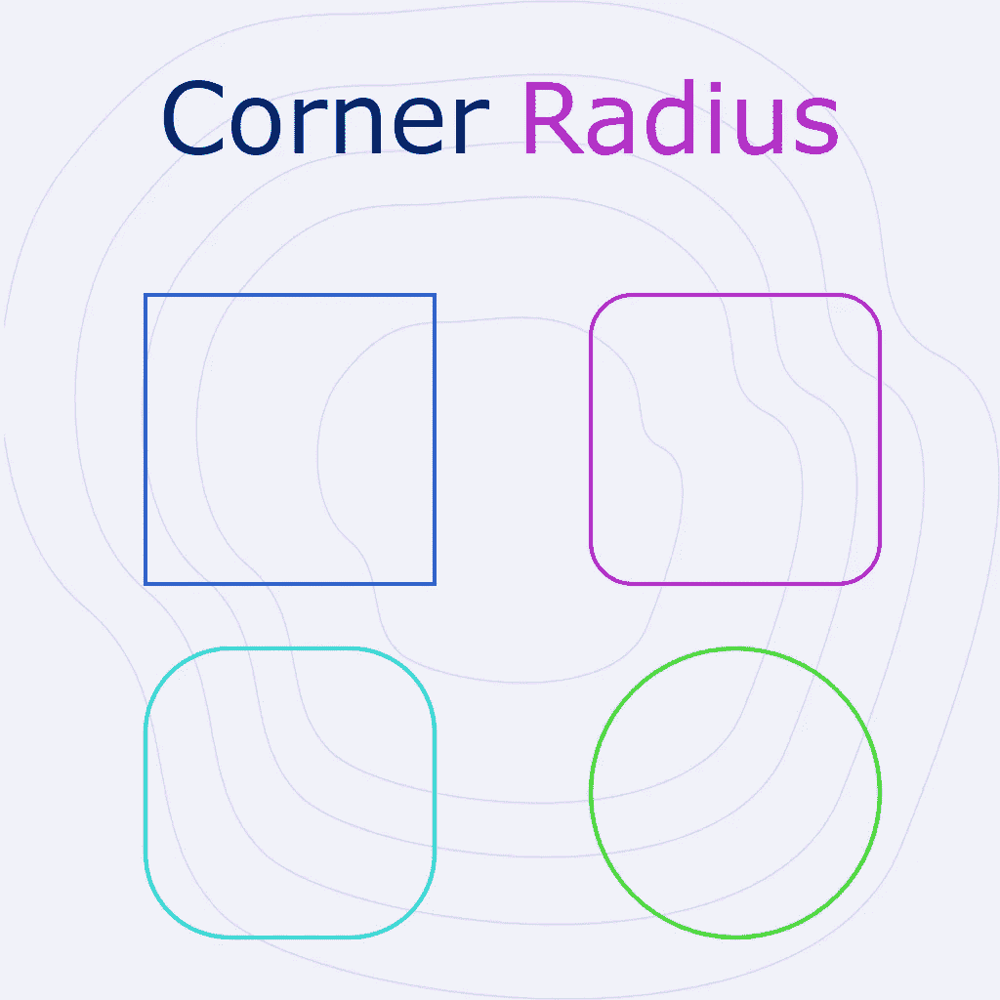
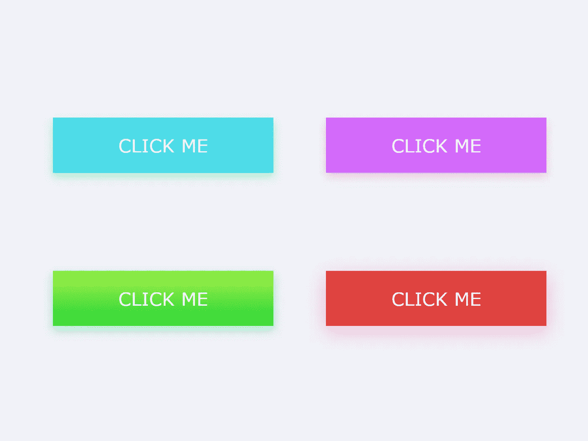
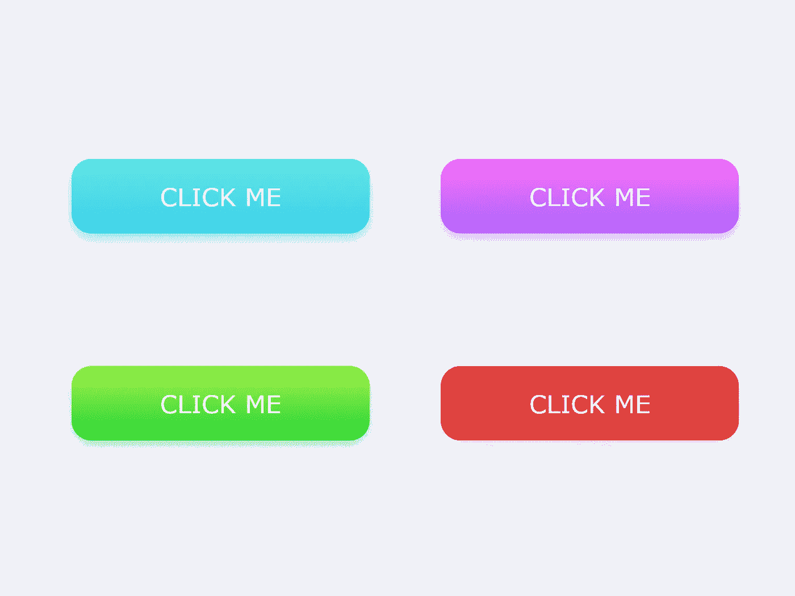
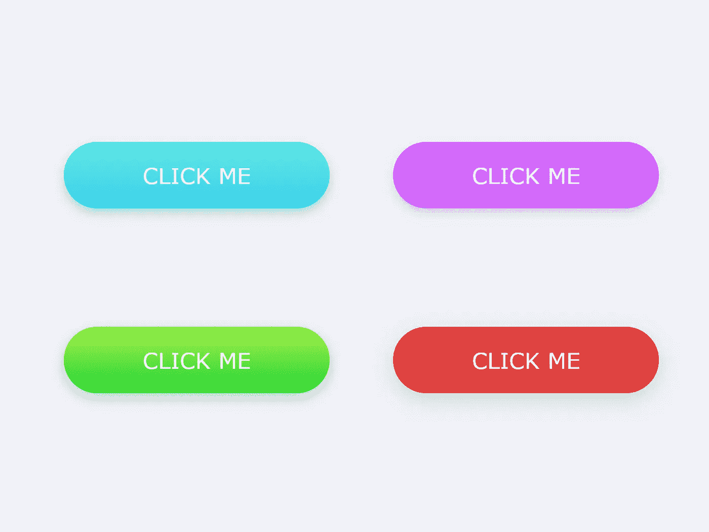

# 为按钮选择完美的圆角半径。

> 原文：<https://blog.devgenius.io/choose-perfect-corner-radius-for-your-buttons-5df0c3595aa6?source=collection_archive---------1----------------------->

## 对界面的整体感觉影响很大。

作者图片

设计师总是试图为项目做出最好的设计决策。无论多么微小，每个决定都会影响整个设计。按钮是任何项目的关键部分。它们意味着行动的号召，并对页面上采取的任何行动负责。因此，按钮的设计非常重要。

随着对用户界面理解的发展，我们已经看到了从锐边按钮到圆角按钮的稳步转变。

圆角按钮更符合当前的审美情趣。它们看起来很现代，象征着乐观。

# 0px 半径:

这是一个经典选项，主要表达严肃和专业的界面感觉。与这种倒圆一致意味着清洁的组件、清晰的几何排列和所有组件的平衡。

作者图片

## 优点:

1.  专业的
2.  整洁的外观
3.  有组织有结构

## 缺点:

1.  保守的
2.  企业感觉
3.  内向的; 寡言少语的; 矜持的

# 3–4px 半径:

这是最好的，也可能是最安全的选择。3–4px 是跨多个领域的每一个标准点，表达比 0px 更友好和包容。

圆形按钮也不是显示嵌套选项的好选择。这是因为它们限制了点击区域，使点击变得困难。所以，在显示嵌套选项时，最好使用半圆按钮。

作者图片

## 优点:

1.  友好的
2.  专业的
3.  更好看

## 缺点:

1.  保守的
2.  不创新

# 8–14px 半径:

在叠牌的时候，圆边表现的更好。圆边牌的计数要容易得多，因为它们是可以相互区分的。当堆叠的卡片边缘锋利时，它们看起来是一致的，我们的眼睛滑过卡片堆而不是停留在上面。这在网格布局中更加明显。

这并不奇怪，大多数网站模板使用圆形边缘的卡片来展示它们的功能和服务。

作者图片

## 优点:

1.  开玩笑的
2.  时尚风格
3.  创新的
4.  引人注目

## 缺点:

1.  有时很乱
2.  使用不当，显得幼稚

# 50px 或完全四舍五入:

圆角按钮和全圆角按钮的区别在于，全圆角按钮只有在空间很大的情况下才表现良好。这意味着您不能像堆叠其他按钮那样堆叠圆形按钮。

另一方面，当有空间时，完全圆形的按钮是一个很好的行动号召。它们可以用来将用户的注意力引向特定的动作。而且，当布局是列表或卡片的形式时，它们会工作得更好。

作者图片

## 优点:

1.  友好的
2.  创造性的
3.  引人注目
4.  产生影响

## 缺点:

1.  不是每个 CTA 都这样
2.  看起来像标签

# 摘要

当谈到选择按钮的决定时，没有通用的指南。设计是多用途的，它可以为你所用。确保你选择的任何一个选项都有利于整个设计。如果可行的话，用户测试决策是一个很好的选择。在一天结束的时候，一个按钮应该让用户想要点击它。