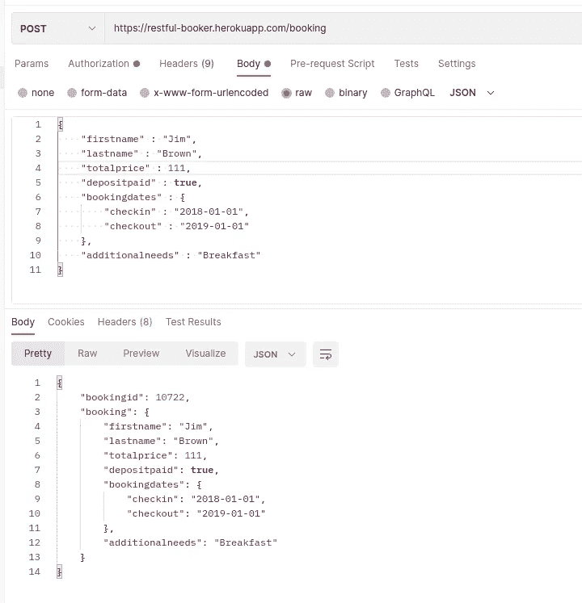
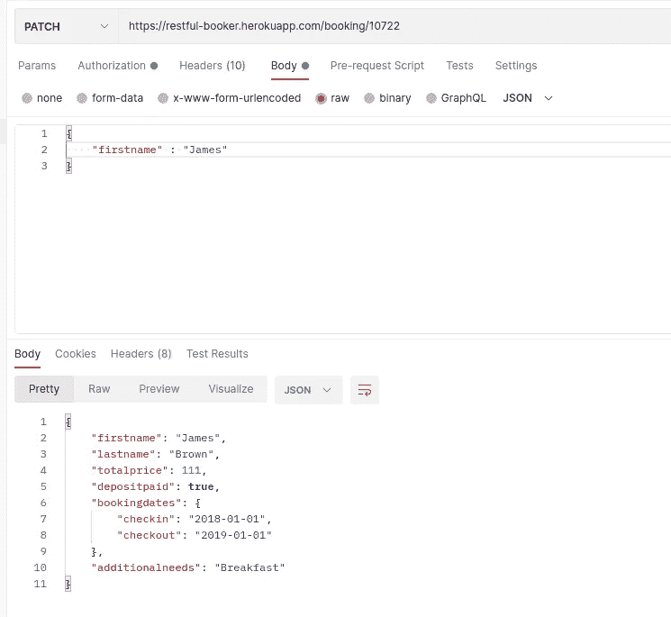
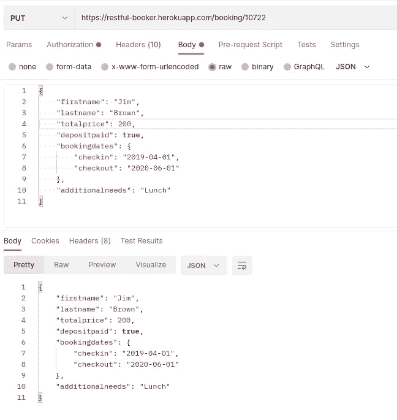

# 明智地选择…修补还是放置？

> 原文：<https://blog.devgenius.io/choose-wisely-patch-or-put-fedc67d80f25?source=collection_archive---------5----------------------->


**放**和**补丁**都是 2 个广为人知的 ***HTTP 方法*** 用在基于**架构*上。虽然在*高层*中，两种*方法*都主要用于*服务器*上的更新*资源*，但是它们具有*不同的功能*并且用于*不同的目的。**

## *放*

***PUT** *方法*用于*更新*一个*资源*由*完全替换*它。类似于 *POST 方法*要求*完整请求体*被*发送*以便*创建*资源* , *PUT* 方法*也要求*完整请求体*被*更新*。每当一个*客户端*想要用*替换*服务器上的一个*现有资源*， ***放*** 被*使用*。*客户端*需要在*请求体*中发送一个*资源*的*完整表示*。***


放就是替换！！

即使*客户端*想要*更新*现有资源的仅*一个字段*，也需要*在*请求体*中添加*资源*的所有*字段*待*更新*，设置*字段*待*更新如果其他字段没有包含在请求体中，服务器将在修改*目标资源时将*空值*放入这些字段。***

例如，让我们以一个 *JSON* 格式*请求体*为例:

```
{
   "firstname": "Jim",
   "lastname":"Brown",
   "age": 24,
   "department": "Development"
}
```

这里如果我们要将*更新*的*部门字段*从*到 ***【产品管理】*** 使用**放**的方法，我们的请求体看起来会像这样:*

```
*{
   "firstname": "Jim",
   "lastname":"Brown",
   "age": 24,
   "department": "Product Management"
}*
```

*如前所述，只有要更新的字段，即*部门*将被替换为新值“ ***产品管理*** ，其余字段*名字*和*年龄*保持*不变*，然后通过 *PUT* 方法向服务器发出请求。*

## *修补*

***补丁**仅用于对*资源*进行*部分更新*。它*只更新*的*请求*的*JSON*主体的*必填字段*，而不是写入所有字段。每当*客户端*想要*更新*时，仅使用*特定字段*、*补丁*。与 *PUT* 方法不同，*客户端*只需要发送*请求体*的*特定字段*及其*更新值*，而不是发送资源的整个表示。*

**

*补丁就是改变！！*

*以请求体为例。*

```
*{
   "firstname": "Jim",
   "lastname":"Brown",
   "age": 24,
   "department": "Development"
}*
```

*这里如果我们要将*更新*的*部门字段*从 ***开发*** 到 ***产品管理*** 使用*补丁*的方法，我们的*请求体*将会是这样的:*

```
*{
   "department": "Product Management"
}*
```

*如前所述，在通过*补丁*向服务器发送 *HTTP 请求*时，只有*字段*将被更新即*部门*将*替换为新值 ***产品管理*** 的*，其他未更改的字段不需要包含在请求体中*

## *说明*

**

*为了便于说明，我们使用 restful-booker 的[](https://restful-booker.herokuapp.com/apidoc/index.html)**进行测试，这是一个开源的 Web API 。我们将使用 ***Postman*** 来测试 API。***

**根据 *API 文档*，让我们首先使用 ***POST*** 调用*创建一个预订*。**

****

**在发送了 *POST 请求*后，*响应*返回了*新创建的预订，*我们将使用 PUT 和 PATCH 方法*更新*以便清楚地理解。**

**对于 PUT 和 PATCH，*资源*需要在*服务器*上*创建*，因此上面创建的带有 *bookingid 10722* 的预订(在我们的例子中)作为*新创建的资源。***

**现在让我们使用*路径参数*中的这个 *bookingid* 来指定我们新创建的资源(booking)的 *URI* 来更改一些字段。因此，在我们的例子中，端点 URI 将是*https://restful booker.herokuapp.com/booking/10722***

**现在我们将使用 ***补丁*** 的方法来改变我们现有资源的名字(booking)。**

****

**从响应中我们可以看到*名字*已经被*补丁*方法*成功更新*。**

**接下来我们将使用 *PUT* 方法来*更新(替换)**整个资源*(预订)。**

****

**从响应中我们可以看到*更新字段*已经被*成功设置*，并且*现有资源*已经被*替换为 *PUT* 方法发送的*请求体*。***

## *什么时候用 PATCH 代替 PUT？*

*每当请求体有一个*数量的属性*并且我们只需要更新*字段的一个*少数*补丁*应该是优选的，因为它节省时间，因为在 *PUT* 中，我们*传输*许多*数据*，导致*不必要的带宽*。*资源更改*比上传*更容易*，因为请求体的*最少，特定的*字段将被*更改*并且*客户端*在发送*更新请求*之前不需要知道*资源*的*完成状态**

**

> *因此，根据您的需求和使用案例，明智地选择修补或放置！！*