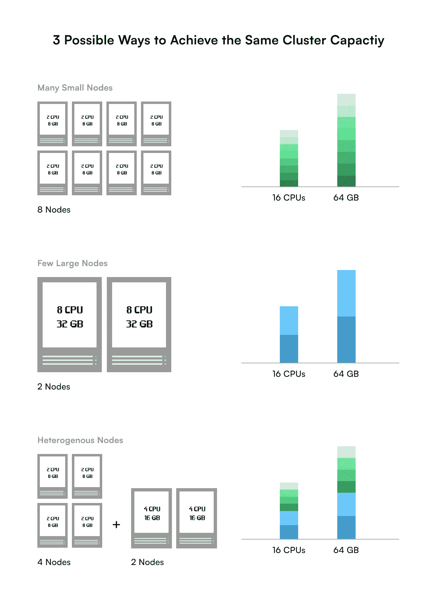
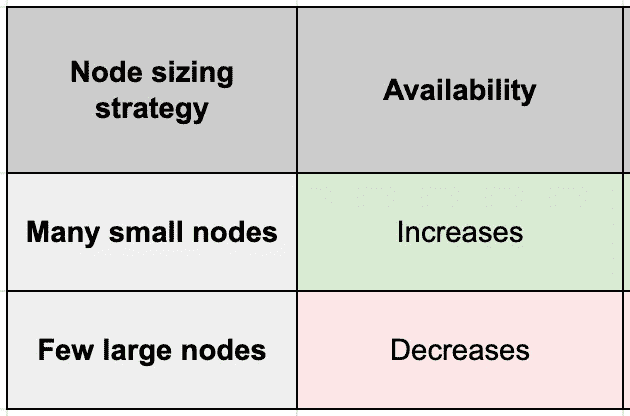
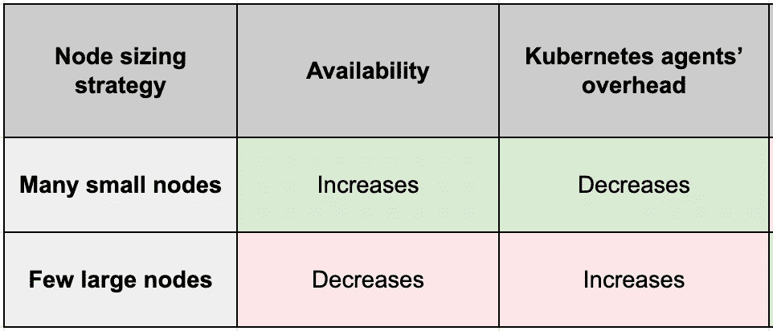
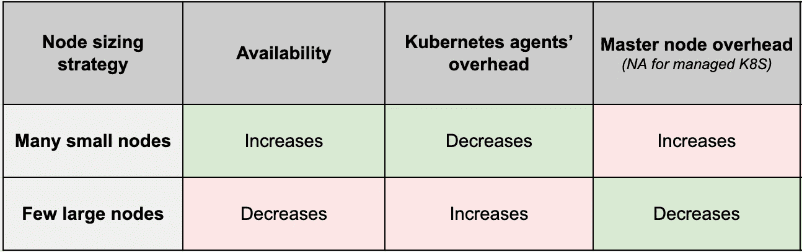
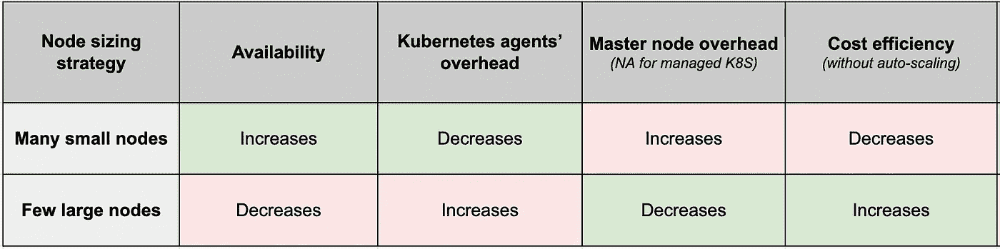
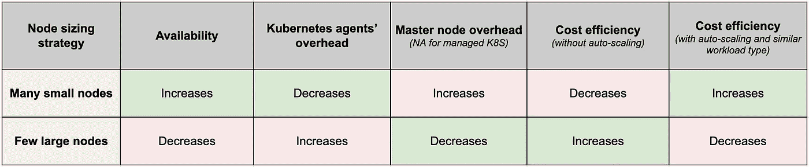

# 为您的初创企业选择最佳的 Kubernetes 工作节点大小

> 原文：<https://blog.devgenius.io/choosing-an-optimal-kubernetes-worker-node-size-e0eacab408c4?source=collection_archive---------1----------------------->

虽然节点规模的问题对于运行 Kubernetes 应用程序的每个人来说都是普遍的，但是正确的答案取决于您的应用程序的规模。

*   但是，在第一次选择节点时，哪些因素是最重要的呢？还有*为什么是*？
*   当第一次在你的 Kubernetes 集群中设置节点时，你是如何做出这个*第一受教育的决定*的？

这篇文章分享了对在 3-4 个环境中运行少于 10 个微服务的初创公司要考虑的最重要因素的理解。我们还会给出具体的建议，这些建议是基于我们所看到的对其他类似规模的创业公司有效的建议。

> 注意:本文将“节点”和“工作节点”作为同义词使用。在本文中，我们不讨论主节点的大小。

# 有哪些不同的节点大小调整策略？

给定所需的集群目标容量(即 CPU 内核和 RAM 的组合)，您有三种节点规模调整策略可供选择

*   **多个小节点**:所有小节点的容量相同
*   **少数大节点**:所有大节点容量相同
*   **异构节点**:大小节点的混合

例如，假设您需要 16 个 CPU 内核和 64 GB 的 RAM 来运行集群上的不同应用程序。以下是在集群中选择节点大小的 3 种可能方式:



确定节点大小的 3 种可能方法

上述每个选项都为您提供了所需的 16 个 CPU 和 64gb 内存的容量。但是你应该选择哪一个呢？

# 许多小节点或少数大节点

任何节点的大小都应该至少与要在其上运行的应用程序所需的最大容量一样大。

假设您想在节点 n 上运行应用程序 a1 和 a2。

```
Capacity(n) >= Max of [max_required_capacity(a1), max_required_capacity(a2) ]
```

例如，要运行需要 10 GB 内存的深度学习应用程序，您需要一个至少有 10 GB 内存的节点。

现在，假设您确保了以上几点，那么在选择节点大小之前，您会考虑哪些因素。

> 注意:以下分享的建议只针对那些有<10 microservices and a total of 3–4 environments.

## 1\. Availability

Within a cluster, the more the nodes, the more the availability.

*为什么？*

每个停止运行的节点都会使应用程序的可用性降低 1/n。n(节点数)越大，对可用性的影响就越小。

举个例子，

如果有一个包含两个大型工作节点的群集，而您丢失了一个，那么您将丢失 50%的容量。除非您将节点容量过度调配 100%，否则您的群集将无法处理双倍的负载。

但是，如果您的群集有 5 个节点，而您丢失了其中的 1 个，那么您只丢失了 20%的群集容量。剩余的活动节点更有可能在它们之间分配和处理这个负载。因此，与前一种情况下只剩下一个节点相比，您的应用程序中只有很少的部分停止运行。

> 注意:这也称为复制。复制越多，可用性越高。

让我们把它绘制在一个对照表上，随着文章的深入，我们会不断添加更多的因素:



## 2.Kubernetes 代理商的管理费用

随着节点数量的减少，每个节点需要处理更大比例的相同工作负载，这导致每个节点上运行的单元数量增加。

因此，更少的大型节点导致每个节点有更多的 pod，从而导致每个节点有更多的容器。

现在，Kubernetes 代理在每个节点上执行各种任务来管理在该节点上运行的容器。例如:

*   cAdvisor 收集并分析节点上所有容器的资源使用情况
*   kubelet 对节点上的每个容器运行定期的活性和就绪性探测

更多的容器意味着 cAdvisor 和 kubelet 在每次迭代中要做更多的工作。

因此，pod 越多→代理管理这些 pod 的开销越大→系统变得越慢，甚至在达到 pod 阈值后变得不可靠。

基本上，你不想窒息你的 Kubernetes 代理。为了简化这一点，Kubernetes 和不同的受管 Kubernetes 服务都推荐和/或硬性限制(阈值)可以在一个节点上调度的 pod 的数量。

> 💡以下是确定 pod 限值的快速参考:
> 
> Kubernetes:建议(或者可以可靠地支持)每个节点不超过 110 个 pod 一个集群中不超过 150000 个 pod
> 
> [Google Kubernetes Engine(GKE)](https://cloud.google.com/kubernetes-engine/quotas):限制每个节点 100 个 pod，不管节点的大小。
> 
> [Azure Kubernetes 服务(AKS)](https://docs.microsoft.com/bs-latn-ba/azure/aks/configure-azure-cni#maximum-pods-per-node) :无论节点大小，每个节点最多允许 250 个 pod。
> 
> [亚马逊弹性 Kubernetes 服务(EKS)](https://github.com/awslabs/amazon-eks-ami/blob/master/files/eni-max-pods.txt) :根据节点大小施加 pod 限制。比如 t3.small 只允许 11 个吊舱，而 m5.4xlarge 允许 234 个吊舱。

我们的对照表现在如下所示:



## 3.主节点开销

> 如果您使用的是托管 Kubernetes 服务，那么主节点由您的服务提供商管理。因此，在这种情况下，您不需要担心主节点开销。只有当您自己管理 Kubernetes 集群时，以下部分才与您相关。

随着节点数量的增加，Kubernetes 控制平面需要管理更多的节点。例如在每个节点上运行健康检查并确保每个节点之间的通信。

节点越小→需要越多的节点来提供所需的容量 Kubernetes 控制平面(在主节点上运行)上的开销越大

您的目标是永远不要用这种开销阻塞主节点。这通常通过以下方式解决:

1.  使用更高性能的主节点。
2.  确保您处于 Kubernetes 推荐的每个集群不超过 5000 个节点的限制之内。

让我们更新对照表。



## 4.成本效率

拥有许多小节点可能会导致每个节点上出现未充分利用的资源碎片，因为该碎片可能太小而无法分配给任何工作负载。

例如，假设您的每个 pod 需要 1.75 GB 的内存。

现在，如果您有 10 个节点，每个节点有 2 GB 内存，那么您可以运行 10 个这样的 pod，最终每个节点上有 0.25 GB 未使用的内存。这相当于未使用总内存的 12.5%。

或者，如果您有一个 20 GB 内存的节点，那么您可以运行 11 个 pod。这仅剩下 3.75%的未使用内存。

闲置资源越多，成本效益越低。

此外，Kubernetes 在每个节点上运行的守护进程集(如 kube-proxy)消耗该节点上固定数量的资源，而与该节点的大小无关。这意味着对于相同的集群总容量，与少数较大的节点相比，许多较小的节点消耗的资源总量更多。

因此，对于相同的集群总容量，如果您选择较大的节点而不是较小的节点，则可以运行更多的应用程序实例。使得更大的节点更具成本效益。

更新后的比较表如下所示:



您在上面看到的是没有集群自动扩展的情况。现在我们来介绍一下。

当您拥有较大的节点时，您也可以自动扩展您的资源。这可能会导致您不需要那么多资源的情况，并且您的资源仍然没有被使用。不划算。

那么， one 选择什么*来优化成本呢？*

对于具有相似资源需求或运行相似工作负载的应用程序(例如，仅计算或仅 GPU)，较大的节点更具成本效益。

如果您希望部署具有不同工作负载的应用程序，那么我们建议您创建不同的节点组来满足每个工作负载，以优化资源利用率和成本。

最后，这是比较表的样子



# 异构节点

使用异构节点的影响将是上表中列出的许多小节点和一些大节点的组合。通常，您会发现，与其他两种规模调整方法相比，管理异构节点规模的负载更加复杂。

# 对创业公司的建议

那么，你的创业公司应该使用几个较大的节点还是许多较小的节点，还是异构节点？

虽然答案取决于您希望在这些节点上运行的应用程序的类型，但我们将推荐您在首次设置节点时应该优化的因素(根据我们咨询其他初创公司的经验):

*   您适度优化了可用性
*   您不必担心 K8S 代理或工作节点的开销，因为它们可以通过选择最佳容量的工作节点和主节点来轻松解决。
*   您在日常运营中对成本的优化要多于自动秤的优化，而自动秤在您的秤中相对不常见。
*   您不必担心为您的应用程序设置[节点关联性](https://kubernetes.io/docs/concepts/scheduling-eviction/assign-pod-node/#node-affinity)，除非有特定的用例，例如，确保 Pod 最终位于一个连接有 SSD 的节点上，或者将来自两个不同服务的 Pod 放在同一可用性区域中进行大量通信

根据以上结论，我们发现以下配置非常适合拥有少于 10 个微服务的初创公司:

*   避免使用异构节点。
*   至少有 3 个工作节点(即 3 重复制)。作为初创企业，3–5 个工作节点就足够了。
*   在这 3 个节点中，尽量少用最大的节点。
*   设置水平自动缩放以产生最多 5 个工作节点。
*   对于开发环境，使用以下大小之一的节点 t3.medium、t3.large、m5.medium 或 m5.large
*   对于生产环境，它依赖于流量。但是，如果你现在不知道更好的，你可以从 m5 系列(1x-4x 大)开始。
*   如果您无法确定所需的集群容量，并且您不知道更好的方法:
*   假设应用程序的每个实例都有以下容量要求:
*   0.5–2 个 CPU(开发环境中 0.5 个 CPU，生产环境中 1–2 个 CPU)
*   1–2 GB
*   如果您有一个无状态的应用程序，请打开水平窗格自动缩放(HPA)
*   监控利用率，并迭代确定您的应用程序更精确的所需集群容量。

一旦集群开始运行，就要定期监控节点的 CPU 和内存，以便更新节点大小来适应新的需求。

在管理 Kubernetes 集群的资源方面，您的最大障碍是什么？发表评论让我们知道，或加入[我们的 Slack connect 渠道](https://join.slack.com/t/slack-saq6109/shared_invite/zt-u9134x8x-jwzSmzP6pPpEKYxeBgy~jw)与我们安排一次一对一的会议，在会上我们将分享我们对您的具体要求的建议。