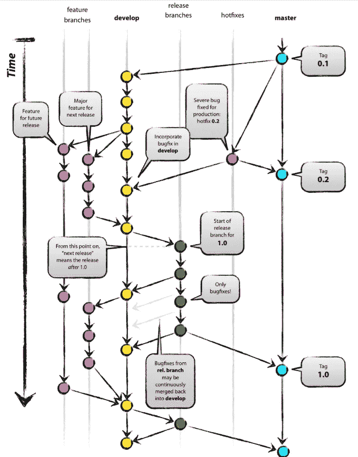
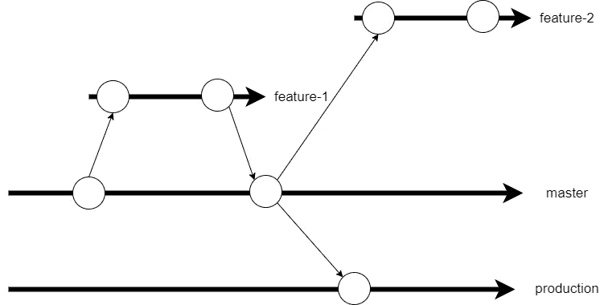
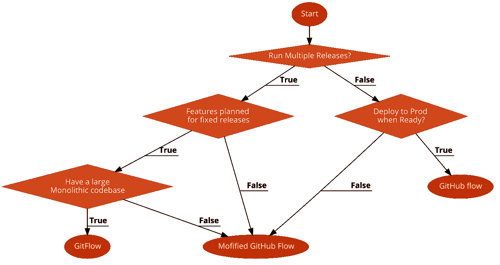

# 为您的团队选择正确的 Git 分支策略

> 原文：<https://blog.devgenius.io/choosing-the-right-git-branching-strategy-for-your-team-2a53144fcbdb?source=collection_archive---------0----------------------->

## 用流程图分析多分支策略

照片由[扬西·敏](https://unsplash.com/@yancymin?utm_source=medium&utm_medium=referral)在 [Unsplash](https://unsplash.com?utm_source=medium&utm_medium=referral) 上拍摄

[Git](https://git-scm.com/) 是目前市场上最流行的版本控制和源代码管理工具。它彻底改变了我们看待版本控制的方式，它的分布式存储库结构可以帮助开发人员分离并处理他们的本地存储库，然后再附加回来将更改推送到远程存储库。Git 在本地 repo 中维护的版本控制与它在远程中维护的版本控制相同，因为本地 repo 只是远程的克隆。

每个使用 Git 的组织都有某种形式的分支策略，如果他们在团队中工作并交付有用的软件的话。没有正确的分支策略，开发人员和行业专家一直争论哪一个是最好的。

尽管你可以根据自己的需要自由地实现一个定制的分支策略，但是，有一些已经被广泛接受和利用。让我们深入研究一些最流行的分支策略，并理解什么最适合什么样的团队。

# GitFlow

Vincent Driessen 创建了 GitFlow，它是大多数企业采用的最流行的分支策略之一，这些企业有许多团队交付一个软件，多个利益相关者推动多个需求和功能请求。

*   GitFlow 的特性分支允许多个开发人员并行处理不同的特性。
*   当单元测试完成并准备好时，他们将特性分支合并成开发分支。
*   然后，开发分支分支成多个发布分支，组成一个时间发布点。一旦您部署了一个特定的发布版本，它就会合并回主分支，并使用发布版本进行标记。
*   它还允许使用直接合并到主服务器的修补程序分支的修补程序。

图片来源:[文森特·德里森](https://nvie.com/posts/a-successful-git-branching-model/)

更不用说开发人员提出将代码合并到开发分支的 pull-request。这是必要的，因为在您将代码与一个稳定的分支合并之前，您希望有另一双眼睛看着您的代码。一些团队还在他们的 CI 过程中使用静态代码分析工具，如 SonarQube，以确保这是自动处理的。

## 何时使用 GitFlow

如果您正在开发一个具有紧密耦合的代码库的单片应用程序，不能被分离和简化成更小的部分(就像在基于微服务的架构中)，那么 GitFlow 提议听起来不错。这并不意味着您应该总是将 GitFlow 用于单片应用程序，因为还有其他方法可以做到这一点。由于 GitFlow 的复杂性，您应该只在您的用例需要时使用它。

如果你有

*   大型代码整体代码库
*   不同开发人员处理的多个特性请求
*   面向未来的多个时间点发布，具有静态发布窗口
*   开发和发布之间的时间间隔从几周到几个月不等

那么 GitFlow 更适合你。

# GitHub 流

对于那些认为应该更频繁地将软件发布到产品中，并希望避免发布过程中所有复杂的晦涩难懂和治理的极客来说，您可能已经在使用 Github flow 了。GitHub flow 是开发人员之间最简单的协作方式之一，被大多数快速开发、测试和部署的开源项目所使用。

GitHub Flow 是由(是的你猜对了) [GitHub](https://github.com/) 推广的，有以下流程:

*   您从 master 中分支出来，创建一个特性分支，处理这个特性，并测试它。
*   一旦您的测试完成，并且您想要部署到生产环境中，您可以提出一个 pull 请求，将您的代码合并到 master 中。
*   一旦您的 pull 请求被批准，您就可以将您的代码合并到主分支中，然后可以对其进行标记并部署到生产中。

图片来源: [GitHub](https://guides.github.com/introduction/flow/)

就是这样！主分支总是包含干净的、可部署的和已评审的代码，准备部署到产品中。您可以构建一个连续的交付管道来监视您的主分支，并在检测到合并时部署到生产环境中。

## 何时使用 GitHub 流

这个过程听起来很简单，许多组织都在非常有效地使用它，但是这个策略并不适合所有人。

如果你有

*   仅针对应用程序的特定组件的多个较小的存储库(例如在微服务架构中)
*   频繁地发布到产品中(从开发到发布的周期是几天到几周)。
*   不需要担心释放。您总是将最新的代码部署到产品中。
*   想要一个纯 CI/CD 部署方法

那么 GitHub flow 适合你。

# 改进的 GitHub 流——中间地带

嗯，我已经谈到了两个极端，而大多数组织在某个地方处于中间。您确实希望在准备就绪时发布，但也希望维护一个单独的代码库，以反映部署到生产环境中的代码。GitHub flow 不会为生产保留不同的代码基础，并且您不需要在合并到主组件后立即进行部署。

然而，大多数组织需要一个分支，在将代码最终合并到产品中之前，他们可以在那里进行集成测试的部署。这将允许您的 QA 团队在稳定的代码基础上进行测试，同时您的开发人员通过将功能分支合并到 QA 分支中来处理功能并交付到测试环境中。

为此，您可以使用修改过的 GitHub 流。

*   开发人员在特性分支上开发并测试它。
*   然后，他们将特性分支合并到主分支，通过拉请求进行 QA 测试。这就是 CI 流程开始并将代码部署到 QA 环境的地方。测试人员在这里运行他们的集成测试。
*   一旦测试完成，并且您准备好发布，您就可以将代码部署到生产中，并将其与生产分支合并。

图片来源:作者

生产分支总是反映生产代码，它允许操作团队通过从生产分支分支到修补分支来进行修补，测试代码并将其合并回生产，而不会干扰功能的交付。

## 何时使用修改后的 GitHub 流

我同意它适合大多数用例，并且是看待软件交付的最实用的方式之一。它不像 GitHub 流那样雄心勃勃，也不像 GitFlow 那样杀戮过度。我并不是说 GitFlow 不对——它有它的用例以及用户基础，但是认真地说，只有在你需要的时候才使用 GitFlow。

如果你有

*   更短的发布周期(从开发到生产的周期时间是几天到几周)
*   希望在特定的维护窗口发布
*   拥有一个 CI/CD 友好的环境
*   不要担心多个版本或者没有一个相当大的单一代码库。

那么修改后的 GitHub 流量更适合你。

# 摘要

下面让我们将分支策略总结成一个有用的流程图

这些只是基于经验的指导方针，你可能有自己的创新方法来解决你的问题。这取决于你的团队结构和工作方式，就像我说的，没有放之四海而皆准的方法，所以要不断尝试和改进。

感谢阅读！我希望你喜欢这篇文章。