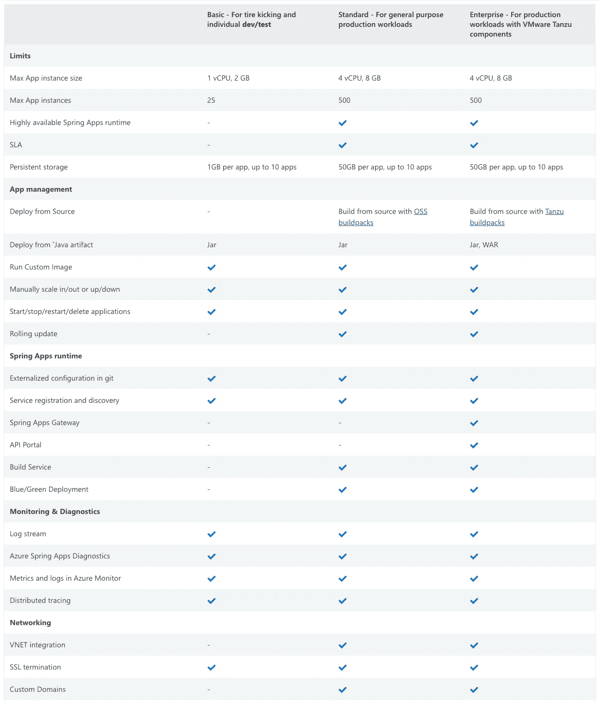
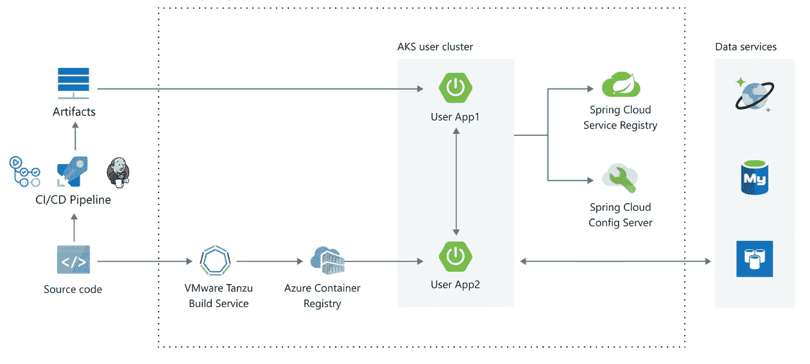
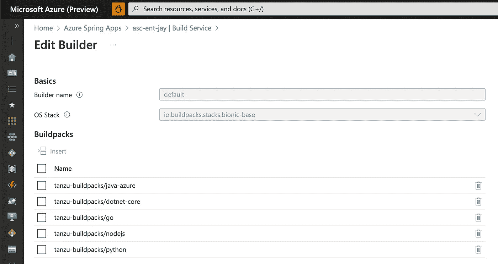
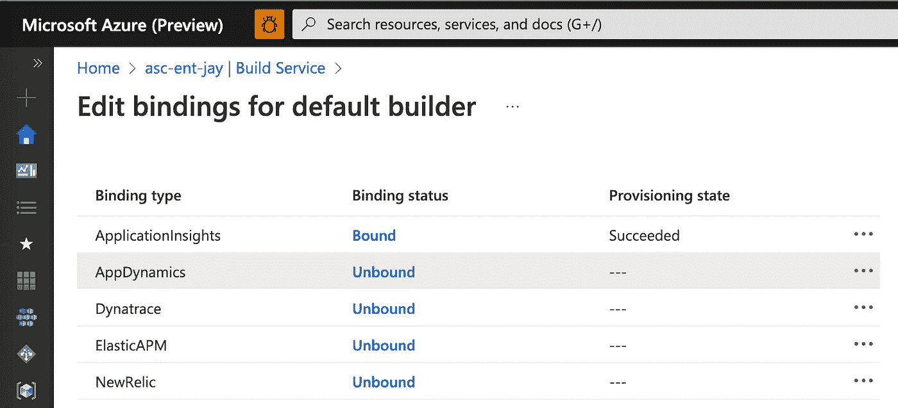
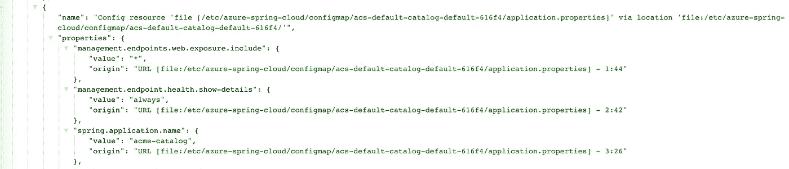
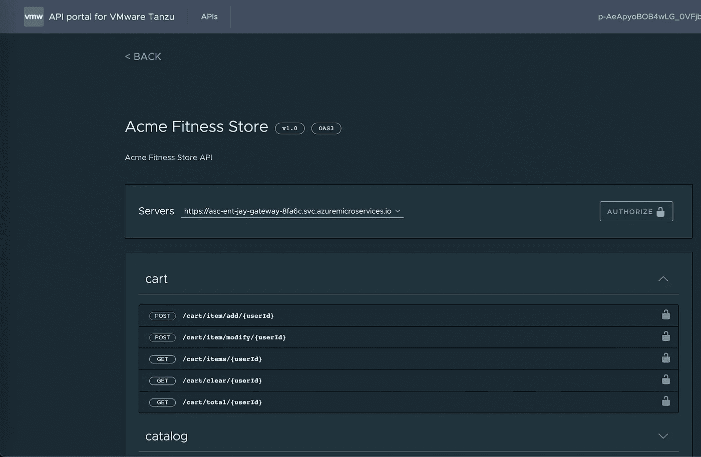
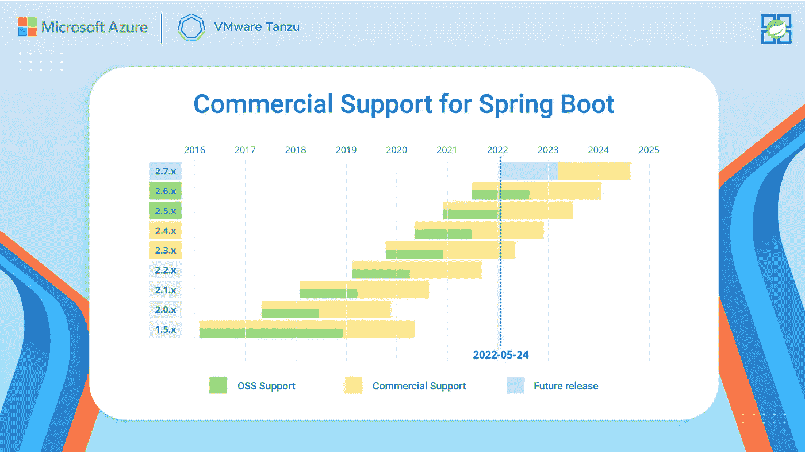
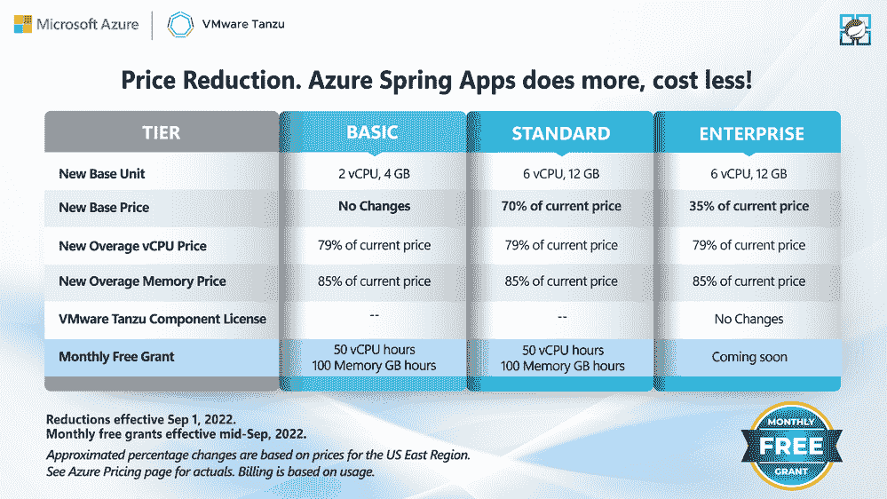

# 在 Azure Spring 应用中选择正确的层

> 原文：<https://blog.devgenius.io/choosing-the-right-tier-in-azure-spring-apps-94456a51c97b?source=collection_archive---------9----------------------->

Azure Spring Apps Enterprise tier 已于 2022 年 5 月全面上市，因此现在 Azure Spring Apps 有三个可用层。就像任何其他 Azure 服务一样，不同的层提供不同的功能。然而，它在 Azure Spring 应用程序中稍微复杂一些，因为企业层包括独有的 VMware Tanzu 组件，这在其他层中是不存在的。我将逐一介绍主要的差异，以便开发人员可以根据他们的生产需求决定合适的层。

层级比较

# Tanzu 构建服务—多语言支持

VMWare Tanzu 构建服务

[Tanzu Build Service](https://docs.microsoft.com/en-us/azure/spring-apps/how-to-enterprise-build-service?tabs=azure-portal) 自动化容器创建、管理和治理，集成 [kpack](https://github.com/pivotal/kpack) 。kpack 是一个“Kubernetes 原生容器构建服务”，它使用云原生构建包在 Kubernetes 上构建 OCI 映像。之前写过两篇关于云原生 Buildpack 的文章。

1.  [使用面向 Azure 容器平台的云原生构建包在一分钟内创建 Spring Boot 容器](https://eggboy.medium.com/creating-spring-boot-images-with-cloud-native-buildpacks-for-azure-container-platforms-62c7a6f187de)
2.  [Cloud Native build pack Inside Out](https://eggboy.medium.com/cloud-native-buildpack-inside-out-e282233206d2)

构建服务已经存在，与标准层相同，但不同之处在于企业层向用户公开了构建器和构建包。它提供了一组有限的 buildpacks，主要用于多语言支持，在 Azure Spring 应用程序上带来与其他语言(如 Go、Node.js 和 Python)的`az spring app deploy`体验。

构建包支持多语言

App Insights、App Dynamics、Dynatrace、ElasticAPM、NewRelic 等监控解决方案也支持云原生 Buildpack 绑定。**注意:这些绑定不是企业专有的，尽管在基本/标准层的门户上看不到。再看 ElasticAPM 的例子:**[**https://docs . Microsoft . com/en-us/azure/spring-apps/how-to-elastic-APM-Java-agent-monitor**](https://docs.microsoft.com/en-us/azure/spring-apps/how-to-elastic-apm-java-agent-monitor)

企业级支持的绑定

# Tanzu 应用程序配置服务

在基本/标准层中，Spring Cloud Config server 提供来自 git 存储库的外部配置。在企业层，Tanzu 应用程序配置服务取代了配置服务器，配置服务器是 Kubernetes 内部使用 ConfigMap 的本地组件。t̶h̶i̶s̶̶c̶h̶a̶n̶g̶e̶̶i̶s̶̶i̶n̶t̶e̶r̶e̶s̶t̶i̶n̶g̶̶b̶e̶c̶a̶u̶s̶e̶̶n̶o̶t̶̶o̶n̶l̶y̶̶d̶o̶e̶s̶̶t̶h̶i̶s̶̶g̶e̶t̶̶r̶i̶d̶̶o̶f̶̶a̶d̶d̶i̶t̶i̶o̶n̶a̶l̶̶d̶e̶p̶e̶n̶d̶e̶n̶c̶y̶̶s̶p̶r̶i̶n̶g̶̶c̶l̶o̶u̶d̶̶c̶o̶n̶f̶i̶g̶̶c̶l̶i̶e̶n̶t̶̶f̶o̶r̶̶s̶p̶r̶i̶n̶g̶̶a̶p̶p̶s̶,̶̶b̶u̶t̶̶a̶l̶s̶o̶̶i̶t̶̶b̶r̶o̶a̶d̶e̶n̶s̶̶i̶t̶s̶̶u̶s̶a̶g̶e̶̶t̶o̶̶p̶o̶l̶y̶g̶l̶o̶t̶̶l̶a̶n̶g̶u̶a̶g̶e̶s̶̶s̶u̶p̶p̶o̶r̶t̶e̶d̶̶o̶n̶̶a̶z̶u̶r̶e̶̶s̶p̶r̶i̶n̶g̶̶a̶p̶p̶s̶̶e̶n̶t̶e̶r̶p̶r̶i̶s̶e̶.̶:您可以从下面运行在企业级的示例应用程序中看到配置源代码。执行器端点显示由 Configmap 支持的本地文件(来自 Git)的属性。

**【2022 年 11 月 18 日修正】—目前，没有办法强制 Azure Spring Apps Enterprise 为非 Spring 应用挂载 ConfigMap。对于 Spring Boot 应用程序，企业级在本地挂载 ConfigMap，然后相应地将 SPRING _ CONFIG _ ADDITIONAL _ LOCATION 设置为文件夹。(例如*/etc/azure-spring-cloud/config map/ACS-default-redis-default-DCE 95/*)**

配置图中的属性

# 用于 Tanzu 和 API 门户的 Spring 云网关

根据来自微软的[调查](https://techcommunity.microsoft.com/t5/apps-on-azure-blog/2021-report-how-developers-migrate-spring-apps-to-the-cloud/ba-p/3021421)，Spring Cloud Gateway 是第二大流行的 Spring 云组件，所以像 Eureka 和 Config Server 一样提供它作为平台组件是很有意义的。这是 VMware Tanzu 团队的介绍。

[*" Spring Cloud Gateway for Tanzu 是商用 VMware Tanzu 组件之一。它基于开源的 Spring 云网关项目。Spring Cloud Gateway for Tanzu 处理 API 开发团队的交叉问题，如单点登录(SSO)、访问控制、速率限制、弹性、安全性等。”*](https://docs.microsoft.com/en-us/azure/spring-apps/how-to-use-enterprise-spring-cloud-gateway)

Tanzu Gateway 版本的主要优势是

1.  这是一个完全托管的组件，第二天的操作由 Azure Spring Apps 负责
2.  无需额外配置 Spring Cloud Config 即可在线刷新路由
3.  可用于 SSO、速率限制、断路器等的预建滤波器。，这有助于解决 API 网关的横切关注点。

下面是一个使用 RateLimit 和 CircuitBreaker 的例子。

过滤器的完整列表可以在这里找到。

 [## 商用路由过滤器

### 开源的 Spring Cloud Gateway 项目包括许多用于网关路由的内置过滤器。春天…

docs.vmware.com](https://docs.vmware.com/en/VMware-Spring-Cloud-Gateway-for-Kubernetes/1.1/scg-k8s/GUID-route-filters.html) 

用于 VMWare Tanzu 的 API 门户与 Spring Cloud Gateway 一起提供。它显示了 Spring Cloud Gateway 上定义的所有路由的 API 目录，因此开发人员可以在门户上快速尝试每个 API。

# 对 Spring Boot 的长期支持—企业级

这是一份官方声明，描述了包含在企业层中的 VMware Spring 运行时。

> 企业级包括对应用程序开发和部署的 VMware Spring 运行时支持。这种支持让您可以接触到 Spring 专家，让您释放 Spring 生态系统的全部潜力，更快地开发和部署应用程序。
> 
> 通常情况下，开源 Spring 项目次要版本从这些项目的初始发布之日起至少支持 12 个月。在 Azure Spring Apps Enterprise 中，Spring project 次要版本将通过 VMware Spring 运行时支持权利，从初始发布之日起获得至少 24 个月*的商业支持。这种扩展的支持确保了您的 Spring 应用程序组合的安全性和稳定性，即使是在开源软件寿终正寝之后。

# 降价—所有三个层级

跨层降价

Azure Spring 应用程序的定价宣布了一些变化。首先，跨层的基本单位减少了。例如，以前，标准层的基本单位是 8 vCPU 和 16 GB。其次，企业级的基础价格大幅降低，实际上与标准级的价格相当，约为 0.679 美元/小时**(警告:不同地区的价格会有所不同)**。现在，在标准层和企业层之间做出选择归结为一个问题。**“你需要坦祖组件吗？”注意:企业级的 Tanzu 组件许可费用很低。**

最后但并非最不重要的一点是，一个名为每月免费授权的新权利被给予了客户，我认为这个免费授权将帮助希望快速评估平台的开发人员。假设开发人员想要使用标准/企业级进行 8 小时的快速概念验证，他们可以在免费授权、50 个 vCPU 和 100 GB 应用程序的限制内，以 5.432 美元(0.679 美元* 8 小时)的基本单元的小额成本完成。

 [## 降价- Azure Spring Apps 做得更多，花费更少！

### 我们相信以极具竞争力的价格提供最具创新性的云产品。随着我们运营 Azure…

techcommunity.microsoft.com](https://techcommunity.microsoft.com/t5/apps-on-azure-blog/price-reduction-azure-spring-apps-does-more-costs-less/ba-p/3614058) 

# 包扎

我希望这篇文章能让你对 Azure Spring 应用的分层有一个清晰的认识。我个人喜欢将 Spring Cloud Gateway 作为企业级平台的一部分，这消除了我自己创建和管理它的繁琐工作。请给我留下你的看法。

如果你喜欢我的文章，请留下一些掌声，或者开始关注我。你可以在 [**Linkedin**](https://www.linkedin.com/in/cloudnativejay/) **上给我打电话。谢谢！**