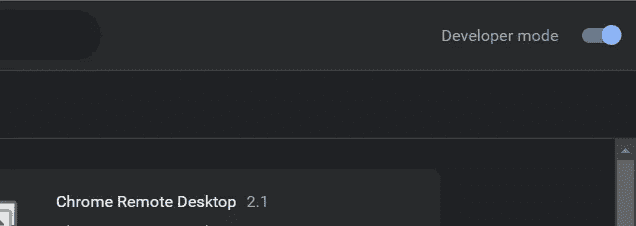
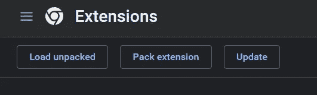
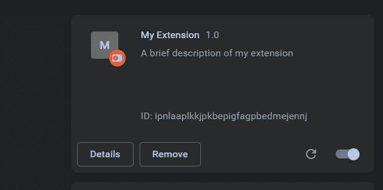

# 使用 JavaScript 的 Chrome 扩展

> 原文：<https://blog.devgenius.io/chrome-extension-using-javascript-7c1e5ea527c7?source=collection_archive---------7----------------------->


在这篇文章中，我将讲述使用 JavaScript 构建 chrome 扩展的基本结构，并将解释用于构建我们的 chrome 扩展的不同文件的工作原理。

**要用 JavaScript 创建一个 Chrome 扩展，你需要遵循以下步骤:**

*   为您的扩展创建一个新文件夹。
*   在文件夹中创建一个名为“manifest.json”的文件。这个文件将包含关于您的扩展的元数据，比如它的名称和版本号。下面是一个基本 manifest.json 文件的示例:

```
{
  "manifest_version": 3,
  "name": "My Extension",
  "version": "1.0",
  "description": "A brief description of my extension",
  "content_scripts":[
    {
      "matched" : ["<all_urls>"],
      "js" : ["content.js"]
    }
  ]

}
```

让我们了解一下什么是 content_scripts:

它用来改变你的“匹配”数组中提到的网页的内容，就像在这个例子中我们传递[" <all_urls>"]这意味着这个扩展将在 chrome 的每个 URL 上工作。如果你想为特定的网页做扩展，你可以提到那个网页的 URL。无论您在“js”上传递什么文件名，javascript 文件都将在匹配的 URL 上运行。</all_urls>

*   后台脚本 :-后台脚本是在 chrome 扩展中后台运行的 javascript 文件。它可用于执行需要连续或定期执行的任务。

要使用 background.js，您必须在 manifest.json 文件中添加以下代码:-

```
"background": {
    "scripts": ["background.js"]
  }
```

在后台脚本中，您可以使用`chrome.runtime` API 来执行任务或监听事件。例如，您可以使用`chrome.runtime.onInstalled`事件在安装扩展时运行脚本，或者使用`chrome.runtime.onMessage`事件监听来自其他脚本的消息。

*   **popup** :-在文件夹中创建一个名为“popup.html”的文件。这个文件将包含当用户点击扩展图标时弹出窗口的 HTML 代码。您可以添加任何其他必要的文件，如图像或 CSS 样式表。

要使用 popup.html，您必须在 manifest.json 文件中添加以下代码:-

```
"browser_action": {
    "default_icon": "icon.png",    //icon of your extension
    "default_popup": "popup.html", //html code for the popup of your extension
  }
```

现在普通扩展的基本设置已经完成，让我们看看如何在 chrome 扩展上添加这个扩展

*   转到 chrome://extensions/
*   确保你的开发者模式在右上角打开



*   点击加载解包



*   现在选择您在第一步中创建的扩展文件夹。
*   在此之后，我们将把你的扩展添加到 chrome 中



我已经演示了 chrome 扩展的基本文件结构和工作原理，按照这些步骤，你可以很容易地通过编写扩展逻辑来进行普通的扩展。我写这篇文章是因为当我学习做 chrome 扩展时，我没有在一个地方找到任何东西。我希望这将有助于你，如果它确实确保:-

*   关注 [Mohit garg](https://medium.com/u/8a9ce53808fd?source=post_page-----7c1e5ea527c7--------------------------------) ，获取更多关于 web 开发和相关内容的文章
*   分享这篇文章给你想开始学习 chrome 扩展的朋友。