# 音乐流媒体应用 Sparkify 的流失预测

> 原文：<https://blog.devgenius.io/churn-prediction-for-music-streaming-app-sparkify-d6e26d1ac80f?source=collection_archive---------11----------------------->

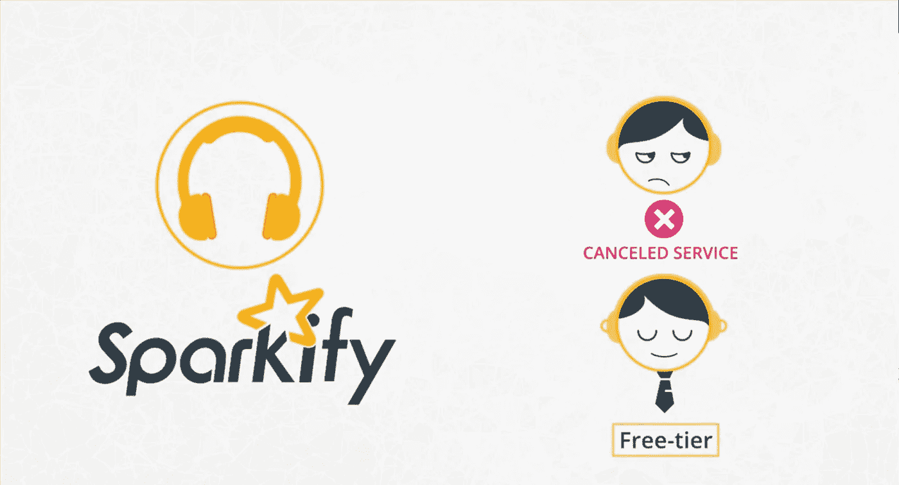

# 项目定义

这篇文章概述了 Udacity 提出的数据科学纳米学位项目。这个想法是通过一个模拟的音乐流媒体应用程序来预测哪些用户会流失。在这个项目中，用户的定义将是降级的用户，从付费到免费计划，或取消它。预测流失率对公司来说非常有价值。了解更有可能取消或降级的用户，公司可以采取措施来防止它，更不用说在问题的建模和分析期间所做的探索性分析会显示产品的弱点。
为了解决这个问题，我们有关于用户的各种信息，比如他们在应用中访问了哪些页面，他们在每个页面上花了多少时间，他们听了哪些歌曲，他们看广告花了多少时间，他们在应用中注册了多长时间等等。这些数据将被处理和设计为机器学习模型的输入，该模型将预测哪些用户会流失。

# 分析

在下图中，我们可以看到数据集的前 20 行，每行代表应用程序中的一次用户交互。不是所有的功能都被用在最终的模型中，一些新的功能被设计出来。这将在本主题中讨论。

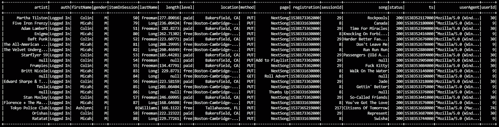

数据集中的 20 行

该数据集由 528005 行组成，数据来自 448 个不同的用户。正如我们在下图中看到的，数据集的大部分是由特性`page`上的值为`NextSong`的行组成的，然而，花费在其他一些页面上的时间是非常相关的。这将在接下来的主题中变得更加清晰。

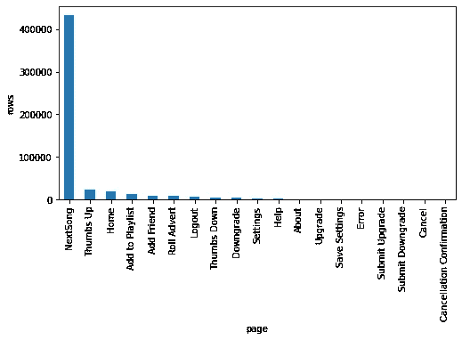

特征“页面”的分布

为了继续分析，下一步将创建`label`列，对于用户在任何给定时刻搅动的行，该列的值为 1，如果用户从未搅动，则为 0。

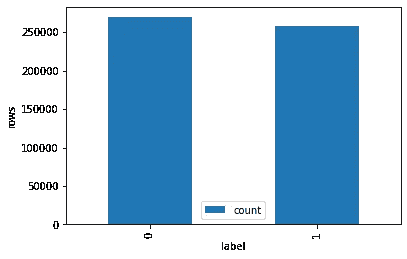

标签分发

在下图中，我们可以看到每个页面的用户比例。列`Cancellation Confirmation`、`Submit Downgrade`和`Cancel`用于定义被搅动的用户，因此它们将始终具有标签 0，并且不会被用作模型的输入特征。特征`Help`、`Logout`、`Home`和`Settings`也将被移除以简化模型，因为它们是最接近 50%标签分布的特征。

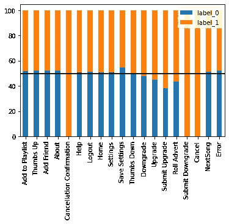

每页标签数标准化分布

下图显示了性别间标签分布的显著差异，因此它将被用作一个特征。

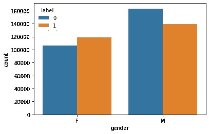

按性别分布的标签

# 方法学

这个数据集已经很干净了，但是，一些行缺少特性`userId`。由于我们试图预测哪些用户会流失，没有用户标识的行是没有用的，因此他们被从数据集中删除。

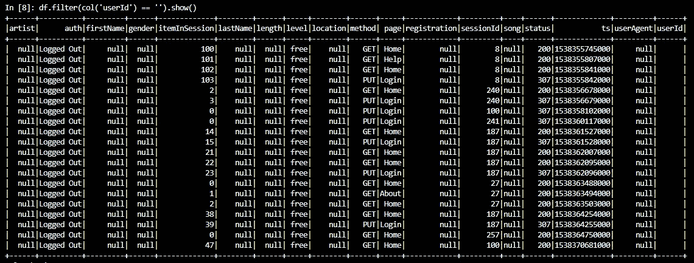

缺少 userId 的行

我还设计了一些其他功能，例如每个用户每小时听多少首歌，观看广告的时间，以及付费/免费时间的比例。`page`特性的所有其他值都变成了新的列。下图显示了模型中使用的最终数据框的示例，共有 21 个要素。

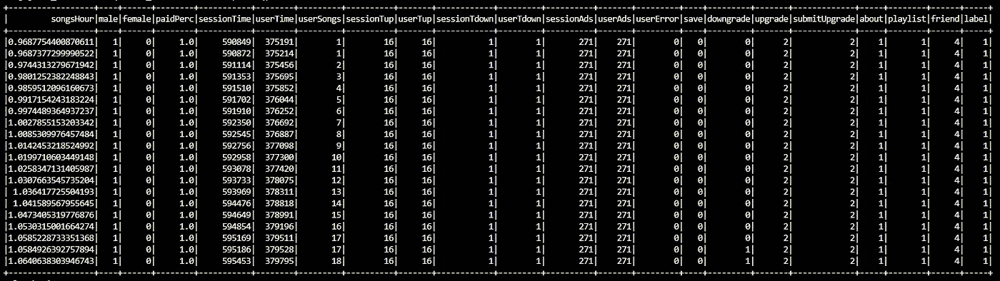

距离最终数据帧 20 行

为了创建和训练模型，我在本地模式下使用 Python API for Spark (pyspark)及其机器学习库。Spark 是一个在集群中处理大型数据集的框架，通常是在云服务中，比如 AWS EMR。在这个项目中，我使用了一个缩减版本的数据集，236MB。数据集的完整版本有 12GB，只能在 AWS 中使用。

组装完上一张图中所示的数据帧后，我们还需要几个预处理步骤。我们必须用`VectorAssembler`将特征列转换成向量，用`MinMaxScaler`将所有特征缩放到[0–1]范围内，从`pyspark.ml.classification,`中选择一个分类器，并用`ParamGridBuilder`选择一些参数来构建参数网格。所有这些都通过`pyspark.ml.Pipeline`在管道中进行转换。管道使代码更容易工作和理解。在使用分布式计算时，它们还有助于并行化任务，并有助于避免错误，如将数据从训练泄露到测试集。

下图显示了构建模型的部分代码，测试了 4 个分类器(随机森林、多层感知器、逻辑回归和梯度提升树)和网格搜索中使用的参数。

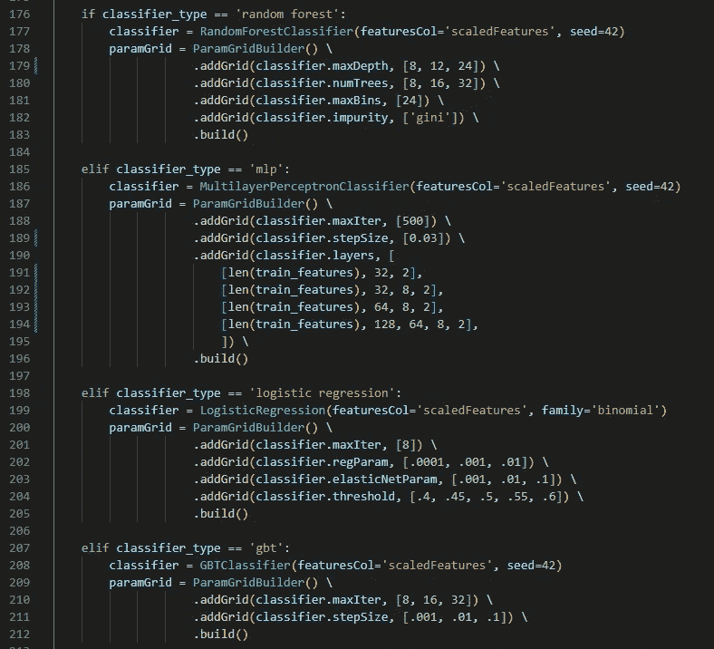

为了评估预测模型的性能，我们将在训练集和测试集之间拆分数据，每个集中有不同的用户。这意味着我们将使用一组用户来构建和训练模型，另一组用户来测试性能。通过这种方式，我们可以模拟一个真实的情况，在这个情况下，模型预测用户的流失，而这个模型以前没有看到过。为了评估性能，我们将使用 F1 分数，它结合了分类问题中的两个重要指标:精确度和召回率。F1 分数的计算公式如下所示:

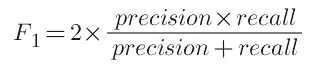

其中:

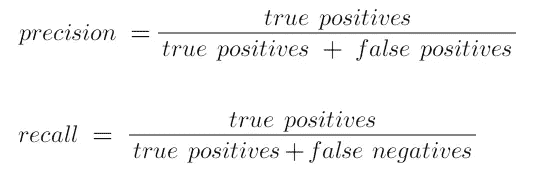

还有一个训练/验证分割(70/30)来训练模型和选择参数，使用`pyspark.ml.tuning.TrainValidationSplit`。

由于数据集对每个用户都有许多行，并且模型对每一行都进行预测，因此我们必须决定一种方法来定义对每个用户的预测。我试验了两种方法:使用最近的预测和使用最频繁的预测。第二个显示了最佳结果，是用于生成下一部分结果的一个。

# 结果

下图显示了每个分类器中最佳模型的 F1 分数和准确度。分数是基于对每个用户的预测，而不是每一行，因为我相信这是一种更好的方法来衡量模型在实际应用中的成功。

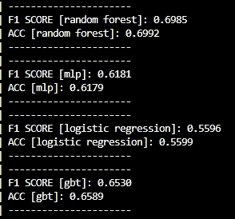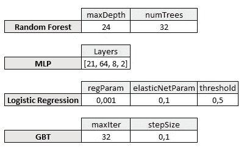

逻辑回归的性能最差，因为它是测试过的最简单的模型，并且只能捕捉线性相关性。MLP 只是稍微好一点，但可以通过更深入的分析、更多的迭代、不同种类的层以及深度学习的许多其他技术来改进，这超出了本项目的范围。这是我第一次在 GBT 试验，我对训练时间印象深刻，比 MLP 快得多，效果也更好。这个问题的最佳分类器是随机森林，它在第一次测试中得分最高。

下图显示了每个特征与随机森林分类器的相关性。与该模型最相关的特征是付费/免费时间比率、自注册以来的时间以及所听歌曲的数量。

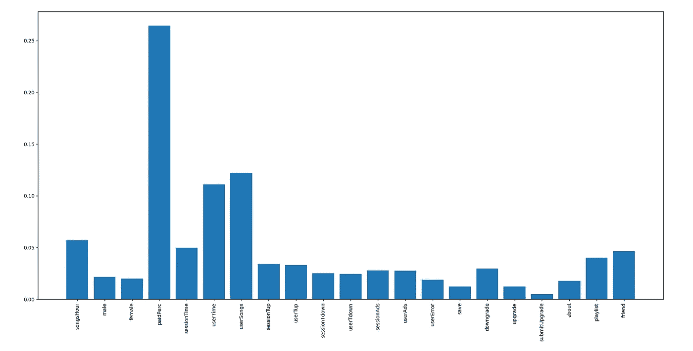

随机森林模型的特征重要性

# 结论

结果显示，即使是简单的模型也能比随机机会更好地预测哪些用户会流失，为公司提供有价值的信息，可以用来保持用户订阅。

在这个模型中可以进行很多改进，例如更复杂的机器学习模型，实时训练和预测流失，对更有可能流失的用户进行自动激励，以及更多来自用户的数据用作输入特征，例如用户对应用程序的定期评级等。

对我来说，这个项目最有趣的方面是目标，流失预测似乎是一个可以在广泛的业务中应用的工具，并且有很多潜力可以进一步开发。

该项目的存储库位于:[https://github.com/ttozatto/sparkify](https://github.com/ttozatto/sparkify)