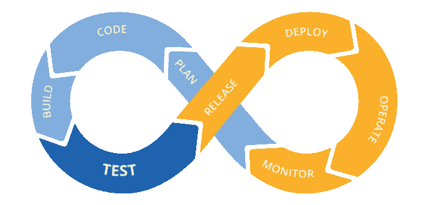
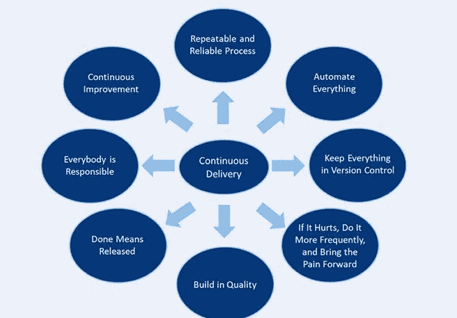

# 渠道的 CI/CD 概念

> 原文：<https://blog.devgenius.io/ci-cd-concept-with-pipeline-3408d2fff38?source=collection_archive---------6----------------------->

# 简介:

在开始阅读本文之前，您必须知道什么是 CI/CD 概念，因为它依赖于 CI/CD 概念。您可以单击此链接阅读 CI/CD 概念。

你可以从这篇[中读到什么是 CI/CD 什么是 CI/CD 概念？。](/what-is-ci-cd-concept-375cb226cf3d)

# 词的阶段

1.  推送:每天推送 Master 这个阶段也被称为基于主干的开发。
2.  测试:CI 依赖于一套自动化且可靠的测试。这些测试验证开发人员集成的代码。您可以包含您认为关键的任意多的测试。
3.  修复:如果您观察到任何构建被破坏，那么团队应该优先修复它，而不是向它添加新功能。

在这些阶段，我们需要

**光盘原理:**

*   **可重复且可靠的软件部署流程:**

为了便于部署，对所有环境使用相同的发布过程非常重要。

*   **自动化一切**

尽可能自动化。自动化您的构建、测试、发布、配置变更以及其他一切。

*   **持续改进**

在 CD 的所有原则中，它对于有效的自动化是最重要的。它将帮助您跟上不断发展的技术进步。它确保您跟踪变化并改进您的流程以与之匹配。

*   **保持所有内容在版本控制中**

保持所有开发、部署和测试方面的版本化是 CD 的关键。代码、配置、脚本、数据库、文档。一切！保持版本化。它确保了高效创建重复性流程的稳定基础。

*   **内置质量**

创建简短的反馈循环，以便在错误产生时立即处理。这将使开发人员能够更快地产生更高质量的代码。此外，很少问题会在以后被发现，那时修复它的成本会更高。

*   **完成意味着发布**

对于 CD，有一个明确的定义，即软件的最终版本应该用于生产。它消除了任何歧义。并帮助每个人达成并交付一致同意的最终版本。

*   **如果疼，就更频繁地做，让疼痛提前**

首先处理耗时或容易出错的任务是很重要的。重复应用这些有问题的程序将能够更快地检测和修复潜在问题。

*   **人人有责**

“它在我的工作站上工作”从来都不是一个有效的借口。责任应该延伸到生产。文化变革可能是最难实施的。然而，拥有管理层的支持和热情的拥护者肯定会有所帮助。在整个过程中，每个人都必须分担责任。

# 在您的应用中完成 CI/CD 流程所需的工具:

我们有很多技术来用很多工具做你的 CI/CD，我用 docker 和 Jenkins 和 Kubernetes 来做。当我编写测试用例时，我使用 JUnit 测试用例，如果我编写 java 应用程序，我也需要 maven，当我需要推送代码时，我使用 GitHub 作为存储库。

> 每个人在 CI/CD 中都有具体的工作。但他们都在 CI/CD 流程中担任主要工作。

# 结论

在这篇文章中，我解释了我需要做什么 CI/CD，以及在这个过程中我需要哪些工具。

我会在接下来的几天里再写一篇关于 Jenkins 和 Docker 和 Kubernetes 的文章，但是我们必须知道什么是 CI/CD，我什么时候想用它，怎么用。

# 参考

https://medium.com/globant/basics-of-cicd-7a5aed1eda5a