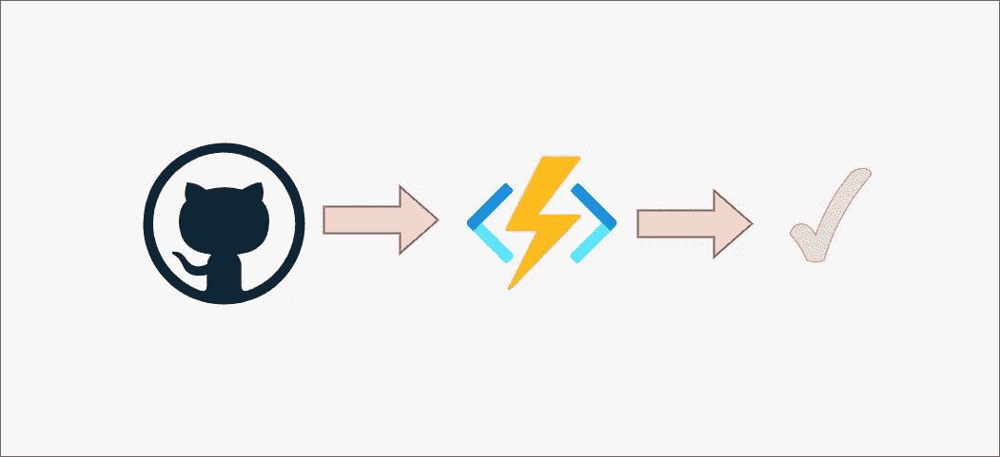
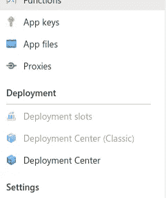

# 使用 GitHub 实现 Azure 功能的 CI/CD

> 原文：<https://blog.devgenius.io/ci-cd-for-azure-functions-with-github-47711cf6f912?source=collection_archive---------2----------------------->



CI/CD 通常是一个被低估的概念，大多数时候我们没有意识到它给你的产品带来的巨大价值。

这篇文章的动机来自于我为一个大型企业项目开发、维护和迁移一个完全无服务器的工作流基础设施的经验。

无论是拥有 30 多个功能应用和 150 多个功能的大型企业项目，还是小型企业项目，拥有一个可管理的工作流来维护代码并随时更新功能应用都是非常重要的。

幸运的是，Azure 提供了一种简单的方式来实现这个工作流。

为了简单起见，我假设您对 GitHub 和 Azure 函数有基本的了解。对于本文，我使用一个简单的基于 HttpTrigger 的 Azure 函数。如果你还没有接触过 Azure 的函数，我强烈推荐你阅读我下面的文章，学习如何创建一个函数。

[](https://medium.com/analytics-vidhya/azure-functions-for-dummies-part-1-http-trigger-a95cd000bc62) [## Azure 虚拟函数—第 1 部分— http 触发器

### 这是我计划撰写的关于 Azure 函数的系列文章的第 1 部分。从标题来看，这是一本傻瓜指南。而我…

medium.com](https://medium.com/analytics-vidhya/azure-functions-for-dummies-part-1-http-trigger-a95cd000bc62) 

现在让我们使用 GitHub 设置新部署的函数应用程序，使其具有 CI/CD 管道。

为了做到这一点，你需要一个 GitHub 帐户，并把功能代码放入一个你可以链接到的存储库中。

您可以使用包含简单 Azure HTTP Trigger 函数的示例存储库并开始使用。

[](https://github.com/rajeshr6r/testazurefunctions) [## rajeshr6r/testazurefunctions

### 在 GitHub 上创建一个帐户，为 rajeshr6r/testazurefunctions 开发做贡献。

github.com](https://github.com/rajeshr6r/testazurefunctions) 

假设你已经有了部署在 Azure 中的功能 App，我们再进一步。

对于本文，我试图创建一个空的函数应用程序，并将其与我的 GitHub 库链接起来，以获得函数。**在你的案例中，如果你按照我的文章从上面创建了一个函数应用程序，你就已经有了这个函数，并且会用你存储库中的代码替换它。**

我的空功能 App 是这样的


现在让我们链接包含函数 App 代码的 GitHub 库。

**第一步**:点击部署中心



**第二步**:配置 GitHub 凭证和资源库

注意:你应该在这里使用你的 GitHub 账户(**我的截图显示了我的账户**)


**第三步:**点击保存按钮，给 Azure 几分钟时间来完成这项工作。

**步骤 4 :** 让我们验证一下功能代码现在是否部署正确。它是


您还可以在这里验证函数下的 Python 代码。

注意第 19 行，这是 HTTPTrigger 函数的锅炉板代码。


**第 5 步:**现在让我们在你最喜欢的代码编辑器或最好的代码编辑器(我喜欢 VS Code)上修改代码，如果你想了解更多，可以看看下面的文章。

[](https://medium.com/@rajesh.r6r/is-visual-studio-code-the-coolest-ide-ever-80a59579612f) [## Visual Studio 代码是有史以来最酷的 IDE 吗

### 我可能对 VS 代码有点固执己见。这是经过多年的开源和可能鄙视微软…

medium.com](https://medium.com/@rajesh.r6r/is-visual-studio-code-the-coolest-ide-ever-80a59579612f) 

**第六步:进行 git 推送**

这种推送确保了你的代码被更新到存储库，而不是停留在那里，它还向 Azure 发送信号，要求它刷新功能代码。

出于我们的目的，我将第 19 行修改为

```
return func.HttpResponse(f"Hello, {name}. For Second Commit function executed successfully.")
```

第 7 步:让我们验证一下推送是否有效。请看第 19 行。


现在，您的无服务器工作流有了一个可靠的 CI/CD 管道。感谢 GitHub，您现在可以放心了，您的功能总是可靠的，并且拥有最好的版本控制。

最后，如果您订阅了 Azure Pipelines，也可以实现这一点。但我觉得这太复杂了，但这只是我的想法。我肯定很快会写一篇关于 Azure Pipelines 的 CI/CD 的文章。

**如果你有兴趣，可以考虑跟随我。**