# Azure 数据工厂中的 CI/CD🏭使用 Azure DevOps

> 原文：<https://blog.devgenius.io/ci-cd-in-azure-data-factory-using-azure-devops-5df2643c9fb1?source=collection_archive---------1----------------------->

这里我们将讨论如何设置 Azure DevOps 来执行 Azure 数据工厂中的所有 CI/CD(持续集成/持续部署)操作。

涵盖的主题:

*   我们为什么需要 DevOps？
*   **为什么我们需要 Azure Data Factory 的 CI/CD？**
*   **什么是 Azure DevOps？**
*   **如何设置 Azure DevOps 帐户？**
*   **如何在 ADF (Azure Data Factory)中配置 GIT？**
*   **如何在 ADF 中执行 CI/CD 操作？**

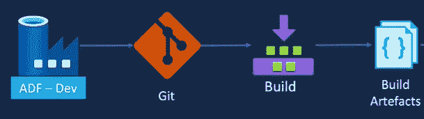

ADF- CI/CD

## 我们为什么需要 DevOps？

早期的公司有不同的开发和生产团队，开发团队负责编写和测试代码，运营团队负责在生产中部署和支持代码。

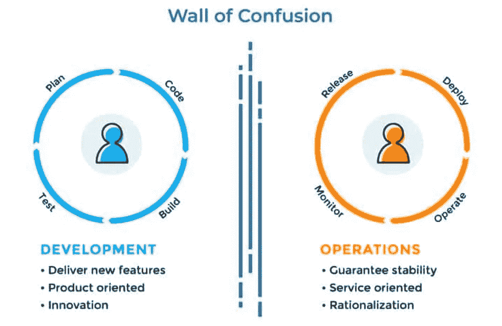

图片来自谷歌

这有其自身的问题，例如团队之间的沟通问题，由于他们自己团队的优先级而产生的利益冲突，以及缺乏自动化。

为了解决这些问题，公司希望将开发和运营团队整合在一起。这两个团队之间的职责交叉称为 DevOps。

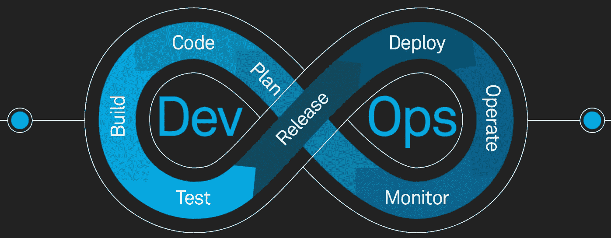

DevOps-生命周期

DevOps 运动开始于 2007 年左右。DevOps 的主要目标是将开发人员和 IT 操作人员聚集在一起，在项目的整个生命周期中协同工作，并提高软件开发和交付的速度和质量。

## 为什么我们需要 Azure 数据工厂的 CI/CD？

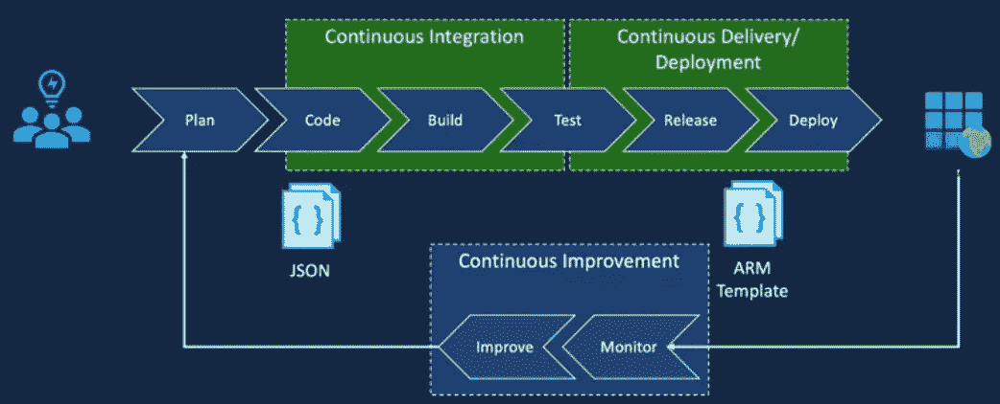

CI/CD 流程端到端

上图清晰地展示了 CI/CD 端到端流程。让我们来谈谈为什么我们确实需要 Azure 数据工厂中的 CI/CD。

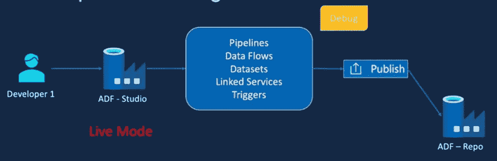

仅针对一个开发人员

假设我们只有一个开发人员在 ADF- Studio 实时模式下工作，进行所有的更改并将它们发布到 ADF repo 中，那么我们没有任何方法回滚我们所做的任何更改。在这种情况下，如果不止一个开发人员使用同一个 ADF- Studio live 模式，他们可能会覆盖彼此的更改，因此为了避免这种情况，我们采用了一种更具协作性的方式，开发人员可以对更改进行版本控制，而不会覆盖彼此的更改。

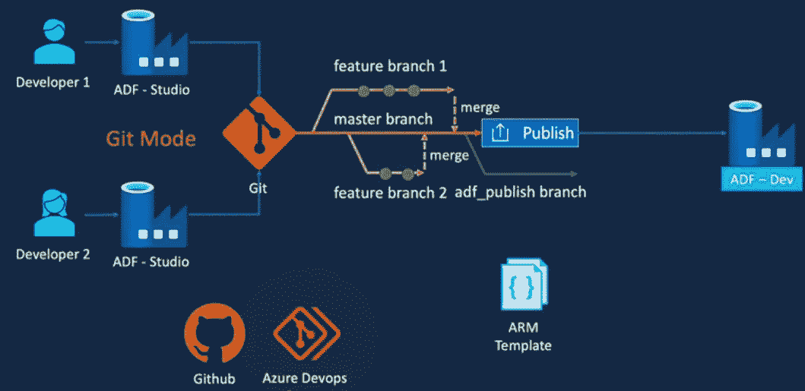

ADF CI/CD 的流程

为了提供这些功能，我们需要启用一个源代码控制解决方案，比如" **Git"** 。我们可以让开发人员使用 Azure Data Factory Studio 作为代码库。这种将 ADF studio 连接到 Git 的方式被称为 Git 模式。

*ADF 支持 GitHub 以及 Azure DevOps Repos 作为核心存储库。在本文中，我们将使用 Azure DevOps repo，但是您只需按照非常相似的步骤将 GitHub 设置为核心存储库*。

随着 Git 的引入，开发人员现在可以创建单独的特性分支来进行更改并协同工作。开发人员可以通过提交到特性分支来保存他们的更改，同时还可以请求评审等。一旦更改被批准，并且特征分支与主分支合并，我们就可以发布到数据工厂。publish 选项不仅将更改发布到 ADF dev 存储库，还在 Git 中创建了另一个名为 ADF 的分支来发布。

## 什么是 Azure DevOps？

Azure DevOps 提供版本控制、报告、需求管理、项目管理、自动化构建、测试和发布管理功能。它涵盖了整个应用生命周期，并支持开发运维功能。

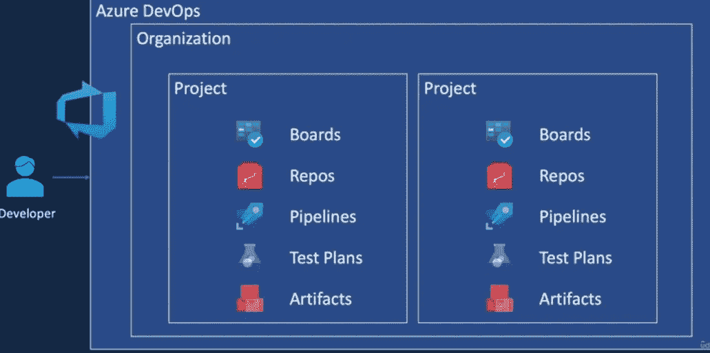

Azure DevOps 的层次结构

## 如何设置 Azure DevOps 帐户？

*   前往[*dev.azure.com*](http://dev.azure.com)
*   如果您已经有一个 azure 帐户，则不必注册新帐户，只需使用现有的 Azure 凭据登录即可

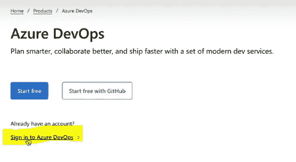

单击登录 Azure DevOps

*   选择要在其中创建该存储库的目录

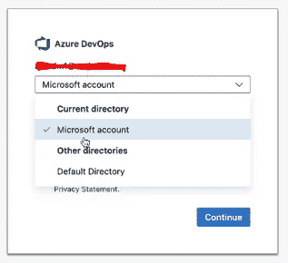

*   在这之后，只需按照简单的下一步和细节填充部分，一旦你完成了所有的步骤，你将能够看到以下屏幕与一个选项，以创建一个新的项目

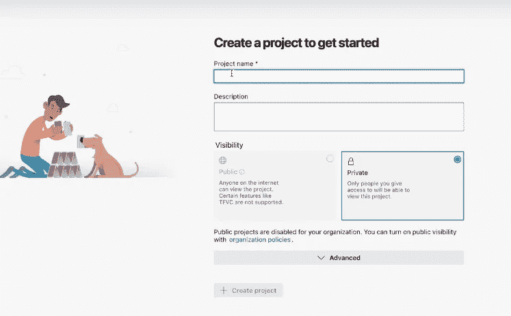

创建新项目

*   让我们创建一个在本文中可以引用的新项目

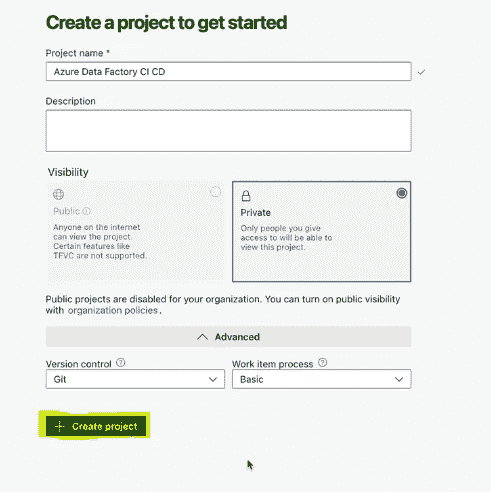

点击创建项目

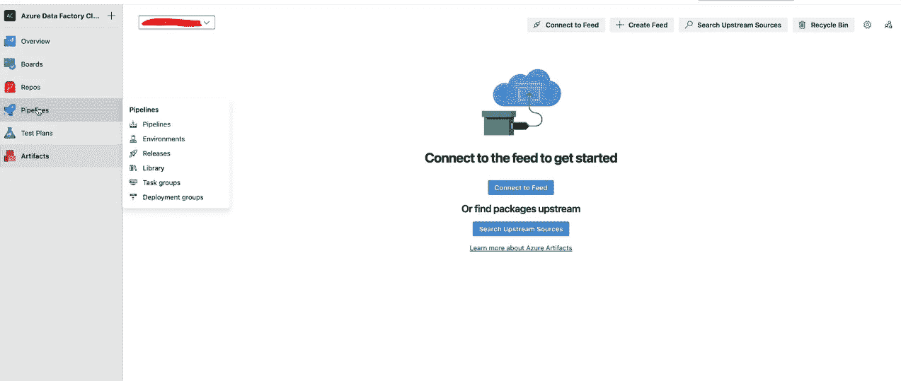

我们将把重点放在回购上，所有 CI/CD 工作都将在回购上完成

*   一旦您完成了 DevOps 帐户的设置，现在让我们将它与 ADF- Studio 连接起来，看看实际操作

**注意:如果你不知道如何创建一个 ADF (Azure 数据工厂)实例，请参考下面的文章:**

 [## 构建你的第一个数据工厂(Azure 门户)- Azure 数据工厂

### 在本文中，您将学习如何使用 Azure 门户创建您的第一个数据工厂。使用…来完成教程

learn.microsoft.com](https://learn.microsoft.com/en-us/azure/data-factory/v1/data-factory-build-your-first-pipeline-using-editor) 

## 如何在 ADF (Azure Data Factory)中配置 GIT？

人们通常做的常见/最佳实践是通过创建特性分支来进行任何更改，并通过使用 publish 按钮将它们推回到主/主要分支。

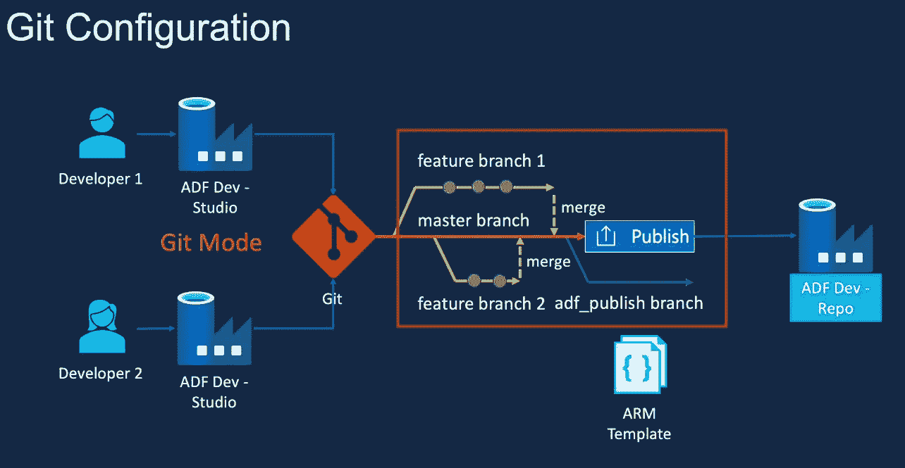

最佳实践

*   转到您的*dev.azure.com*门户并创建一个存储库(尽量保持名称与 azure 数据工厂实例名称相同)

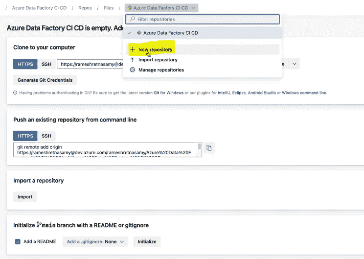

*   您需要在主分支中配置的一个策略是启用检查器策略

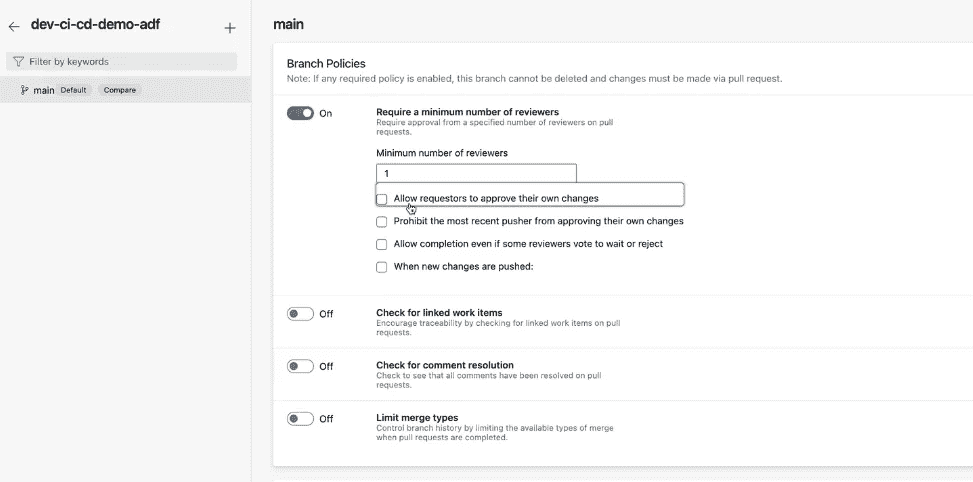

*   在 Azure data factory 中有 3 种不同的方式来设置代码回购

1.  回家去设置代码回购

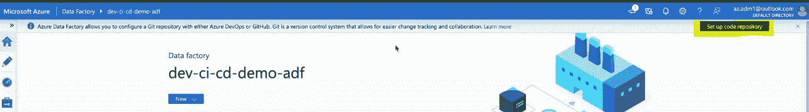

2.去找作者，设置代码回购

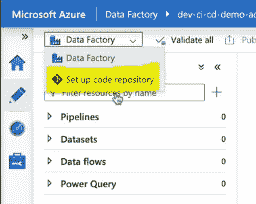

3.转到管理并设置代码回购

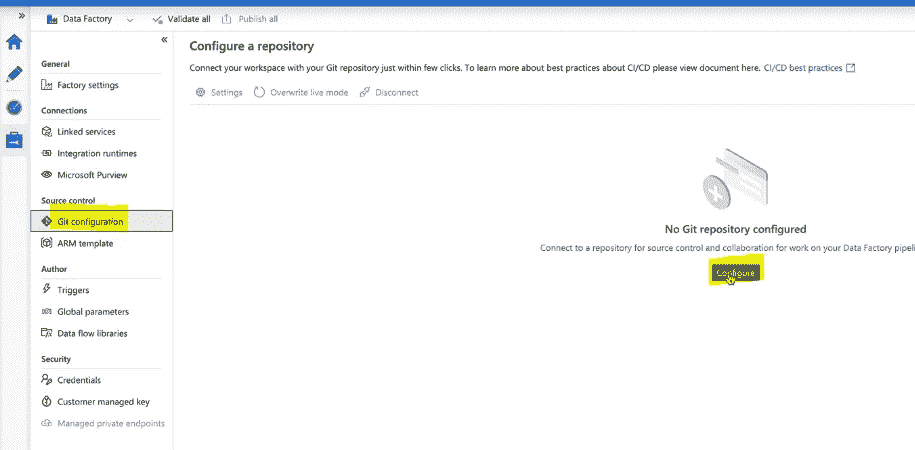

*   选择任意一种方法来配置 git(大多数情况下保持默认设置)

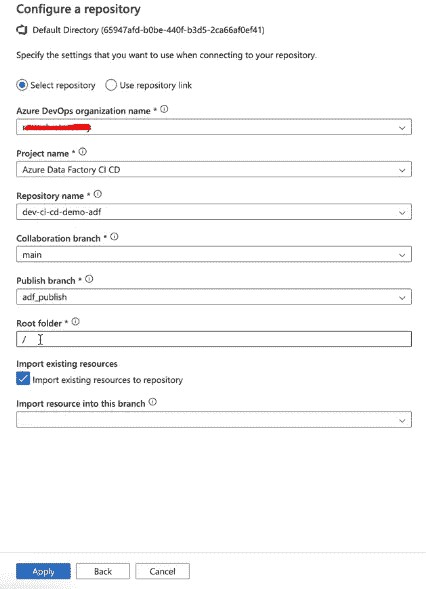

*   如果你已经做了所有正确的事情，那么你就差不多完成了配置

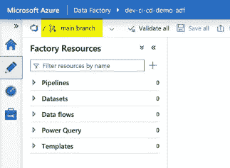

## 如何在 ADF 中执行 CI/CD 操作？

到目前为止，我们已经将 git 配置为使用 ADF studio 中的 CI/CD 进行版本控制和许多其他好处。现在是时候看看一切活动了。

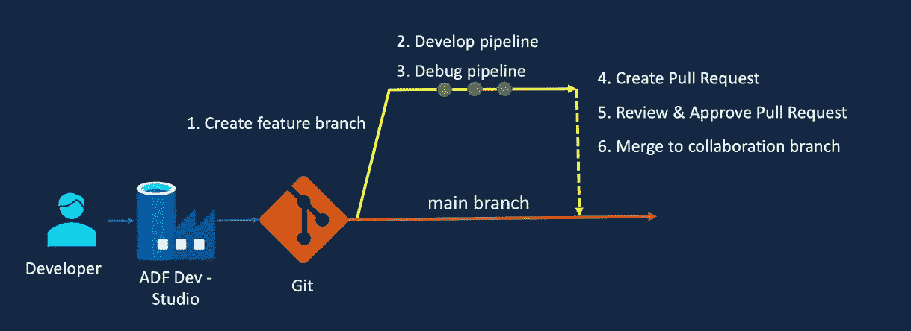

要遵循的步骤

步骤 1:创建特征分支

*   点击+新建分支

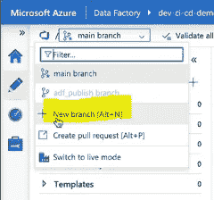

*   相应地命名它(/表示一个新文件夹->在名为 feature 的文件夹中创建 feature_1)

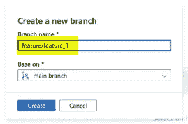

*   现在，您可以看到 repo 名称更改为 feature 分支

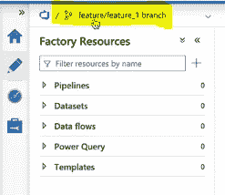

*   你也可以在 Azure DevOps 回购中看到同样的情况

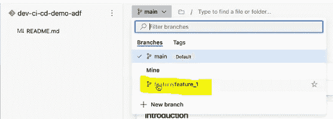

步骤 2 和 3:开发和调试管道

*   搜索或拖动一些活动，以创建用于测试目的的管道

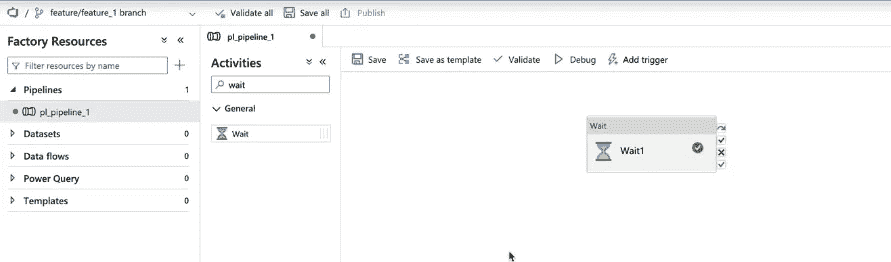

等待活动

*   单击“保存全部”保存所有更改

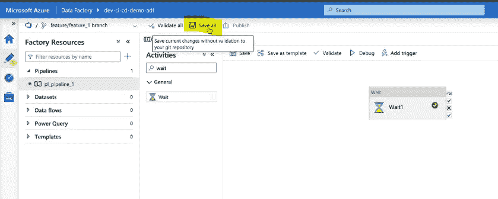

步骤 4、5 和 6:创建拉取请求

*   点击创建拉式请求

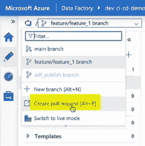

*   这将弹出一个新的页面，其中您已经提到了描述和审查者的姓名

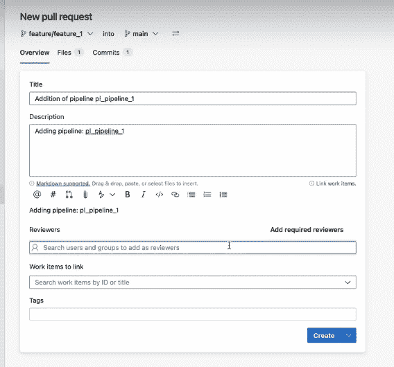

*   一旦创建，审查者将收到类似这样的东西来批准

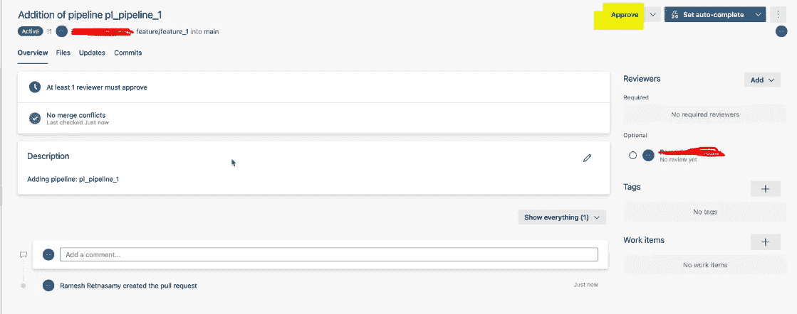

批准变更

*   下一步是将其合并到主分支，单击右上角的 complete 完成合并

按完成

*   合并后删除特征分支

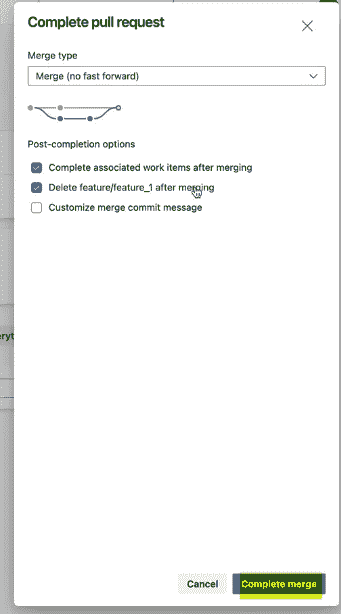

完成到主分支的合并

现在您可以在主分支中看到变更(管道)。

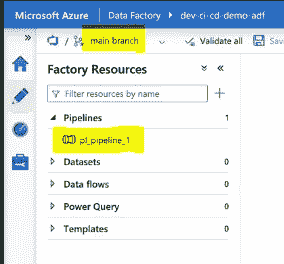

**想看更多**:[*https://medium.com/@ravikumar10593/*](https://medium.com/@ravikumar10593/)

**找到我的所有句柄**:[*https://linktr.ee/ravikumar10593*](https://linktr.ee/ravikumar10593)

> 如果这篇文章对你有所帮助，别忘了关注、点赞并与你的朋友分享👍快乐学习！！