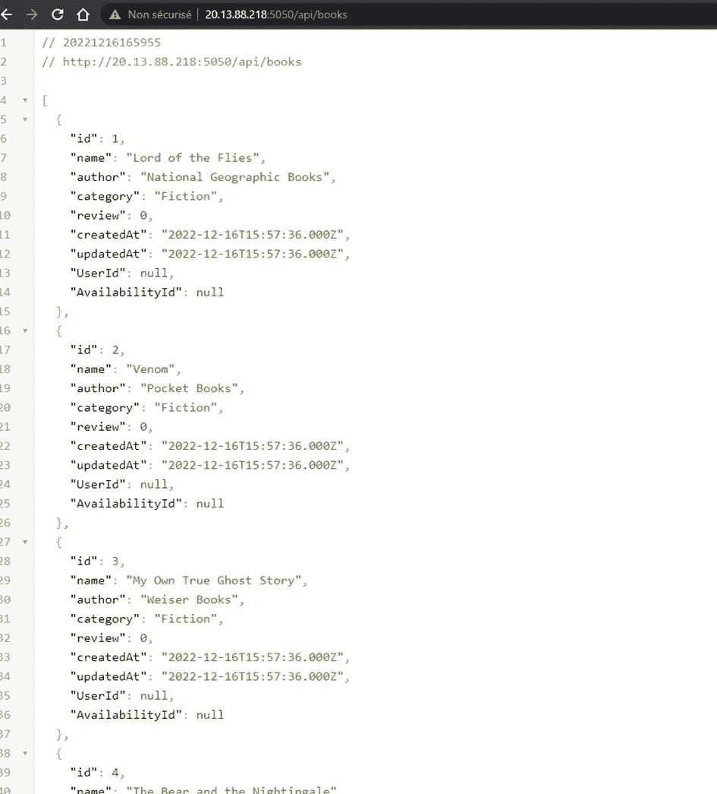

# 带有 Jenkins 和 Argo CD 的 CI/CD 管道

> 原文：<https://blog.devgenius.io/ci-cd-pipeline-with-jenkins-and-argo-cd-65b48f76b62a?source=collection_archive---------0----------------------->

## 概述:

你好，在这篇文章中，我们将从头开始构建一个 CI/CD 管道，我们将讨论其中的每个组件。

这是我们的管道:


## 詹金斯:


詹金斯

詹金斯是什么，它是用来做什么的？

Jenkins 是一个用 Java 编程语言编写的开源持续集成/持续交付和部署(CI/CD)自动化软件 DevOps 工具。它用于**实现 CI/CD 工作流，称为管道**。

## 管道:

让我们讨论一下什么是 CI/CD 管道。

持续集成和持续部署(CI/CD)管道是为了交付软件的新版本而必须执行的一系列步骤。CI/CD 管道是一种专注于通过自动化在整个软件开发生命周期中改进软件交付的实践。

**在 Windows 上安装詹金斯:**

要安装 Jenkins，我们直接进入其官方网站并下载。msi 文件，我们安装它:


现在是设置凭证的时候了。

**国书:**

要让 Jenkins 访问我的存储库，我需要为我的 github 帐户配置凭证:


此外，我必须将 azure 凭证配置到我的 azure 容器注册表，以便它可以将图像推送到那里:


**我的詹金斯文件:**

```
pipeline{
  agent any
  environment{
    AZURE_REPO='myprivaterepo.azurecr.io'
  }
  stages{
    stage("build image"){
      steps{
        sh "docker build -t myprivaterepo.azurecr.io/library-management-api ./api/" 
        echo "image built successfully"
      }     
    }
    stage("push image to ACR"){
      steps{
        echo "pushing to ACR stage"
        withCredentials([usernamePassword(credentialsId: 'azure-credentials', passwordVariable: 'PASS', usernameVariable: 'USER')]){
          sh "echo $PASS | docker login ${AZURE_REPO} --username $USER --password-stdin"
          sh "nslookup myprivaterepo.azurecr.io"
          sh "docker push myprivaterepo.azurecr.io/library-management-api"
        }
        echo "image pushed successfully to azure container registry"
      }
    }
  }
}
```

然后我得到了这个错误:


这个错误是通过将 sh.exe 添加到我的路径中解决的。

现在，我们的管道成功运行，它由分支提交触发，每次都重建 docker 映像并将其推送到 Azure 容器注册表:


## Azure MySQL 数据库:

我们所有的应用程序数据都保存在 Azure 数据库中。对于 MySQL 数据库，Azure 在特定条件下免费为我们提供这项服务:


我们创建灵活的服务器:


创建新数据库:


一切都准备好了。还有一点要说的是持续部署。

## 阿尔戈光盘:


阿尔戈光盘

Argo CD 是一个 Kubernetes-native 连续部署(CD)工具。与只支持基于推送的部署的外部 CD 工具不同，Argo CD 可以从 Git 存储库中提取更新的代码，并将其直接部署到 Kubernetes 资源中。它使开发人员能够在一个系统中管理基础架构配置和应用程序更新。

## 带有 Argo CD 的 GitOps:

GitOps 是一种软件工程实践，它使用 Git 存储库作为其唯一的事实来源。团队将声明性配置提交到 Git 中，这些配置用于创建持续交付过程所需的环境。不需要手动设置环境，也不需要使用独立的脚本——一切都是通过 Git 存储库定义的。

GitOps 过程的一个基本部分是拉请求。配置的新版本通过 pull request 引入，与 Git 存储库中的主分支合并，然后新版本被自动部署。Git 存储库包含所有变更的完整记录，包括流程每个阶段的所有环境细节。

我们建立了一个新项目，将它链接到我们的 git 存储库，并指定 k8s 清单的位置:


现在，我们可以看到我们的资源成功部署到 Azure Kubernetes 集群:


> 提醒一下，ArgoCD 安装在集群本身上，并作为负载平衡器类型的服务运行

## 测试:

测试我们的外部 api:


我们测试书籍是否已设置:



最后，我们检查用户:


当然，我们找不到它们，因为我们还没有添加。

总之，在本文中，我们了解了 pipelines 和 GitOps，部署 pipelines 和 GitOps 的方法以及所需的工具。

这有帮助吗？迷惑？如有疑问，欢迎在下方评论！如果你对类似的内容感兴趣，并想和我一起学习，一定要关注 Linkedin:[https://www.linkedin.com/in/malekzaag/](https://www.linkedin.com/in/malekzaag/)和 github:[https://github.com/Malek-Zaag](https://github.com/Malek-Zaag)！