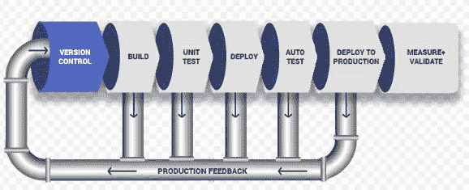
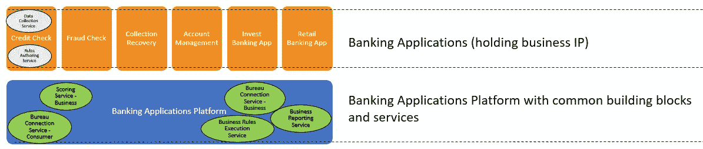
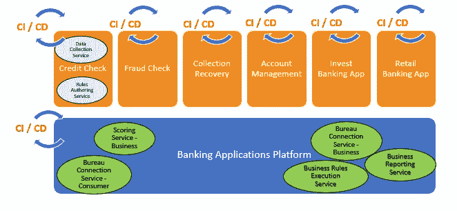
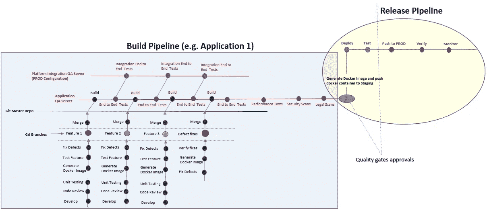

# CI / CD:实现软件交付管道

> 原文：<https://blog.devgenius.io/ci-cd-software-delivery-pipeline-774609db974f?source=collection_archive---------0----------------------->

CI / CD 管道

在这个行业呆得够久了，我们中的许多人都见过过去需要几个月甚至几年来开发、测试和安装软件的日子，现在只需点击几下鼠标就可以发布/移植软件了。自动化在这一转变中发挥了关键作用。CI / CD 概念在市场上广为人知。AWS、Azure 和 Google cloud 已经有了定义良好的步骤和工具，可以帮助你自动化完整的软件交付管道。此外，我们在市场上有许多其他工具/产品可以实现同样的目标。你只需要谷歌一下…但是我找不到足够的材料来帮助理解 CI / CD 管道在 SAAS 和 PAAS 产品的真实世界中的应用。

下面我们来看一下**用例**:

**托管在软件平台上的银行应用和服务产品套件，为银行及其客户提供端到端的生命周期服务**

**用例:托管在云银行平台上的银行应用**

银行应用程序平台提供通用构建模块和服务(如下所示),这些模块和服务只需开发一次，便可由多个银行应用程序使用

银行应用平台托管微服务和 API:例如

*   评分服务(x n)
*   库务局连接服务(x n)
*   业务规则执行服务
*   商业报告服务

每个银行应用程序都是一组微服务、组件/模块和 API，为银行保存业务知识产权。它提供支持银行业务生命周期所需的特定功能，并在内部使用银行应用平台提供的通用服务。

示例:信用检查的应用程序具有下列服务-

*   数据收集服务(服务呼叫中心和其他销售点)
*   业务规则创作服务(x n)
*   如此等等…

## **自动化交付渠道的高级策略:**

1.  使用交付管道中的作业和任务实现每个阶段的自动化

*   使用变量来概括自动化作业

2.为执行管道中的步骤定义单独的自动化作业/服务

*   单个作业可以根据未来模块/服务部署的变化进行更新

3.作业/序列的相关性:

*   定义和维护职务之间的相关性
*   允许按要求的顺序执行

4.回滚机制:

*   自动化作业/服务，以便在部署/测试期间出现任何问题时实现自动回滚
*   在微服务级别和应用程序级别启用回滚机制

5.通过 CI 流程的代码更改自动准备好进行部署(CD)

6.质量关(治理)在管道的每个阶段都得到实施

*   控制质量关批准的自动触发器

7.应用/微服务的容器化

*   通过管道推送 docker 映像进行部署
*   开发→质量保证→试运行→生产

8.数据库/文件系统迁移:

*   处理数据库/文件系统迁移的独立作业

9.考虑到连接到平台的多个下游应用程序，更改/增强需要向后兼容

10.使用 API 版本控制来支持突破性 API 变更的部署(API 变更不向后兼容)

*   在同一微服务中部署多个 API 版本
*   将旧版本和新版本部署为单独的微服务(直到客户完全迁移到新版本)

11.部署监控服务的单独作业

12.部署期间的高可用性，使用:

*   滚动更新
*   蓝绿色部署
*   金丝雀释放

**每个应用和软件平台的独立管道**

## C **连续输送管道:**

上述参考平台和应用程序的持续交付管道将由以下三个不同阶段组成:

**持续探索(CE) :** 应用团队不断迭代特性开发、增强和缺陷修复

*   定义、设计和架构
*   开发和单元测试

**持续集成(CI) :**

*   集成、构建
*   端到端测试
*   阶段

**持续部署(CD):**

*   部署
*   核实
*   班长
*   作出反应

## **管道的目标:**

1.  应用程序开发团队可以独立构建、测试和部署他们的服务/模块/应用程序
2.  应用/微服务可以独立部署，也可以通过持续部署一起部署
3.  每个应用程序团队都反复强调他们的市场需求以及开发和交付的优先级
4.  通过 CI 流程的代码更改自动准备好进行部署(CD)

## **软件交付管道:**

软件交付管道分为两部分——构建管道和发布管道:

**构建管道:**运行 CE 和 CI 来生成构建工件(容器映像)

**发布管道**:在产品中运行应用程序/微服务(容器映像)部署的 CD 流程

*为多个应用程序建立管道，根据需要集中发布管道*

**软件交付管道**

## 软件交付管道实施计划:

交付管道是针对每个应用/服务的构建、部署和测试的集成自动化

*   如用例中所述，每个应用都是一组微服务、API 和组件，为银行提供功能
*   应用程序拥有业务知识产权，并与银行平台集成以满足常见功能需求

请参考以下示例，了解一个应用程序的交付管道实施。同样，我们可以在可以并行运行的平台上为所有应用程序(x ^ n)构建管道

**软件交付管道**

1.  通过这种管道结构，应用团队可以根据需要单独或一起部署、迁移一组微服务

2.应用程序团队在构建管道上不断迭代，以生成构建工件(生产就绪容器映像)

*   一组工程师致力于特性开发(Git 分支)
*   生成 Docker 图像用于分支级别的测试
*   在合并到主文件(/ release branch)之前，在 Docker 映像(特性分支)上执行测试
*   在应用质量保证服务器上执行端到端测试、功能测试、非功能测试和平台集成测试

3.构建和发布管道只能针对特定的微服务/应用程序执行，或者针对一组微服务和应用程序一起执行

## C **输送管道中的部件:**

使用 Jenkins 管道执行构建和发布管道的完整流程:

*   自动化在 QA / INT 服务器上构建和部署代码的工作
*   自动化作业，为每个微服务/应用创建 docker 映像
*   自动化作业以跨环境推送 docker 映像 QA → INT → Staging → PROD
*   部署期间用于监视日志的监视作业
*   自动化作业以处理数据库/文件系统迁移
*   自动化安装所需监控工具(X 射线)的作业
*   定义按顺序执行的作业之间的依赖关系
*   在管道中跨阶段移动时自动触发质量审批
*   利用 Jenkins 主从配置同时执行任务和测试
*   将 AWS Lambda 用于(无服务器)测试执行和任务(可能)——以降低托管成本

## A **输送管道自动测试:**

*   为管道中的测试执行定义单独的自动化测试作业/服务
*   自动化测试和自动化框架与交付管道中所需的步骤相集成
*   数据迁移期间的自动检查与交付管道相集成
*   维护测试自动化工作中的模块性/分离性，这样测试中的任何更新/变更都可以很容易地被合并
*   自动化框架旨在利用(无服务器)AWS lambda 来降低执行周期的成本(使用无头浏览器执行)
*   自动化测试代码需要在 Git 中维护，以便进行版本控制，支持 PROD 版本和 PROD + 1 版本(运行中)
*   尽可能使用现货实例或车队实例，以降低成本

**测试类型&自动化工具:**下面列出了一些自动化工具的例子，这些工具可以在 pipeline 中与 Jenkins 插件一起使用和集成

*   朱尼特(TestNG)
*   API 自动化测试(定制构建)
*   UI 自动化测试(Selenium，BDD 框架)
*   数据迁移测试(定制版本)

安全测试:

*   静态安全扫描
*   容器漏洞扫描(浅绿色扫描)
*   动态安全扫描(Web 检查)
*   网络和应用层漏洞扫描(Qualys)

性能测试:

*   API 性能(JMeter)
*   用户界面性能(性能中心)

自动化作业的粒度、作业之间的相互依赖以及回滚策略在流水线设计中起着重要的作用。此外，支持应用程序架构和部署方法的未来更新也是关键。因此，管道需要易于修改和扩展，以满足未来的需求。没有最适合所有应用程序的通用设计，它会因应用程序/微服务体系结构和产品部署频率而异。

感谢您花时间阅读这篇文章，请随时发表您的评论。