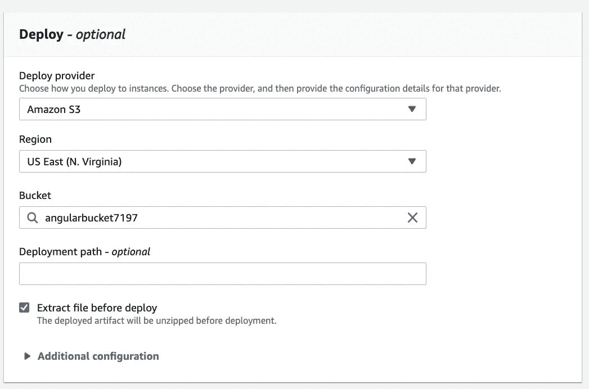

# 使用 GitHub 和 Angular 应用程序的带有 AWS 代码管道的 CI/CD

> 原文：<https://blog.devgenius.io/ci-cd-with-aws-codepipeline-using-github-and-an-angular-application-d8936782cca8?source=collection_archive---------2----------------------->


本指南将提供如何创建 AWS 代码管道的说明，以便为您的 Angular 应用程序自动化持续集成和持续交付。

*先决条件:*

*   GitHub 中的角度应用源代码
*   IAM 用户帐户

## **步骤 1:创建一个 S3 存储桶**

第一步是创建一个 S3 存储桶来托管您的应用程序。在 AWS 控制台中，点击服务并导航至 **S3** 。

*   点击**创建存储桶。**
*   输入一个**桶名**。这必须是独一无二的。
*   选择一个**区域**。这需要保持一致。
*   这将是一个静态网站，因此您需要取消选中**阻止所有公共访问**。检查确认当前设置。


*   铲斗的其余默认设置都很好。点击**创建桶**。

导航到您新创建的 S3 存储桶。点击**属性**。

*   滚动到静态网站托管。单击编辑。


*   启用静态网站托管。输入你的索引和错误文件。单击保存更改。


接下来，为您的 S3 存储桶单击**权限**选项卡。

*   点击存储桶策略部分下的**编辑**。
*   清除当前策略。输入以下内容:

```
{
    "Version": "2012-10-17",
    "Statement": [
        {
            "Sid": "PublicReadGetObject",
            "Effect": "Allow",
            "Principal": "*",
            "Action": [
                "s3:GetObject"
            ],
            "Resource": [
                "arn:aws:s3:::Bucket-Name/*"
            ]
        }
    ]
}
```

*   用您的铲斗名称替换**铲斗名称**。
*   点击**保存更改**。

## **步骤 2:创建代码构建项目**

你可以在 AWS 代码管道中完成这一步，但是，我发现提前创建它更简单。

在 AWS 控制台中，单击服务并导航到**代码构建**。

*   点击**创建构建项目**。
*   输入一个**项目名称**。

向下滚动到**信号源。**

*   选择 **GitHub** 作为您的**源提供商**。
*   选择**使用 OAuth** 连接，然后点击**连接 GitHub** 。输入您的 GitHub 凭据。
*   在我的 GitHub 帐户中选择存储库。
*   选择 GitHub 存储库。

向下滚动到**环境**。

*   选择**管理图像**。
*   选择您的**操作系统**偏好。本教程我选择了 Ubuntu。
*   选择**运行时**。标准是目前唯一可用的选项。
*   选择最新的**图像版本**。
*   选择 **Linux** 作为**环境类型**。
*   点击**新建服务角色**，允许 AWS 创建角色。


滚动到底部并点击**创建构建项目**。

接下来，通过点击 **Start build** 来测试您的项目。

如果成功了，您应该会在每个阶段旁边看到 success，如您的 **buildspec.yaml** 文件中所定义的。


## **第三步:创建代码管道**

在 AWS 控制台中，单击服务并导航到**代码管道**。

*   点击**创建管道**。
*   输入一个**管道名**。
*   点击**新建服务角色**。


*   点击下一个的**。**
*   选择 **GitHub(版本 2)** 作为**源提供者**。
*   如果这是你第一次连接你的 Github 账户，点击**连接 GitHub** 。否则，在下拉菜单中选择您现有的 GitHub 连接。
*   在你的 GitHub 账户中选择**库名**。
*   选择**分支名称**。


*   点击**下一步**。
*   选择 **AWS CodeBuild** 作为构建提供者。
*   为您之前在 CodeBuild 中完成的项目选择**项目名称**。


*   点击下一个的**。**
*   选择 **S3** 作为**部署提供者**。
*   选择您创建的 S3 存储桶。
*   在部署之前检查**提取文件。**



*   点击下一个的**。**
*   确认管道配置，然后点击**创建**。

当您的 GitHub 存储库中的代码发生更新时，它会被自动检测到，您的项目也会随之更新。