# 带 AWS 弹性豆茎的 CI/CD

> 原文：<https://blog.devgenius.io/ci-cd-with-aws-elasticsbeanstalk-and-travis-ci-6bdd40dbf748?source=collection_archive---------3----------------------->

这是一个关于如何使用一些 DevOps 原则设置 react 前端的演练，例如持续集成和持续部署 **CI/CD** 。在演练中，我们将利用诸如 **Docker** 、 **Travis-ci** 和 **AWS Elastic beanstalk** 等工具。这不会是对这些工具的深入探究，但是您仍然可以在没有任何经验的情况下学习。

**先决条件**

1.  使用 **git** 和 **GitHub** 的经验。

2.**特拉维斯-Ci** 账户。

3.**拥有管理员权限的 AWS** 账户。

在本演练中，我将使用运行命令**npx create-react-app****<my-app>时生成的默认 react-native 模板。**

# **步骤 1 —设置 AWS 弹性豆茎。**

从在 Elastic beanstalk 中创建一个新环境开始。从 **AWS 管理控制台**搜索弹性豆茎。**选择**创建一个新环境。选择环境层 **Web 服务器环境。**继续填写表格，添加**应用名称。**如下图，选择**对接**作为您要设置的**平台**。最后同样重要的是创造一个环境。

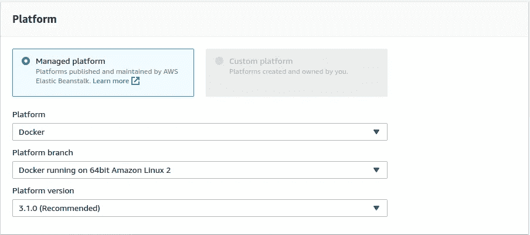

选择 Docker 作为平台

[**Elastic Beanstalk**](https://eu-west-2.console.aws.amazon.com/elasticbeanstalk/home?region=eu-west-2)然后会启动一个 S3 桶，里面有一个文件夹，里面会包含你所有设置为添加当前用户名的项目。同时，它将启动一个运行 Docker 和应用程序的 VM。

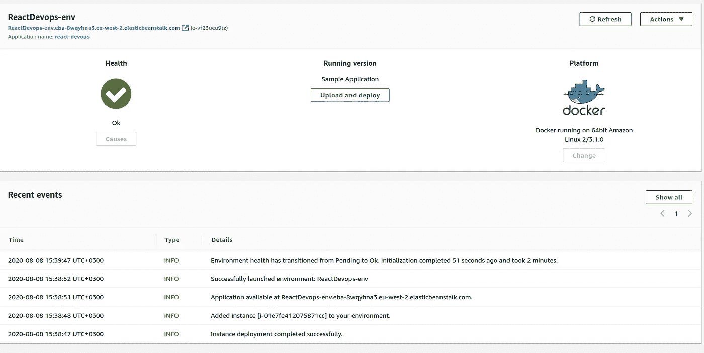

# **步骤 2 —** **设置 AWS IAM**

因为 Travis-ci 将用于将应用程序集成到要部署的 elastic beanstalk 中。我们必须给特拉维斯一些许可。为此，需要创建秘密密钥，Travis-ci 将使用这些密钥来验证和确认权限集。

从 **AWS 管理控制台**搜索 **IAM** (身份访问管理)您需要拥有管理员权限或至少拥有授予当前用户创建用户和分配策略权限的策略权限。

在 **IAM** 仪表盘中，选择左侧菜单上的**用户**。然后在顶部选择**添加用户。**另一个表格将提示您继续填写您想要的任何**用户名*** 并**选择 AWS 访问类型**作为**编程访问。**

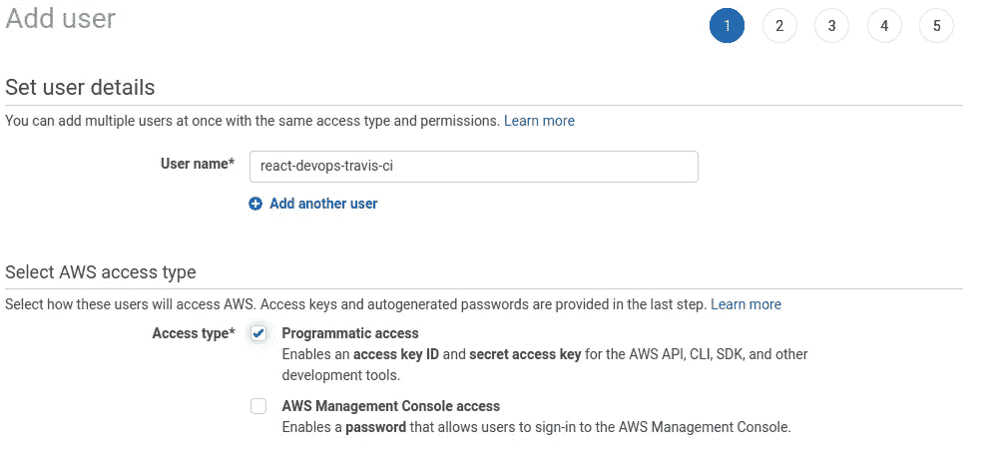

我们创建的用户需要能够向 elastic beanstalk 部署新的应用程序。为了实现这一点(1) **直接附加现有策略。**通过搜索过滤下面的列表(2)使用 **Elasticbeanstalk** 过滤策略(3)检查**AWSElasticBeanstalkFullAccess。**在我们的例子中，这将给予用户 Travis-ci 访问 elastic beanstalk 的完全权限。

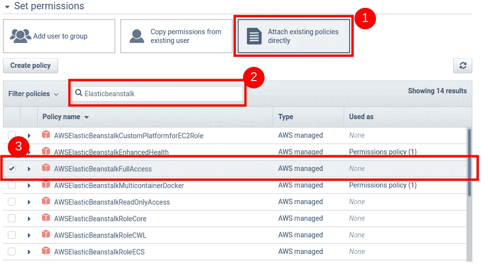

点击**下一步:标签，下一步:审核**，最后**创建用户**

在最后一部分，您将看到一条消息，告知成功。在那下面将会出现这个表格。这里重要的是**访问密钥 ID** 和**秘密访问密钥**。可以**下载。csv** 或**或**将两把钥匙(点击**显示**)复制到电脑上的文本文件中以备后用。

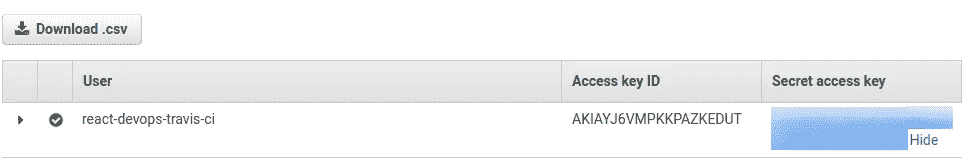

# **步骤 3 —创建 Github 存储库**

您需要创建一个存储库来保存您想要部署的应用程序的配置文件。在 **Github 中创建一个资源库。**如果您已经有了存储库，请跳过这一步。

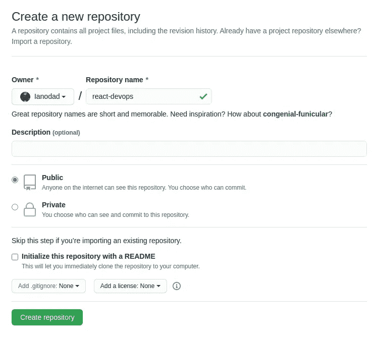

# **步骤 4 —设置 Travis-ci**

Travis 是连接 Github 存储库和 AWS 的代理。Travis 可以作为 CI 工具执行许多任务。在 Travis 中，您必须将 GitHub 存储库与 Travis-ci 同步。最好的方法是通过 Oauth 使用您的 GitHub 用户帐户创建一个帐户。

选择要添加到 Travis-ci 以进行观察的存储库。在右上角点击 profile，然后选择一个**设置。**如果您的帐户被同步，您将看到 GitHub 公共项目列表。为你创建的库名过滤项目。如果您没有看到您的存储库启动**同步帐户**

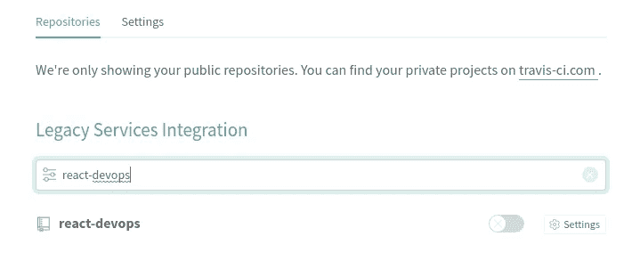

选择储存库，然后**激活储存库。**

在同一页面上**下的选项**比**设置多。**在设置仪表板中，您必须添加我们使用 **AWS IAM** 步骤 2 **创建的**密钥**。在环境变量**下，添加 **AWS_ACCESS_KEY 和 AWS_SECRET_KEY。**

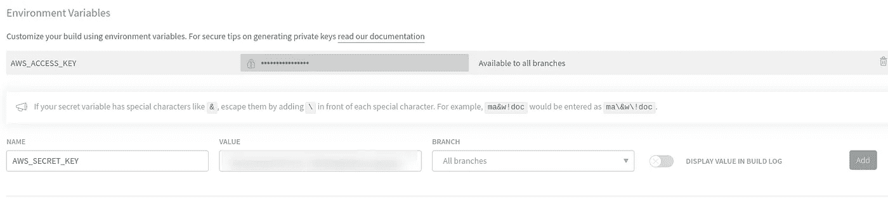

有许多方法可以用 react 设置 CI/CD。通过充分利用容器的可移植性和效率等优势，降低了自动化的复杂性。为此，将设置两个 **Dockerfiles** 。

# **步骤 5- Dockerfile 和 Travis config**

Dockerfile 是一个文本文档，它包含用户可以在命令行上调用的所有命令来组合一个图像。这是一个命令**声明式**。在某些生产版本中，您可以有一个 docker 文件，但这取决于您的设置和目标。出于本演练的目的，我们将有两个 **Dockerfile.dev** 和 **Dockerfile**

## **Dockerfile.dev**

这个文件将创建一个 Travis 将用来测试应用程序的环境。Docker 文件使用 **node: alpine** 作为基本映像，如果您熟悉 nodejs，您会看到最后一个命令将运行应用程序。这个 Dockerfile.dev 将运行应用程序用于**测试**目的。我就不赘述了，我假设你对 Docker 有一个简单的了解。

## **Dockerfile**

这个 Dockerfile 将由 AWS Elastic beanstalk 发起。这是应用程序的生产状态。这可以看出，因为我们构建使用**运行**运行 **npm 运行构建。**该文件将在端口 **80 通过 **Nginx** 构建并公开应用。**

**注意:**避免使用**节点:alpine-builder**和**Copy-from = build**否则弹性豆茎会出错。这将被视为两个论点。

## **.travis.yaml**

这是 Travis-ci 将用于测试和集成到 AWS 的主文件。Travis 将启动一个虚拟机，并使用管理员权限运行**Docker**(**sudo**)。 **before_install** 将使用 **Dockerfile.dev** 创建镜像测试。**部署**元数据将告诉 Travis 如何以及在哪里部署应用程序。Travis-ci 已经过预配置，可以部署到一些提供商，参见文档[https://docs.travis-ci.com/user/deployment](https://docs.travis-ci.com/user/deployment)。

所有这些信息都可以得到

**提供商—** 陈述目标提供商

**地区—** AWS 有许多地区，在本例中是**美国-西部-2-伦敦**

**app —** 您在 Elastic beanstalk 中设置的应用名称

**env —** 是环境的名称

**bucket _ name—**Elastic beanstalk 在 S3 有自己的文件夹，其中包含所有项目。

**bucket _ path—**bucket _ name 中包含应用文件的路径

**on: master —** 这将告诉 Travis 要触发建造哪个分支。

**access_key_id** —这个访问密钥是我们在步骤 2 中创建用户时在 AWS 中创建的。这个键将由 Travis 作为环境变量传递。

**secret_access_key —** 这是 Travis 将作为环境变量传递的最终密钥。

**最后**

一旦所有这些文件都被添加到应用程序的根目录中。将项目提交并推送到 GitHub。Travis 将启动并部署到 AWS Elastic beanstalk。然后，Elastic beanstalk 将部署 react 应用程序。您可以通过 Elastic Beanstalk 提供的 URL 访问该网站。

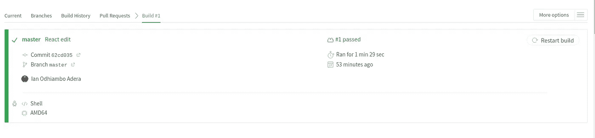

Travis-ci 中的状态显示

如果管道不成功，请检查日志中的错误。

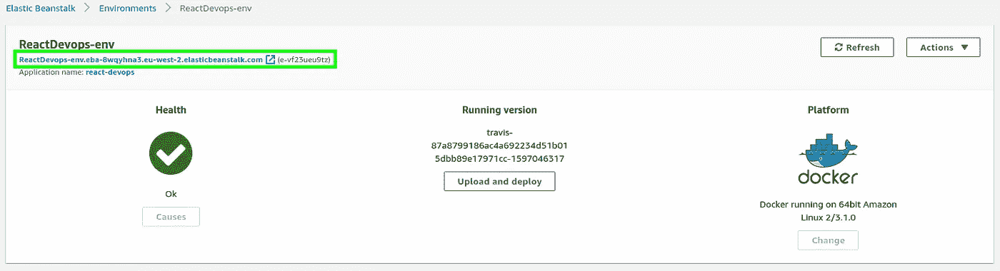

AWS 的状态

请注意右上角的链接，以查看新部署的网站。

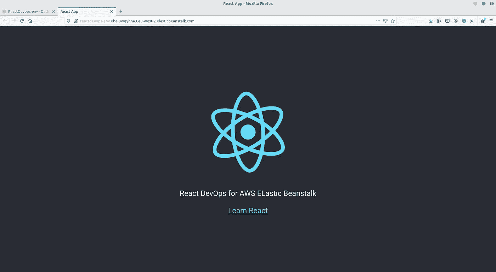