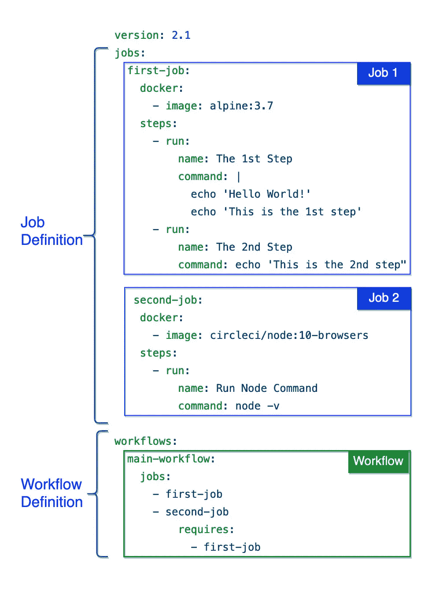
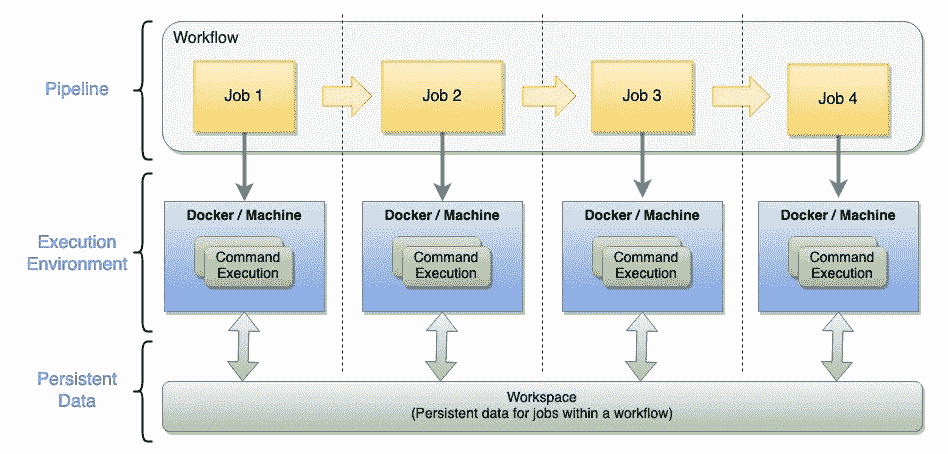
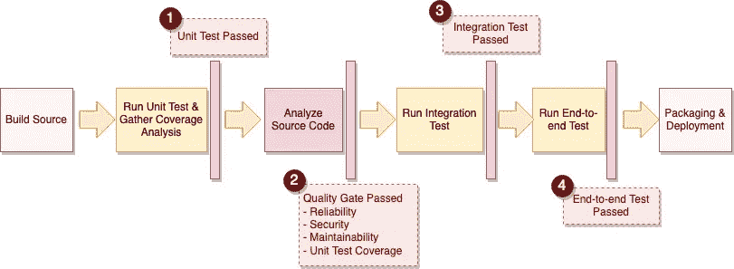
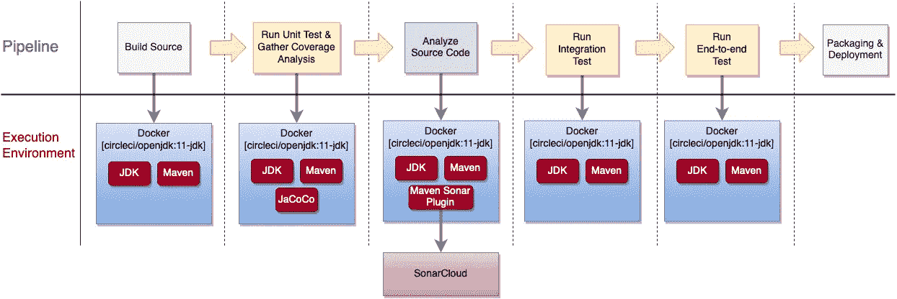
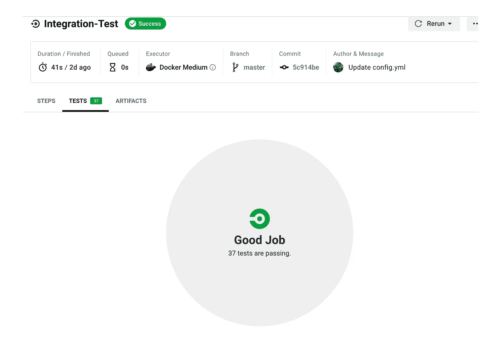
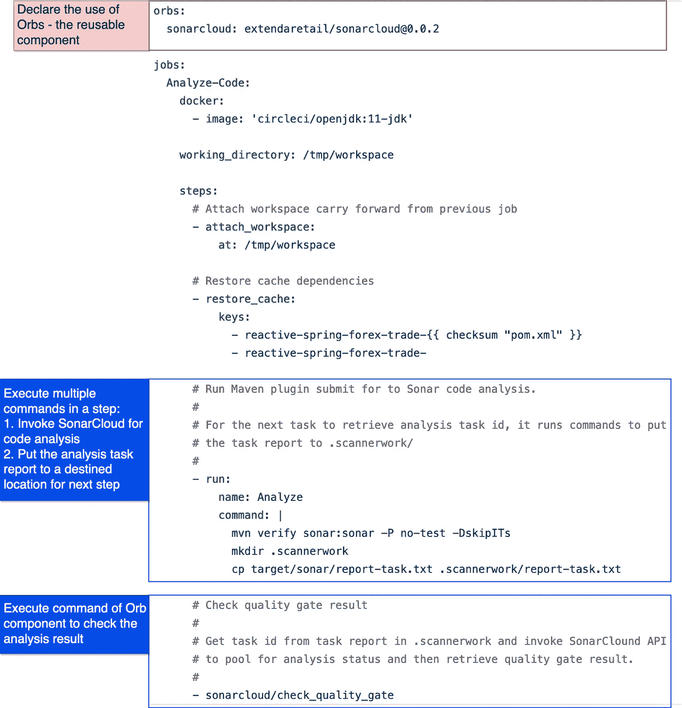
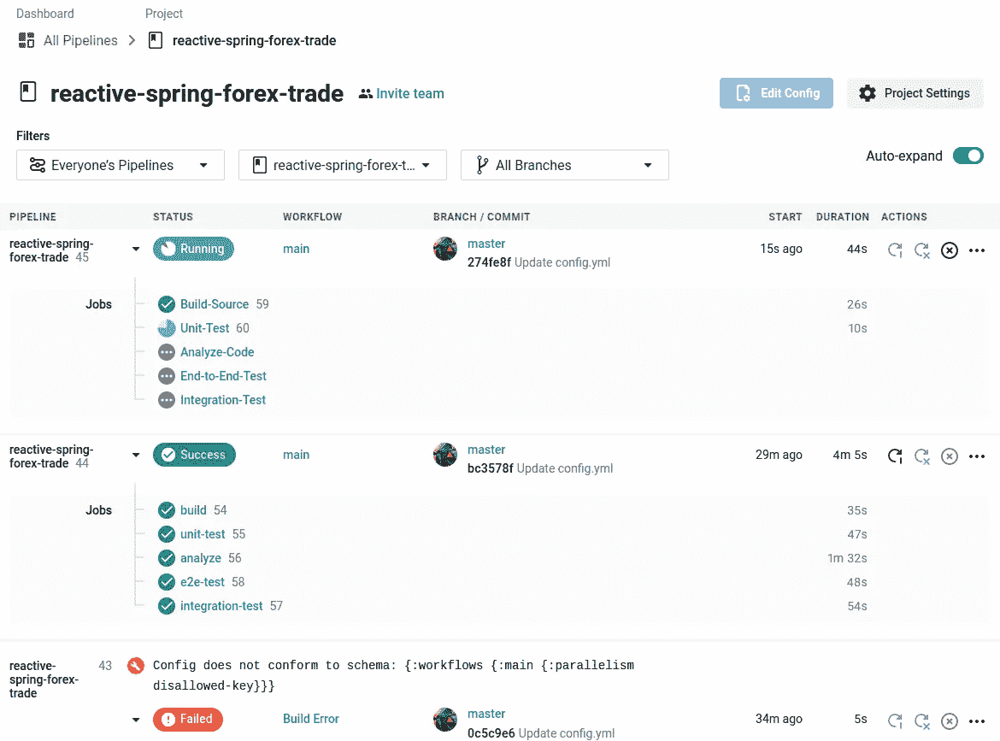
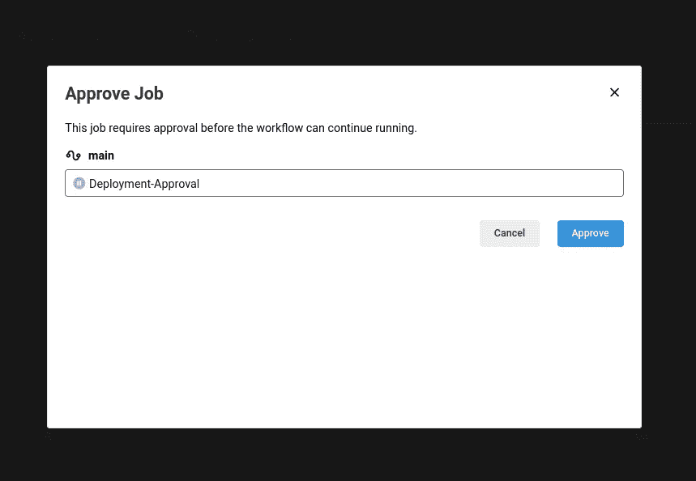
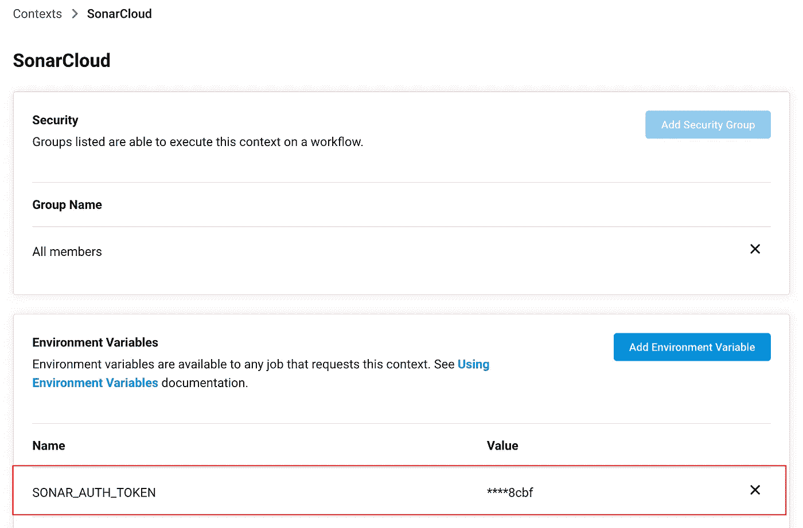
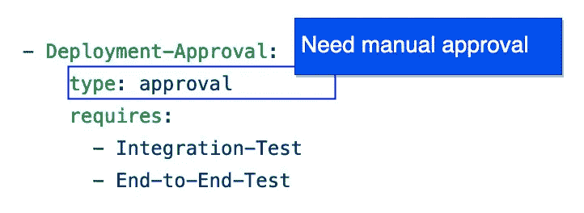

# circle ci——基于云的现代管道自动化平台

> 原文：<https://blog.devgenius.io/circleci-the-modern-cloud-based-platform-of-pipeline-automation-a5b293c9e171?source=collection_archive---------2----------------------->

## 云计算之旅从 Jenkins 到 CircleCI

哈利勒·易卜拉欣·切廷卡亚在 [Unsplash](/collections/45649460/modern-architecture?utm_source=unsplash&utm_medium=referral&utm_content=creditCopyText) 上拍摄的照片

软件工程师花在业务功能开发上的时间越多，交付给业务的价值就越多。事实是，构建新的功能和业务逻辑需要程序员保持高度专注，以便进行分析、设计、编码和测试。然而，现实是，他们被许多其他任务分散了注意力和占用了他们日常工作的大部分时间。这些都是软件开发的开销，比如那些用于系统构建和部署的重复而乏味的手动过程。因此，在过去的几年中，自动化是许多公司软件开发团队的基调。

CI/CD 管道无疑是 DevOps 支持的关键基础设施，因为它提供了自动化，并提供了允许开发和运营团队无缝合作的方法。Jenkins 是一个开源项目，是管道供应中最广泛采用的产品。它是免费的，成熟的，有强大社区支持的各种插件。虽然 Jenkins 是市场的主导者，但近年来出现了一些云平台，它们提供了出色的管道自动化服务。

CircleCI 是提供 CI/CD 管道即服务的流行平台之一。由于云计算的本质，它在易用性、效率和避免维护开销方面提供了无与伦比的优势。如果您正在寻找一种方法，使用 CircleCI 作为传统 Jenkins 管道的替代选项，如何快速设置自动化管道，那么这篇文章就是为您准备的。我将基于一个典型的 CI/CD 管道的例子来分享使用方法以及如何在 CircleCI 上创建管道。

# 什么是 CI/CD 管道？

首先，我们快速说一下管道的概念。下图展示了一个典型的工作流程——编译、代码分析、测试用例执行、打包和部署到目标环境。每一步都将涉及一系列的命令执行，这些任务可能是单调乏味和重复的，而且容易因人为错误而出错。因此，它是通过自动化整个流程来高效运行工作流的管道。

典型的 CI/CD 管道(我自己制作的图表)

# CircleCI 一览

CircleCI 是一个云平台，YAML 格式的管道声明性定义是您提供管道所需的全部内容。您的管道定义是完全自包含的，这意味着您可以运行您的工作流，而不用担心平台上的依赖插件或工具安装。此外，它利用 docker 映像的生态系统，您可以在指定的 docker 映像上运行作业，并访问映像中可用的任何工具。CircleCI 的管道设计涵盖了最常见的场景，它当然适合最典型的应用程序和团队结构。尽管如此，如果您的管道在复杂的企业环境中高度定制了特殊功能，Jenkins 仍然是一个合适的选择。

## 管道定义

CircleCI 的管道定义简单易懂。它采用 YAML 格式，这是一种人类可读的格式。该定义主要由两部分组成——作业和工作流。

下面这个简单的例子向您简要介绍了管道定义。本例中有两个作业-

*   ***作业 1*** —在 docker 镜像上运行 **alpine:3.7** 有 2 个执行 echo 命令的步骤
*   ***作业 2*** —在 docker 映像**circleci/Node:10-browsers**上运行，这是 circle ci 为带有节点 JS 的执行环境预先构建的映像。该命令只是为了获取节点 JS 版本。

然后，工作流定义将作业放在一起形成一个管道。工作流指定作业 2 依赖于作业 1，因此管道首先执行作业 1，然后执行作业 2。

CircleCI 管道定义(自己创建的图表)

## CircleCI 管道概述

基于流水线定义，CircleCI 启动单个 docker 容器或虚拟机来运行作业。该作业利用 docker 映像或 VM 映像附带的工具来执行命令，如 JDK、Maven、Node JS 等。换句话说，它通过使用预先配置了特定工具的映像，节省了工具安装和设置的工作量。因为每个作业都运行在一个单独的临时容器上，所以有一个持久数据存储的工具，这样同一管道中的所有作业将共享相同的上下文。

CircleCI 管道组件(自己制作的图表)

# 实施概述

## 关于示例管道

为了演示 CircleCI 管道设置，我将基于一个典型的管道，逐步演示如何在 CircleCI 中实现管道。这里的示例管道是一个强制实施质量控制的 Java 应用程序的构建过程。关于 Jenkins 的概念和实现细节，你可以参考我的分享:

 [## DevOps—使用 Jenkins CI/CD 管道进行软件质量控制

### Java 技术软件质量保证的基本技巧

medium.com](https://medium.com/dev-genius/devops-software-quality-control-using-jenkins-ci-cd-pipeline-373ade18d738) 

在本例中，在每一步结束时都实施了质量关，以确保在进入下一步之前满足特定的退出标准:

*   **单元测试** —所有的单元测试用例都应该通过。
*   **代码质量分析** —代码分析的总体结果应该通过一组预定义的质量属性，例如 bug 发现、代码发布数量、单元测试覆盖率等。
*   **集成测试** —所有的集成测试用例都应该通过。
*   **端到端测试** —所有端到端测试用例都应该通过。

具有质量关口的管道(我自己创建的图表)

## CircleCI 是如何工作的？

在 CircleCI 工作流程中，每个步骤将被定义为一个单独的作业。由于它是一个 Java 应用程序，管道作业被配置为在 docker image**circle ci/open jdk-11-JDK**上运行，为整个管道的构建过程提供 JDK 和 Maven。

Pipeline 调用外部服务— SonarCloud，这是 Sonarqube 的云平台版本，用于源代码扫描和分析。

对于测试覆盖分析和代码分析，Maven 将检索插件来完成工作，因此相同的 docker 映像足以运行这些工作。

CircleCI 管道中工具的使用(自己制作的图表)

# 管道的逐步演练

让我们看看 CircleCI 管道定义的实现细节。

## 1.构建源

CircleCI 作业定义及说明:

*   **签出 Git 存储库源代码**——第一步是从 Git 存储库签出源代码，内置命令“Checkout”可以为我们完成这项工作。
*   **依赖关系缓存** —在开始编译源代码之前，让我们通过下载并缓存所有依赖关系来加快流水线进程。它可以避免在后续作业中或在作业重新运行期间再次下载所有依赖项所需的时间。每个缓存都有一个相关的关键字，我们使用 Maven pom.xml 的校验和值作为关键字的一部分，以确定是否可以重用同一个缓存。如果 pom.xml 发生了变化，您可能已经添加或删除了依赖项。
*   **执行命令** —这一步运行 Maven 命令来编译源代码。
*   **持久化工作空间** —当您编译了源代码时，存储工作空间允许后续作业继续在其上工作。工作空间是所有作业在同一数据上下文中工作的缓冲区。

## 2.运行测试—单元测试/集成测试/端到端测试

CircleCI 作业定义及说明:

CircleCI 工作定义—集成测试(自己创建的图表)

*   **恢复工作区&缓存** —在源代码构建之后，测试用例执行的作业首先附加工作区，然后从缓存中恢复依赖关系。
*   **执行命令** —这一步运行 Maven 命令来运行测试。
*   **存储测试结果** —如果您想在 CircleCI UI 屏幕上查看测试摘要，那么您可以在测试执行完成后存储测试结果。
*   **持久化工作空间** —同样，存储工作空间用于下一步。

CircleCI 测试结果(在我的工作站上捕获的屏幕截图)

## 3.分析源代码

这一步将源代码提交给 SonarCloud，sonar cloud 是一个用于代码分析的云平台，然后等待分析结果。如果有主要的代码问题，新提交的代码就不能满足质量关。对于这种情况，管道应该触发警报并停止管道进程。

**Orbs — CircleCI 可重用组件**

与其他步骤类似，Maven 插件非常有用，因为它支持向 SonarCloud 提交源代码。但是，没有办法检索分析结果。幸运的是，有人开发了一个**orb**“extendaretail/sonar cloud”来轮询分析进程状态并获得分析结果。“Orb”是 CircleCI 中一组可重用的作业和命令。就像编程中的函数一样，您可以使用 orb 并简化管道定义。

要在管道中使用 orb，您需要声明它并在管道中调用它的作业或命令。由于本例中的**检查质量门**命令需要报告任务文件。scannerwork 文件夹，以便获得 SonarCloud 状态检查的任务 id，这样您就可以看到在执行 maven 命令后有命令复制报告任务文件。

# 将一切放在一起—工作流定义

有了作业定义，让我们把它们粘在一起形成一个工作流。您将学习如何定义具有以下特征的工作流:

*   **上下文注入** —将敏感信息作为环境变量注入管道。
*   **手动审批** —在进行下一步之前提示手动审批。
*   **作业执行顺序** —顺序并行运行作业的定义。

这是流水线流程——源代码编译、单元测试和代码分析一个接一个地执行。一旦代码分析通过，集成测试和端到端测试都会被触发，它们将并行运行，以加速测试的执行。最后，在进行部署之前，需要进行人工批准。

CircleCI 工作流程(自己创建的图表)

## CircleCI 管道投入使用

这是 CircleCI 管道概述，它显示了当前和历史管道执行。

CircleCI 管道概述(在我的工作站上截取的屏幕截图)

集成测试和端到端测试是并行执行的，因为它们只依赖于代码分析工作。一旦这两项都完成，pipeline 状态将变为“暂挂”并等待人工批准。

CircleCI Pipeline —等待批准(在我的工作站上捕获的屏幕截图)

批准人可以点击工作，然后提供批准。

CircleCI Pipeline 批准屏幕(在我的工作站上捕获的屏幕截图)

一旦获得批准，管道将继续 rest 过程。

CircleCI 管道-批准的流程(在我的工作站上捕捉的屏幕截图)

## 上下文注入

SonarCloud 需要一个身份验证令牌来访问代码分析结果。我们应该把认证令牌放在哪里？出于安全考虑，我们绝不应该将这种敏感信息以纯文本格式放在管道定义中。CircleCI 为我们提供了一种在组织环境中定义凭证的方法，它会在管道执行期间自动将敏感信息作为环境变量注入。

CircleCI 组织环境(在我的工作站上捕获的屏幕截图)

在工作流定义中，您可以简单地将作业链接到类似于以下定义的上下文:

CircleCI 工作流—带上下文的作业(我自己创建的图表)

## 人工批准

如果您需要某人在某个时候手动给予同意，以便继续管道流程，那么您可以将类型属性设置为“批准”

循环工作流—工作需要批准(我自己创建的图表)

## 作业执行顺序

使用“requires”属性指定作业依赖关系。CircleCI 会在所有必需的作业完成后启动作业。您可以参考下面的示例，该示例演示了并行运行作业的场景以及多个作业的相关性。

CircleCI 工作流程—作业执行顺序(自己创建的图表)

# 最后的想法

CircleCI 是一个强大的工具，因为它提供了一种快速的方式来建立一个自动化的管道，用于云平台中的持续集成。此外，使用 docker 映像作为作业执行环境使得工具的使用更加灵活，而不会影响环境的安装和维护。虽然 CircleCI 的工作流设计支持大多数场景，但它不能完全取代 Jenkins，因为某些用例有特定的管道要求，需要高度定制的流程。然而，如果你想建立一个新的管道或寻找一种方法来降低现有管道的维护成本，CircleCI 是值得探索的。

## GitHub 知识库

如果您想详细研究示例实现，这里是带有 CircleCI 管道配置的示例应用程序的 Git 存储库

 [## gavinklfong/无功-弹簧-外汇-贸易

### 创建这个库的目的是展示 Spring framework 的主流非阻塞技术…

github.com](https://github.com/gavinklfong/reactive-spring-forex-trade)