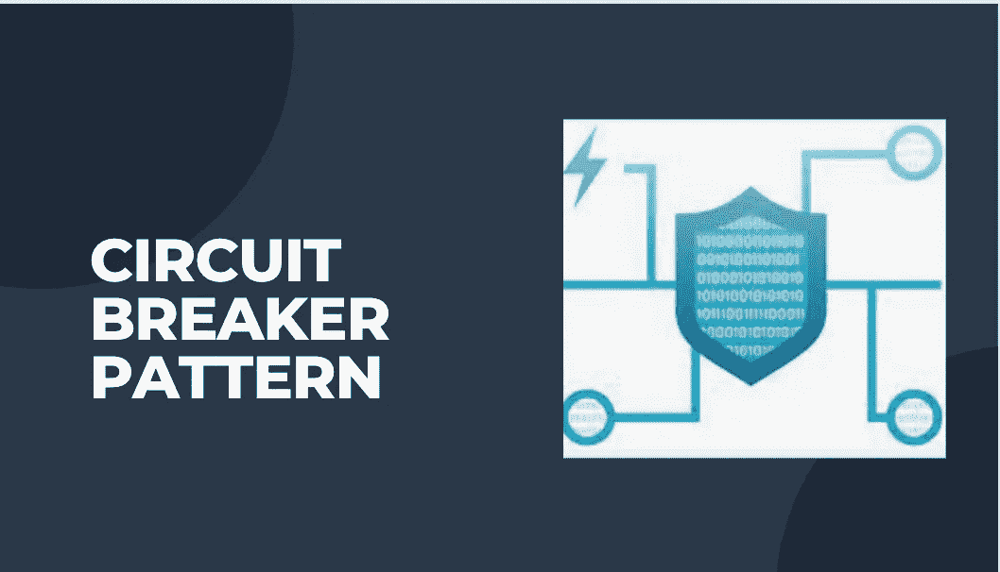
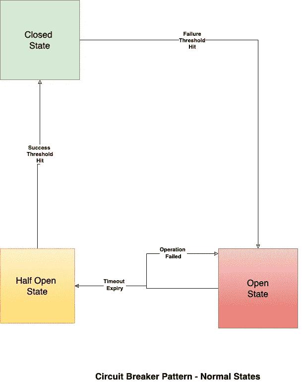

# 断路器模式 101

> 原文：<https://blog.devgenius.io/circuit-breaker-pattern-101-be2d7fdb656?source=collection_archive---------6----------------------->

本博客是《归零地》(Ground Zero)系列文章的一部分，内容是为起步知识有限的读者讨论 101 个概念。本文来自 ***中级*** 系列，因为涉及对**优先级队列**的理解，主要用于根据租户/业务用例处理不同优先级的异步消息。

101 系列的一些早期博客如下:

[**优先级队列 101**](/priority-queues-101-40eb4f6f5ee9)[API 101](/api-101-773ec501b485)[**T21【异步通信】101**](/async-communication-101-b04d5c95333a) **[数据库 101](/database-101-13d593ec4078)**[**数据库设计 101**](/database-design-101-7c019d69b97f)

# 什么是断路器？

断路器是分布式系统中使用的一种设计模式，用于防止某个应用程序层的非暂时性故障阻塞应用程序层次结构中其他层的资源。非瞬时故障事件，如*维护、网络连接缓慢、超时等*，可持续导致远程呼叫终止而没有预期的响应，是实施断路器的理想情况。非对称重试模式，用于短暂故障的情况，其中客户端进行连续调用(有/没有 [**指数回退**](https://en.wikipedia.org/wiki/Exponential_backoff) **) *、*** 此模式对于在**多租户**平台架构的情况下防止 [**拒绝服务**](https://en.wikipedia.org/wiki/Denial-of-service_attack) 场景至关重要。通过打开长期故障电路来解除资源阻塞，有助于优化系统资源，如*内存、线程、数据库连接*，从而防止下游系统出现任何进一步的故障。

# 结束 2 结束流程

断路器通常被实现为应用程序代理，其监控远程调用故障，然后允许*后续操作/动作*。代理通常被配置为作为简单的状态机运行，如下所示—

## **关闭状态**

*   在关闭状态下，所有对下游服务的远程调用都像预期的那样被允许。代理对故障/异常的发生进行计数，并且一旦达到某个阈值，状态就变为打开状态。

## **打开状态**

*   在开放状态下，所有远程调用都会间歇性地失败，并出现预定义的异常，所有对下游的调用都会被阻塞，直到设置的超时过期。超时期满后，电路进入半开状态。

## **半开状态**

*   在半开状态下，电路允许一定比例的对下游微服务的远程调用。在进一步故障的情况下，电路返回到开路状态，并且如果达到成功阈值，电路返回到健康闭合状态。

# 用例

*   **多租户—** 大型系统，其中下游平台服务(如身份、认证等)跨多个业务领域共享。
*   **单租户—** 同一个租户内的微服务在更严格的*性能和可用性*方面具有高可见性，因此电路有助于维持所需的端到端 SLA。

# 优势

*   这种模式的主要目标是隔离**单点故障**级联成大型分布式故障，影响多个微服务的整个业务域的整体可用性。
*   优化系统资源( ***线程、内存、CPU 等*** )，减少不必要的退休和暂时故障时的消耗。
*   屏蔽受影响的下游系统，并通过避免故障状态下的流量，帮助减少总体**平均恢复时间(MTTR)** 。

# 摘要

我们讨论了**断路器**设计模式的基础，这种模式在具有高可用性和毫秒级性能 SLA 的分布式系统中很流行。**网飞**通过其开源库[**Hystrix**](https://github.com/Netflix/Hystrix/wiki/How-it-Works)**解决了客户在他们端实现的一些重大集成需求。后来，Hystrix 被弃用，被一个 Spring 库取代。**

**我们将在未来的 **Advanced** 博客中用一个代码例子来讨论这个库的工作，以解决一个实际的用例。**

***如需反馈，请留言至****Amit[dot]894[at]Gmail[dot]com****或联系*[*https://about.me/amit_raj*](https://about.me/amit_raj)*的任何链接。***