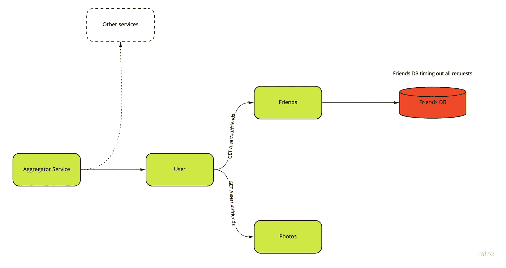
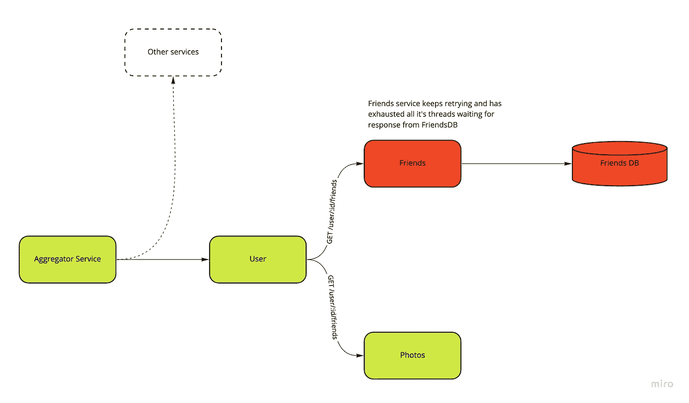
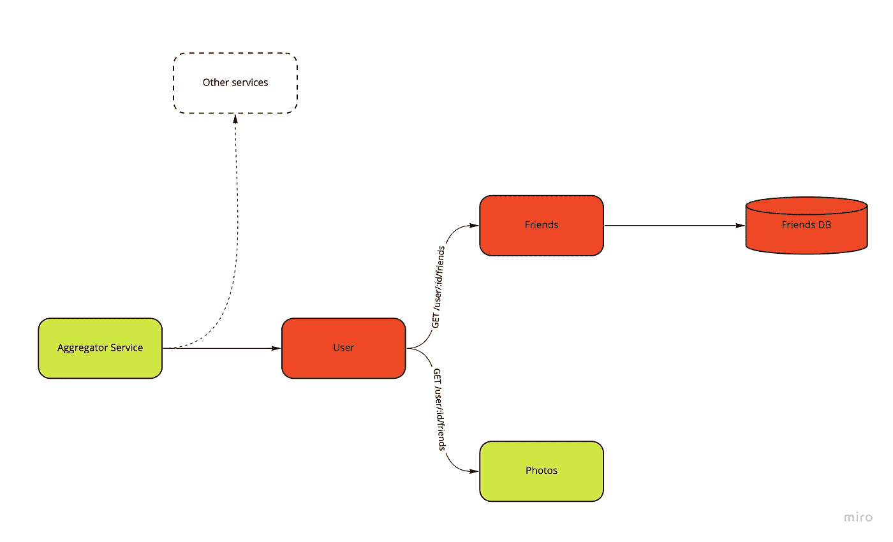
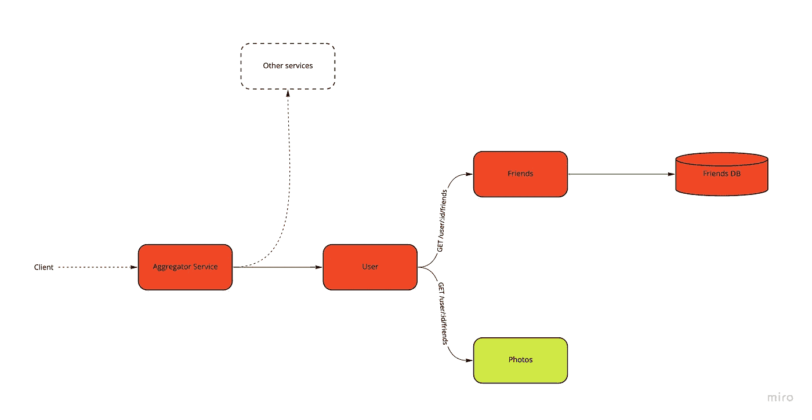
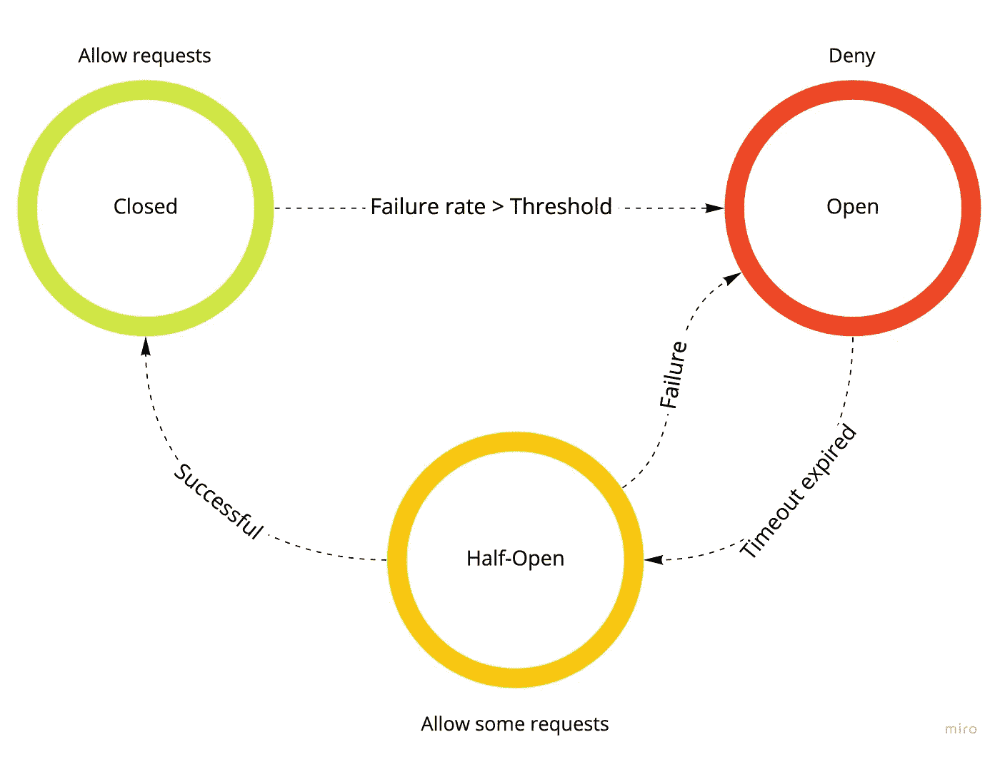

# 微服务中的断路器

> 原文：<https://blog.devgenius.io/circuit-breakers-in-microservices-625654df0830?source=collection_archive---------2----------------------->


照片由 [Fotis Fotopoulos](https://unsplash.com/@ffstop?utm_source=medium&utm_medium=referral) 在 [Unsplash](https://unsplash.com?utm_source=medium&utm_medium=referral) 上拍摄

[断路器](https://en.wikipedia.org/wiki/Circuit_breaker_design_pattern#:~:text=Circuit%20breaker%20is%20a%20design,failure%20or%20unexpected%20system%20difficulties.)是一种设计模式，广泛用于分布式系统中，以防止级联故障。在本帖中，我们将讨论级联故障的问题，并回顾断路器模式是如何使用的。

# 动机:级联故障的问题

在进入断路器模式之前，让我们试着理解它试图解决什么问题。
当服务 A 试图与服务 B 通信时，它会分配一个线程来进行调用。打电话时可能会出现两种故障。我们使用一个`user`服务调用`friends`服务的例子。

```
''' user service ''' 
def get_user_info(user_id: str):  
    try:    
        friends_service.get_friends(user_id)  
    except Exception as e:    
        raise InternalServerError
```

**立即失败**:在立即失败中，会立即引发一个异常(比如:连接被拒绝)并释放服务 A 线程。

**超时失败**:如果 service_b 需要很长时间来响应，当我们收到服务 A 的新请求时，我们会有越来越多的线程等待 service_b。如果在等待超时时发出几个请求，这可能会耗尽服务 A 的线程池，并使服务 A 停止运行。

> 你的代码不能永远等待一个可能永远不会出现的响应，迟早，它需要放弃。希望不是一种设计方法。“——迈克尔·t·尼加德，释放它！

让我们通过一个社交媒体应用程序的例子来更好地理解这一点。这里我们有一个`aggregator`服务，它是客户端与之交互的对象，它聚集了包括`user`服务在内的一系列服务的结果。`User`服务调用`photo`服务，`friends`服务又调用`friends_db`。



在这里，friends 服务试图向 friends_db 发出请求，但是，friends_db 并没有立即失败，而是让来自“friends”服务的线程等待。朋友服务尝试重试，从而使用更多的线程。当它收到新的请求时，更多的线程等待 friends_db 响应。



我们现在可以看到朋友服务是如何成为用户服务超时的来源的。用户服务耗尽它的线程池等待来自朋友服务的请求，就像朋友服务等待 friends_db 一样。我们现在可以看到 friends_db 中的故障是如何导致间接依赖它的服务中的*级联故障*的。



最终，聚合器服务也会因为同样的原因而关闭。客户端调用聚合器服务，因此我们的系统对于用户来说是有效关闭的。我们看到我们架构中一个组件的一个错误如何导致级联故障，使所有其他服务停止。



# 断路器模式

断路器通常被实现为[拦截器模式](https://en.wikipedia.org/wiki/Interceptor_pattern)/责任链/过滤器。它由 3 个状态组成:

*   Closed:允许所有请求传递给上游服务，拦截器将上游服务的响应传递给调用者。
*   Open:不允许将任何请求传递给上游响应和拦截器响应，默认响应通常是错误响应。
*   半开:一些请求被允许传递给上游，其他请求被终止并以默认响应响应。



下图显示了断路器拦截器的三种状态


让我们看一个关于断路器的 Python 例子。您可以使用以下工具创建自己的断路器:

```
from circuitbreaker import CircuitBreakerclass MyCircuitBreaker(CircuitBreaker):
    FAILURE_THRESHOLD = 20
    RECOVERY_TIMEOUT = 60
    EXPECTED_EXCEPTION = RequestException@MyCircuitBreaker()
def get_user_info(user_id):
  try:
    friends_service.get_friends(user_id)
  except Exception as e:
    raise InternalServerError
```

我们也可以利用边车模式来实现这一点。在这种方法中，我们不必通过包装断路器来修改我们的服务，相反，我们用像[特使](https://www.envoyproxy.io/)这样的边车来运送我们的应用程序。该服务的所有出站流量都是通过 envoy 代理的。特使支持打破常规。以下是使用 Envoy 断开电路的配置示例:

```
circuit_breakers:
  thresholds:
    - priority: DEFAULT
      max_connections: 1000
      max_requests: 1000
    - priority: HIGH
      max_connections: 2000
      max_requests: 2000
```

原贴:[http://iyer.ai/circuit-breakers-in-microservices/](http://iyer.ai/circuit-breakers-in-microservices/)

感谢尼尚·甘地的投入。

# 资源

*   [http://martinfowler.com/bliki/CircuitBreaker.html](http://martinfowler.com/bliki/CircuitBreaker.html)
*   [https://pypi.org/project/circuitbreaker/](https://pypi.org/project/circuitbreaker/)
*   [https://books.google.com/books/about/Release_It.html?发布它(书)id = ug 9 qdwaaqbaj&source = KP _ book _ description](https://books.google.com/books/about/Release_It.html?id=Ug9QDwAAQBAJ&source=kp_book_description)
*   特使断路:[https://www.envoyproxy.io/learn/circuit-breaking](https://www.envoyproxy.io/learn/circuit-breaking)