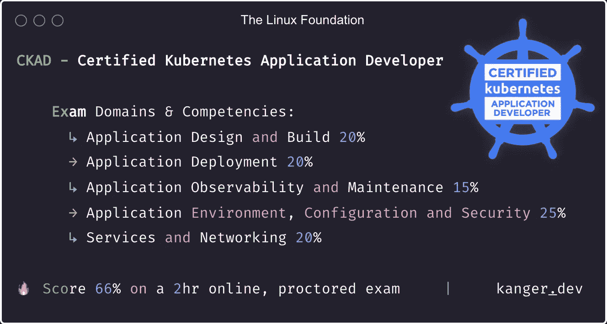
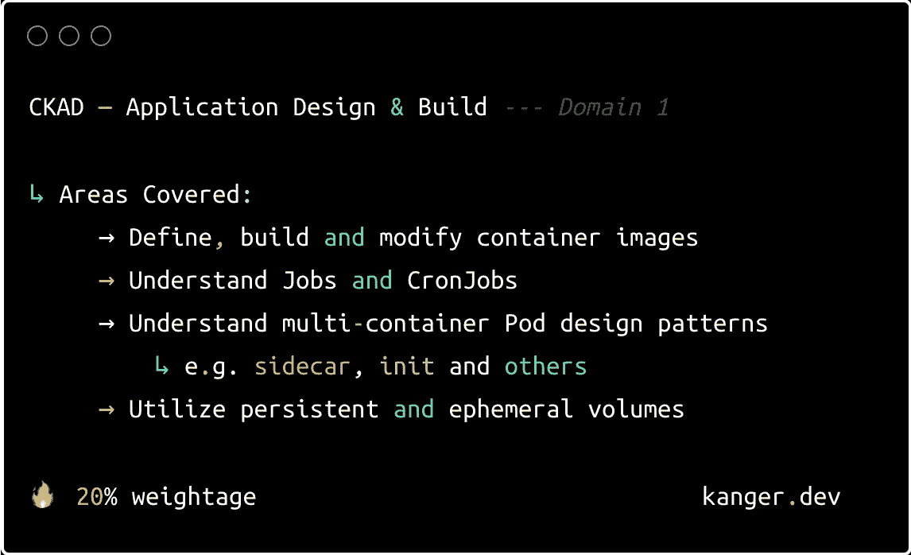
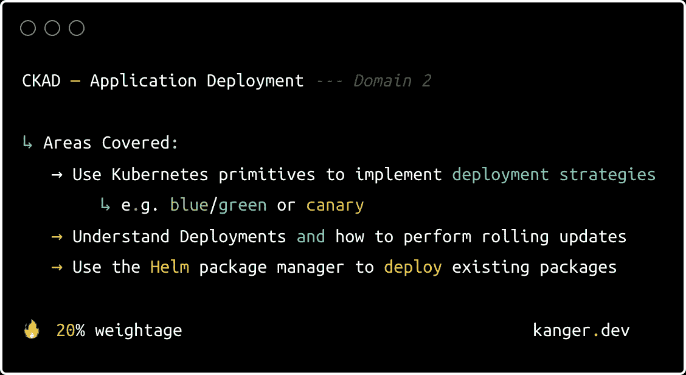
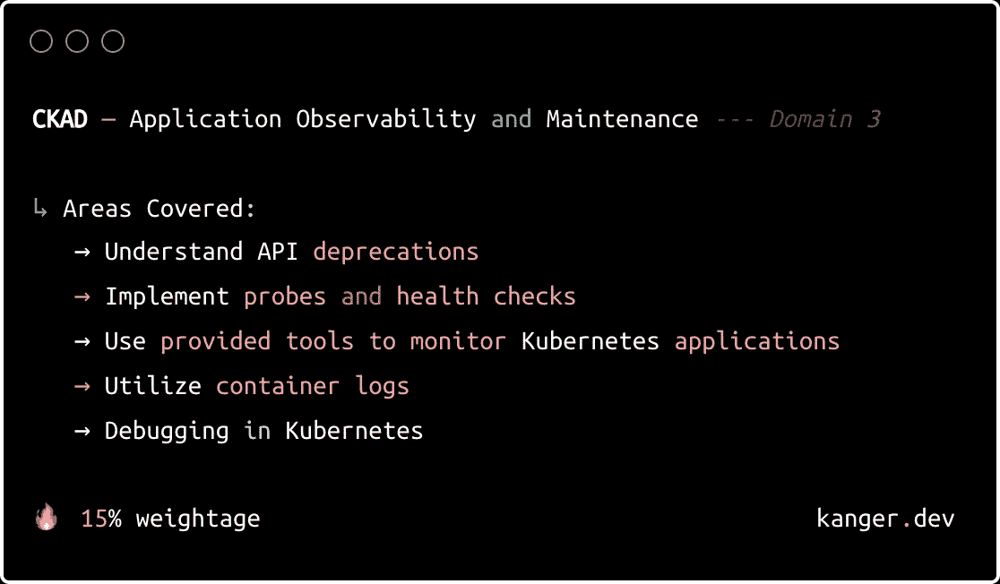
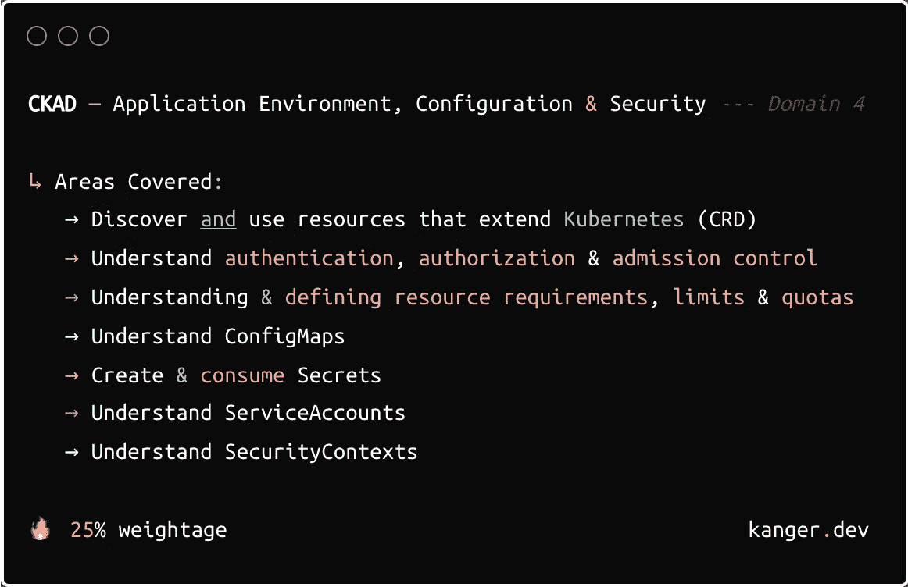
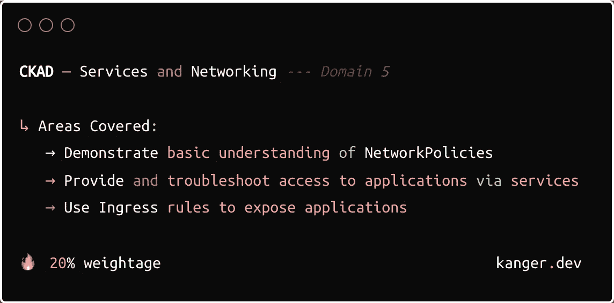

# 新的 CKAD 考试指南——面向开发人员的 Kubernetes

> 原文：<https://blog.devgenius.io/ckad-exam-guide-kubernetes-developers-b228eed83ee5?source=collection_archive---------13----------------------->

kubernetes——知识渊博的应用程序开发人员——CKADs 获得了大量的经济利益。

**来源**:新 [CKAD 指南](https://kanger.dev/new-ckad-exam-guide-certified-kubernetes-application-developer/)

作为历史上速度最快的开源项目之一，Kubernetes 已经席卷了技术经济——这种经济转变已经从 DevOps、SysAdmin、软件开发、信息安全和其他云原生空间等领域爆发出来。

无论您是该领域的新手还是经验丰富的开发人员，获得 CKAD 都可以帮助您建立云原生职业生涯，并为您更深入地了解 Kubernetes 提供的许多技术机会做好准备。该证书有助于组织招募和留住具有技术技能、知识和能力的开源人才，以履行 Kubernetes 应用程序开发人员的职责。

认证 Kubernetes 应用程序开发人员计划旨在让开发人员在竞争激烈的就业市场中验证他们的能力和可信度。CKADs 可以定义应用程序资源，并使用核心原语为 Kubernetes 设计、构建和部署云原生应用程序。

当谈到规划您的 [Kubernetes 认证](https://kanger.dev/kubernetes-certification-training-paths/)路径(CKAD)时，您有很多要考虑的——从培训课程到越来越重要的考虑事项，如实践实验室、构建 Kubernetes 集群、部署容器化应用程序等等。

好消息是，这份学习指南**直截了当**切中要害，旨在帮助你为 CKAD 考试做好充分准备，掌握所有必需的资源。请继续阅读，了解你需要学习的内容。

> *我们假设你是一名开发人员。你有最喜欢的编程语言、编辑器/IDE，还有一些开发应用程序的经验。*

# CKAD 考试-必备条件和资源

在 CNCF 的指南中，CKAD 考试的特点是多种形式的结合。考试实验问题/场景是基于问题的，包括一组基于性能的任务，这些任务将在与最新 K8s 次要版本一致的实际操作命令行环境中解决。

*   在线监考考试
*   Kubernetes v1.25 合并器

> [**认证 Kubernetes 应用开发者**](https://kngr.me/ckad) —考试报名

## CKAD 先决条件

CKAD 考试需要容器运行时和微服务架构的基础知识。你应该有:

*   Linux 的基本舒适性
*   YAML/JSON 知识
*   VIM 编辑器
*   基本码头工人知识(不低水平)

## CKAD 考试准备资源

无论您是对参加付费培训课程感兴趣，还是对开始参加免费培训感兴趣，以下资源都将帮助您展示自己在 CKAD 考试各个领域的专业技能:

## —培训资源

最好先回顾一下培训内容，这样对你报名参加的项目就更清楚了。这里有几个全面严谨的动手培训资源，可以帮助你入门。

↳ **培训课程**

*   [Kubernetes 应用开发者](https://kngr.me/ckad1)—Linux 基金会
*   [CKAD 培训课程](https://kngr.me/ckad2)—kode cloud
*   [CKAD 视频课程](https://kngr.me/ckad4) — Whizlabs

↳ **直播项目**

*   [Kubernetes 部署应用](https://kngr.me/ckad5)
*   [幸存的 Kubernetes 部署](https://kngr.me/ckad6)

↳ **书籍**

*   [Kubernetes 在行动](https://kngr.me/ckad7) (2022 年更新)
*   [面向开发者的 Kubernetes](https://kngr.me/ckad8)(2022 年更新)

> 在注册一门课程或者为这门课程付费之前，看看它在学生中是否成功。然而，如果你觉得作为一个初学者，你可能会遇到一些障碍来打断你的努力，那么可以考虑 KodeKloud 的 [*CKAD 学习计划*](https://kngr.me/ckad2)*——它包括一系列精心设计的讲座，其中包含综合的动手实验经验、编码测验和插图，可以帮助你理解复杂的概念，而不必自己建立任何实验室环境。*

## —实践资源

学习和实践是关键，通过两者都努力，你可以更快地取得成功。这些资源有助于拓展你的技能。

↳ **实践实验室**

对于喜欢边做边学的人来说，这是一个很好的方法，它的实践环境被设计成模拟真实的职业场景。

*   [Killercoda](https://killercoda.com/killer-shell-ckad) —面向 Kubernetes 应用开发者的交互场景
*   [Minikube](https://kubernetes.io/docs/tutorials/hello-minikube/)——关于如何使用 minikube & Katacoda 运行示例应用程序的教程
*   [玩 Kubernetes](https://labs.play-with-k8s.com/) —学习 Kubernetes 的互动游乐场
*   [玩转 Kubernetes 课堂](https://training.play-with-kubernetes.com/)—Docker 举办的 Kubernetes 实践研讨会
*   [kode Cloud 游乐场](https://kngr.me/kodekloud-playgrounds) — DevOps 游乐场& Cloud 游乐场
*   [Killer.sh](https://killer.sh/) —考试环境

↳ **云信用**

随着几乎所有主要云提供商都提供托管 Kubernetes 托管服务，多云和混合云策略的采用率持续上升。使用 Kubernetes 托管服务和免费计算积分可以让您有效地练习，避免潜在的麻烦。以下是一些最好的云平台，它们提供免费积分来获得实践经验。

*   [数字海洋管理的 Kubernetes](https://kngr.me/k8-digitalocean)——200 美元信用
*   [Linode Kubernetes 集群部署](https://kngr.me/linode)——100 美元信用
*   [Vultr Kubernetes 引擎](https://kngr.me/vultr)——100 美元信用
*   谷歌 Kubernetes 引擎——300 美元信用
*   Azure Kubernetes 服务——200 美元信用
*   [亚马逊弹性 Kubernetes 服务](https://aws.amazon.com/eks/) —免费等级或 300 美元 [AWS 概念验证计划](https://pages.awscloud.com/adoptf90d_GLOBAL_POC-credits)
*   面向 Kubernetes 的阿里云容器服务 —免费试用

社区论坛、活动、博客和播客(链接)等更多资源几乎都在本文的末尾。

> 提示:不要依赖考试垃圾和免费资源。

# CKAD——开源课程

开源考试课程包括以下领域。

## 应用程序设计和构建— 20%

在设计和构建应用程序时，许多需求会影响模式和架构。使用 Kubernetes，最强大的因素之一是水平扩展的能力— [水平 pod 自动扩展](https://kubernetes.io/docs/tasks/run-application/horizontal-pod-autoscale/)，增加并行运行的应用程序的相同副本的数量，从而通过分配负载来提高可用性。

该领域的重点是测试您创建小型、可组合的应用程序的能力，这些应用程序通过定义良好的 API 在网络上进行通信。

设计和构建具有可伸缩性、可移植性和健壮性的应用程序具有挑战性，尤其是随着系统复杂性的增长。让您的功能知识渗透到云原生原则中，并了解微服务架构和设计模式如何很好地用于可扩展部署的概念。

## 应用程序部署— 20%

将您的应用程序部署到生产环境意味着您将它公开给最终用户。一旦我们有了一个正在运行的 Kubernetes 集群，我们就可以在其上部署容器化的应用程序。

该领域还需要一个陡峭的学习曲线，以了解如何实现成功部署的部署策略，包括使用 Kubernetes 命令行界面 [Kubectl](https://kubernetes.io/docs/tasks/tools/) 创建和更新具有 pod 依赖关系的应用程序实例的部署配置。

在数字海洋上旋转一个生产级 [kubernetes 集群(使用免费积分)来学习部署类型。在选择培训课程或书籍时，优先选择能让您获得部署实践经验的课程。这将帮助您根据需求确定要采用的正确部署过程和策略。](https://kngr.me/k8-digitalocean)

## 应用可观察性和维护— 15%

Kubernetes 的可观察性远远超出了从集群的不同组件收集和分析日志、指标和跟踪；它必须与每个事件相关联，以便根据事件发生时集群的其他部分如何运行来进行实际维护。

随着 Kubernetes 集群的增长，观察和管理它的复杂性也在增加。凭借免费的云计算积分，你可以监控任何 Kubernetes 平台，并集成 CNCF 托管的开源技术来收集 K8s 可观测性数据——包括 [OpenTelemetry](https://opentelemetry.io/) 、 [Prometheus](https://prometheus.io/) 和 [Fluentd](https://www.fluentd.org/) 。

你将被检查的东西的实施，利用和调试表面健康和性能问题。强烈建议进行学习准备、活性和启动探测。这些探针本质上是健康检查，了解如何使用它们比放弃它们更好。

## 应用环境、配置和安全性— 25%

Kubernetes 使开发人员能够采用新的体系结构，如微服务和无服务器，这要求开发人员以与垂直扩展或单个应用程序堆栈完全不同的方式来考虑应用程序环境的安全性和操作。

学习如何最好地利用容器编排环境提供的功能可能很困难，但是当您学习应用程序构建和部署域时，您会更加清楚操作实践是如何与工具所围绕的概念保持一致的。

了解如何以最佳方式配置应用程序环境，以更好地适应您的应用程序。它将很好地为您服务——研究 DevOps 在容器化应用程序组件方面的最佳实践，并学习能够打包应用程序的特性，以便它们在 Kubernetes 上平稳、安全地运行。

## 服务和网络— 20%

随着容器编排技术的出现，今天的情况有所不同。作为一名 Kubernetes 应用程序开发人员，在这个由 Kubernetes 和容器组成的云环境中，您需要了解哪些服务和网络知识？该领域需要关于集群中多个元素如何相互作用的基础知识。

Kubernetes 不一定很容易使用，而且对初学者来说可能很混乱。为了通过考试，熟悉以下主题的知识。

*   服务和其他网络原语
*   入口控制器和入口资源
*   使用网络策略

# CKAD —社区资源

## 允许的资源

您可以在参加考试时使用官方资源，包括子域和翻译页面。

*   [https://kubernetes.io/docs/](https://kubernetes.io/docs/)
*   [https://github.com/kubernetes/](https://github.com/kubernetes/)
*   [https://kubernetes.io/blog/](https://kubernetes.io/blog/)

## 社区、论坛和新闻

加入 Kubernetes 社区，讨论您的疑问和问题。

↳ **社区**

*   [库本内特斯群落](https://kubernetes.io/community/)
*   [库本尼斯群落群](https://www.kubernetes.dev/community/community-groups/)
*   [库本线虫群落资料](https://dok.community/)
*   [特殊利益集团](https://github.com/kubernetes/community/blob/master/communication/README.md#weekly-meeting) (SIGs)

↳ **论坛**

*   [库本内斯社区论坛](https://discuss.kubernetes.io/)
*   [Stackoverflow Kubernetes](https://stackoverflow.com/questions/tagged/kubernetes)
*   [AWS 回复:发布](https://repost.aws/)

↳ **社会团体**

*   [Kubernetes 开发者/贡献者](https://groups.google.com/g/kubernetes-dev)讨论
*   [Kubernetes Reddit](https://www.reddit.com/r/kubernetes/)
*   [Kubernetes Slack](https://kubernetes.slack.com/)

↳ **博客和新闻**

*   [Kubernetes 博客](https://kubernetes.io/blog/)
*   [谷歌的容器& Kubernetes 博客](https://cloud.google.com/blog/products/containers-kubernetes)
*   [AWS 计算机博客的 Kubernetes 版块](https://aws.amazon.com/blogs/compute/tag/kubernetes/)
*   [培养基上的 Kubernetes](https://medium.com/tag/kubernetes)
*   [库贝周刊](https://www.cncf.io/kubeweekly/) — CNCF

↳ **播客**

*   来自谷歌的 Kubernetes 播客
*   [Kube 搂抱](https://kubecuddle.transistor.fm/)
*   [Kubernetes 字节](https://www.podpage.com/kubernetes-bytes/)

↳ **职业生涯**

*   [Kube 职业](https://kube.careers/)
*   [库伯内特乔布斯](https://www.dice.com/jobs/q-Kubernetes-jobs)

## TL；博士？

CKAD 是一门实践动手考试。自学云原生应用程序概念对于推进您的云职业生涯至关重要，不仅可以获得更高的工资，还可以获得更有吸引力的职位。

我们希望这对您有所帮助，并祝您在认证 Kubernetes 应用程序开发人员考试中好运。

***披露*** *:本文所表达的观点均为作者个人观点，不代表 Kubernetes、CNCF、Linux 基金会或其合作伙伴的观点。本文可能包含指向第三方网站内容的链接。通过提供此类链接，kanger.dev 不采用、保证、批准或认可此类网站上的信息、观点或产品。*

> 我们的观众支持 kanger.dev。我们可能会从购买本网站的链接和广告中赚取代销商佣金。