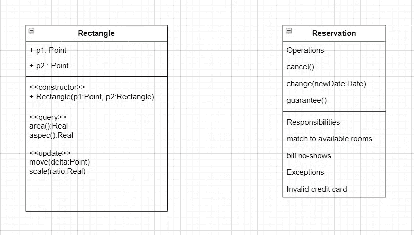
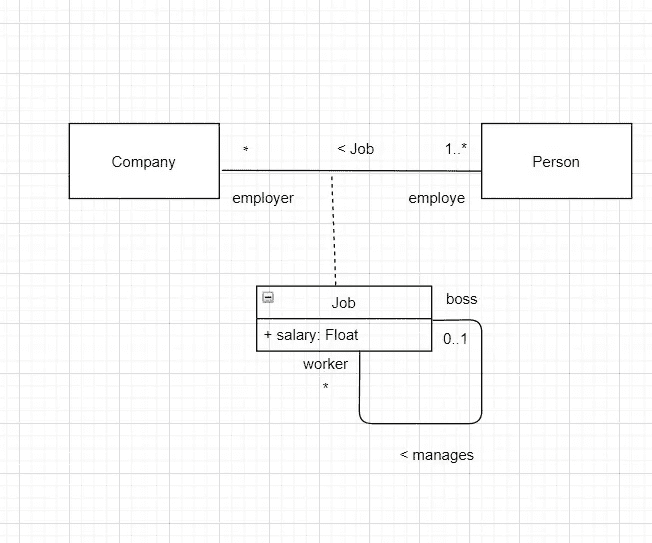
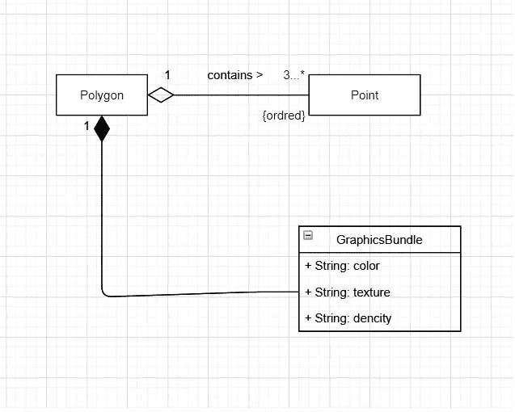

# 类图是最流行也是最复杂的

> 原文：<https://blog.devgenius.io/class-diagram-is-the-most-popular-and-complex-e92d84d587c6?source=collection_archive---------17----------------------->

在 [Unsplash](https://unsplash.com?utm_source=medium&utm_medium=referral) 上由 [Austin Distel](https://unsplash.com/@austindistel?utm_source=medium&utm_medium=referral) 拍摄的照片

在本文中，我将讨论如何使用统一建模语言(UML)来表达问题理解的结果。

特别是 UML 的类模型图，它是 UML 最流行的形式。

正如我在之前的[文章](https://medium.com/@zouhaire.elakioui/how-to-be-a-great-problem-solver-software-engineer-1f88dee2cfc9)中谈到的 OOA(面向对象分析)，通过它你可以开始理解你试图解决的问题。

此外，类图很流行，它是 UML 中最复杂的图表类型。

UML 类图也称为静态结构图。

类有特性，我指的是它的属性和操作。

类存在于现实世界中，功能存在于计算机内部。

类别示例:

类图

我想在这里提到预订类，责任和异常不是 UML 的一部分。

它们在这里只是向你展示这些盒子的用途。

班级模型还有一些额外的高级功能。

为此，我想提一下接口、参数化类、嵌套类、复合对象。

如果你熟悉像 java 这样的面向对象语言，你知道你可以在你的程序中通过使用 java 中的接口结构来表达一个类型。

在接口描述中，你通常描述该接口向系统的其余部分提供什么，以及它向系统的其余部分要求什么。

参数化类对应于 java 泛型或 c++模板，也就是说，它们提供了一种方式，例如通过给定一个作为类类型的参数来描述集合类。

比如你有一套交通工具，一套银行账户。

第三，嵌套类，如果你熟悉 java 类定义，你可以在一个类里面有其他类。

它们有时被称为嵌套类或内部类。

最后，您可以拥有复合对象。这些对象中包含其他对象。

在面向对象的分析中，我们看到名词可以给我们一个很好的引导，让我们知道类将会是什么。

类似地，动词可以用于几个目的，其中之一是描述类之间的关系。

在 UML 中有三种关系，它们的关联，例如人和车辆的关联，人可以驾驶车辆。

有一种概括，那就是汽车。而且还有一个依赖关系。

他们可能是汽车和污染法律之间的依赖。

如果污染法规改变，汽车可能必须适应。例如安装某种污染控制装置。

对于关联，有许多符号启示:

*   名字
*   关联类
*   聚集和组成
*   一般化
*   适航性
*   多样性
*   角色名称
*   预选赛
*   环
*   限制

## 关联类

您可以将它视为一个具有一些类属性或一些关联属性的关联:

关联类示例

正如您在上面的示例中看到的，这是 Job 的另一个关联，它是一个递归关联。

这种关联最好使用角色名。

## 聚集和组成

聚合和合成示例

这是一个与许多其他课程相关的课程。

聚合并没有说太多关系的语义，特别是没有说太多参与者对象的生命周期。

例如，假设您有一个房屋类和房间类。

很明显，一所房子有房间，所以你会期望那里有一个集合。但是，更进一步，如果你摧毁了房子，你也摧毁了房间。

因此，我们不使用聚合，而是使用组合。

在组合中，有管理组成对象的生命周期的责任。

也就是说，一种特定的成分只能属于一种成分。

作文，也有传递性。也就是说，房子可以有房间，房间可以有壁橱。

对于聚合，没有这样的规则。聚合是一般情况。

例如，我可能会说，一个房间有一张桌子。

现在，这是一个聚合的情况，因为在我们把桌子拿出来之后，我们当然会破坏这个房间。

他们没有相同的寿命。因此，我们将使用聚合而不是组合。

## 预选赛

它们用小矩形表示，位于类矩形的边上。

小矩形包含该特定类的一个属性的名称。

小矩形内的属性是限定符，它可以提供对该特定类的实例的访问。

如果你在做一个关系数据库模型，你会把限定词看作是实例集合中的键。

## 链接

就像类可以有实例一样，关联也可以有链接。

示例:

如果我们有一个公司雇佣人的情况，我们可能有一个脸书雇佣杰克的情况。脸书雇佣了莎拉。谷歌雇佣了汤姆，谷歌雇佣了莎拉。

萨拉有两份工作。在这种情况下，我们将有四个不同的链接。

## 一般化

它也用实线表示，但在这种情况下，该线以三角形结束。

语义是子类的所有实例也是父类的实例。那是关系的子集。

一般化不像继承。继承是一种实现技术，概括是一种建模方法。

在 UML 中，泛化支持给定类的多个父类和多个子类。

您可以指定识别符。这是子类组的名称。

# 结论:

UML 为系统结构建模提供了丰富的词汇，UML 类图展示了许多不同的特性。

然而，您不需要使用它的所有启示。

尤其是在建模过程开始时。

然而，每一个启示都隐含着一个需要回答的问题。

**什么是多重性？**

**这些价值观是有序的吗？**

**什么是预选赛？**

**您正在建模的系统是否存在由该启示表示的属性？**

建模的一个重要好处是，它鼓励您在开发过程的早期就面对这些问题。

因为，如果你遗忘了，它们可能以后会回来缠着你。

作为这篇文章的额外收获，我想和你们分享一些书，这些书改变了我在软件设计工程领域的生活:

1- [干净代码:敏捷软件工艺手册](https://amzn.to/2XSyWbg)

2- [干净的架构:软件结构和设计的工匠指南(Robert C. Martin 系列)](https://amzn.to/30BYfzR)

3- [务实的程序员:您的掌握之旅，20 周年版](https://amzn.to/3fgZmJr)

你呢，你觉得类图怎么样？