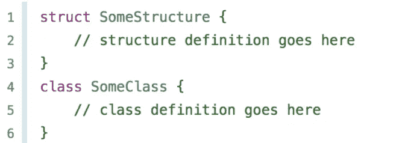
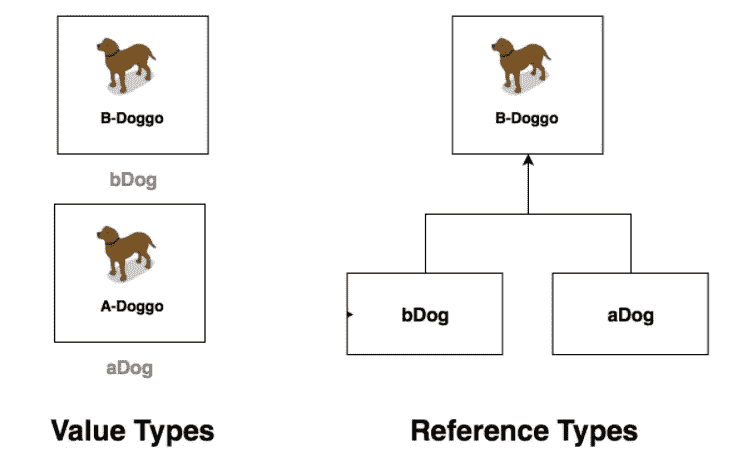

# Swift 中的类与结构

> 原文：<https://blog.devgenius.io/class-versus-struct-in-swift-b0ce62bee676?source=collection_archive---------12----------------------->

嗨，如果你正在学习 swift，并且来自 java 或类似的语言，你可能不会遇到 struct，想知道这是什么？先说什么是 class，什么是 struct 之后要对比一下。

首先，我想告诉你我对班级的了解；然后我们应该谈谈定义。当我听到上课时，我想到了什么？OOP 概念来自于现实生活。当我们谈论面向对象的编程概念时，我们应该从现实生活中获得例子。在现实生活中，一个类就像种类一样。在哲学中，阶级就像思想。当我们谈论类时，我们谈论的是马的概念。什么是马？马是一种跑得很快的动物，有四条腿，脸很长:)。一匹名为 Spirit 的真正的马是马类的一个对象。现实生活中，我们可以像灯泡一样想出新的类(种类)。我想我已经解释清楚了。

那么什么是结构呢？结构和类几乎是一回事。但是差别很小。

差异:

1-结构是值类型，类是引用类型。这是什么意思？当我们传递 struct 或赋值 struct 时，我们复制了，但是当我们对类做同样的事情时，它为内存中的那个地址创建了新的引用。我不会深究指针逻辑，但是我们应该知道当我们改变类的时候，它会到处改变，但是如果我们改变了结构，它不会到处改变。

2-结构是来自函数式编程的概念，类来自面向对象编程。因此，如果你来自面向对象的语言，结构可能会让你感到惊讶，因为这是一个非常有趣的概念。

3- Struct 有空闲的 init 它初始化所有的变量，但是这个类没有空闲的初始化类。

在一个结构中，可变性必须被明确的声明，类总是可变的。

你好，如果你需要，我可以做应用程序；你可以从[点击](https://apps.apple.com/developer/halis-bilal-kara/id1537304083)查看我的应用