# 更有前景的模型性能的分类度量。

> 原文：<https://blog.devgenius.io/classification-metrics-5713f5a7b8e5?source=collection_archive---------12----------------------->

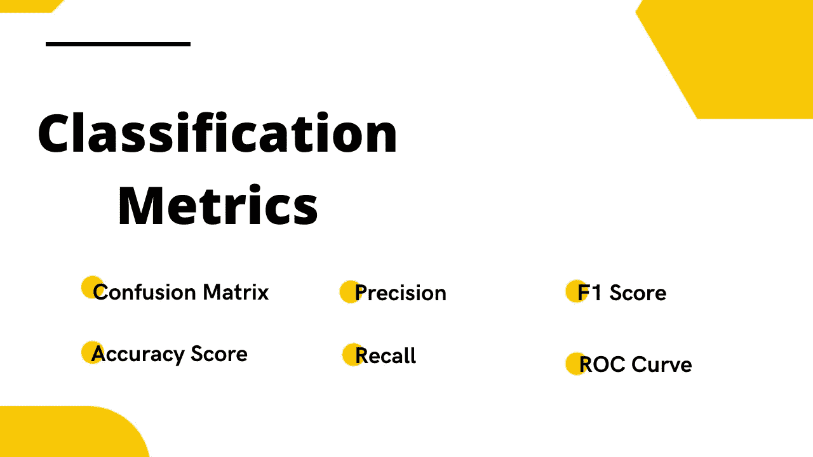

分类是一种有监督的机器学习算法，可以帮助你解决预测实例类别的问题。

分类器是一种实现预测类别的算法。评估分类器的性能比评估回归更困难。如果类别分布有偏差，即一个类别比另一个类别有更多的观察值，这就特别困难。

标准评估度量不适用于不平衡的分类分布，因为大多数标准度量假设类分布是平衡的，或者有时甚至误导模型性能。

为了获得更好的性能，选择一个好的度量标准与选择一个好的估计器同样重要。有许多度量标准可以用来衡量分类器的性能。度量标准的选择可能取决于您正在处理的数据类型或您试图解决的问题。

你可以在这里 阅读 *sklearn* 库 [***支持的所有分类度量列表。在本文中，我们将学习一些最常用的分类指标，并简要讨论何时使用它们。***](https://scikit-learn.org/stable/modules/model_evaluation.html#classification-metrics)

让我们首先从导入所需的库和数据集开始。这里，我使用了来自分析型 vidya hackathon 的 *loan_default* 数据集。数据非常不平衡，这意味着违约的客户数量明显少于未违约的客户数量。

对数据进行预处理和转换，以便我们可以训练模型和测量指标的性能。我们按照 70:30 的比例将数据分为训练数据集和测试数据集。在训练一个模型之后，我们准备好使用度量来评估我们的分类器。

```
## Import libraries
import pandas as pd
import matplotlib.pyplot as plt
import seaborn as sns
sns.set_style("whitegrid")## To split the data
from sklearn.model_selection import train_test_split## Classifier
from sklearn.ensemble import RandomForestClassifier## read data
data = pd.read_csv("data.csv")
X = data.drop(['loan_default'], axis=1)
y = data['loan_default']## distribution
print("Y distribution:\n", y.value_counts())## split the data into 70% of training data and 30% of test data.
X_train, X_test, y_train, y_test = train_test_split(X, y,
                                                    train_size=0.7,
                                                    random_state=1)## Train algorithm
clf = RandomForestClassifier(random_state=1)## fit the data
clf.fit(X_train, y_train)## Predict the output
y_predicts = clf.predict(X_test)
```

```
## Ouput:
Y distribution: 
0    4200
1    2800
```

数据非常不平衡，因为有 4200 个 0 的实例，而有 2800 个 1 的实例。让我们使用以下指标来衡量`RandomForestClassifier`的性能。

# 1.混淆矩阵

混淆矩阵也被称为 ***误差矩阵。*** 虽然混淆矩阵不计算分类器性能度量的特定值。但是它提供了一个 2x2 矩阵的表格，允许您使用这些数字来计算其他性能指标。

在混淆矩阵中，矩阵的每一行代表实际类中的实例，而每一列代表预测类中的实例，反之亦然。它报告如下图所示的*真阳性、假阴性、真阴性、*和*假阳性*值。

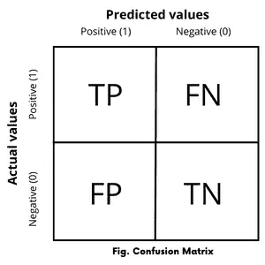

考虑具有两种可能结果的二元分类；其中输出被标记为 1 类(正)或 0 类(负)。

*   **真正—** *如果分类器预测输出为 1(正)，实际值也为 1(正)，则称为* ***真正(TP)。***
*   **假阴性—** *如果分类器预测输出为 0(阴性)，但实际值为 1(阳性)，则称为* ***假阴性(FN)。***
*   **真阴性—** *如果分类器预测输出为 0(负)，而实际值也为 0(负)，则称为* ***真阴性(TN)。***
*   **假阳性—** *如果分类器预测输出为 1(阳性)，但实际值为 0(阴性)，则称为* ***假阳性(FP)。***

混淆矩阵允许更详细的错误分析，并且不限于二进制分类。混淆矩阵也可以用于多类分类器。

使用这些值，您可以计算有助于您更准确地理解模型性能的其他指标。

```
## Confusion matrix
from sklearn.metrics import confusion_matrix
from sklearn.metrics import ConfusionMatrixDisplaycm = confusion_matrix(y_test, y_predicts)
disp = ConfusionMatrixDisplay(confusion_matrix=cm, 
                              display_labels=clf.classes_)disp.plot()
plt.show()
```

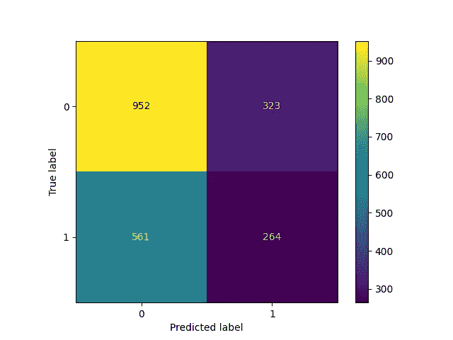

# 2.准确(性)

准确性衡量全部观察值中被正确分类的部分。它是正确分类总数与观察总数的比率。

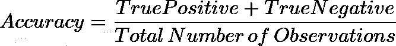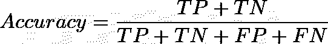

准确性指标可能不是评估不平衡数据的好选择。因为简单地把所有观测值归为多数类，很容易得到高精度的分数。考虑一个例子，其中数据包含 95 个正观察值和仅 5 个负观察值，那么在这种情况下，将所有值分类为正，将给出 0.95 的准确度分数。

```
## Accuracy score.from sklearn.metrics import accuracy_score
accuracy = accuracy_score(y_test, y_predict)
print("Accuracy Score: %.3f" %(accuracy))# Output: Accuracy Score: 0.579
```

# 3.精确

精度衡量肯定预测的准确性，即它衡量肯定类别在分类器肯定预测的总类别中的比率。Precision 帮助您回答问题 ***“一个分类器将如何精确地预测正类？”***

> **精度**是真阳性结果的数量除以所有阳性结果的数量，包括那些没有被正确识别的结果。

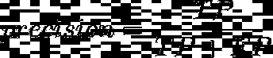

*   ***TP*** *为真阳性数。*
*   ***FP*** *是误报数。*

精度衡量算法的质量。更高的精度意味着算法比不相关的结果返回更多的相关结果。

例如:考虑一位脑外科医生从病人的大脑中移除癌细胞。外科医生应该移除所有癌细胞，因为任何残留的癌细胞都会再生。相反，外科医生不得移除健康的脑细胞。在这种情况下，更高的精度可以确保外科医生只移除癌细胞。更高的精确度降低了移除健康细胞的机会，同时降低了移除所有癌细胞的机会。

***完美精度的较高值是 1.0*** ，这意味着当算法不预测任何假阳性(FP=0)时，所有结果都是相关的(真阳性)，这实际上是不可能的。

```
# precision scorefrom sklearn.metrics import precision_score
precision = precision_score(y_test, y_predict)
print("Precision Score: %.3f" %(precision))# Output: Precision Score: 0.450
```

当您希望分类器不要将阴性样本标记为阳性时，精度分数会更有用。

# 4.回忆或敏感度(真实阳性率)

它测量分类器正确检测到的阳性实例的比率。回忆有助于你回答问题**“多大比例的实际阳性被正确分类？”**

> **召回**是真阳性结果的数量除以所有应被鉴定为阳性的样本数量。

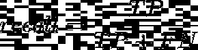

*   ***FN*** *为漏报数。*

我们可以说，回忆是数量的量度。较高的召回率意味着算法返回大部分相关的结果，不管不相关的结果是否也被返回。考虑到上述从患者大脑中移除癌细胞的例子，这里较高的召回确保了外科医生已经移除了所有癌细胞。但是随着更高的回忆增加了移除所有癌细胞的机会，也增加了移除健康细胞的机会。

***完全回忆的较高值是 1.0*** ，这意味着当算法没有预测到任何假阴性(FN=0)时，所有结果都是相关的(真阳性)。

```
# recall scorefrom sklearn.metrics import recall_score
recall = recall_score(y_test, y_predict)
print("Recall Score: %.3f" %(recall))# Output: Recall Score: 0.320
```

当您希望分类器找到所有阳性样本时，召回分数会更有用。

# **5。f1-分数**

具有较高召回率和较高精确度的模型将是完美的分类器，但是召回率的增加将降低精确度值，反之亦然。因此，我们可以使用精确度和召回率的单一度量来评估模型性能，它被称为 f1-score。

F1-score 是一种度量，用于基于对阳性类别的预测来评估二元分类。它衡量测试的准确性。f1-得分是精确度和召回率的调和平均值，由以下公式表示。

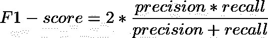

F 分数的最高可能值是 1.0，表示完美的精确度和召回率，最低可能值是 0。如果精度或召回率为零。F 值越高，模型性能越好。

```
# f1-score
from sklearn.metrics import f1_score
score = f1_score(y_test, y_predict, average='macro')
print("F1 Score: %.3f" %(score))# Output: F1 Score: 0.528
```

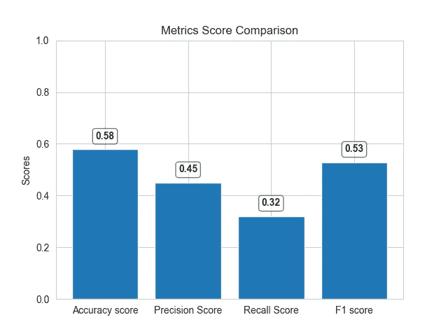

我们可以看到，不同指标的得分存在差异。准确性可能看起来很高，但没有考虑数据的分布，模型实际上无法正确预测。这里，f1 分数将提供更好的模型性能，因为它考虑了数据的分布。

# 6.受试者工作特征曲线

ROC(受试者操作特征曲线)是用图形说明模型性能的另一种方式。ROC 曲线是通过在各种阈值下绘制真阳性率(TPR)对假阳性率(FPR)而创建的。

*   **真阳性率(TPR)(召回率或灵敏度)——**它是真阳性结果数除以所有应被鉴定为阳性的样本数的比值。

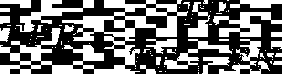

*   **假阳性率(FPR)——**它是假阳性结果数除以所有应被鉴定为阴性的样本数(实际阴性总数)的比值。)

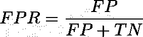

这是 TPR 和 FPR 之间的权衡，因此较高的 ***TPR*** 和较低的 ***FPR*** 更好，左上角的曲线更好。

```
# ROC Curve
from sklearn.metrics import RocCurveDisplay
RocCurveDisplay.from_estimator(clf, X, y)
plt.plot([0, 1], linestyle="--", color='black')
plt.show()
```

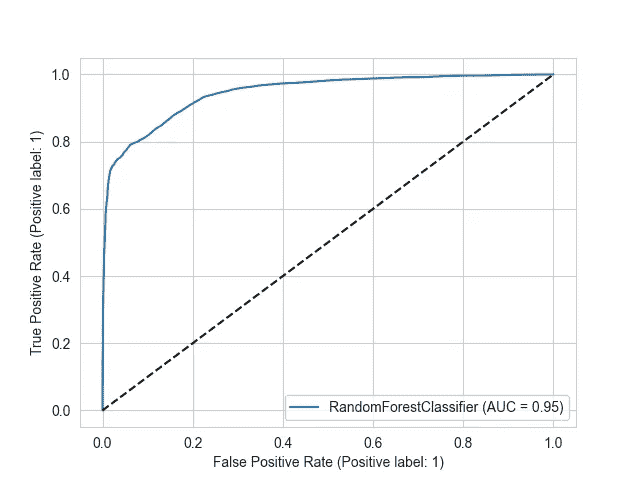

ROC 曲线使用曲线下的面积来确定分类器的准确性，曲线下的面积越高，性能越好。在该图中，蓝线代表 ROC 曲线，黑色虚线代表阈值为 0.5 时的 ROC 曲线，其中特异性=灵敏度。

## 结论

这些是一些常用于评估分类器的指标。正如我之前所说的，选择好的度量标准和选择分类器一样重要，它总是依赖于数据和你试图解决的问题。

当类别平衡并且预测假阴性没有缺点时，经常使用准确性。而 f1 分数用于不平衡的类别分布，并且当预测假阴性有缺点时。

例如:预测某人没有癌症，而实际上，他们有。在这种情况下，f1 分数将会很低，因为与准确性相比，它会以更多的假阴性来惩罚模型。

我希望您现在理解了用于模型评估的不同分类标准，以及何时使用它们。

感谢您的阅读。

***资源****——*[*https://en.wikipedia.org/wiki/Confusion_matrix*](https://en.wikipedia.org/wiki/Confusion_matrix)