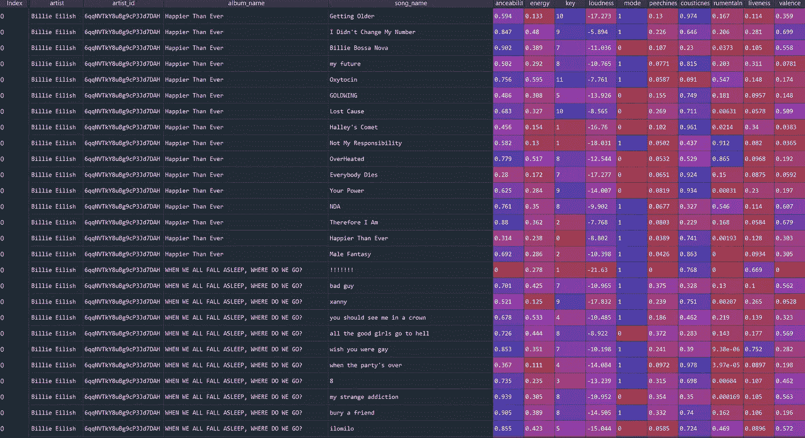
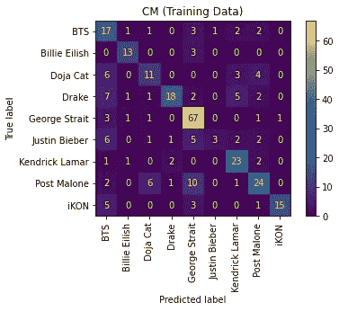
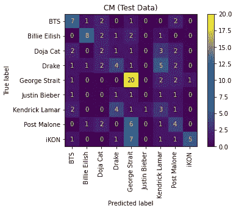

# 使用 Pytohn 对 Spotify 艺术家进行分类

> 原文：<https://blog.devgenius.io/classifying-spotify-artists-w-pytohn-ddfb7799db7c?source=collection_archive---------6----------------------->

## 在这个项目中，我使用 Spotify API 和 KNN 创建了一个 Spotify 艺术家分类器

嗨，我经常使用 Spotify。我每天都用它来帮助我保持专注和冷静。尽管我是 Spotify 的超级粉丝，但我并不知道每首歌都有一个独特的音频特征列表，这些音频特征可以用来尝试和预测歌曲的艺术家。

这是我用 python 写的第一个统计模型，我学到了很多。我不会坐在这里说我一次就把所有的东西都打好了。我使用了很多谷歌，并进行了很多尝试和错误才到达终点。

这是非常有趣和有教育意义的，但有时也令人沮丧。我已经看到了这种模型的不同应用，以及如何利用我所学到的知识来开发一个端到端的项目。

我列出了一些我最喜欢的艺术家，然后使用 Spotify API 从他们的前 4 张专辑中获取歌曲数据，从那时起，我对数据进行了清理和预处理，然后使用 K 近邻算法创建了一个机器学习模型来预测歌曲的艺术家。该模型大约有 65%的准确性，让我看到了一些我最喜欢的歌曲背后的幕后数字。我还可以做更多来提高精确度。超参数调整等，但我会留到另一天。

这个项目有一个后续项目，我从 Spotify 请求了我的 Spotify 数据，并将使用它来创建我的收听数据的可视化，并创建我的热门歌曲的音频分析。我将基本上创建一个我的音频分析可视化。

# 1️⃣正在获取歌曲数据

第一步是获取我列出的艺术家的数据。

*   artists = ['Billie Eilish '，' Kendrick Lamar '，' Post Malone '，' iKON '，'乔治·斯特瑞特'，'贾斯汀比伯'，' BTS '，' Drake '，' Doja Cat']
*   正如你所看到的，我试着做了一个很好的混音来拥有不同的音频特征。我也很喜欢所有这些艺术家，所以这很有意义。

接下来，我需要 Spotify API 的证书。你可以点击这里的链接[了解如何获得这些信息。我还需要了解 API 中有哪些端点可用，这需要大量阅读和搜索。你可以在这里](https://developer.spotify.com/documentation/general/guides/authorization/app-settings/)阅读端点文件[。](https://developer.spotify.com/documentation/web-api/reference/#/)

有一个名为 [Spotipy](https://spotipy.readthedocs.io/en/2.19.0/) 的 Python 包装器，使数据收集更加容易，而不是对 HTTP 请求使用实际的 API。为了获得 API 体验，在我使用 Spotify 完成项目后，我仍然使用 Spotify 官方 API 提取数据。

在*音频特征* [端点](https://developer.spotify.com/documentation/web-api/reference/#/operations/get-several-audio-features)可获得单首歌曲数据。但这需要单独曲目的 Spotify ID。所以我首先需要收集这些。那些 ID 可以在由 album_tracks [端点](https://developer.spotify.com/documentation/web-api/reference/#/operations/get-an-artists-top-tracks)给出的曲目信息中找到。在我做所有这些之前，我需要获得我的艺术家的唯一 Spotify 艺术家 ID，这样我就可以从他们的专辑中取出歌曲。我用 Spotify API*search*[endpoint](https://developer.spotify.com/documentation/web-api/reference/#/operations/search)搜索艺人的名字，拉他们的艺人 ID。

有了艺术家 ID 之后，我就可以提取他们的前 4 张专辑，并提取每张专辑的数据。一旦有了专辑数据，我就能够从专辑数据中提取歌曲的 id，然后使用这些 id 提取每首歌曲的独特音频特征。

然后将结果保存到 CSV 文件中。参见下面的代码。

天使的代码

得到的数据帧是这样的:



# 2️⃣Exploratory 数据分析

创建数据集后，下一步是探索它。使用 Seaborn 的 [pairplot](https://seaborn.pydata.org/generated/seaborn.pairplot.html) 函数，我能够评估我们所有列的关系。剧透警告没有太多关联。

```
# Libraries
import pandas as pd
import seaborn as sns# import the database 
df = pd.read_csv('album_database_clean.csv')# Correlations 
sns.pairplot(df.drop(['Unnamed: 0', 'mode', 'song_name'],axis=1), hue='artist')
```

# 3️⃣Preprocessing 数据

我知道我想做分类，并选择[K-最近邻](https://www.youtube.com/watch?v=HVXime0nQeI)作为模型 t 使用。在模型选择和应用方面，我还有很长的路要走，但我认为这是最适合这项工作的。然后，我使用 sklearn 将我的数据分成 70%的训练和 30%的测试。

```
# Identifying X and Y columns
x_cols = ['danceability','energy', 'key', 'loudness', 
           'mode', 'speechiness', 'acousticness','instrumentalness', 
           'liveness', 'valence', 'tempo']y_cols = ['artist']# Creating train and test splits
X_train, X_test, y_train, y_test = train_test_split(df[x_cols],df[y_cols], 
                                     train_size = .7, 
                                     random_state = 0)
```

为了得到最好的结果，我需要对数据进行均值居中和缩放。我用 sklearn 简单地做到了这一点。

```
from sklearn.preprocessing import StandardScaler# standardizing
scaler = StandardScaler()
X_train_data = scaler.fit_transform(X_train)
X_test_data = scaler.fit_transform(X_test)
```

# 4️⃣Creating ML 模型

k-最近邻是一种很好的分类算法，它使用距离来计算多数邻居，并将未知样本投票为多数邻居的类或组。

在这种情况下，我使用歌曲的特征(' danceability '，' energy '，' key '，' loudness '，' mode '，' speechiness '，' acousticness '，' instrumentalness '，T14，' liveness '，' valence '，' tempo ')来预测艺术家的名字。

我选择了 k=4，我运行了几次这个模型来得到一个精确度范围。我不想过分渲染模型，所以 4 似乎是一个不错的选择。

```
# Classification 
from sklearn.neighbors import KNeighborsClassifier# Make the KNN model
KNN = KNeighborsClassifier(n_neighbors = 4)
KNN.fit(X_train_data, y_train)
predictions=KNN.predict(X_train_data)print(knn.score(X_train_data,y_train))print(KNN.score(X_train_data, y_train))
```

该模型对训练数据的准确率约为 65%。

# 👀可视化和评估模型

我不仅想看到准确性，还想了解模型是如何工作的，所以我创建了一个混淆矩阵。

一个[混淆矩阵](https://en.wikipedia.org/wiki/Confusion_matrix)允许一个人理解模型如何在不同的类别标签上分类，并给出更多关于什么标签更容易或更难预测的洞察。

同样，在 scikit learn 中制作混淆矩阵非常容易，只需要几行代码:

```
# Making confusion matrix
predictions = KNN.predict(X_train_data)
cm = confusion_matrix(y_train, predictions, labels = KNN.classes_)
disp = ConfusionMatrixDisplay(confusion_matrix=cm, display_labels=KNN.classes_)
disp.plot()
plt.tick_params(axis = 'x', labelrotation=90)
plt.title('CM (Training Data)')
plt.show()
```

由此产生的图帮助我更好地理解了这个模型:



天使的困惑矩阵

你会看到该算法能够很好地将乔治·斯特瑞特与 iKon 和 Billie Eilish 分类，尽管对其他艺术家尤其是贾斯汀比伯(可怜的家伙)有相当多的错误分类。

我还测试了测试数据的准确性和混淆矩阵。准确度下降到大约 41%,下面是产生的混淆矩阵:



天使的困惑矩阵

# 5️⃣My 外卖

总的来说，我创建这个模型的时候很开心。

我还想知道企业如何利用这一点。如果我们有 Spotify 用户最常播放的歌曲，了解平均音频属性可以帮助我们向他们推荐更好的内容，从而创造更好的参与度。

仍然有很大的改进空间，我将继续提高我的技能和准确性

希望你喜欢，如果有任何问题，请告诉我。