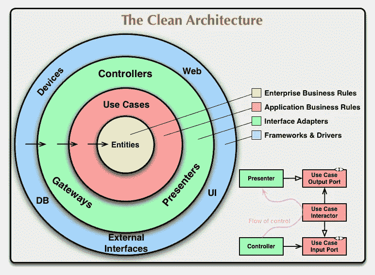

# 干净的建筑——c·马丁(鲍勃叔叔)

> 原文：<https://blog.devgenius.io/clean-architecture-c-martin-uncle-bob-5a7a17e4fadb?source=collection_archive---------2----------------------->

## #初学者架构指南

架构是一种系统设计，它将组件分解成独立的部分。工程师可以轻松实现他们的目标。

clean architecture 的目标是找到更好的软件，如可维护的、可测试的、易于使用的、可伸缩的等等——这是工程师的准确指南。

干净架构的目标是得到更好的软件，比如可维护的、可测试的、易于使用的、可伸缩的等等。建筑是工程师的正确指南。如果你是初学者，会帮助你找到目标，你可以有一个基本的思路。

# 洁净建筑的解释？

图片来源:[罗伯特·c·马丁的博客](https://blog.cleancoder.com/uncle-bob/2012/08/13/the-clean-architecture.html)

这种错觉非常好地覆盖了建筑，我们来看看解释。清洁建筑是由罗伯特·c·马丁的博客在 2012 年创建的。

这里是我们的领域和实体的中心。这是我们生意的规则。

这是在外部案例中使用的应用程序，以及它如何被称为实体。
然后在下一个层面，如果你正在做一些像 MVC 或网关或用户界面演示器，我们有一个控制器。在顶层，如果你创建一个 web 应用程序，它在这里和 UI 框架。

# 依赖性规则

在这个架构中，主要的规则是依赖规则。你可以在这个错觉中看到这些箭头。这里，这些箭头指向内部，这意味着外层可以指向层的内部，而内层不能指向外层。而内层对外层一无所知。

# 它是如何工作的？

干净的架构把核心放在中心。这意味着业务逻辑和应用程序模型都处于中心位置。

但是核心必须独立于附加数据，所以我们颠倒了依赖关系。
这是通过添加核心接口和应用它的外层实现的。

# 为什么我们需要干净的架构:

*   独立于框架。
*   独立于数据库。
*   独立于 Ui。
*   可测试。
*   独立于任何外部机构。
*   最佳结果

# 关于图层的说明:

你的应用程序主要有三层:

*   表示层:视图模型、表示器实现、适配器。
*   领域层:用例或回调和存储库的接口。
*   数据层:数据库、UI、存储和网络。实体存储库实现和业务逻辑。

**现在让我讨论一下三层。**

## 演示文稿:

该层应用不带参数的 UI。这一层在内部应用架构，它连接到一切。

## 数据层:

在数据层，我们有一个实体存储室改造其他业务项目

但我见过一些人认为实体是在域级别下创建的。但是不要因为我们的 MVVM 而跟它走，因为它可能会在后面发生逆转。

因此，每当您实施存储或使用其他东西时，您都会创建它。

## 域层:

在这个层面上，你的业务是有逻辑的。顶层代码停留在核心层。由于类和对象是在应用程序中运行的，因此不了解这一级别的类和对象。这一层将数据层连接到表示层。

领域层将是存储库的用例回调和接口。所以我们可以称之为特定的储存库。

# 使用案例:

这一层包含特定的应用程序业务规则。这一层实现了所有的用途。这一层改变时不能影响实体层，外层也不能影响。但是如果这个用例改变了，那么这一层的一些代码就会受到影响。

# 清洁建筑的另外两个概念:

干净架构的许多特性共同决定了什么是干净架构。但是在这里我要和你们分享两个概念:

*   易测性
*   关注点分离

可测试性是分离部分的一个关注点。因为为了可测试，你想把事情分开。

他们利用了对分离的关注，所以你这样做是为了让它可以测试。这两件事是不可抗拒的最重要的事情。

分离是指将应用程序的不同部分分离成自给自足的元素。

这里的基本思想是自给自足。如果我们看建筑，它会像一个轻的例子。

在 UI 中，有一些业务逻辑，将信息从存储库移动到活动或片段中，这就是视图模型。然后，您有了自己的存储，它指的是您的远程数据源。

这些都被定义为不同的应用程序组件，您可以将它们换成不同的东西。在您换出之后，您只需运行所有的测试，所有的测试都会通过，即使您换出了其中的一个组件。

# 最后的话

能看到 [**鲍勃大叔的干净建筑**](https://blog.cleancoder.com/uncle-bob/2012/08/13/the-clean-architecture.html) 就好了。稍微注意一下，就会得到基础知识。干净的架构是好的应用程序的基础。如果您不了解任何体系结构，那么您的应用程序就没有好的计划。

因此，干净的架构给你一个实现高质量应用程序的清晰思路。所以不熟悉的就去看看吧。

感谢您的阅读。