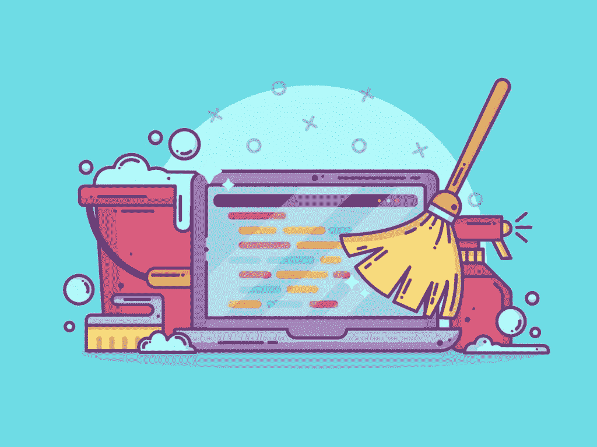
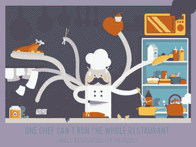

# 干净的代码:无止境的编码冒险

> 原文：<https://blog.devgenius.io/clean-code-an-endless-codding-adventure-3cf798fdc54c?source=collection_archive---------1----------------------->

你听说过写干净的代码吗？干净的代码是什么意思？我们可以在准则中使用化学清洁产品吗？如果不可能，我该怎么做才能写出干净的代码？顺便问一下，为什么我必须写干净的代码？脑子里疯狂的问题…

编写干净的代码是所有程序员都应该具备的重要技能。基本上，如果你的代码易于阅读和增强，恭喜你！

## 什么是干净的代码，为什么我们要代码干净？

干净的代码是其他开发人员易于阅读、理解和修改的代码。这很重要，因为其他开发人员需要阅读您的代码并理解如何修复您的错误和添加新功能。这不仅对其他开发者来说，对你也很重要。当你被虫子包围时，你需要社区的帮助。如果你从社区中寻求帮助的人不能理解你的代码，这对他们来说将是一个巨大的挑战。每个人都知道不理解代码就不可能找到并修复 bug。显而易见，即使是寻求帮助也是必要的。

## **我们怎样才能写出更干净的代码？**

如果我们同意编写干净代码的重要性，那么让我们来谈谈如何编写干净的代码？有一些原则要遵循，现在我们将重点放在最著名的原则和它们的例子。

## **干:不要重复自己**

根据 DRY 原则，函数应该只做一件事，这样可以避免不必要的重复。如果有分离但又相关的功能，可以合并成一个功能。干的反义词是湿(我们喜欢打字)。采用 WET 的程序员不在乎重复输入类似的东西。

*//湿程序员*

> var color of house = getcolor of house()；
> 
> var roomsCountOfHouse = getRoomsCountOfHouse()；
> 
> var rentof house = getrentof house()；
> 
> var newHouse = {colorOfHouse，roomsCountOfHouse，rent of house }；
> 
> print house infos(new house)；

您真想为每栋新房子输入这段代码吗？

*//干程序员*

> 函数 getHouseInfos() {
> 
> 返回{
> 
> color of house = getColorOfHouse()；
> 
> roomsCountOfHouse = getRoomsCountOfHouse()；
> 
> rentof house = getrentof house()；
> 
> }
> 
> }
> 
> print house infos(getHouseInfos())；

## 吻:保持简单，笨蛋

根据 KISS 原则，你写的代码应该尽可能简单。这意味着解决问题有很多方法，你应该选择最简单的方法，而不是复杂的方法。它简短地说“远离不必要的挑战和复杂性。”。我们也可以说 DRY 是 KISS 的更具体的版本，DRY 只是关于代码的功能方面，而 KISS 是关于所有代码的。

## YAGNI:你不会需要它的

YAGNI 说“如果你现在不需要某个功能/特性，就不要把它添加到你的代码中”。这是正确的，因为有时我们开发功能的想法是在未来使用它们。如果我们那时不使用它，可能会浪费时间，而且我认为这会导致注意力分散，所以我们在那个时候不能集中在确切的问题上。解决今天的问题比解决明天的问题更有效。及时行乐吧，宝贝！

## 固体:该听鲍勃叔叔的话了

最广为人知的原则是由 Robert C. Martin(也叫 Bob 叔叔)在他的书《设计原则和设计模式》中介绍的。每一个实心字母都代表着一个原则，代表着

***S*** 单一责任原则

***O*** 笔闭合原理

***L*** 伊斯科夫替代原理

***I*** 界面偏析原理

***D*** 依赖反转原理

## **单一责任原则:只能有一项工作**

我们有面向对象编程的类，根据 SRP，一个类应该只有一个任务。这样程序对每个类的依赖性就会减少。测试和调试将会更容易和更快，因为程序员可以知道哪个类导致了错误。此外，代码将更加有组织和开放的扩展。

## 开放封闭原则:我对创新持开放态度，但我不会改变

时间在流逝，需求在变化。每个程序都需要更新才能存活，但这并不意味着改变。如果你直接给一个类添加新特性，那就和 bug 打个招呼吧！应该通过使用泛化(继承)来添加新特性。这种方式更干净，可以保护你免受虫子的侵害。

## 利斯科夫替换:我可以做我父母做的任何事情

当然，在 OOP 中，孩子扩展了他们父母的属性和能力。如果一个类是通过继承从另一个类创建的，这个新的类将成为它的子类。子类的能力不能比父类少，这导致了程序的混乱。

## 接口隔离:只给我我的业务

通常程序都有接口，有时程序员不能慢下来，他们有更大的接口。处理大的接口既困难又复杂，所以 Bob 叔叔建议分成更小更特殊的。小件和特殊件执行的工作只是他们的角色。

## 依赖性倒置:每个人都依赖抽象

程序包含模块，一个模块可以依赖于其他模块。依赖有一些组织规则。例如，高级模块不应该依赖于低级模块。两者都应该依赖于抽象。

> 类别食物菜单{
> 
> 构造者(主菜、可乐、配菜){
> 
> this . main course = main course；
> 
> this.coke =可乐；
> 
> this . side flavor = side flavor；
> 
> }
> 
> }

例如，我们有一个 FoodMenu 类，这个食物菜单来自主菜、可乐和配菜。如果顾客想要不同于可乐的饮料，他/她不能得到它。有问题我们会解决！

> 班级饮料{}
> 
> 级可乐延伸饮料{}
> 
> 级冰茶延伸饮品{}
> 
> 类别食物菜单{
> 
> 构造者(主菜、饮料、配菜){
> 
> this . main course = main course；
> 
> 这个。喝=喝；
> 
> this . side flavor = side flavor；
> 
> }
> 
> }

我很确定，我们可以遵循这些原则写出更干净的代码。除了这些避免不必要的注释的原则之外，为函数、类、变量使用有意义的名字也会使你的代码更整洁。

> var array = ["category1 "，" category2 "，" category 3 "]；
> 
> var a =数组.长度；
> 
> 真的吗？“a”是你的变量名，你把你的数组命名为“array”？不要偷懒…
> 
> var categories = ["category1 "，" category2 "，" category 3 "]；
> 
> var number of categories = categories . length；

直到这个时候，自从我了解了干净代码，我一直在努力遵循这些原则和规则。意识到如何提高代码质量让我更有动力写得更干净。我希望它也能让你有动力并准备好为更干净的编码采取行动。

感谢您的阅读和关注。如果你有任何问题或建议，请评论它。