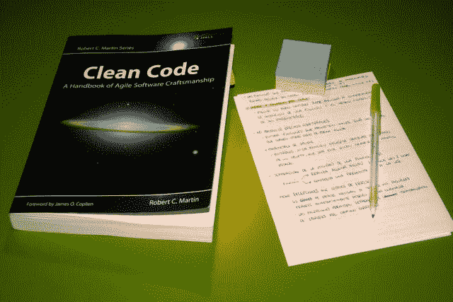
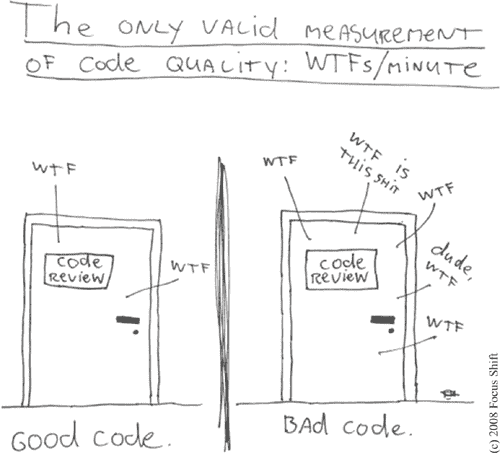

# 干净的代码注释

> 原文：<https://blog.devgenius.io/clean-code-notes-d853fb12633a?source=collection_archive---------13----------------------->

# 干净代码

第一章

我用我总结的一些要点来研究《干净的代码》这本书。希望对别人有帮助。

**(注:这个总结不排除看书的需要。)**

> 首先，我想强调几段引言

> 强烈支持！

# 为什么是糟糕的代码？！是什么让我写出了糟糕的代码？！

*   你的老板不给你时间
*   你想更快地完成更多积压的故事
*   没有经验
*   我过会儿会打扫它

# 小心

“以后等于永远不会。”糟糕的代码会拖垮一家公司。
“按时完成的唯一方法——快速完成的唯一方法——是始终保持代码尽可能的干净。”

# 什么是干净代码？

*   代码可以用代码评审中的“好”或“坏”来衡量，或者用你谈论它的时间来衡量。
*   一个干净的代码应该优雅、高效、易读、简单、没有重复、写得好。
*   你应该用你的代码增加业务的价值。
*   当我们开班时，干净的代码提供了质量和理解。
*   你的代码必须清晰易读，便于任何人查找和理解。避免浪费别人的时间。

# 我怎样才能写出干净的代码呢？！

在编码时，你可以考虑一些规则和技巧

# **一般规则**

*   遵循标准惯例。
*   保持简单愚蠢(吻)
    越简单越好。
    尽可能降低复杂度。
*   童子军规则“留下比你发现时更干净的露营地。”
*   永远要找到根本原因。永远寻找问题的根源。
*   理解技巧
*   保持一致。如果你以某种方式做某事，以同样的方式做所有类似的事情。
*   使用解释变量。
*   封装边界条件。
    边界条件很难跟踪。把他们的加工放在一个地方。
*   优先选择专用值对象而不是基本类型。
*   避免逻辑依赖。
    不要写依赖于同一个类中的其他东西就能正确工作的方法。
*   避免消极条件句。

# 那么到底是什么代码我可以称之为干净的

在我看来，你可以称之为干净的代码

*   易读的
*   瘸子帮和清场
*   保持一致
*   可维持的
*   可攀登的
*   可试验的
*   有意义的名字
*   没有重复
*   较少依赖
*   代码质量

# 我们应该什么时候打扫？！

一直

## 最后的

“练习，儿子。实践！”