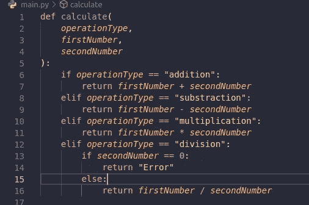
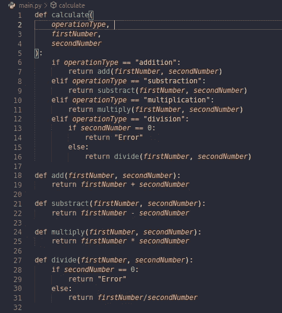

# 干净的代码:初学者终极指南

> 原文：<https://blog.devgenius.io/clean-code-the-ultimate-beginners-guide-806d8608703d?source=collection_archive---------5----------------------->

## 更易于理解和组织的代码的最佳实践

干净的代码

编写不仅计算机能理解，而且人类也能理解的代码(我们所说的人类是指程序员)，是每个程序员都应该具备的一项关键技能。如果你是一个大型开发团队的一员，或者你正在开发开源软件，或者甚至你是一个从事长期项目的单独开发人员，编写一个清晰易懂的代码将会给你带来巨大的变化，并使你从其他程序员中脱颖而出。

今天，我们将分享 10 个编写清晰易懂代码的技巧:

# 1.命名变量:

这是最重要的建议之一，它将使你的代码超级可读，当我们开始学习编程时，我们都用这种方式命名变量:I，j，x，y …如果你正在学习，用这种方式命名变量是可以的，因为你的程序不会超过 30 行代码，你知道为什么每个变量都声明为， 但是，当你开始编写越来越多的代码时，这种命名惯例将会变得低效，你开始失去对变量的跟踪，在这种情况下，你需要开始选择好的描述性名称，如 username、itemPrice、number _ of _ likes……这样你就可以知道这些变量的用途，以及你希望你的代码在接下来的几行中做什么，所以尽量使你的变量名更长，更具描述性。

# 2.您的函数只需要做一件事:

函数是编程中一个非常重要的概念，它会让你的代码变得枯燥(**D**on t**R**EPE at**Y**yourself)，如果你恰当地应用这个概念，它会让你的代码非常易读。当你开始编写函数时，请记住，你需要设计它们只做一件事，我们说的一件事指的是一件事，为了清楚起见，让我们来看这个例子:

在这个函数中，我们首先检查操作的类型，然后执行它，为了使它更加清晰易懂，我们可以这样做:

我知道这是一个实现干净代码原则的极端例子，但是当你的代码开始变得越来越大时，你会看到使用这种技术的好处，并且永远记住你的函数只需要执行一件事情。

# 3.命名功能:

像 variable 一样，给你的函数指定一个合适的名字会使你的代码非常干净，因为它会告诉任何阅读你的代码的人你期望从这个函数中得到什么，并且永远记住你的函数的名字需要是一个动词，像 addTwoVariables，login_user，filterArray …

# 4.让您的文件尽可能小:

我几乎可以肯定，您会面临这样的情况，在您编写的大型文件中很难添加单个功能，这就是为什么我们总是需要将文件中的行数保持得尽可能少，并使其专用于一件事情(或者可能是一个功能)，您还需要正确命名您的文件，并将它们放在一个具有非常描述性的名称的文件中。 这样，当你搜索一段代码时，你将确切地知道在哪里看，并且也将告诉阅读你的代码的其他人在每个文件中期待什么。

这些是一些快速的提示，如果你恰当地应用它们，将会提高你的代码的质量和可读性，现在，我希望这篇短文能赢得你的赞赏，感谢你的关注。