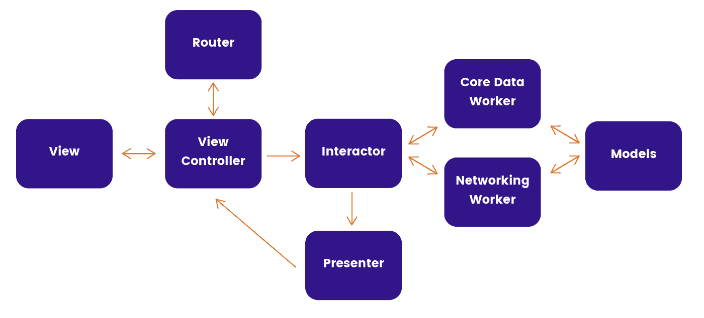

# 用实例清理 Swift VIP

> 原文：<https://blog.devgenius.io/clean-swift-vip-with-example-6f6e643a1a01?source=collection_archive---------2----------------------->

# 清洁 Swift VIP

Clean Swift(又名 VIP)是 Bob 大叔应用于 iOS 和 Mac 项目的 Clean 架构。干净的 Swift 架构不是一个框架。它是一组 Xcode 模板，可以为您生成干净的架构组件。这意味着您可以根据自己的需要自由修改模板。



*   视图控制器
*   模型
*   路由器
*   工人
*   互动者
*   提出者

# 视图控制器

视图控制器开始和结束 VIP 循环向交互器发送数据，尽管它没有从交互器获得响应。该类与演示者进行单向交互。视图控制器从演示者获得响应，但不能向它传输任何内容

```
import UIKitprotocol IMostPopularViewController: class {
	var router: IMostPopularRouter? { get set }
}class MostPopularViewController: UIViewController {
	var interactor: IMostPopularInteractor?
	var router: IMostPopularRouter? override func viewDidLoad() {
        super.viewDidLoad()
		// do someting...
    }
}extension MostPopularViewController: IMostPopularViewController {
	// do someting...
}
```

# 模型

模型类与 VIP 模型中的每个组件相关。模型是一个包含请求、响应和视图模型等结构的类:

*   请求模型包含发送给 API 请求的参数，这些参数是用户输入，比如在文本字段中输入的文本和在选择器中选择的值。
*   响应
    这种类型的模型接收来自 API 的响应，并存储适当的数据。
*   ViewModel
    这个模型将发送给演示者的响应封装成原始数据类型，比如 String 和 Int。

```
import UIKit
struct MostPopularModel {	
	struct Request {
		// do someting... func parameters() -> [String: Any]? {
			// do someting...
			return nil
		}
	} struct Response {
		// do someting...
	}
}
```

# 路由器

路由器通过在视图控制器之间传递数据来处理过渡，这是通过助手类完成的

操作发生在具有委托方法的视图控制器调用路由器类中

```
//MARK: - in View Controller 
   func getMostPopularArticles(){
        router?.navigateToArticle(article_id : id )
    }
//MARK: - in Router
import UIKit
protocol IMostPopularRouter: class {
	func navigateToArticle(article_id : Int )
}class MostPopularRouter: IMostPopularRouter {	
	weak var view: MostPopularViewController?

	init(view: MostPopularViewController?) {
		self.view = view
	}

	func navigateToArticle(article_id : Int ){
        view?.navigate(type: .modal, module: GeneralRoute.mostPopularArticles, completion: nil)
    }
}
```

*   通用根
    包含从视图控制器路由的所有模块，并通过通用根选择目的地将参数传递给目的地配置类

```
import Foundation
import UIKitenum MostPopularRoute: IRouter {
    /*
     If you want passing with parameters
     you just add like this:
         */
     case sample
     case sample2(parameter: [String: Any])
    /*
     you can use: String, Int, [String: Any], etc..
    */
}extension MostPopularRoute {
    var module: UIViewController? {
        /*
         Setup module with parameters like:
           */
         switch self {
         case .sample:
            return SampleConfiguration.setup()
        case .sample2(let parameters):
            return SampleConfiguration2.setup(parameters: parameters)
         }

    }
}
```

*   配置
    配置器是一个初始化所有干净的 Swift 组件的类。然而这个类是可选的。您可以通过在 ViewController 中创建私有函数来配置场景。

```
import Foundation
import UIKitclass MostPopularConfiguration {
    static func setup(parameters: [String: Any] = [:]) -> UIViewController {
        let controller = MostPopularViewController()
        let router = MostPopularRouter(view: controller)
        let presenter = MostPopularPresenter(view: controller)
        let manager = MostPopularManager()
        let interactor = MostPopularInteractor(presenter: presenter, manager: manager)

        controller.interactor = interactor
        controller.router = router
        interactor.parameters = parameters
        return controller
    }
}
```

# 工人

Worker 处理所有的 API 和核心数据请求和响应，并为交互器准备数据，它还向交互器发送成功和错误响应

```
import Foundationprotocol IArticlesManager: class {
   func mostPopularFromApi(complition: @escaping (NSError?, Bool, ArticlesModel.MostPopularArticle?) -> Void)
}class ArticlesManager: IArticlesManager {
   func mostPopularFromApi(complition: @escaping (NSError?, Bool, ArticlesModel.MostPopularArticle?) -> Void) {
       NetworkService.share.request(endpoint: ArticlesEndpoint.mostPopular, success: { (responseData) in
           let response = responseData
           do {
               let decoder = JSONDecoder()
               let data = try decoder.decode(ArticlesModel.MostPopularArticle.self, from: response)
               print(data)
               complition(nil , true , data)
           } catch let error {
               print("error : ", error.localizedDescription)
               complition(error as NSError , true , nil)
           }
       })
   }
}
```

# 互动者

交互器是工作器和呈现器之间的中介。首先，它与 ViewController 通信，后者在向工作器发送数据之前传递工作器所需的所有查询参数。交互器检查这些数据。如果一切正常，工作器返回响应，交互器向呈现器发送响应

```
//MARK: - in View Controller 
   func getMostPopularArticles(){
        interactor?.getMostPopularArticles()
    }

//MARK: - in Interactorimport UIKitprotocol IArticlesInteractor: class {
	var parameters: [String: Any]? { get set }
    func getMostPopularArticles()
}class ArticlesInteractor: IArticlesInteractor {
    var presenter: IArticlesPresenter?
    var manager: IArticlesManager?
    var parameters: [String: Any]? init(presenter: IArticlesPresenter, manager: IArticlesManager) {
    	self.presenter = presenter
    	self.manager = manager
    }

    func getMostPopularArticles() {
        manager?.mostPopularFromApi( complition: { (error, success, response) in
            if(success == true){
                print("getMostPopularArticles Done.....")
                self.presenter?.showResponse(response: response)
            } else {
                self.presenter?.showErrorAlert(title: "Error", msg: error?.localizedDescription )
            }
        })
    }
}
```

# 提出者

演示者负责演示逻辑。它决定了数据将如何呈现给用户。演示者将交互者发送的响应组织成适合显示的视图模型。接下来，演示者将这些视图模型传递回视图控制器，以显示给用户

```
import UIKitprotocol IArticlesPresenter: class {
	func showErrorAlert(title: String, msg: String?)
    func showResponse(response: ArticlesModel.MostPopularArticle?)
}class ArticlesPresenter: IArticlesPresenter {	
	weak var view: IArticlesViewController?

	init(view: IArticlesViewController?) {
		self.view = view
	}
    func showErrorAlert(title: String, msg: String?) {
        view?.showErrorAlert(title: title, msg: msg)
    }
    func showResponse(response: ArticlesModel.MostPopularArticle?) {
        view?.showResponse(response: response)
    }
}
```

# Clean Swift 的优势

*   现成的模板
*   单向数据流动
*   易测性
*   复用性
*   合作

# Clean Swift 的缺点

*   进入壁垒
*   过度工程化

你可以从[这里](https://github.com/AhmedibnAdam/NYTimes)
查看 GitHub 上的源代码谢谢:)