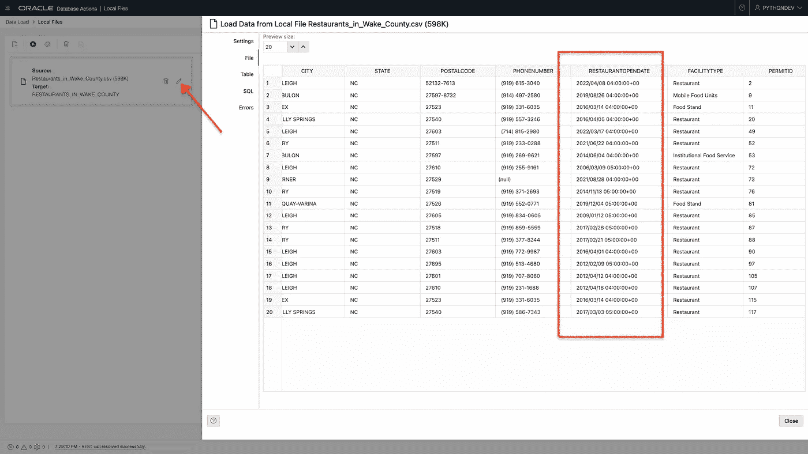
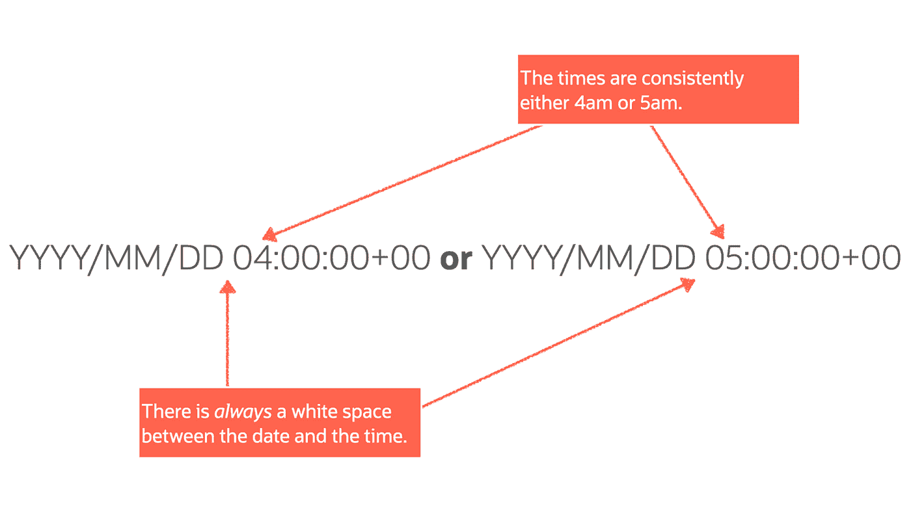
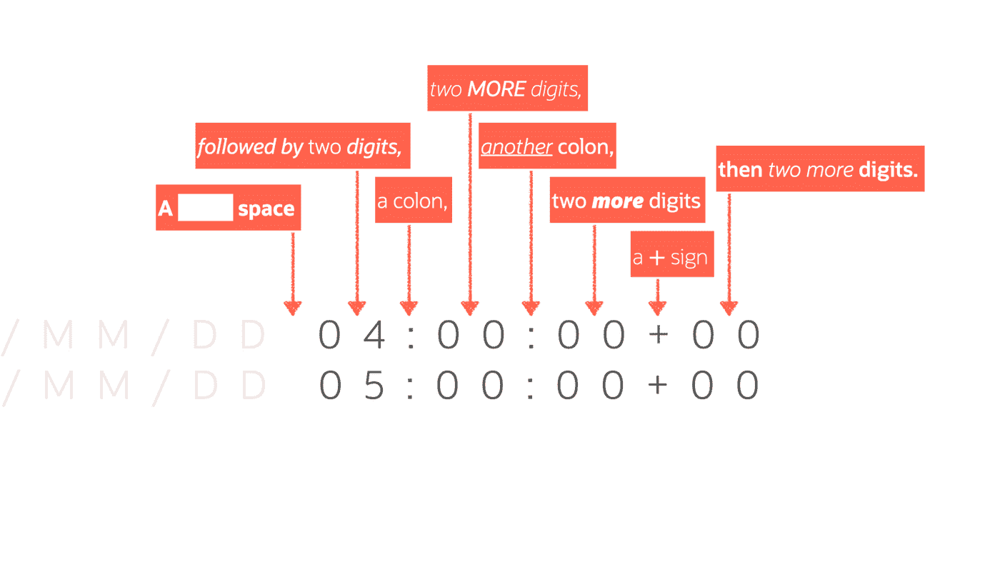
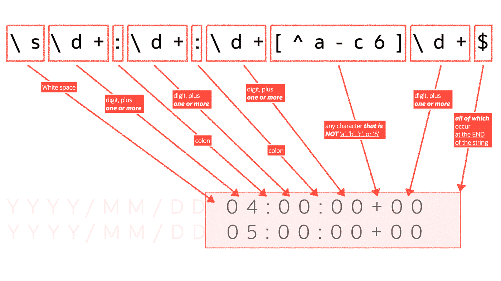
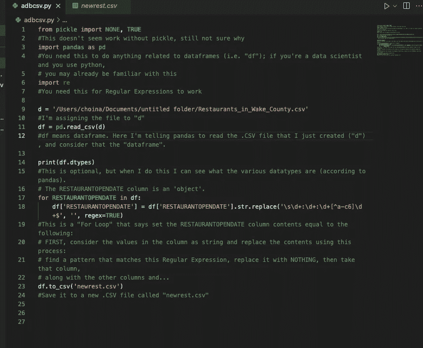
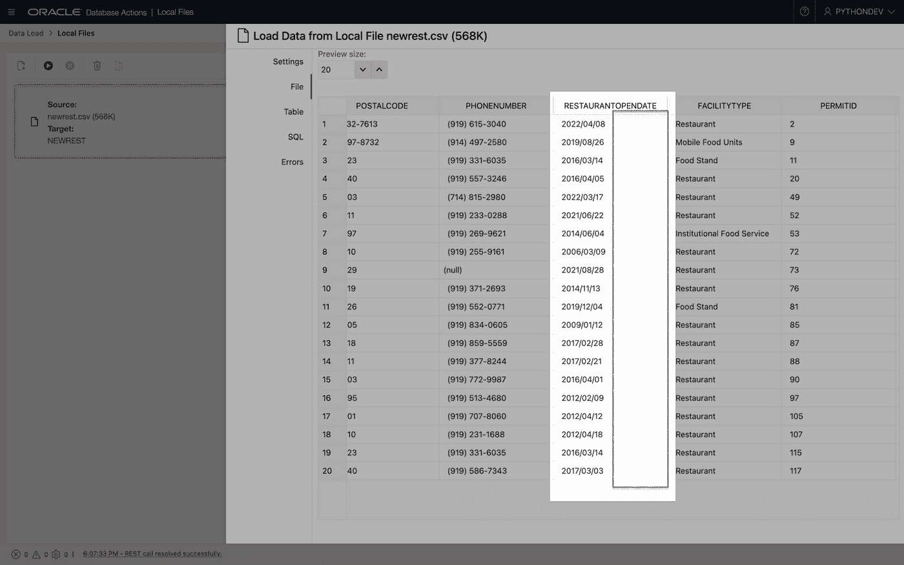
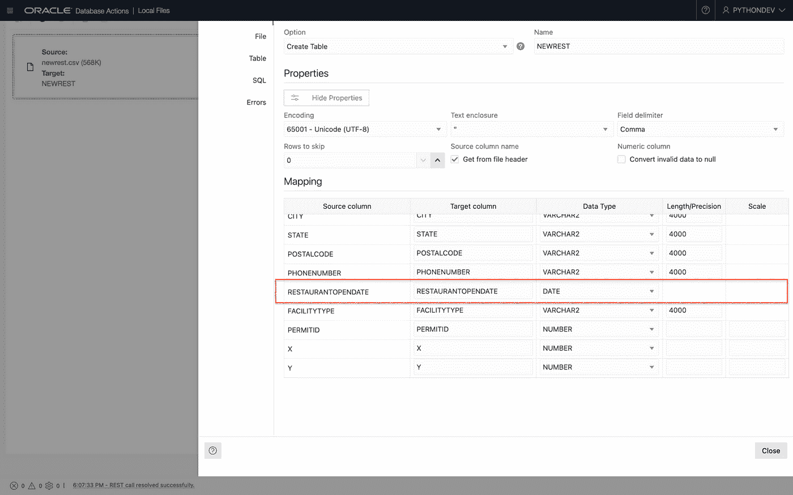

# 用正则表达式、熊猫和 Python 清理. CSV 文件

> 原文：<https://blog.devgenius.io/clean-up-a-csv-file-with-regular-expressions-pandas-and-python-c8584bb2c2c5?source=collection_archive---------1----------------------->

> 我想通过 Oracle 自治数据库(ADB)中的数据库操作加载数据，但首先我需要清理一些日期和时间。Python 是我选择的语言，我也听说过正则表达式，但是我很害怕…

# 让我们开始

我以新创建的“Python 开发人员”的身份登录数据库操作，并直接导航到“数据加载”页面(位于启动板的数据工具部分下)。我选择从“本地文件”中“加载数据”我单击“下一步”，单击铅笔图标(见图中的箭头)，然后导航到“文件”选项卡。我滚动到“RESTAURANTOPENDATE”列，看到了这个:



在[之前的一篇文章](https://followthecoffee.com/table-prep-data-loads-and-time-zones/)(如果你是新手，你可以阅读端到端的过程)中，我讨论了这个时间(“04:00:00+00”或“05:00:00+00”)对于[我的项目](https://followthecoffee.com/project-overview-python-flask-ords-autonomous-database/)来说是不必要的。当时，我使用了 Excel 中的“查找和替换”功能(我相信您可以对数字、工作表或 Calc 执行同样的操作)，将所有出现的时间替换为“”(即，无)。

但是本着在**五天**中做事的精神，当他们本可以只花**五分钟**的时候，我选择看看我是否能在 python 中取得类似的结果。

# 目标

创建一个 python 脚本，允许您删除. CSV 文件中的 a 值的*部分。*

```
**WARNING:** I thought this would be a simple task. I should have known better. My approach may not be ideal for your situation, but hopefully you’ll learn something. Or at the very least maybe you can bookmark this post, along with the resources (at the end of the post) I'm including, for later use.
```

# 正则表达式

我相信有一种方法可以实现这个目标。python 中的 CSV 库。或许有一种现成的 python 方法可以做到这一点。*我想不通。*

我也有理由相信我的方法近乎荒谬。然而，python 中的正则表达式和 Pandas 库对我很有用。

# 什么是正则表达式？

好问题。我仍然不知道，但这是我在维基百科上找到的:

> 正则表达式(缩写为 regex 或 regexp 也称为有理表达式)是指定文本中搜索模式的字符序列。通常，字符串搜索算法使用这种模式对字符串进行“查找”或“查找和替换”操作，或者进行输入验证。它是在理论计算机科学和形式语言理论中发展起来的一种技术

读起来很痛苦，但是我理解的方式是我们在模式匹配中使用正则表达式。本质上，您创建一个模式，然后告诉您的应用程序(或脚本)搜索它。从那里，您可以包含更多的代码来执行更多的操作。在我的情况下，这些行动将是找到一个模式，并用什么也不做来代替这个模式。

# 那么模式是什么呢？

在应用程序开发(这里是计算机科学和形式语言理论)中没有正式培训的好处之一是，偶尔你可能会采用一种虽然不直观但足够有效的方法。

在经历了许多、*许多*小时的反复试验，通过堆栈溢出进行解析，查看了几个小时的 YouTube，阅读了几页博客，偶尔使用一下谷歌上的“我感觉很幸运”按钮之后，我突然想到我的模式是:



在查看了更多的文档和其他各种资源之后(我在最后有一整节)，我更清楚地确定了一个模式:



提出一个清晰定义的模式帮助我了解如何创建下面的*正则表达式*:

```
'\s\d+:\d+:\d+[^a-c6]\d+$'
```

然后我做了更多的事情，就这样！关注我了解更多…

我开玩笑的。

# 深潜

我不能教你所有的东西，因为在这一点上我可能只比你领先一周。但我可以解释，希望能有意义。让我继续上面的正则表达式(同样，您会想花一些时间在我包含的参考资料部分，以便更好地理解这些是如何组合在一起的)。

但是上面的正则表达式可以这样定义:



然后，我将上面的代码插入到这个九行(12 行包含小节，更多包含注释)的脚本中:

```
**from pickle import NONE, TRUE**#This doesn't seem work without pickle, still not sure why**import pandas as pd**#You need this to do anything related to dataframes (i.e. "df"); 
# if you're a data scientist and you use python, you may already 
# be familiar with this**import re** #You need this for Regular Expressions to work**d = '/Users/choina/Documents/untitled folder/Restaurants_in_Wake_County.csv'**#I'm assigning the file to "d"**df = pd.read_csv(d)**#df means dataframe. Here I'm telling panda to read the .CSV file 
# that I just created ("d"), and consider that the "dataframe".**print(df.dtypes)**#This is optional, but when I do this I can see what the various 
# datatypes are (according to pandas). The RESTAURANTOPENDATE column 
# is an 'object'.**for RESTAURANTOPENDATE in df:**
 **df['RESTAURANTOPENDATE'] = df['RESTAURANTOPENDATE'].str.replace('\s\d+:\d+:\d+[^a-c6]\d+$', '', regex=TRUE)**#This is a "For Loop" that says set the RESTAURANTOPENDATE column 
# contents equal to the following: FIRST, consider the values in the 
# column as string and replace the contents using this process: 
# find a pattern that matches this Regular Expression, replace
# it with NOTHING, then take that column,along with the other 
# columns and...**df.to_csv('newrest.csv')**#...save it to a new .CSV file called "newrest.csv"
```

编码为图像以供参考:



简而言之，(我留下了详细的注释供参考)，这九行代码搜索一个模式，找到后用 *nothing* 替换它。然后我们把这些结果(包括剩下的。CSV 文件)并将它们保存到名为“newrest.csv”的新文件中

请参考这个脚本。根据需要进行调整。或者给我留言，如果你需要外界的观点。祝你好运！

# 还有一点

**泡菜**、**熊猫**和 **RE** 都是这个脚本工作所必需的。

```
**Note:** While I understand Pickle is a library that deals with the serialization of objects in python. I've no idea what that means, and reading about it makes my brain melt. Additionally, I’m not sure if this is expected behavior, but when I ran an earlier version of this script, this "Pickles" library just appeared at the very top. If this has happened to you, please leave a comment, because I'm scared there may be an actual ghost in my machine.
```

# 继续前进

剩下的就很简单了。

然后，我返回到数据库操作(已经过了这么长时间，我以为已经发布了新版本)，加载我的数据，并检查有问题的列:



我看不错！

# 魔法

我注意到，我的自治数据库自动将“RESTAURANTOPENDATE”列识别为“DATE”数据类型。我不需要在这里做什么特别的事情，我觉得这很酷。看一看:



# 增编的增编

导入后，您还可以在数据库中使用正则表达式(使用 SQL)。但是如果你想在数据到达你的 ADB 之前清理你的数据，我在这里写的方法也是一个很好的选择！

# 资源

正如我所承诺的，这里是我整理的所有资源，如果你选择少走的路，这些资源可能会对你有所帮助…

重要/相关文件:

*   [泡菜](https://docs.python.org/3/library/pickle.html)
*   [正则表达式](https://docs.python.org/3/library/re.html)
*   [熊猫](https://pandas.pydata.org/)

与这篇文章相关的是，有一些特定的页面非常有用。具体来说:

*   [删除字符串中的后缀](https://pandas.pydata.org/docs/reference/api/pandas.Series.str.removesuffix.html)
*   [替换一串中的一串](https://pandas.pydata.org/docs/reference/api/pandas.Series.str.replace.html)
*   [lstrip](https://pandas.pydata.org/docs/reference/api/pandas.Series.str.lstrip.html) (删除*前导*字符)一个字符串
*   [剥离](https://pandas.pydata.org/docs/reference/api/pandas.Series.str.strip.html)(去掉前导*和*尾随字符)一个字符串
*   发现/更好地理解您的[数据帧的属性和特征](https://pandas.pydata.org/docs/reference/frame.html)
*   [迭代](https://pandas.pydata.org/pandas-docs/stable/user_guide/basics.html#iteration)在熊猫身上
*   [替换系列中的值](https://pandas.pydata.org/docs/reference/api/pandas.Series.replace.html?highlight=regex)(又名熊猫中的列)

堆栈溢出:

*   一系列关于 Python 和正则表达式的“[书签](https://stackoverflow.com/users/9552864/chris-hoina?tab=bookmarks)”问题。他们帮助了我，他们可能有用。它们不是为了教你，而是帮助你获得更好的视角。

YouTube:

*   我创建的一个播放列表可能值得回顾(至少看一下 Case Digital 的“如何在 Python 中从熊猫数据帧中删除字符”视频)。

正则表达式编辑器:

*   [py tex](https://pythex.org/)(确保你点击了“正则表达式备忘单”按钮来展开/查看一个有价值的快速参考——此外，显然可以在[这里](https://github.com/tartley/python-regex-cheatsheet/)找到一个更完整的版本)
*   [正则表达式 101](https://regex101.com/) —这包括一个巨大的先前创建的正则表达式库。还有一个“调试器”！

# 找到我

请再次光临。我将在我的自治数据库中处理视图，稍后，我将在 [ORDS](https://www.oracle.com/database/technologies/appdev/rest.html) 的帮助下启用它们！

*   [推特](https://twitter.com/chrishoina%29)
*   [YouTube](https://www.youtube.com/user/chrishoina/)
*   [GitHub](https://github.com/chrishoina)
*   [不和](https://discord.gg/seYeAPgq9E)
*   [我的博客](https://followthecoffee.com/blog/)
*   [堆栈溢出](https://stackoverflow.com/users/9552864/chris-hoina)
*   [领英](https://www.linkedin.com/in/chrishoina/)